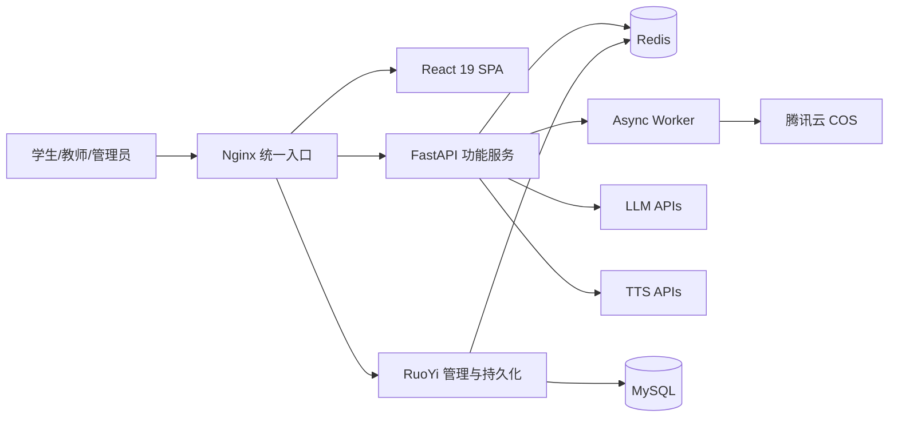

# Architecture Index

> 本项目架构已在 `_bmad-output/planning-artifacts/architecture/` 中完整定义，此处为索引摘要。

## System Architecture

```
Nginx 统一入口
    │
    ├── React SPA (:5173) — 学生端前端
    ├── FastAPI (:8090) — 功能服务 + AI 编排
    └── RuoYi (:8080) — 管理后台 + 持久化
```

## Key Architecture Decisions

### ADR-001: 双后端分层架构
- **Decision**: FastAPI 负责功能服务，RuoYi 负责持久化
- **Rationale**: 各自擅长领域不同，避免重复建设
- **Consequences**: 需要防腐层协调两后端

### ADR-002: Video/Classroom Engine 独立
- **Decision**: 两个内容引擎生成链路保持独立
- **Rationale**: 避免流水线耦合，便于独立演进
- **Consequences**: 共享基础设施但不共享生成逻辑

### ADR-003: 统一 SSE 事件集
- **Decision**: 八类公开事件已冻结
- **Rationale**: 简化前端状态管理，支持断线恢复
- **Consequences**: 不私自扩展对外事件名

### ADR-004: Provider 抽象层
- **Decision**: 外部能力通过统一抽象层接入
- **Rationale**: 避免业务逻辑与具体厂商耦合
- **Consequences**: 需要维护 Provider 接口和 Failover 逻辑

## Component Diagram



## Tech Stack Summary

| Layer | Technology |
|-------|------------|
| Frontend | React 19 + Vite 6 + TypeScript 5.9 + Tailwind CSS 4 |
| Functional Backend | FastAPI 0.115+ + Python 3.11+ + Dramatiq |
| Admin Backend | Spring Boot 3.5 + Java 21 + RuoYi-Vue-Plus 5.5 |
| Admin Frontend | Vue 3.5 + Vite 7 + Naive UI |
| Cache | Redis |
| Database | MySQL |
| Storage | 腾讯云 COS |

## Source Documents

- 架构分片目录: `_bmad-output/planning-artifacts/architecture/`
- 系统边界: `_bmad-output/planning-artifacts/architecture/04-4-系统边界与总体架构.md`
- 技术选型: `_bmad-output/planning-artifacts/architecture/11-11-技术选型与评估结论.md`
- 架构决策记录: `_bmad-output/planning-artifacts/architecture/12-12-架构决策记录摘要.md`