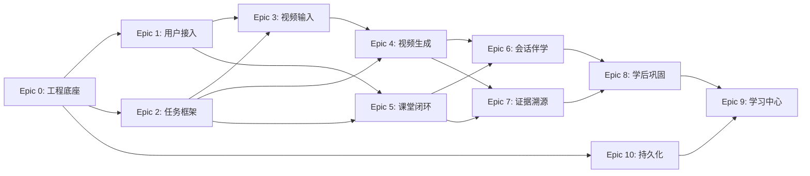

# Epics Index

> 本项目 Epic/Story 已在 `_bmad-output/planning-artifacts/epics/` 和 `_bmad-output/implementation-artifacts/` 中完整定义。

## Epic Overview

| Epic | Name | Status | Stories | MVP |
|------|------|--------|---------|-----|
| Epic 0 | 工程底座与并行开发轨道 | done | 6 | ✓ |
| Epic 1 | 用户接入、统一入口与启动配置 | done | 7 | ✓ |
| Epic 2 | 统一任务框架、SSE 与 Provider | done | 8 | ✓ |
| Epic 3 | 单题视频输入与任务创建 | in-progress | 6 | ✓ |
| Epic 4 | 单题视频生成、结果消费 | in-progress | 10 | ✓ |
| Epic 5 | 主题课堂学习闭环 | in-progress | 10 | ✓ |
| Epic 6 | 会话内伴学与当前时刻解释 | backlog | 7 | Post-MVP |
| Epic 7 | 资料依据、来源回看与证据深挖 | backlog | 7 | Post-MVP |
| Epic 8 | 学后巩固、测验与学习路径 | backlog | 7 | Post-MVP |
| Epic 9 | 学习中心聚合、个人管理 | backlog | 5 | Post-MVP |
| Epic 10 | RuoYi 持久化承接、业务表 | done | 8 | ✓ |

## Dependency Map

## MVP Scope

**MVP 包含**: Epic 0, 1, 2, 3, 4, 5, 10

**Post-MVP**: Epic 6, 7, 8, 9

## Current Progress (2026-04-08)

| Status | Count |
|--------|-------|
| done | 4 Epics (0, 1, 2, 10) |
| in-progress | 3 Epics (3, 4, 5) |
| backlog | 4 Epics (6, 7, 8, 9) |

## Execution Order

1. **并行推荐**: Epic 3 + Epic 5（页面主战场分开）
2. **不建议并行**: Epic 4 + Epic 8（都会碰结果页后续动作入口）
3. **有条件并行**: Epic 6 + Epic 7（需先冻结结果页挂载位）

## Source Documents

- Epic 分片目录: `_bmad-output/planning-artifacts/epics/`
- Epic 列表: `_bmad-output/planning-artifacts/epics/10-epic-list.md`
- 实施文档: `_bmad-output/implementation-artifacts/`
- Sprint 状态: `_bmad-output/implementation-artifacts/sprint-status.yaml`