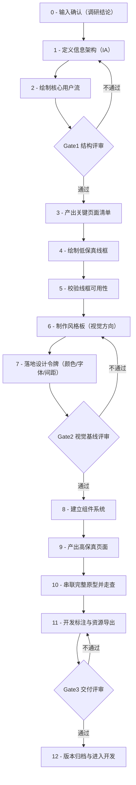

# 调研后 UI/UX 设计流程图（清晰执行版）

> 本版目标：不追求“拆得多”，只保留**真正可执行**的步骤。  
> 起点固定为：你已完成调研，已有需求、用户、竞品结论。

## 一、总流程（12步，顺序清晰）

---

## 二、每一步到底做什么（执行清单）

| 步骤 | 你要做什么 | 产出物 | 完成标准 |
|---|---|---|---|
| 0 输入确认 | 把调研结论整理成“设计输入包”（目标用户、核心场景、功能边界、业务目标） | 设计输入包 v1 | 团队对范围无歧义 |
| 1 定义 IA | 明确一级/二级信息结构，页面之间关系 | IA 图 | 所有核心功能都能挂到结构中 |
| 2 绘制用户流 | 画主路径+异常路径（含空状态/错误状态） | 用户流程图 | 主任务可以闭环 |
| Gate1 | 评审 IA+用户流是否可执行 | Gate1 结论 | 不通过就回到步骤1 |
| 3 页面清单 | 列出核心页面、支持页面、状态页面 | 页面清单 | 页面无缺失、无孤岛 |
| 4 低保真线框 | 先做布局和信息层级，不做视觉细节 | 线框稿 | 关键页面全覆盖 |
| 5 线框可用校验 | 用典型任务走查线框，找断点和冗余 | 线框问题清单 | 核心任务可走通 |
| 6 风格板 | 出 2~3 套视觉方向，比较差异 | 风格板方案 | 选出 1 套主方向 |
| 7 设计令牌 | 固化颜色、字体、间距、圆角、阴影 | Design Tokens 文档 | 能支撑后续统一出图 |
| Gate2 | 评审风格板+令牌是否稳定可复用 | Gate2 结论 | 不通过回到步骤6 |
| 8 组件系统 | 建立按钮/表单/导航/反馈等组件与状态 | 组件库 | 复用率达标、命名统一 |
| 9 高保真页面 | 用组件系统完成核心页面视觉稿 | 高保真页面集 | 主流程页面完成 |
| 10 原型走查 | 把页面串成可演示原型，检查一致性 | 可点击原型 | 主流程+异常流程都可演示 |
| 11 开发标注 | 输出尺寸、间距、字体、状态、资源规格 | 标注稿+资源包 | 开发可直接实现 |
| Gate3 | 交付评审（完整性/一致性/可实现性） | Gate3 结论 | 不通过回到步骤11 |
| 12 版本归档 | 按命名规范打包并归档版本 | 交付包 v1 | 可追溯、可复用 |

---

## 三、图像化输出方式（给 AIGC 用）

同一套内容，固定输出三类图：
1. **流程图**：用上面的12步主流程（看全局）
2. **看板图**：把12步拆成任务卡（看执行）
3. **画廊图**：按步骤展示关键产物截图（看成果）

固定三种画幅：`16:9`、`4:3`、`9:16`。

