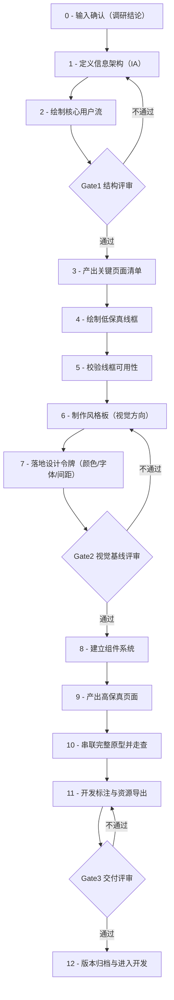

# 流程步骤模板库（调研后设计阶段）

> 本文件已完成“02细分流程模板化”改造。
> 执行原则：**按节点优先调用 `templates/node_prompts/` 下的场景模板；通用模板仅作为兜底。**

---

## 一、主流程说明

以下主流程与《01_总流程图.md》保持一致，不改动核心结论：

主流程产出节奏：结构（0~Gate1）→ 线框与视觉基线（3~Gate2）→ 高保真交付（8~12）。

---

## 📊 二、细分流程模板引用表（节点 × 场景）

| 节点 | flow（流程图） | kanban（看板图） | gallery（画廊图） |
|---|---|---|---|
| 00输入确认 输入确认（调研结论） | [`templates/node_prompts/00输入确认/flow.md`](templates/node_prompts/00输入确认/flow.md) | [`templates/node_prompts/00输入确认/kanban.md`](templates/node_prompts/00输入确认/kanban.md) | [`templates/node_prompts/00输入确认/gallery.md`](templates/node_prompts/00输入确认/gallery.md) |
| 01信息架构 定义信息架构（IA） | [`templates/node_prompts/01信息架构/flow.md`](templates/node_prompts/01信息架构/flow.md) | [`templates/node_prompts/01信息架构/kanban.md`](templates/node_prompts/01信息架构/kanban.md) | [`templates/node_prompts/01信息架构/gallery.md`](templates/node_prompts/01信息架构/gallery.md) |
| 02核心用户流 绘制核心用户流 | [`templates/node_prompts/02核心用户流/flow.md`](templates/node_prompts/02核心用户流/flow.md) | [`templates/node_prompts/02核心用户流/kanban.md`](templates/node_prompts/02核心用户流/kanban.md) | [`templates/node_prompts/02核心用户流/gallery.md`](templates/node_prompts/02核心用户流/gallery.md) |
| Gate1结构评审 Gate1 结构评审 | [`templates/node_prompts/Gate1结构评审/flow.md`](templates/node_prompts/Gate1结构评审/flow.md) | [`templates/node_prompts/Gate1结构评审/kanban.md`](templates/node_prompts/Gate1结构评审/kanban.md) | [`templates/node_prompts/Gate1结构评审/gallery.md`](templates/node_prompts/Gate1结构评审/gallery.md) |
| 03页面清单 产出关键页面清单 | [`templates/node_prompts/03页面清单/flow.md`](templates/node_prompts/03页面清单/flow.md) | [`templates/node_prompts/03页面清单/kanban.md`](templates/node_prompts/03页面清单/kanban.md) | [`templates/node_prompts/03页面清单/gallery.md`](templates/node_prompts/03页面清单/gallery.md) |
| 04低保真线框 绘制低保真线框 | [`templates/node_prompts/04低保真线框/flow.md`](templates/node_prompts/04低保真线框/flow.md) | [`templates/node_prompts/04低保真线框/kanban.md`](templates/node_prompts/04低保真线框/kanban.md) | [`templates/node_prompts/04低保真线框/gallery.md`](templates/node_prompts/04低保真线框/gallery.md) |
| 05线框可用性校验 校验线框可用性 | [`templates/node_prompts/05线框可用性校验/flow.md`](templates/node_prompts/05线框可用性校验/flow.md) | [`templates/node_prompts/05线框可用性校验/kanban.md`](templates/node_prompts/05线框可用性校验/kanban.md) | [`templates/node_prompts/05线框可用性校验/gallery.md`](templates/node_prompts/05线框可用性校验/gallery.md) |
| 06风格板 制作风格板（视觉方向） | [`templates/node_prompts/06风格板/flow.md`](templates/node_prompts/06风格板/flow.md) | [`templates/node_prompts/06风格板/kanban.md`](templates/node_prompts/06风格板/kanban.md) | [`templates/node_prompts/06风格板/gallery.md`](templates/node_prompts/06风格板/gallery.md) |
| 07设计令牌 落地设计令牌 | [`templates/node_prompts/07设计令牌/flow.md`](templates/node_prompts/07设计令牌/flow.md) | [`templates/node_prompts/07设计令牌/kanban.md`](templates/node_prompts/07设计令牌/kanban.md) | [`templates/node_prompts/07设计令牌/gallery.md`](templates/node_prompts/07设计令牌/gallery.md) |
| Gate2视觉评审 Gate2 视觉基线评审 | [`templates/node_prompts/Gate2视觉评审/flow.md`](templates/node_prompts/Gate2视觉评审/flow.md) | [`templates/node_prompts/Gate2视觉评审/kanban.md`](templates/node_prompts/Gate2视觉评审/kanban.md) | [`templates/node_prompts/Gate2视觉评审/gallery.md`](templates/node_prompts/Gate2视觉评审/gallery.md) |
| 08组件系统 建立组件系统 | [`templates/node_prompts/08组件系统/flow.md`](templates/node_prompts/08组件系统/flow.md) | [`templates/node_prompts/08组件系统/kanban.md`](templates/node_prompts/08组件系统/kanban.md) | [`templates/node_prompts/08组件系统/gallery.md`](templates/node_prompts/08组件系统/gallery.md) |
| 09高保真页面 产出高保真页面 | [`templates/node_prompts/09高保真页面/flow.md`](templates/node_prompts/09高保真页面/flow.md) | [`templates/node_prompts/09高保真页面/kanban.md`](templates/node_prompts/09高保真页面/kanban.md) | [`templates/node_prompts/09高保真页面/gallery.md`](templates/node_prompts/09高保真页面/gallery.md) |
| 10原型走查 串联完整原型并走查 | [`templates/node_prompts/10原型走查/flow.md`](templates/node_prompts/10原型走查/flow.md) | [`templates/node_prompts/10原型走查/kanban.md`](templates/node_prompts/10原型走查/kanban.md) | [`templates/node_prompts/10原型走查/gallery.md`](templates/node_prompts/10原型走查/gallery.md) |
| 11开发标注 开发标注与资源导出 | [`templates/node_prompts/11开发标注/flow.md`](templates/node_prompts/11开发标注/flow.md) | [`templates/node_prompts/11开发标注/kanban.md`](templates/node_prompts/11开发标注/kanban.md) | [`templates/node_prompts/11开发标注/gallery.md`](templates/node_prompts/11开发标注/gallery.md) |
| Gate3交付评审 Gate3 交付评审 | [`templates/node_prompts/Gate3交付评审/flow.md`](templates/node_prompts/Gate3交付评审/flow.md) | [`templates/node_prompts/Gate3交付评审/kanban.md`](templates/node_prompts/Gate3交付评审/kanban.md) | [`templates/node_prompts/Gate3交付评审/gallery.md`](templates/node_prompts/Gate3交付评审/gallery.md) |
| 12版本归档 版本归档与进入开发 | [`templates/node_prompts/12版本归档/flow.md`](templates/node_prompts/12版本归档/flow.md) | [`templates/node_prompts/12版本归档/kanban.md`](templates/node_prompts/12版本归档/kanban.md) | [`templates/node_prompts/12版本归档/gallery.md`](templates/node_prompts/12版本归档/gallery.md) |

---

## 📝 三、调用规范（新增）

1. 🎯 **节点优先**：执行到哪个节点，就优先调用该节点对应场景模板。
2. 🧩 **场景匹配**：
   - 🔄 需要表达顺序、分支、回退：用 [`flow.md`](flow.md)
   - 📋 需要管理任务状态与负责人：用 [`kanban.md`](kanban.md)
   - 🖼️ 需要展示成果与版本对比：用 [`gallery.md`](gallery.md)
3. ⚙️ **机制强制**：每次调用都必须执行 [core_prompt_v2](templates/core_prompt_v2.md)（5候选→硬门槛→打分→Top1/Top2→三比例参数）。
4. 🛡️ **通用模板降级使用**：仅当节点模板缺失或临时探索时，才可使用 [通用模板](templates/prompt_master_template.md)。
5. 🔗 **一致性要求**：节点命名、Gate回退关系必须与 [《01_总流程图.md》](01_总流程图.md) 一致。

---

## 🚀 四、快速入口

- 🧭 节点模板导航：[`templates/node_prompts/index.md`](templates/node_prompts/index.md)
- 🧠 核心机制说明：[`templates/core_prompt_v2.md`](templates/core_prompt_v2.md)
- 🛠️ 通用母版（兜底）：[`templates/prompt_master_template.md`](templates/prompt_master_template.md)