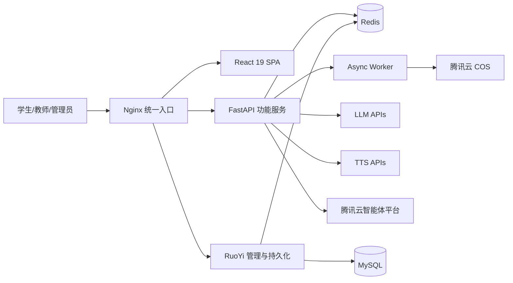

# 4. 系统边界与总体架构

## 4.1 系统定位与双后端分层

\[Decision] 系统采用\*\*“RuoYi 负责业务持久化与管理后台，FastAPI 负责功能执行与 AI 编排”\*\*的双后端分层架构。
\[Rule] Video Engine 与 Classroom Engine 在生成链路上保持独立，不做流水线合并。\
\[Decision] 统一的是会话交互语义层（Companion），不是内容生成引擎。

* **Video Engine**
  * 题目理解
  * 分镜生成
  * Manim 代码生成与修复
  * TTS 合成
  * FFmpeg 合成
  * COS 上传

* **Classroom Engine**
  * 主题输入
  * Agent 编排
  * 幻灯片 / 讨论 / 白板
  * SSE 推送

* **Companion Layer**
  * 当前时刻追问
  * 解释白板
  * 追问链
  * 资料补充检索

## 4.2 系统组成

系统由六个主要部分组成：

1. **React 19 SPA 前端**\
   面向学生/教师，负责双入口交互、任务创建、进度展示、会话伴学与结果消费。

2. **FastAPI 功能服务（8090）**\
   负责课堂生成、视频生成、Companion、Evidence / Retrieval、Learning Coach、Provider 调度、SSE、异步任务协调，是功能性微服务。

3. **Async Worker**\
   负责 Manim 渲染、音视频合成等长耗时/CPU 密集任务。

4. **RuoYi Spring Boot 管理后端（8080）**\
   负责用户、角色、菜单、审计日志以及小麦业务表、会话记录、学习数据的持久化与 CRUD 管理。

5. **Nginx 统一入口**\
   负责静态资源分发、反向代理与统一域名接入。

6. **外部 AI 能力层**\
   负责 Evidence / Retrieval 的证据检索、Learning Coach 的流程/规划能力，以及部分补充型白板解释生成。

\[Rule] FastAPI 不承担长期业务数据主存储职责；长期业务数据统一由 RuoYi 业务表 / MySQL 承担持久化。

## 4.3 系统上下文图

```text
┌─────────────────────────────────────────────────────────────────────────────┐
│                                用户角色                                      │
│       ┌──────────┐         ┌──────────┐         ┌──────────┐               │
│       │  高职学生  │         │  高职教师  │         │   管理员   │               │
│       └────┬─────┘         └────┬─────┘         └────┬─────┘               │
│            │ HTTPS              │ HTTPS              │ HTTPS               │
└────────────┼────────────────────┼────────────────────┼─────────────────────┘
             ▼                    ▼                    ▼
┌─────────────────────────────────────────────────────────────────────────────┐
│                       小麦平台 (System Boundary)                             │
│                                                                             │
│  ┌───────────────────────────────────────────────────────────────────────┐  │
│  │                      Nginx 统一入口                                    │  │
│  │           (反向代理 + 静态资源 + 路由分发)                               │  │
│  └──────────────────────────┬────────────────────────────────────────────┘  │
│                             │                                               │
│         ┌───────────────────┼───────────────────┐                          │
│         ▼                   ▼                   ▼                          │
│  ┌──────────────┐  ┌──────────────┐  ┌────────────────┐                   │
│  │ React 19 SPA │  │ FastAPI 8090 │  │  RuoYi 8080    │                   │
│  │ (ToC 前端)    │  │ (功能服务)    │  │ (管理/持久化)   │                   │
│  └──────────────┘  └──────┬───────┘  └───────┬────────┘                   │
│                           │                   │                            │
│                           ▼                   ▼                            │
│                    ┌────────────┐       ┌──────────┐                      │
│                    │Async Worker│       │  MySQL   │                      │
│                    │(渲染/合成)  │       │ (RuoYi)  │                      │
│                    └────────────┘       └──────────┘                      │
└──────────────────────────┬──────────────────────────────────────────────┘
                           │
            ┌──────────────┼──────────────┐
            ▼              ▼              ▼
┌─────────────────────────────────────────────────────────────────────────────┐
│                         外部系统 / 服务                                      │
│  ┌────────────┐  ┌────────────┐  ┌────────────┐  ┌────────────┐          │
│  │  LLM APIs  │  │  TTS APIs  │  │ 腾讯云 COS  │  │   Redis    │          │
│  │ • Gemini   │  │ • 豆包 TTS │  │ • 视频存储  │  │ • JWT 在线态│          │
│  │ • Claude   │  │ • 百度 TTS │  │ • CDN 分发  │  │ • 任务状态  │          │
│  │ • 其他模型  │  │ • Spark    │  │            │  │ • 事件缓存  │          │
│  │            │  │ • Kokoro   │  │            │  │ • 会话缓存  │          │
│  └────────────┘  └────────────┘  └────────────┘  └────────────┘          │
└─────────────────────────────────────────────────────────────────────────────┘
```

## 4.4 交互协议说明

| 交互路径 | 协议 | 说明 |
|----------|------|------|
| 用户 → Nginx | HTTPS | TLS 1.3 |
| Nginx → React SPA | 静态文件 | Nginx 直接返回 |
| Nginx → FastAPI | HTTP 反向代理 | `/api/v1/*` |
| Nginx → RuoYi | HTTP 反向代理 | `/admin/*` |
| FastAPI → Redis | Redis Protocol | Token 在线态、任务状态、事件缓存 |
| RuoYi → Redis | Redis Protocol | Token 在线态写入、缓存 |
| FastAPI → RuoYi | HTTP API | 业务元数据回写、记录查询、状态同步 |
| FastAPI → LLM APIs | HTTPS | 同步或流式调用 |
| FastAPI → TTS APIs | HTTPS | 语音合成 |
| Worker → COS | HTTPS SDK | 视频上传 |
| FastAPI → 前端 | SSE | 任务实时进度推送 |

## 4.5 部署视图

### 4.5.1 本地开发环境

```text
┌────────────────────────────────────────────────────────────────┐
│                  开发者本机 (macOS / Linux)                      │
│                                                                │
│  ┌────────────┐  ┌────────────────┐  ┌───────────────────┐    │
│  │ React Dev  │  │ FastAPI Dev    │  │ RuoYi Dev         │    │
│  │ pnpm dev   │  │ uvicorn        │  │ IDEA / java -jar  │    │
│  │ :5173      │  │ :8090          │  │ :8080             │    │
│  └─────┬──────┘  └───────┬────────┘  └─────────┬─────────┘    │
│        │                 │                      │              │
│        └─────────────────┴──────────────┬───────┘              │
│                                         ▼                      │
│  ┌──────────────────────────────────────────────────────────┐  │
│  │ Docker Desktop                                           │  │
│  │ ┌────────┐  ┌────────┐  ┌──────────────────────────────┐ │  │
│  │ │ Redis  │  │ MySQL  │  │ Async Worker / Manim 沙箱    │ │  │
│  │ │ :6379  │  │ :3306  │  │ 可选容器化运行               │ │  │
│  │ └────────┘  └────────┘  └──────────────────────────────┘ │  │
│  └──────────────────────────────────────────────────────────┘  │
│                                                                │
│  外部服务：LLM / TTS / COS —— HTTPS                            │
└────────────────────────────────────────────────────────────────┘
```

### 4.5.2 生产环境

```text
┌──────────────────────────────────────────────────────────────────────┐
│                      腾讯云 / 生产服务器                               │
│                                                                      │
│  ┌────────────────────────────────────────────────────────────────┐  │
│  │              Nginx :443 (HTTPS/TLS 1.3)                        │  │
│  │  /             → React SPA 静态文件                             │  │
│  │  /api/v1/*     → FastAPI 8090                                  │  │
│  │  /admin/*      → RuoYi 8080                                    │  │
│  └────────┬──────────────────┬──────────────────┬─────────────────┘  │
│           ▼                  ▼                  ▼                    │
│  ┌──────────────┐  ┌──────────────┐  ┌────────────────┐            │
│  │ React SPA    │  │ FastAPI 容器  │  │ RuoYi 容器     │            │
│  │ 静态文件      │  │ (Docker)     │  │ (Docker/JAR)   │            │
│  └──────────────┘  └──────┬───────┘  └───────┬────────┘            │
│                           │                   │                     │
│                    ┌──────┴──────────────┬────┘                     │
│                    ▼                     ▼                          │
│           ┌──────────────┐      ┌────────────────┐                 │
│           │ Docker Redis │      │ Docker MySQL   │                 │
│           │ :6379        │      │ :3306          │                 │
│           └──────┬───────┘      └────────────────┘                 │
│                  │                                                 │
│                  ▼                                                 │
│           ┌──────────────────┐                                     │
│           │ Async Worker 容器 │                                     │
│           │ Dramatiq + Redis │                                     │
│           │ 渲染/合成/上传    │                                     │
│           └──────────────────┘                                     │
└─────────────────────┬────────────────────────────────────────────┘
                      │
           ┌──────────┼──────────┐
           ▼          ▼          ▼
     ┌──────────┐ ┌────────┐ ┌──────────┐
     │腾讯云 COS│ │LLM APIs│ │ TTS APIs │
     └──────────┘ └────────┘ └──────────┘
```

### 4.5.3 部署方式分类

| 组件 | 部署方式 | 说明 |
|------|----------|------|
| Nginx | 宿主机 / Docker | 统一入口，SSL 终结 |
| React SPA | Nginx 静态托管 | `pnpm build` 产物 |
| FastAPI | Docker 容器 | 功能服务 |
| Async Worker | Docker 容器 | 长任务执行 |
| RuoYi | Docker / JAR | 管理与持久化 |
| Redis / MySQL | Docker 容器 | 运行时缓存 / 持久化存储 |
| LLM / TTS / COS | 云服务 | 外部能力 |

## 4.6 总体架构补充视图



***
