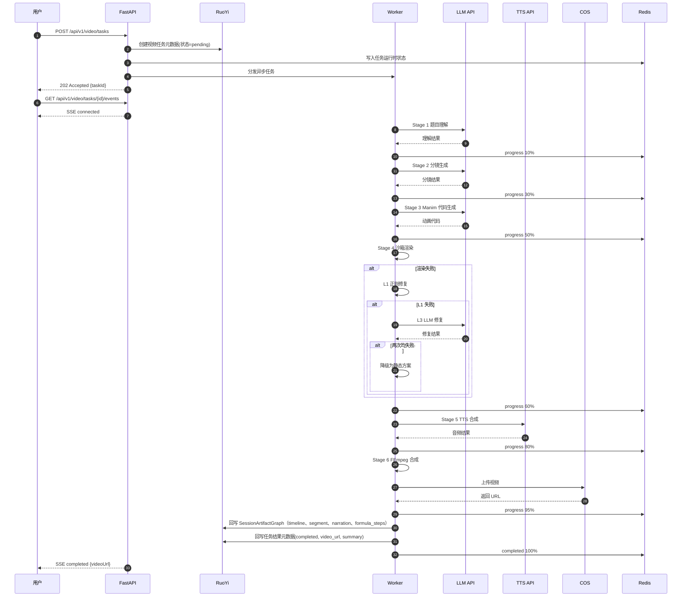
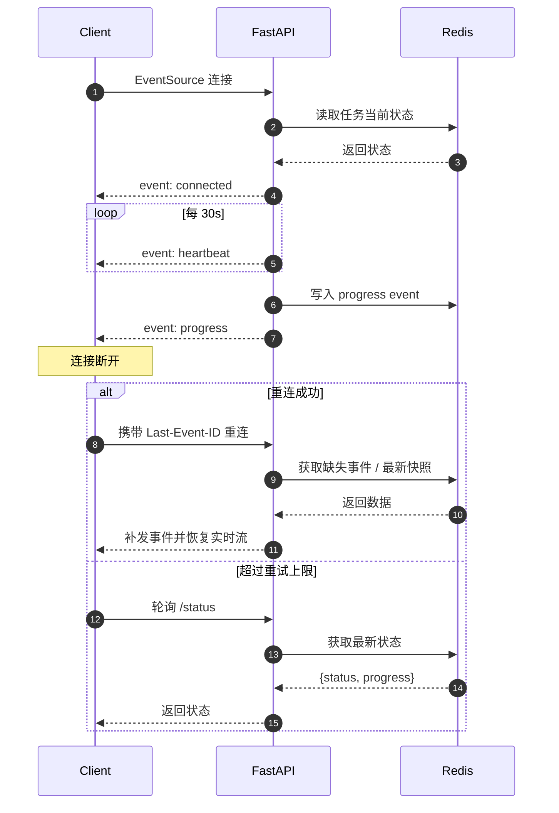
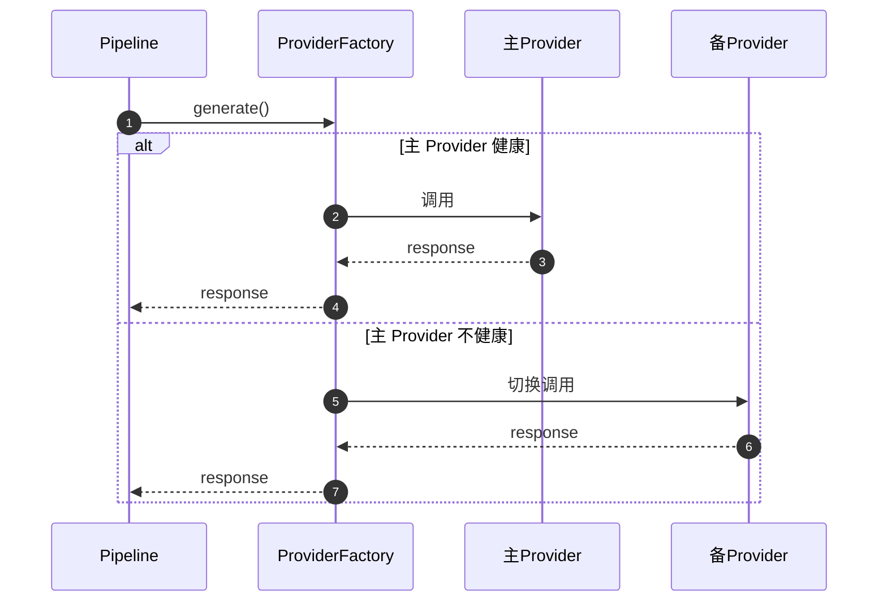
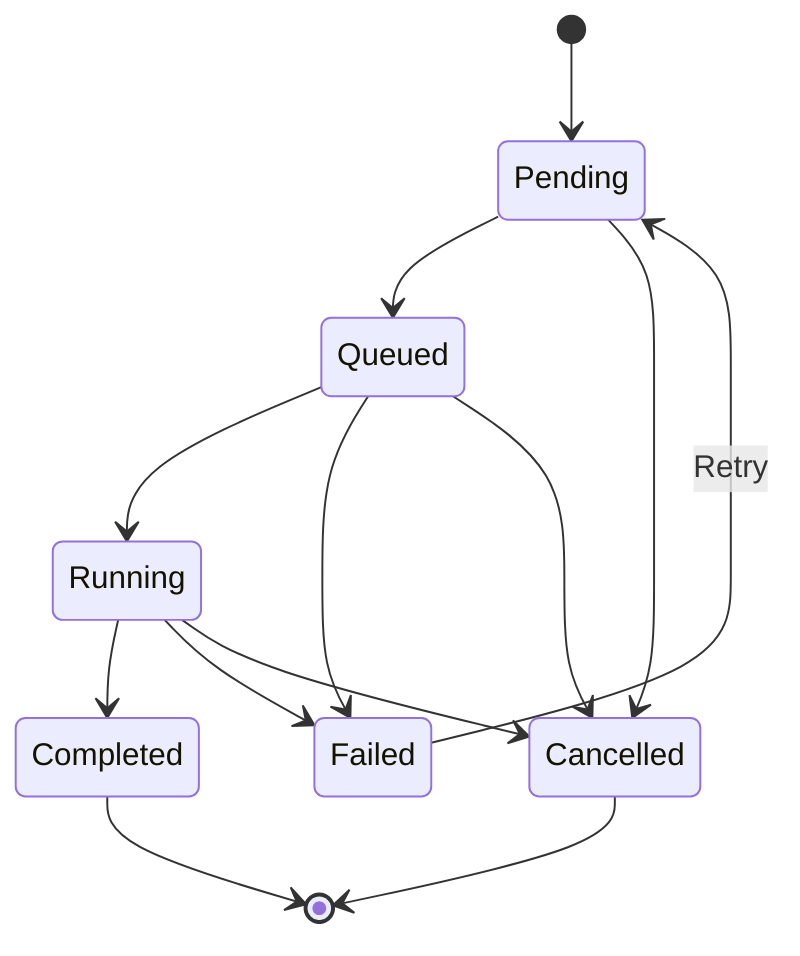

# 5. 运行机制与关键链路

## 5.1 运行时核心机制

\[Decision] 小麦运行时采用“独立内容引擎 + 共享会话语义层 + 长期数据回写”的机制：\
前端调用 FastAPI 创建视频或课堂任务，FastAPI 负责执行与实时推送，内容引擎在生成结果后产出 `SessionArtifactGraph`，Companion 在消费阶段围绕当前 `TimeAnchor` 提供追问、解释白板与追问链，长期结果统一回写 RuoYi，文件产物上传 COS。

\[Metric]\[Target] 端到端延迟 P95 < 5min\
\[Metric]\[Target] 渲染成功率（含修复）>= 80%

\[Rule] SSE 的恢复依据 Redis 中的运行时状态与事件缓存完成，**不是**依赖数据库回放全部历史过程。

\[Decision] 外部 AI 能力（证据检索、流程编排、路径规划、评测）通过**抽象层**封装，腾讯云只是当前默认实现类之一。

\[Decision] 所有异步任务（VideoTask、ClassroomTask）遵循**统一的任务框架**，保证一致性和可维护性。
\[Decision] 所有会话内追问统一建模为 `CompanionTurn`，并且必须绑定 `TimeAnchor`。
\[Decision] Companion 回答优先检索 `SessionArtifactGraph`，必要时再回退到 Evidence / Retrieval 层的检索能力。

**统一内容：**

* 任务 ID 生成规则
* 状态机定义
* 事件模型
* 重试策略
* 错误码
* 进度推进协议
* 结果回写流程

## 5.2 关键链路一：视频生成全流程



### 5.2.1 视频流水线关键参数决策

| 参数 | 决策值 | 说明 |
|------|--------|------|
| 分镜目标时长 | 默认 `120s` | 面向常规单题讲解 |
| 分镜时长允许区间 | `90-180s` | 超出区间需二次裁剪 |
| Manim 自动修复上限 | `2 次` | 超限后进入降级或失败 |
| 队列引擎 | `Dramatiq + Redis broker` | 统一 Worker 调度通道 |
| 沙箱资源限制 | `1 vCPU`、`2 GiB RAM`、`120s/attempt`、`1 GiB tmp`、禁止外网、进程隔离 | 安全优先于成功率 |

## 5.3 关键链路二：SSE 断线重连



## 5.4 关键链路三：Provider Failover



## 5.5 统一任务模型

### 5.5.1 设计目标

\[Decision] 所有异步任务（VideoTask、ClassroomTask）遵循**统一的任务框架**，保证一致性和可维护性。

### 5.5.2 统一任务状态

\[Rule] 定义统一异步任务状态，前后端一致。

| 状态值 | 含义 |
|--------|------|
| `pending` | 待处理 |
| `processing` | 处理中 |
| `completed` | 已完成 |
| `failed` | 已失败 |
| `cancelled` | 已取消 |

### 5.5.3 任务状态机

| 状态 | 说明 |
|------|------|
| `PENDING` | 待处理 |
| `QUEUED` | 已入队 |
| `RUNNING` | 执行中 |
| `COMPLETED` | 已完成 |
| `FAILED` | 已失败 |
| `CANCELLED` | 已取消 |

### 5.5.4 任务 ID 生成规则

\[Rule] 任务 ID 格式：`{prefix}_{timestamp}_{short_uuid}`\
示例：

* `video_20260326143000_a1b2c3d4`
* `class_20260326143000_e5f6g7h8`

### 5.5.5 统一事件模型

\[Rule] 任务进度更新必须通过统一 SSE 事件模型输出，事件中至少包含：

* event
* task\_id
* task\_type
* status
* progress
* message
* timestamp
* error\_code（如适用）

### 5.5.6 统一错误码

| 错误码 | 含义 |
|--------|------|
| `UNKNOWN` | 通用未知错误 |
| `TIMEOUT` | 超时 |
| `CANCELLED` | 已取消 |
| `LLM_UNAVAILABLE` | LLM 不可用 |
| `LLM_RATE_LIMITED` | LLM 限流 |
| `LLM_RESPONSE_INVALID` | LLM 响应非法 |
| `MANIM_CODE_GENERATION_FAILED` | Manim 代码生成失败 |
| `MANIM_RENDER_FAILED` | Manim 渲染失败 |
| `MANIM_SANDBOX_ERROR` | Manim 沙箱错误 |
| `TTS_SYNTHESIS_FAILED` | TTS 合成失败 |
| `TTS_ALL_PROVIDERS_FAILED` | 所有 TTS Provider 失败 |
| `EXTERNAL_SERVICE_UNAVAILABLE` | 外部服务不可用 |
| `EXTERNAL_SERVICE_TIMEOUT` | 外部服务超时 |
| `COS_UPLOAD_FAILED` | COS 上传失败 |

### 5.5.7 任务框架总结

| 组件 | 职责 |
|------|------|
| `TaskStatus` | 统一状态枚举 |
| `TaskContext` | 任务上下文（ID、用户、重试次数） |
| `TaskResult` | 统一结果结构 |
| `BaseTask` | 任务基类，定义生命周期钩子 |
| `TaskScheduler` | 任务调度器，管理执行和状态 |
| `TaskErrorCode` | 统一错误码 |
| `TaskProgressEvent` | 统一 SSE 事件格式 |

## 5.6 运行机制补充视图



## 5.7 关键链路四：会话伴学（Companion）按时刻追问与白板解释

```text
用户在 /video/:id 或 /classroom/:id 发起追问
→ Companion API 接收（含 session_id + TimeAnchor）
→ Context Adapter 拉取当前片段上下文
→ 可选补充 Evidence / Retrieval 检索
→ 返回 answer_text + whiteboard_actions + source_refs + followups
→ 异步回写 RuoYi：xm_companion_turn / xm_whiteboard_action_log / 学习信号
```

***
