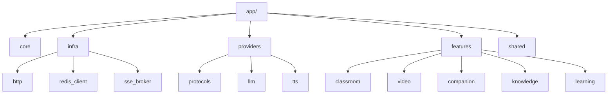

# 8. 模块划分与实现策略

## 8.1 模块划分原则

| 原则 | 说明 |
|------|------|
| **核心壁垒 → 自研** | Manim 渲染、数学动画生成是小麦的核心竞争力 |
| **通用能力 → 调用** | 证据检索、流程编排、路径规划、评测等通用 AI 能力通过可插拔 Provider 接入 |
| **比赛要求 → 必须用** | 至少 2-3 个核心功能要展示腾讯云平台能力 |
| **数据主权 → 自研** | 用户数据、学习记录必须在 RuoYi，不依赖外部平台 |
| **前端统一 → 自研** | 100% 自研前端，保持品牌一致性 |

## 8.2 模块实现矩阵

继续如下：

### 8.2.1 视频生成模块（🔴 100% 自研）

| 子模块 | 实现方式 | 理由 |
|--------|----------|------|
| 题目理解 | 🔴 自研 | 核心能力，需要深度理解数学题目 |
| 分镜生成 | 🔴 自研 | 核心壁垒，专门针对数学动画 |
| Manim 代码生成 | 🔴 自研 | 核心壁垒，Pass@1 关键 |
| Manim 代码修复 | 🔴 自研 | L1 正则 + L3 LLM 修复链 |
| Manim 渲染 | 🔴 自研 | 沙箱执行，安全可控 |
| TTS 合成 | 🔴 Provider 抽象 | 多厂商级联，可替换 |
| FFmpeg 合成 | 🔴 自研 | 标准工具，自研集成 |
| COS 上传 | 🔴 调用腾讯云 COS | 基础设施服务 |
| 公开视频发布元数据（FR-VP-004） | 🔴 自研 + RuoYi 长期承接 | 公开状态、最小卡片元数据与复用关系需可控 |

### 8.2.2 课堂服务模块（🔴 自研为主）

| 子模块 | 实现方式 | 理由 |
|--------|----------|------|
| 课堂生成 | 🔴 自研 | 核心业务流程 |
| Agent 编排 | 🔴 自研 (LangGraph) | 核心能力，已有架构 |
| Agent 风格 | 🔴 自研 | AgentConfig 数据预设 |
| 幻灯片生成 | 🔴 自研 | 代码生成逻辑 |
| 课后练习触发信号生成 | 🟢 `QuizFlowProvider` | 用于输出学后 checkpoint / quiz 的触发与线索，避免把正式 quiz 硬插进课堂主叙事 |
| 多 Agent 讨论（FR-CS-005） | 🔴 自研编排 + 🟢 可选外部增强 | 保持课堂主链可控，支持后续增强 |
| SSE 进度推送（FR-CS-006） | 🔴 自研 | 核心能力 |
| 白板布局基础可读性（FR-CS-007） | 🔴 自研 | 保障课堂结果页可读与降级策略 |

### 8.2.3 会话伴学模块（🟡 自研编排 + 外部能力补充）

| 子模块 | 实现方式 | 理由 |
|--------|----------|------|
| Companion API | 🔴 自研 | 统一视频 / 课堂追问入口 |
| Context Adapter | 🔴 自研 | 屏蔽 Video / Classroom 上下文差异 |
| Whiteboard Action Schema | 🔴 自研 | 统一解释白板动作协议 |
| Whiteboard Renderer | 🔴 自研 + 🟢 可选外部增强 | 先保证结构化解释与可回放 |
| SessionArtifactGraph 检索 | 🔴 自研 | Companion 核心基础设施 |
| Evidence 补充调用 | 🟢 通过 `EvidenceProvider` 适配 | 仅作为资料依据补充 |

### 8.2.4 Evidence / Retrieval 服务（🟢 Provider 驱动）

| 子模块 | 实现方式 | 理由 |
|--------|----------|------|
| 资料索引管理 | 🟢 `EvidenceProvider` | 平台能力可替换，避免主流程侵入 |
| 文档上传/解析（FR-KQ-002） | 🟢 `EvidenceProvider` + 🔴 自研任务编排 | 文档解析能力强，需纳入统一任务与错误模型 |
| 证据检索 | 🟢 `EvidenceProvider` | 负责来源召回、引用与补证据 |
| 术语解释 | 🟢 `EvidenceProvider` | 作为证据补充能力的一部分 |
| 引用来源展示 | 🟢 Provider 返回 + 🔴 自研渲染 | 证据可解释，但前端交互由自研控制 |
| 联网搜索 / 公开资料检索（FR-KQ-007） | 🟢 `EvidenceProvider` + 🔴 自研编排 | 课堂输入可显式开启，作为生成前证据增强 |
| 资料接入入口与解析状态展示 | 🔴 自研 | 品牌一致性与交互可控 |

### 8.2.5 Learning Coach 学习教练模块（🟢 Provider + 🔴 自研混合）

| 子模块 | 实现方式 | 理由 |
|--------|----------|------|
| Checkpoint 生成 | 🟢 `QuizFlowProvider` + 🔴 自研编排 | 会话后轻量检查 |
| Quiz 生成与判分 | 🟢 `QuizFlowProvider` | 适合流程化能力 |
| 错题解析 | 🟢 `EvidenceProvider` + `QuizFlowProvider` | 证据与流程联合增强 |
| 学习路径规划 | 🟢 `PathPlanningProvider` | 多角色规划与推荐 |
| 知识点推荐 | 🟢 `PathPlanningProvider` + `EvidenceProvider` | 基于证据与学习行为关联 |
| 错题本 | 🔴 自研 | 数据在 RuoYi |
| 学习记录 | 🔴 自研 | 数据在 RuoYi |
| 收藏管理 | 🔴 自研 | 数据在 RuoYi |

### 8.2.6 用户与权限模块（🔴 自研）

| 子模块 | 实现方式 | 理由 |
|--------|----------|------|
| 用户注册/登录 | 🔴 自研 (RuoYi) | 已有，不动 |
| JWT 认证 | 🔴 自研 (RuoYi + Redis) | 已有方案 |
| RBAC 权限 | 🔴 自研 (RuoYi) | 已有，不动 |
| 学习数据统计 | 🔴 自研 | 数据在 RuoYi |

### 8.2.7 前端模块（🔴 100% 自研）

| 页面 | 实现方式 | 理由 |
|------|----------|------|
| 首页主入口与顶栏导航 | 🔴 自研 | 默认学习起点与入口分发 |
| 营销落地页（`/landing`） | 🔴 自研 | 获客与试点转化，不替代默认首页 |
| 视频生成页 | 🔴 自研 | 核心交互 + 公开视频发现区 |
| 视频播放页 | 🔴 自研 | 核心体验 + 公开发布 / 复用入口 |
| 课堂输入页 | 🔴 自研 | 主题输入、联网搜索配置 |
| 课堂等待/结果页 | 🔴 自研 | 课堂链路承载 + 基础导出 |
| Companion 伴学侧栏 / 白板 | 🔴 自研 | 共享消费体验核心 |
| 来源抽屉 / 证据面板（嵌入结果页与学习中心） | 🔴 自研 | 证据能力以非路由形态嵌入，不再新增学生端独立页面 |
| 学习中心（`/learning`） | 🔴 自研 | 学习结果与学习沉淀聚合入口 |
| 历史记录视图（`/history`） | 🔴 自研 | 学习中心域视图，承接结果回看 |
| 收藏视图（`/favorites`） | 🔴 自研 | 学习中心域视图，承接收藏管理 |
| 个人资料（`/profile`） | 🔴 自研 | 仅承接用户基础资料 |
| 设置页（`/settings`） | 🔴 自研 | 仅承接平台设置与账号偏好 |
| 管理后台 | 🔴 自研 (Soybean) | 已有，不动 |

## 8.3 开发优先级

| 优先级 | 模块 | 实现方式 | 说明 |
|--------|------|----------|------|
| **P0 / 契约与底座** | 统一任务框架 + 队列调度 | 🔴 自研 | `Dramatiq + Redis broker`、状态机、错误码、SSE |
| **P0 / 并行主链路** | 视频与课堂后端能力链 | 🔴 自研 | 分镜/渲染/修复、课堂内容、多 Agent 讨论、白板可读性 |
| **P0 / 并行主链路** | Companion 会话伴学层 | 🔴 自研 | 锚点、追问、白板解释、问答回写 |
| **P0 / 并行主链路** | RuoYi 业务表与学习数据域 | 🔴 自研 | 学习记录、收藏、错题本、问答回写 |
| **P1 / 并行扩展** | Evidence / Retrieval + 文档解析 | 🟢 Provider 默认实现 + 🔴 编排 | FR-KQ-002 与来源引用链路闭环 |
| **P1 / 并行扩展** | Learning Coach 扩展能力 | 🟢 Provider 默认实现 + 🔴 编排 | checkpoint / quiz / path / 推荐闭环 |
| **P1 / 页面与消费扩展** | 公开视频发现、联网搜索、基础导出 | 🔴 自研 + 🟢 Provider | 已正式纳入事实源，作为主链外重要增强能力 |
| **P1 / 前端并行实现** | 首页、输入、等待、结果正式页 | 🔴 自研 | 基于 `adapter + mock` 并行实现，真实联调 / 合并前核对四项门禁 |
| **P2 / 前端并行扩展** | 学习中心域与个人资料/设置正式页 | 🔴 自研 | `/learning`、`/history`、`/favorites`、`/profile`、`/settings`，按稳定契约并行推进 |

## 8.4 FastAPI 内部模块组织

**选择：手动搭建 FastAPI + Feature-Module + Protocol-DI 架构**

| 维度 | 评估 |
|------|------|
| **版本** | FastAPI 0.135.1、Python 3.12+、Pydantic v2、pydantic-settings 2.13.1 |
| **架构模式** | Feature-Module + Protocol-DI |
| **定位** | 功能服务层 / AI 编排层 / 异步任务协调层 |
| **核心设计原则** | 模块自治、接口隔离、基础设施可替换、无独立业务 ORM |

### 8.4.1 不使用现成模板的原因

* FastAPI 模板通常预设 ORM / Migration，而小麦业务主存储不在 FastAPI
* 小麦 FastAPI 核心是 AI 编排与功能执行，不是 CRUD 后台
* 长期业务数据由 RuoYi 承载，FastAPI 不应膨胀为第二个业务后台

### 8.4.2 技术栈选择

| 工具 | 用途 | 替代方案 | 选择理由 |
|------|------|----------|----------|
| **pydantic-settings 2.13.1** | 配置管理 | dotenv + getenv | 类型安全 |
| **loguru 0.7+** | 日志系统 | logging | 零配置、结构化友好 |
| **HTTP Client 抽象层** | 外部 API 调用统一入口 | 业务代码直连 | 统一超时/重试/限流 |
| **httpx 0.28+** | 默认 HTTP 客户端实现 | aiohttp | async、测试友好 |
| **tenacity 9.x** | 重试机制 | 自研 | 指数退避、异常分类 |
| **redis-py 5.x** | Redis 客户端 | aioredis | asyncio 原生支持 |
| **Protocol (PEP 544)** | 接口抽象 | ABC | 结构化子类型 |

\[Implementation Note] HTTP 客户端在架构上采用“抽象层 + 默认实现”模式；默认实现使用 `httpx`，必要时允许替换为 `aiohttp`，但业务代码不感知具体客户端。

### 8.4.3 目录结构

```text
packages/fastapi-backend/
├── app/
│   ├── main.py
│   ├── core/
│   │   ├── config.py
│   │   ├── security.py
│   │   ├── lifespan.py
│   │   ├── errors.py
│   │   ├── sse.py
│   │   └── logging.py
│   ├── infra/
│   │   ├── http/
│   │   │   ├── protocols.py
│   │   │   ├── httpx_client.py
│   │   │   └── retry.py
│   │   ├── redis_client.py
│   │   └── sse_broker.py
│   ├── providers/
│   │   ├── protocols.py
│   │   ├── llm/
│   │   └── tts/
│   ├── features/
│   │   ├── classroom/
│   │   ├── video/
│   │   ├── companion/
│   │   │   ├── routes.py
│   │   │   ├── service.py
│   │   │   ├── schemas.py
│   │   │   ├── context_adapter/
│   │   │   │   ├── video_adapter.py
│   │   │   │   └── classroom_adapter.py
│   │   │   └── whiteboard/
│   │   │       ├── action_schema.py
│   │   │       └── renderer.py
│   │   ├── knowledge/
│   │   └── learning/
│   └── shared/
│       ├── agent_config.py
│       ├── ruoyi_client.py
│       └── cos_client.py
├── tests/
├── pyproject.toml
└── Dockerfile
```

### 8.4.4 模块组织补充视图



***
