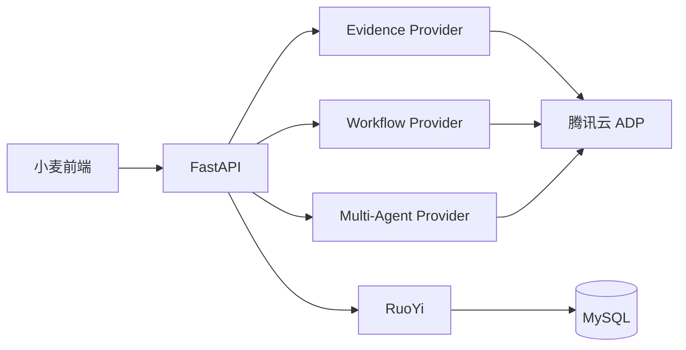

# 9. 外部平台集成策略

## 9.1 腾讯云智能体平台定位

\[Decision] 腾讯云智能体开发平台（Tencent Cloud ADP）作为**当前默认的外部 AI 能力实现之一**，不作为核心业务主链路的直接依赖。

**核心原则**：

* **纯 API 调用**：不自建前端组件，完全使用自研 UI
* **能力借用**：借用平台的证据检索、流程编排、路径规划与评测能力
* **数据独立**：核心业务数据仍由 RuoYi 持久化，不依赖平台存储
* **可替换性**：通过 Provider 抽象层封装，便于未来迁移

## 9.2 平台能力与小麦用途映射

| 平台能力族 | 小麦内部能力 | 集成方式 |
|-----------|-------------|---------|
| **证据检索 / RAG** | `EvidenceProvider` | 标准 API 调用 |
| **工作流编排** | `QuizFlowProvider` | 异步 API 调用 + 轮询 |
| **Multi-Agent / 深度分析** | `PathPlanningProvider` | 标准 API 调用 |
| **文档解析 / 拆分 / embedding / rerank** | `EvidenceProvider` 的索引与召回子能力 | 原子能力 API |
| **应用评测 / 运营** | `EvaluationProvider` | 控制台 / API 混合接入 |

## 9.3 API 集成架构

```text
┌─────────────────────────────────────────────────────────────────────┐
│                      小麦前端 (React SPA)                            │
│  所有 UI 100% 自研，不使用腾讯云前端组件                              │
└───────────────────────────────┬─────────────────────────────────────┘
                                │ HTTP / SSE
┌───────────────────────────────┴─────────────────────────────────────┐
│                    FastAPI 功能服务 (8090)                           │
│  ┌─────────────────────────────────────────────────────────────┐   │
│  │                 TencentADPAdapter                            │   │
│  │  ├─ EvidenceService (资料证据检索与引用)                     │   │
│  │  ├─ WorkflowService (工作流调用)                              │   │
│  │  ├─ MultiAgentService (多智能体)                              │   │
│  │  └─ DocumentService (文档解析)                                │   │
│  └─────────────────────────────────────────────────────────────┘   │
└───────────────────────────────┬─────────────────────────────────────┘
                                │ HTTPS API
┌───────────────────────────────┴─────────────────────────────────────┐
│                    腾讯云智能体开发平台                               │
│  ┌──────────────┐  ┌──────────────┐  ┌──────────────┐              │
│  │ 知识库应用    │  │ 工作流应用    │  │ Multi-Agent  │              │
│  │ (标准模式)    │  │ (工作流模式)  │  │ (多智能体)    │              │
│  └──────────────┘  └──────────────┘  └──────────────┘              │
└─────────────────────────────────────────────────────────────────────┘
```

## 9.4 配置管理

\[Rule] 腾讯云智能体平台相关配置作为外部能力配置项统一管理，包括：

* `TENCENT_SECRET_ID`
* `TENCENT_SECRET_KEY`
* `TENCENT_ADP_REGION`
* `TENCENT_ADP_KNOWLEDGE_APP_KEY`
* `TENCENT_QUIZ_WORKFLOW_ID`
* `TENCENT_PATH_AGENT_ID`

## 9.5 用户身份关联

\[Rule] 通过 `visitor_biz_id` 参数将小麦用户 ID 传递给腾讯云平台，实现用户行为追踪，但不在平台侧做身份验证。

## 9.6 数据回写策略

| 数据类型 | 回写时机 | 存储位置 |
|---------|---------|---------|
| 问答记录 | 每次对话后 | RuoYi `xm_knowledge_chat_log`（历史表名，承载证据检索与来源问答历史） |
| 小测结果 | 工作流完成后 | RuoYi `xm_quiz_result` |
| 学习路径 | 用户确认后 | RuoYi `xm_learning_path` |

\[Implementation Note] 数据回写通过 FastAPI 定时任务或 Webhook 实现，不依赖腾讯云平台的数据存储。

## 9.7 平台能力使用清单

| 能力类别 | 具体能力 | 小麦用途 | API 接口 |
|---------|---------|---------|---------|
| **证据检索 / RAG** | 证据召回 | 资料证据检索与来源引用 | `ChatGetMsgRecord` |
| **工作流** | 可视化编排 | Learning Coach 的 checkpoint / quiz 生成 | `CreateWorkflowRunDescribeWorkflowRun` |
| **Multi-Agent** | 多智能体协同 | 学习路径规划 | `Chat` (Multi-Agent 模式) |
| **文档解析** | 文档转 Markdown | 教材上传解析 | 原子能力 API |
| **Embedding** | 向量化 | 知识检索 | 原子能力 API |

## 9.8 相关文档索引

| 文档 | 路径 | 说明 |
|------|------|------|
| 腾讯云产品简介 | `docs/01开发人员手册/000-腾讯云产品文档/0001腾讯云智能体平台-产品简介.md` | 平台能力概述 |
| 页面功能服务 | `docs/01开发人员手册/000-腾讯云产品文档/0003腾讯云智能体平台-页面功能服务（给用户）.md` | 三种模式使用指南 |
| API 文档索引 | `docs/01开发人员手册/000-腾讯云产品文档/004腾讯云智能体平台-API 文档网络索引.md` | 完整 API 列表 |
| 应用接口文档 | `docs/01开发人员手册/000-腾讯云产品文档/005腾讯云智能体平台-应用接口文档.md` | 应用管理、评测、运营 |

## 9.9 外部能力接入补充视图



***
