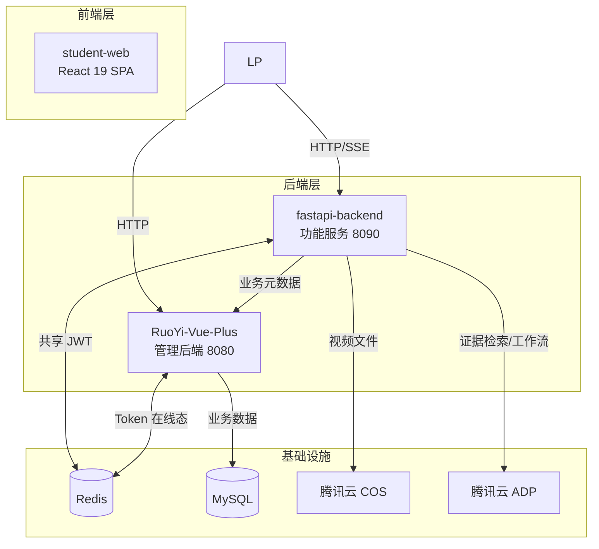

# 14. 项目结构与边界定义

## 14.1 需求到架构组件映射

### 14.1.1 功能需求映射

| 功能域 | 模块/目录/服务 | 核心组件 |
|--------|---------------|---------|
| **FR-VS: 视频服务** | `packages/fastapi-backend/app/features/video/` | `routes/`, `services/`, `schemas/`, `workers/` |
| **FR-CS: 课堂服务** | `packages/fastapi-backend/app/features/classroom/` | `routes/`, `services/`, `schemas/`, `agents/` |
| **FR-CP: 会话伴学** | `packages/fastapi-backend/app/features/companion/` | `routes/`, `service/`, `context_adapter/`, `whiteboard/` |
| **FR-KQ: Evidence / Retrieval** | `packages/fastapi-backend/app/features/knowledge/` | `routes/`, `services/`, `parsers/`, `adapters/` |
| **FR-LA: 学习教练** | `packages/fastapi-backend/app/features/learning/` | `checkpoint/`, `quiz/`, `recommendation/`, `wrongbook/`, `path/` |
| **FR-UM: 用户管理** | `packages/RuoYi-Vue-Plus-5.X/` | RuoYi 业务表 + RBAC |
| **FR-LR: 学习记录** | `packages/RuoYi-Vue-Plus-5.X/` | 业务表 + CRUD |
| **FR-UI: 前端 UI** | `packages/student-web/` | React 19 SPA |

\[Note] `packages/fastapi-backend/app/features/knowledge/` 为历史工程命名，当前产品语义统一对应 Evidence / Retrieval 服务层；当前版本不提供学生端独立 `/knowledge` 路由。
\[Note] `FR-VS-010` 与 `FR-VP-004` 由视频结果元数据、公开状态与输入页发现卡片协同承接，不扩展独立视频社区域。
\[Note] `FR-CS-008`、`FR-KQ-007` 由 classroom 与 knowledge 两个模块协同承接；`FR-CS-009` 由课堂结果导出编排与产物宿主协同承接。
\[Note] UX 设计资产按页面归档；前端代码仍按 React 页面、组件、服务职责组织。两者分别服务于设计管理与工程实现，不构成冲突。

## 14.2 完整 Monorepo 项目结构

```text
Prorise_ai_teach_workspace/
├── docs/                                    # 📚 项目文档
│   ├── 01开发人员手册/
│   │   ├── 001-项目概述.md
│   │   ├── 002-需求分析.md
│   │   ├── 003-架构设计.md
│   │   ├── 004-开发规范.md
│   │   ├── 005-环境搭建.md
│   │   ├── 006-模块开发指南/
│   │   │   ├── 01-课堂服务.md
│   │   │   ├── 02-视频服务.md
│   │   │   ├── 03-AI-LLM集成.md
│   │   │   ├── 04-TTS集成.md
│   │   │   └── 05-Manim渲染.md
│   │   ├── 007-测试策略.md
│   │   ├── 008-部署与运维.md
│   │   ├── 009-里程碑与进度.md
│   │   └── 010-附录/
│   │       ├── 000-腾讯云产品文档/
│   │       ├── ADR记录.md
│   │       └── FAQ.md
│   ├── 02团队协作规范/
│   ├── 03UI:UX设计素材/
│   └── INDEX.md
│
├── packages/                                # 📦 代码包
│   │
│   ├── fastapi-backend/                     # 🔴 FastAPI 功能服务 (8090)
│   │   ├── app/
│   │   │   ├── main.py                     # FastAPI 应用入口
│   │   │   │
│   │   │   ├── core/                       # 核心配置与基础设施
│   │   │   │   ├── config.py               # pydantic-settings 配置
│   │   │   │   ├── security.py             # JWT 验证、密码哈希
│   │   │   │   ├── lifespan.py             # 应用生命周期管理
│   │   │   │   ├── errors.py               # 统一异常处理
│   │   │   │   ├── sse.py                  # SSE 基础设施
│   │   │   │   └── logging.py              # loguru 日志配置
│   │   │   │
│   │   │   ├── infra/                      # 基础设施层
│   │   │   │   ├── http/                   # HTTP 客户端抽象
│   │   │   │   │   ├── protocols.py        # HttpClient Protocol
│   │   │   │   │   ├── httpx_client.py     # httpx 实现
│   │   │   │   │   └── retry.py            # tenacity 重试策略
│   │   │   │   ├── redis_client.py         # redis-py 客户端
│   │   │   │   └── sse_broker.py           # SSE 事件分发器
│   │   │   │
│   │   │   ├── providers/                  # Provider 抽象层
│   │   │   │   ├── protocols.py            # LLM/TTS Protocol 定义
│   │   │   │   ├── llm/                    # LLM 实现
│   │   │   │   │   ├── __init__.py
│   │   │   │   │   ├── factory.py          # LLM Provider 工厂
│   │   │   │   │   ├── gemini_provider.py  # Gemini 实现
│   │   │   │   │   ├── claude_provider.py  # Claude 实现
│   │   │   │   │   └── deepseek_provider.py
│   │   │   │   └── tts/                    # TTS 实现
│   │   │   │       ├── __init__.py
│   │   │   │       ├── factory.py          # TTS Provider 工厂
│   │   │   │       ├── doubao_provider.py  # 豆包 TTS
│   │   │   │       ├── baidu_provider.py   # 百度 TTS
│   │   │   │       ├── spark_provider.py   # Spark TTS
│   │   │   │       └── kokoro_provider.py  # Kokoro 本地 TTS
│   │   │   │
│   │   │   ├── features/                   # 业务功能模块
│   │   │   │   ├── classroom/              # 课堂服务模块
│   │   │   │   │   ├── routes.py           # 路由定义
│   │   │   │   │   ├── service.py          # 课堂生成逻辑
│   │   │   │   │   ├── schemas.py          # Pydantic 模型
│   │   │   │   │   ├── agents/             # Agent 编排
│   │   │   │   │   │   ├── orchestrator.py # LangGraph 编排器
│   │   │   │   │   │   ├── styles.py       # AgentConfig 定义
│   │   │   │   │   │   └── prompts.py      # Persona 模板
│   │   │   │   │   └── workers/            # 课堂异步任务
│   │   │   │   │       └── classroom_task.py
│   │   │   │   │
│   │   │   │   ├── video/                  # 视频服务模块
│   │   │   │   │   ├── routes.py           # 路由定义
│   │   │   │   │   ├── service.py          # 视频生成逻辑
│   │   │   │   │   ├── schemas.py          # Pydantic 模型
│   │   │   │   │   ├── pipeline/           # 视频流水线
│   │   │   │   │   │   ├── stages.py       # 阶段定义
│   │   │   │   │   │   ├── understanding.py # 题目理解
│   │   │   │   │   │   ├── storyboard.py   # 分镜生成
│   │   │   │   │   │   ├── manim_gen.py    # Manim 代码生成
│   │   │   │   │   │   ├── manim_fix.py    # Manim 修复链
│   │   │   │   │   │   ├── render.py       # 渲染执行
│   │   │   │   │   │   └── compose.py      # FFmpeg 合成
│   │   │   │   │   ├── sandbox/            # Manim 沙箱
│   │   │   │   │   │   ├── executor.py     # 安全执行器
│   │   │   │   │   │   ├── resource_limits.py
│   │   │   │   │   │   └── security_policy.py
│   │   │   │   │   └── workers/            # 视频异步任务
│   │   │   │   │       └── video_task.py
│   │   │   │   │
│   │   │   │   ├── companion/              # 共享会话伴学层
│   │   │   │   │   ├── routes.py
│   │   │   │   │   ├── service.py
│   │   │   │   │   ├── schemas.py
│   │   │   │   │   ├── context_adapter/
│   │   │   │   │   │   ├── video_adapter.py
│   │   │   │   │   │   └── classroom_adapter.py
│   │   │   │   │   └── whiteboard/
│   │   │   │   │       ├── action_schema.py
│   │   │   │   │       └── renderer.py
│   │   │   │   │
│   │   │   │   ├── knowledge/              # Evidence / Retrieval 资料证据服务（含联网搜索）
│   │   │   │   └── learning/               # Learning Coach 学习教练
│   │   │   │
│   │   │   └── shared/                     # 共享模块
│   │   │       ├── agent_config.py         # AgentConfig 预设数据
│   │   │       ├── ruoyi_client.py         # RuoYi API 客户端
│   │   │       ├── cos_client.py           # 腾讯云 COS 客户端
│   │   │       ├── tencent_adp.py          # 腾讯云智能体平台适配器
│   │   │       └── task_framework/         # 统一任务框架
│   │   │           ├── base.py             # BaseTask 基类
│   │   │           ├── status.py           # TaskStatus 枚举
│   │   │           ├── context.py          # TaskContext
│   │   │           ├── events.py           # TaskProgressEvent
│   │   │           └── scheduler.py        # TaskScheduler
│   │   │
│   │   ├── tests/                          # 测试
│   │   │   ├── unit/
│   │   │   ├── integration/
│   │   │   └── conftest.py
│   │   │
│   │   ├── pyproject.toml                  # 项目配置
│   │   ├── requirements.txt                # 依赖清单
│   │   ├── Dockerfile                      # 容器化配置
│   │   └── .env.example                    # 环境变量示例
│   │
│   ├── student-web/                         # 🔵 React 19 学生端前台 (5173)
│   │   ├── src/
│   │   │   ├── main.tsx                    # 应用入口
│   │   │   ├── App.tsx                     # 根组件
│   │   │   │
│   │   │   ├── pages/                      # 页面组件
│   │   │   │   ├── Home.tsx                # 首页主入口与导航分发
│   │   │   │   ├── Landing.tsx             # 营销落地页（投放场景）
│   │   │   │   ├── VideoGenerator.tsx      # 视频生成页（含公开视频发现区）
│   │   │   │   ├── VideoPlayer.tsx         # 视频播放页（含公开发布 / 复用入口）
│   │   │   │   ├── Classroom.tsx           # 课堂页（含联网搜索配置与结果导出）
│   │   │   │   ├── CompanionPanel.tsx      # 会话伴学侧栏 / 白板
│   │   │   │   ├── EvidenceDrawer.tsx      # 来源抽屉 / 证据面板（非路由）
│   │   │   │   ├── LearningCenter.tsx      # 学习中心
│   │   │   │   ├── History.tsx             # 历史记录视图（学习中心域）
│   │   │   │   ├── Favorites.tsx           # 收藏视图（学习中心域）
│   │   │   │   ├── Profile.tsx             # 个人资料页
│   │   │   │   └── Settings.tsx            # 设置页
│   │   │   │
│   │   │   ├── components/                 # 组件
│   │   │   │   ├── ui/                     # Shadcn/ui 组件
│   │   │   │   │   ├── button.tsx
│   │   │   │   │   ├── card.tsx
│   │   │   │   │   ├── input.tsx
│   │   │   │   │   └── ...
│   │   │   │   ├── layout/                 # 布局组件
│   │   │   │   │   ├── Header.tsx
│   │   │   │   │   ├── Footer.tsx
│   │   │   │   │   └── Sidebar.tsx
│   │   │   │   ├── video/                  # 视频相关组件
│   │   │   │   │   ├── TaskProgress.tsx    # SSE 进度展示
│   │   │   │   │   ├── VideoPlayer.tsx     # Video.js 封装
│   │   │   │   │   └── TaskList.tsx
│   │   │   │   ├── classroom/              # 课堂相关组件
│   │   │   │   │   ├── AgentAvatar.tsx     # Agent 头像
│   │   │   │   │   ├── ChatPanel.tsx       # 对话面板
│   │   │   │   │   └── SlideViewer.tsx     # 幻灯片查看器
│   │   │   │   └── agent/                  # Agent 风格组件
│   │   │   │       ├── AgentSelector.tsx   # Agent 选择器
│   │   │   │       └── AgentStyleWrapper.tsx
│   │   │   │
│   │   │   ├── hooks/                      # 自定义 Hooks
│   │   │   │   ├── useSSE.ts               # SSE 连接管理
│   │   │   │   ├── useVideoTask.ts         # 视频任务状态
│   │   │   │   └── useAuth.ts              # 认证状态
│   │   │   │
│   │   │   ├── stores/                     # Zustand 状态
│   │   │   │   ├── authStore.ts            # 认证状态
│   │   │   │   ├── agentStore.ts           # Agent 配置
│   │   │   │   └── taskStore.ts            # 任务状态
│   │   │   │
│   │   │   ├── services/                   # API 服务
│   │   │   │   ├── api/                    # HTTP 客户端
│   │   │   │   │   ├── client.ts           # ky/alova 封装
│   │   │   │   │   ├── interceptors.ts
│   │   │   │   │   └── types.ts
│   │   │   │   ├── video.ts                # 视频服务 API
│   │   │   │   ├── classroom.ts            # 课堂服务 API
│   │   │   │   └── auth.ts                 # 认证 API
│   │   │   │
│   │   │   ├── router/                     # 路由配置
│   │   │   │   ├── index.tsx
│   │   │   │   └── routes.ts
│   │   │   │
│   │   │   ├── styles/                     # 样式
│   │   │   │   ├── globals.css             # Tailwind 入口
│   │   │   │   └── agent-colors.css        # Agent 点缀色变量
│   │   │   │
│   │   │   ├── lib/                        # 工具库
│   │   │   │   ├── utils.ts                # 工具函数
│   │   │   │   ├── constants.ts            # 常量
│   │   │   │   └── katex.ts                # KaTeX 配置
│   │   │   │
│   │   │   └── types/                      # TypeScript 类型
│   │   │       ├── api.ts
│   │   │       ├── video.ts
│   │   │       └── classroom.ts
│   │   │
│   │   ├── public/
│   │   │   ├── avatars/                    # Agent 头像图片
│   │   │   │   ├── serious.png
│   │   │   │   ├── humorous.png
│   │   │   │   ├── patient.png
│   │   │   │   └── efficient.png
│   │   │   └── favicon.ico
│   │   │
│   │   ├── index.html
│   │   ├── vite.config.ts
│   │   ├── tailwind.config.js
│   │   ├── tsconfig.json
│   │   ├── package.json
│   │   └── .env.example
│   │
│   ├── ruoyi-plus-soybean-master/           # 🟢 ToB 管理前端 (已有，不动)
│   │
│   └── RuoYi-Vue-Plus-5.X/                  # 🟡 RuoYi Java 后端 (8080)
│       ├── ruoyi-admin/                     # 管理后台模块
│       ├── ruoyi-common/                    # 公共模块
│       ├── ruoyi-system/                    # 系统模块
│       ├── ruoyi-framework/                 # 框架核心
│       │
│       └── ruoyi-xiaomai/                   # 🆕 小麦业务模块 (新增)
│           ├── src/main/java/
│           │   └── org/ruoyi/xiaomai/
│           │       ├── domain/              # 实体类
│           │       │   ├── XmVideoTask.java
│           │       │   ├── XmClassroomSession.java
│           │       │   ├── XmCompanionTurn.java
│           │       │   ├── XmSessionArtifact.java
│           │       │   ├── XmWhiteboardActionLog.java
│           │       │   ├── XmLearningRecord.java
│           │       │   ├── XmLearningFavorite.java
│           │       │   └── XmQuizResult.java
│           │       ├── mapper/              # MyBatis Mapper
│           │       ├── service/             # 业务服务
│           │       ├── controller/          # REST 接口
│           │       └── vo/                  # VO 对象
│           └── src/main/resources/
│               └── mapper/                  # XML 映射文件
│
├── references/                              # 📖 参考项目 (只读)
│   ├── openmaic/                           # OpenMAIC 多 Agent 课堂
│   ├── manim-to-video-claw/                # Manim 视频生成流水线
│   └── INDEX.md
│
├── _bmad/                                   # BMAD 开发流程系统
│   ├── bmm/
│   │   ├── agents/
│   │   ├── config.yaml
│   │   └── workflows/
│   └── tasks/
│
├── _bmad-output/                            # BMAD 流程产出物
│   ├── planning-artifacts/
│   │   ├── prd.md                          # ✅ 已完成
│   │   ├── ux-design-specification.md      # ✅ 已完成
│   │   ├── architecture.md                 # ✅ 已完成 (本文档)
│   │   └── product-brief-*.md
│   ├── implementation-artifacts/
│   └── research/
│
├── .serena/                                 # Serena 项目记忆
│
├── CLAUDE.md                                # Claude Code 项目指令
├── pnpm-workspace.yaml                      # pnpm workspace 配置
├── package.json                             # 根 package.json
└── README.md
```

## 14.3 能力域/功能到文件映射

| 能力域 / 功能 | 主要文件/目录 | 说明 |
|------------|--------------|------|
| **功能域：Video Engine 后端** | `packages/fastapi-backend/app/features/video/` | 完整视频流水线 |
| - FR-VS-001 题目输入 | `video/routes.py`, `video/schemas.py` | 多模态输入与创建前校验 |
| - FR-VS-002 题目理解 | `pipeline/understanding.py` | LLM 题目解析 |
| - FR-VS-003 分镜生成 | `pipeline/storyboard.py` | 分镜脚本生成 |
| - FR-VS-004 Manim 代码生成 | `pipeline/manim_gen.py` | 动画代码生成 |
| - FR-VS-005 代码自动修复 | `pipeline/manim_fix.py` | 自动修复链 |
| - FR-VS-006 动画渲染 | `pipeline/render.py`, `sandbox/` | 沙箱执行 |
| - FR-VS-007 TTS 合成 | `providers/tts/` | 多 TTS 级联 |
| - FR-VS-008 视频合成与上传 | `pipeline/compose.py`, `shared/cos_client.py` | FFmpeg 合成 + COS 上传 |
| - FR-VS-009 视频任务进度反馈 | `video/workers/`, `core/sse.py`, `infra/sse_broker.py` | 阶段进度与恢复 |
| - FR-VS-010 公开视频发现 | `video/routes.py`, `shared/ruoyi_client.py` | 公开卡片列表与输入页复用入口 |
| - FR-VP-004 公开发布与复用 | `video/routes.py`, `ruoyi-xiaomai/domain/` | 公开状态与最小元数据 |
| **功能域：Classroom Engine 后端** | `packages/fastapi-backend/app/features/classroom/` | 课堂生成 |
| - FR-CS-001 主题→课堂 | `service.py`, `agents/orchestrator.py` | 课堂生成 |
| - FR-CS-002 用户配置系统 | `shared/user_profile.py`, `classroom/agents/generator.py` | 用户配置管理与 Agent 动态生成 |
| - FR-CS-003 幻灯片 | `agents/` | 幻灯片生成 |
| - FR-CS-004 会话结束信号 | `agents/`, `shared/tencent_adp.py` | 课后 checkpoint / quiz 触发信号生成 |
| - FR-CS-005 多 Agent 讨论 | `agents/discussion.py`, `agents/orchestrator.py` | 多角色讨论编排 |
| - FR-CS-006 SSE | `core/sse.py`, `infra/sse_broker.py` | 实时进度 |
| - FR-CS-007 白板布局 | `viewmodels/whiteboard_layout.py` | 基础可读性与降级规则 |
| - FR-CS-008 联网搜索增强 | `classroom/service.py`, `knowledge/services/` | 输入配置透传与生成前证据增强 |
| - FR-CS-009 课堂结果导出 | `classroom/routes.py`, `shared/cos_client.py`, `ruoyi-xiaomai/domain/` | 导出任务与产物记录 |
| **功能域：Companion 会话伴学后端** | `packages/fastapi-backend/app/features/companion/` | 当前时刻问答、白板解释、上下文适配 |
| - FR-CP-001~004 锚点与追问 | `companion/service.py`, `companion/context_adapter/` | 当前上下文解释 |
| - FR-CP-003 白板解释 | `companion/whiteboard/` | 动作协议与渲染 |
| - FR-CP-005 回写 | `ruoyi-xiaomai/domain/`, `shared/ruoyi_client.py` | 问答与动作日志 |
| **功能域：Evidence / Retrieval 后端** | `packages/fastapi-backend/app/features/knowledge/` | 证据检索、来源引用与资料接入 |
| - FR-KQ-002 文档上传与解析 | `knowledge/parsers/`, `knowledge/services/` | 上传、解析、索引 |
| - FR-KQ-007 联网搜索 | `knowledge/adapters/`, `knowledge/services/` | 公开资料检索与 citation 归一化 |
| **功能域：Learning Coach 学习教练后端** | `packages/fastapi-backend/app/features/learning/` | checkpoint / quiz / path / 推荐 |
| - FR-LA-004 知识点推荐 | `learning/recommendation.py` | 关联推荐 |
| - FR-LA-005 错题本 | `learning/wrongbook.py`, `ruoyi-xiaomai/domain/` | 错题沉淀与回看 |
| **功能域：前端 UI** | `packages/student-web/` | React 19 SPA |
| - FR-UI-001 首页 | `pages/Home.tsx` | 双入口页面 |
| - FR-UI-009 营销落地页 | `pages/Landing.tsx` | 独立营销页 |
| - FR-UI-002 课堂页 | `pages/Classroom.tsx` | 课堂输入、等待、结果与导出 |
| - FR-UI-003 视频页 | `pages/VideoGenerator.tsx`, `pages/VideoPlayer.tsx` | 视频输入、公开视频发现与结果消费 |
| - FR-UI-004 播放器 | `components/video/VideoPlayer.tsx` | Video.js 封装 |
| - FR-UI-006 来源抽屉 / 证据面板 | `components/evidence/` | 非路由资料能力 |
| - FR-UI-005 个人资料与设置 | `pages/Profile.tsx` | 个人资料与平台设置 |
| - FR-UI-007 学习中心 | `pages/LearningCenter.tsx` | 学习结果聚合页面 |
| - 学习中心域视图 | `pages/History.tsx`, `pages/Favorites.tsx` | `/history`、`/favorites` |
| - 设置页 | `pages/Settings.tsx` | `/settings` |
| **功能域：RuoYi 业务承接（用户与学习数据）** | `packages/RuoYi-Vue-Plus-5.X/ruoyi-xiaomai/` | 业务表与 CRUD 承接 |
| - FR-LR-001 学习记录 | `domain/XmLearningRecord.java` | 学习记录表 |
| - FR-LR-002 收藏 | `domain/XmLearningFavorite.java` | 收藏表 |

## 14.4 跨边界集成关系



## 14.5 关键边界约束

| 边界 | 约束 | 实现方式 |
|------|------|----------|
| **FastAPI ↔ RuoYi** | 防腐层隔离 | `shared/ruoyi_client.py` |
| **FastAPI ↔ 腾讯云 ADP** | Provider 抽象 | `shared/tencent_adp.py` |
| **前端 ↔ FastAPI** | 统一 API 格式 | `services/api/client.ts` |
| **前端 ↔ RuoYi** | JWT 认证 | `hooks/useAuth.ts` |
| **Redis 数据** | TTL 强制 | 所有 Key 设置过期时间 |
| **长期数据** | 必须入 RuoYi | 业务表持久化 |
| **Video / Classroom 引擎边界** | 不互相依赖具体实现 | 仅通过 `SessionArtifactGraph` 共享上下文 |
| **Companion ↔ Evidence / Retrieval** | Companion 不直接承担资料库主检索 | 通过 `EvidenceProvider` 适配调用 |

***
