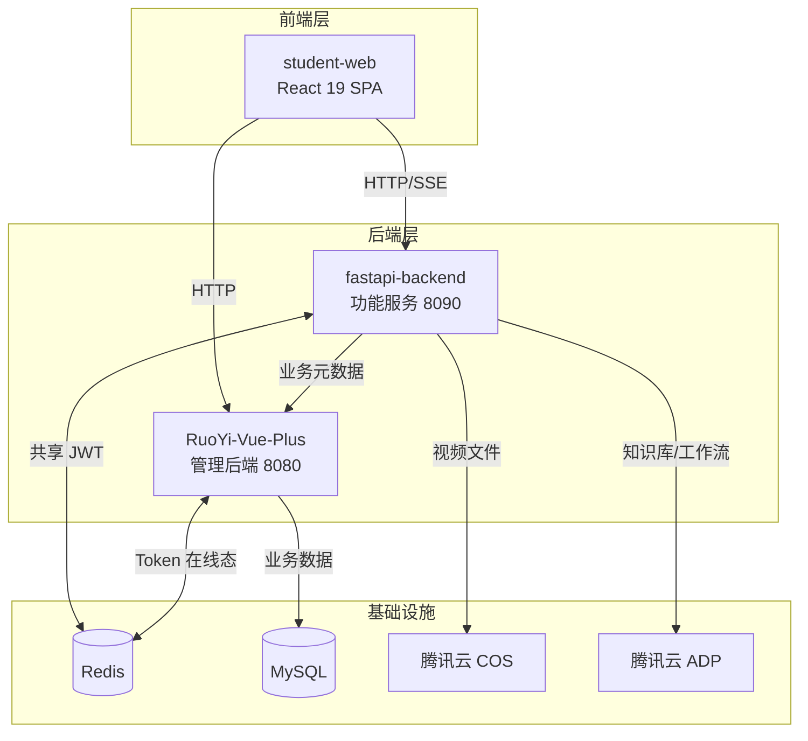

# 14.4 跨边界集成关系

```mermaid
flowchart TB
    subgraph Frontend["前端层"]
        SW[student-web<br/>React 19 SPA]
    end
    
    subgraph Backend["后端层"]
        FA[fastapi-backend<br/>功能服务 8090]
        RY[RuoYi-Vue-Plus<br/>管理后端 8080]
    end
    
    subgraph Infrastructure["基础设施"]
        RD[(Redis)]
        MY[(MySQL)]
        COS[腾讯云 COS]
        ADP[腾讯云 ADP]
    end
    
    SW -->|HTTP/SSE| FA
    SW -->|HTTP| RY
    
    FA <-->|共享 JWT| RD
    FA -->|业务元数据| RY
    FA -->|视频文件| COS
    FA -->|知识库/工作流| ADP
    
    RY <-->|Token 在线态| RD
    RY -->|业务数据| MY
```
