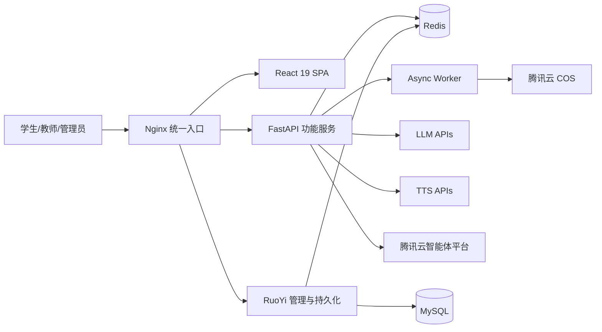

# 4.6 总体架构补充视图

```mermaid
flowchart LR
    U[学生/教师/管理员] --> N[Nginx 统一入口]
    N --> FE[React 19 SPA]
    N --> FA[FastAPI 功能服务]
    N --> RY[RuoYi 管理与持久化]

    FA --> RD[(Redis)]
    FA --> W[Async Worker]
    W --> COS[腾讯云 COS]
    FA --> LLM[LLM APIs]
    FA --> TTS[TTS APIs]
    FA --> TADP[腾讯云智能体平台]

    RY --> MYSQL[(MySQL)]
    RY --> RD
```

---
