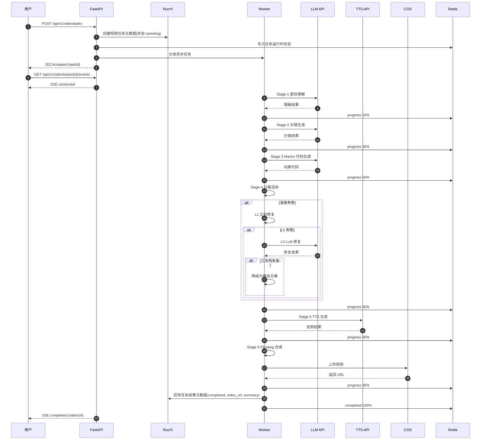

# 5.2 关键链路一：视频生成全流程

```mermaid
sequenceDiagram
    autonumber
    participant U as 用户
    participant F as FastAPI
    participant RY as RuoYi
    participant W as Worker
    participant L as LLM API
    participant T as TTS API
    participant C as COS
    participant R as Redis
    U->>F: POST /api/v1/video/tasks
    F->>RY: 创建视频任务元数据(状态=pending)
    F->>R: 写入任务运行时状态
    F->>W: 分发异步任务
    F-->>U: 202 Accepted {taskId}
    U->>F: GET /api/v1/video/tasks/{id}/events
    F-->>U: SSE connected
    W->>L: Stage 1 题目理解
    L-->>W: 理解结果
    W->>R: progress 10%
    W->>L: Stage 2 分镜生成
    L-->>W: 分镜结果
    W->>R: progress 30%
    W->>L: Stage 3 Manim 代码生成
    L-->>W: 动画代码
    W->>R: progress 50%
    W->>W: Stage 4 沙箱渲染
    alt 渲染失败
        W->>W: L1 正则修复
        alt L1 失败
            W->>L: L3 LLM 修复
            L-->>W: 修复结果
            alt 三次均失败
                W->>W: 降级为静态方案
            end
        end
    end
    W->>R: progress 60%
    W->>T: Stage 5 TTS 合成
    T-->>W: 音频结果
    W->>R: progress 80%
    W->>W: Stage 6 FFmpeg 合成
    W->>C: 上传视频
    C-->>W: 返回 URL
    W->>R: progress 95%
    W->>RY: 回写任务结果元数据(completed, video_url, summary)
    W->>R: completed 100%
    F-->>U: SSE completed {videoUrl}
```
