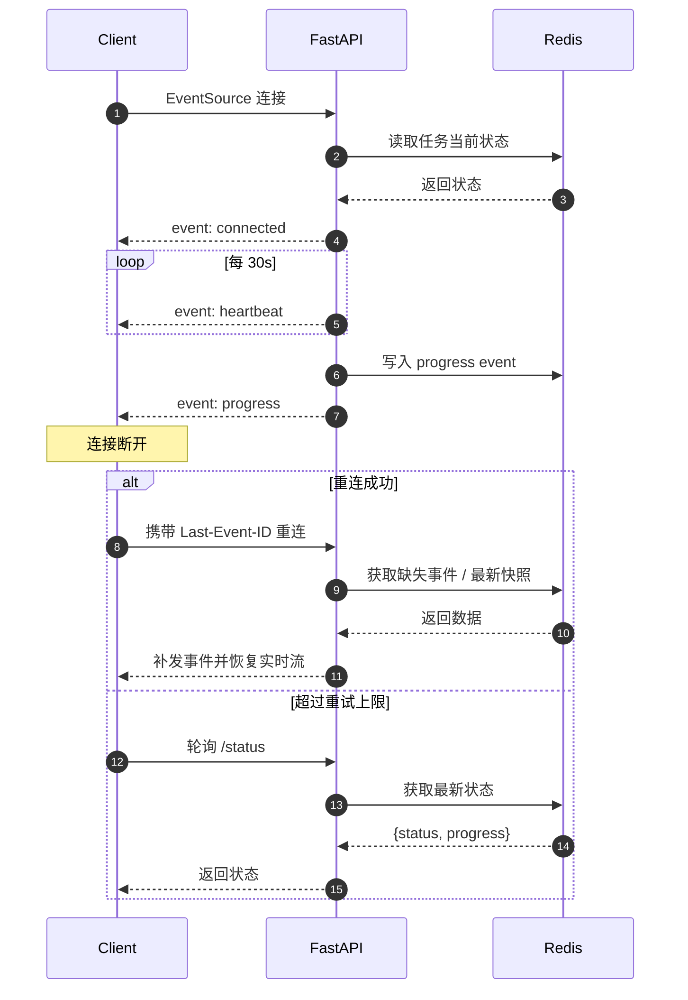

# 5.3 关键链路二：SSE 断线重连

```mermaid
sequenceDiagram
    autonumber
    participant C as Client
    participant F as FastAPI
    participant R as Redis
    C->>F: EventSource 连接
    F->>R: 读取任务当前状态
    R-->>F: 返回状态
    F-->>C: event: connected
    loop 每 30s
        F-->>C: event: heartbeat
    end
    F->>R: 写入 progress event
    F-->>C: event: progress
    Note over C: 连接断开
    alt 重连成功
        C->>F: 携带 Last-Event-ID 重连
        F->>R: 获取缺失事件 / 最新快照
        R-->>F: 返回数据
        F-->>C: 补发事件并恢复实时流
    else 超过重试上限
        C->>F: 轮询 /status
        F->>R: 获取最新状态
        R-->>F: {status, progress}
        F-->>C: 返回状态
    end
```
