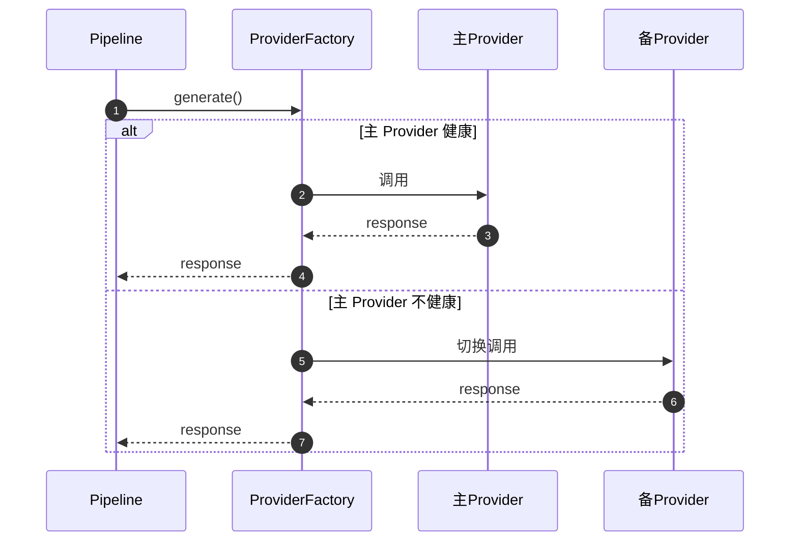

# 5.4 关键链路三：Provider Failover

```mermaid
sequenceDiagram
    autonumber
    participant P as Pipeline
    participant F as ProviderFactory
    participant G as 主Provider
    participant B as 备Provider
    P->>F: generate()
    alt 主 Provider 健康
        F->>G: 调用
        G-->>F: response
        F-->>P: response
    else 主 Provider 不健康
        F->>B: 切换调用
        B-->>F: response
        F-->>P: response
    end
```
