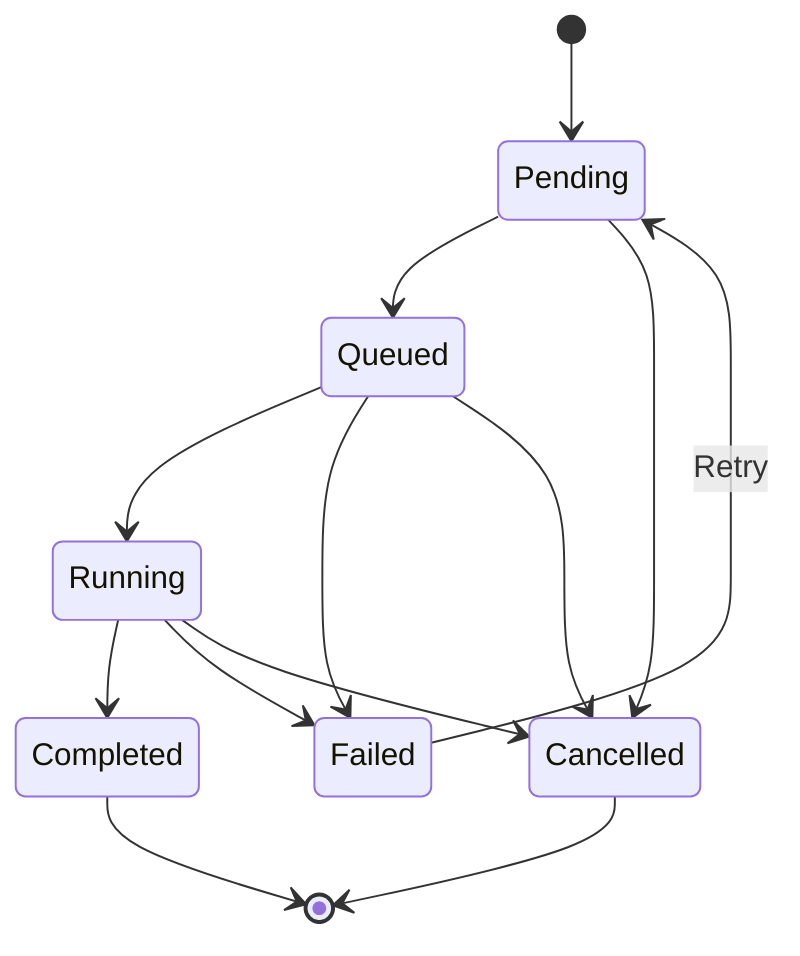

# 5.6 运行机制补充视图

```mermaid
stateDiagram-v2
    [*] --> Pending
    Pending --> Queued
    Pending --> Cancelled
    Queued --> Running
    Queued --> Failed
    Queued --> Cancelled
    Running --> Completed
    Running --> Failed
    Running --> Cancelled
    Failed --> Pending: Retry
    Completed --> [*]
    Cancelled --> [*]
```

---
