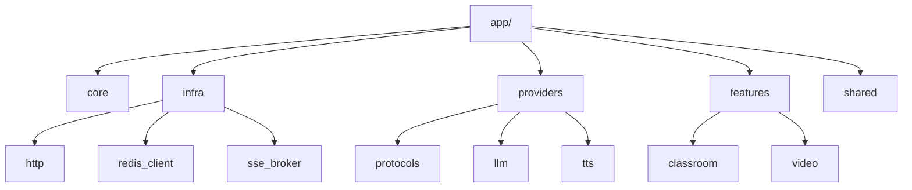

# 8.4 FastAPI 内部模块组织
**选择：手动搭建 FastAPI + Feature-Module + Protocol-DI 架构**

| 维度 | 评估 |
|------|------|
| **版本** | FastAPI 0.135.1、Python 3.12+、Pydantic v2、pydantic-settings 2.13.1 |
| **架构模式** | Feature-Module + Protocol-DI |
| **定位** | 功能服务层 / AI 编排层 / 异步任务协调层 |
| **核心设计原则** | 模块自治、接口隔离、基础设施可替换、无独立业务 ORM |

## 8.4.1 不使用现成模板的原因
- FastAPI 模板通常预设 ORM / Migration，而小麦业务主存储不在 FastAPI
- 小麦 FastAPI 核心是 AI 编排与功能执行，不是 CRUD 后台
- 长期业务数据由 RuoYi 承载，FastAPI 不应膨胀为第二个业务后台

## 8.4.2 技术栈选择
| 工具 | 用途 | 替代方案 | 选择理由 |
|------|------|----------|----------|
| **pydantic-settings 2.13.1** | 配置管理 | dotenv + getenv | 类型安全 |
| **loguru 0.7+** | 日志系统 | logging | 零配置、结构化友好 |
| **HTTP Client 抽象层** | 外部 API 调用统一入口 | 业务代码直连 | 统一超时/重试/限流 |
| **httpx 0.28+** | 默认 HTTP 客户端实现 | aiohttp | async、测试友好 |
| **tenacity 9.x** | 重试机制 | 自研 | 指数退避、异常分类 |
| **redis-py 5.x** | Redis 客户端 | aioredis | asyncio 原生支持 |
| **Protocol (PEP 544)** | 接口抽象 | ABC | 结构化子类型 |

[Implementation Note] HTTP 客户端在架构上采用“抽象层 + 默认实现”模式；默认实现使用 `httpx`，必要时允许替换为 `aiohttp`，但业务代码不感知具体客户端。

## 8.4.3 目录结构
```text
packages/fastapi-backend/
├── app/
│   ├── main.py
│   ├── core/
│   │   ├── config.py
│   │   ├── security.py
│   │   ├── lifespan.py
│   │   ├── errors.py
│   │   ├── sse.py
│   │   └── logging.py
│   ├── infra/
│   │   ├── http/
│   │   │   ├── protocols.py
│   │   │   ├── httpx_client.py
│   │   │   └── retry.py
│   │   ├── redis_client.py
│   │   └── sse_broker.py
│   ├── providers/
│   │   ├── protocols.py
│   │   ├── llm/
│   │   └── tts/
│   ├── features/
│   │   ├── classroom/
│   │   └── video/
│   └── shared/
│       ├── agent_config.py
│       ├── ruoyi_client.py
│       └── cos_client.py
├── tests/
├── pyproject.toml
└── Dockerfile
```

## 8.4.4 模块组织补充视图


---
