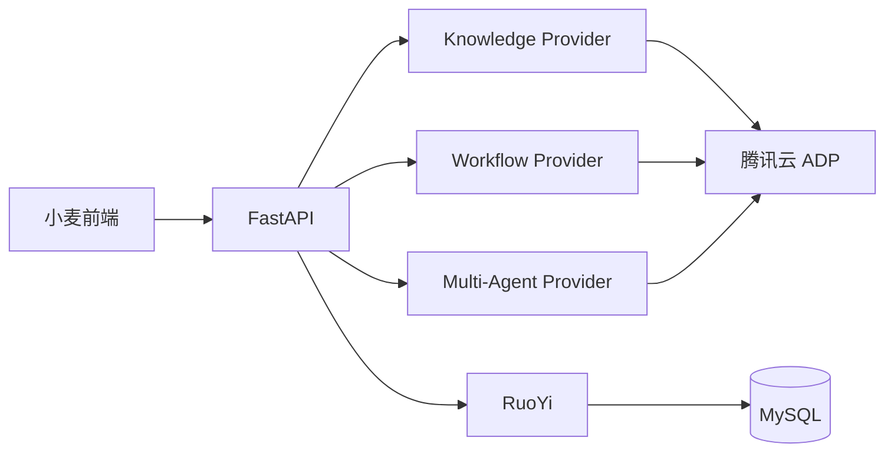

# 9.9 外部能力接入补充视图

```mermaid
flowchart LR
    FE[小麦前端] --> FA[FastAPI]
    FA --> KP[Knowledge Provider]
    FA --> WP[Workflow Provider]
    FA --> MP[Multi-Agent Provider]

    KP --> TADP[腾讯云 ADP]
    WP --> TADP
    MP --> TADP

    FA --> RY[RuoYi]
    RY --> DB[(MySQL)]
```

---
