| 版本 | 日期 | 修订内容 | 作者 | 评审 |
|------|------|----------|------|------|
| v0.1.0 | 2026-03-24 | 占位骨架 | 研发团队 | — |
| v1.0.0 | 2026-04-25 | arc42 + 4+1 + C4 三视图首版 | 研发团队 | 架构组 |
| v2.0.0 | 2026-04-25 | 重构为「图多讲解少 + 全程抽象」总览风格；移除全部模块路径与文件级引用，下沉至 006 模块开发指南 | 研发团队 | 架构组 |

---

## 1. 概述

### 1.1 目的

本文档以 **arc42** 为骨架，融合 **4+1 视图** 与 **C4 模型**，给出 Prorise AI Teach 平台的 **抽象级总览**。它只回答四个问题：**做什么 / 给谁用 / 由哪些容器组成 / 如何协作**。

> 任何文件级引用、模块内部结构、代码锚点 **不在本文档范围**，请到《006 模块开发指南》查阅。

### 1.2 阅读路径

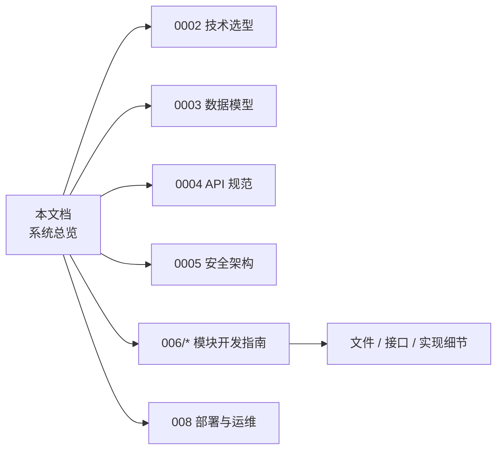

> 图 1-1：从总览出发的阅读路径。本文档是入口，**不承担细节**。

### 1.3 缩写

| 缩写 | 含义 |
|---|---|
| BMAD | Brief / Map / Architecture / Develop（项目研发流程） |
| SoT | Source of Truth |
| LLM / TTS / MLLM | 大语言 / 文本转语音 / 多模态大模型 |
| SSE | Server-Sent Events |
| ADR | Architecture Decision Record |

---

## 2. 引用文件

- 同级：《0002 技术选型决策记录》《0003 数据模型设计》《0004 API 设计规范》《0005 安全架构》
- 兄弟章节：《006 模块开发指南》《008 部署与运维》
- 外部标准：arc42 v8.2、4+1 View（Kruchten, 1995）、C4 Model（Simon Brown）、ISO/IEC/IEEE 42010、GB/T 8567-2006

---

## 3. 引言与目标（arc42 §1）

### 3.1 业务目标（一图概览）

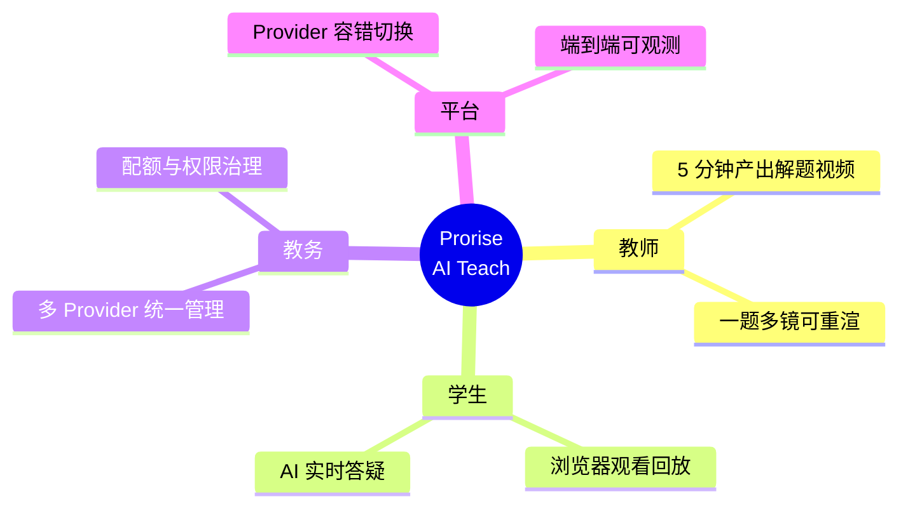

> 图 3-1：业务目标心智图

### 3.2 质量树

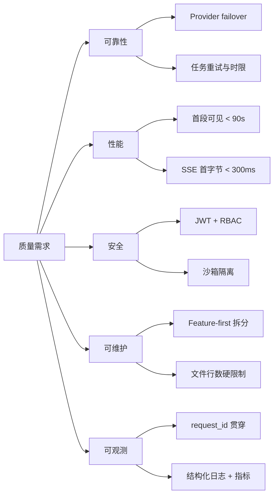

> 图 3-2：顶层质量属性树

### 3.3 干系人地图

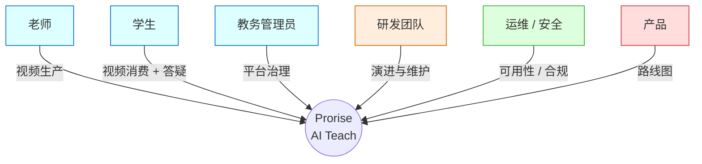

> 图 3-3：干系人与关注点

---

## 4. 约束条件（arc42 §2）

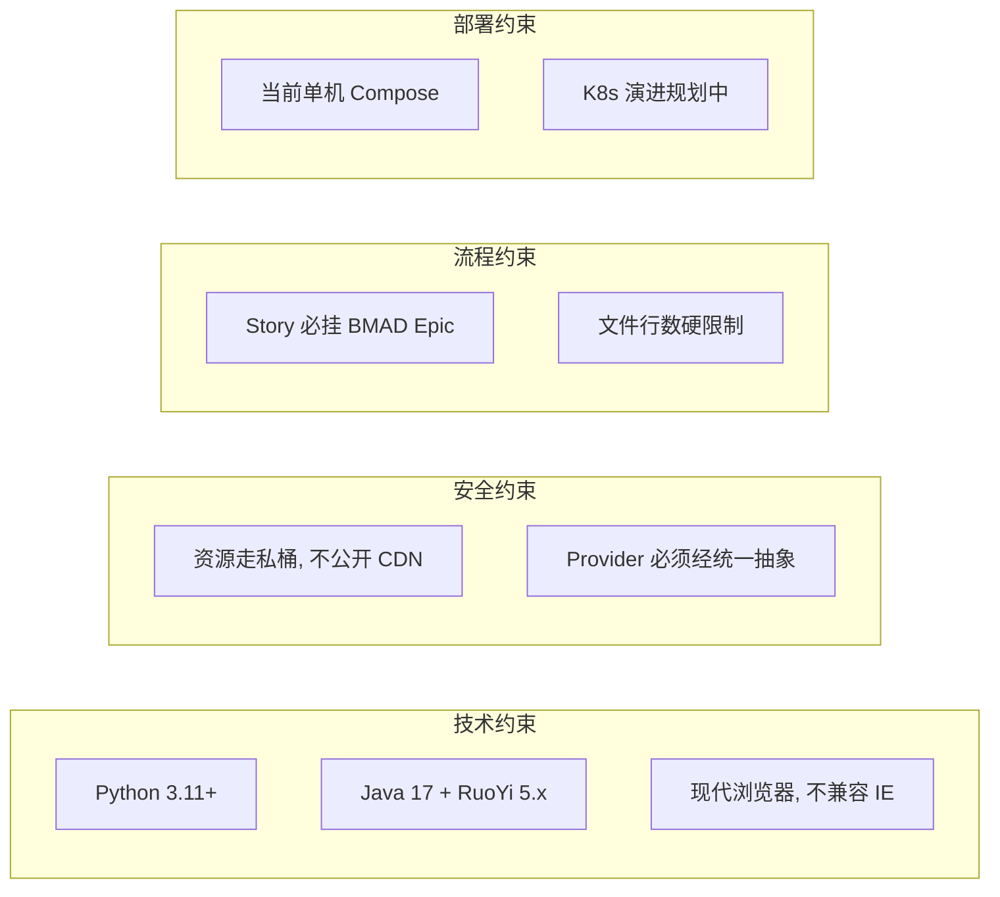

> 图 4-1：四类约束概览。任何违反约束的设计变更必须通过 ADR。

---

## 5. 上下文与范围（C4-Context, arc42 §3）

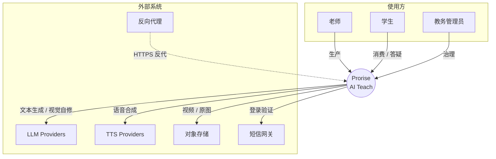

> 图 5-1：C4-Context — 系统与外部干系实体

**范围界定：**

- ✅ In-scope：教学视频生产、视频消费、AI 答疑、教务治理、Provider 路由、Auth / RBAC
- ❌ Out-of-scope：第三方 LLM 训练、社交互动、支付（规划中）

---

## 6. 解决方案策略（arc42 §4）

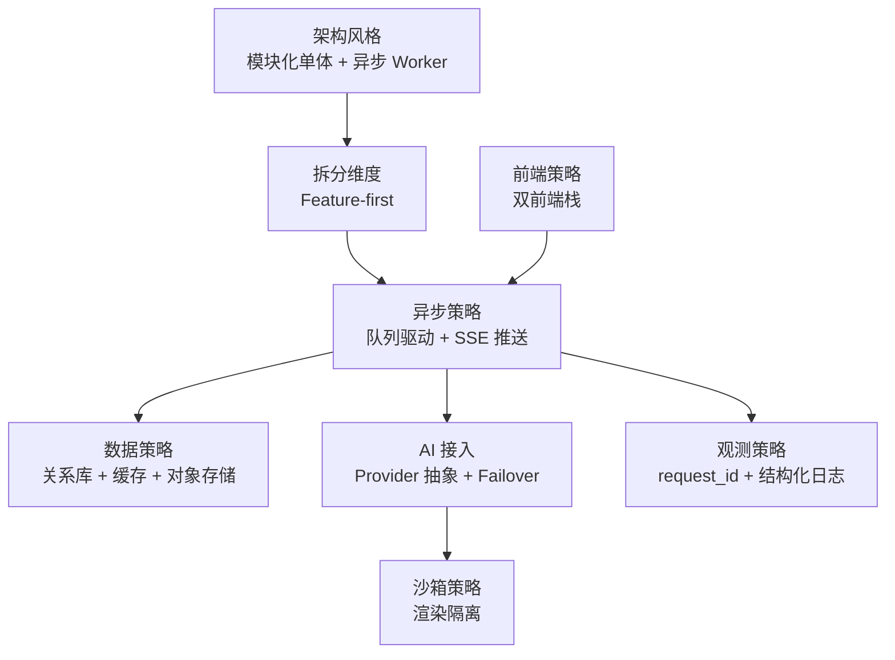

> 图 6-1：八大策略的总线图。**每条策略只回答"为什么这样选"，具体实现在 0002《技术选型决策记录》。**

---

## 7. 构建块视图（C4-Container, arc42 §5）

### 7.1 容器全景

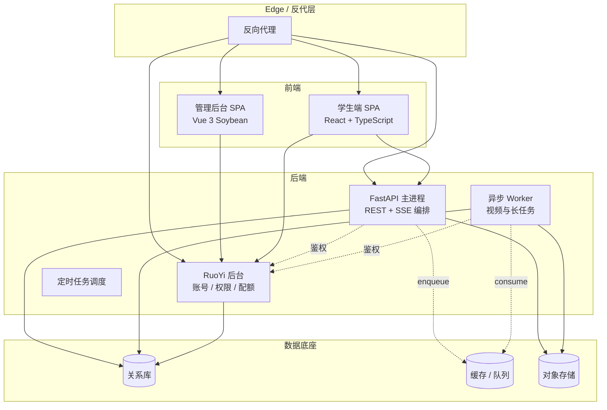

> 图 7-1：C4-Container — 7 类核心容器

### 7.2 容器职责一览

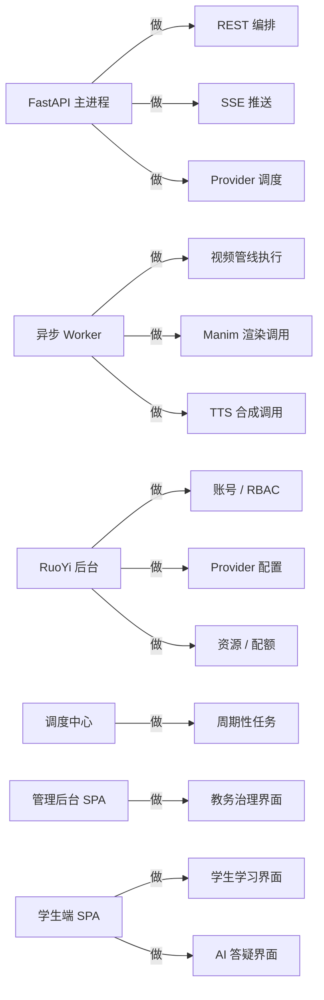

> 图 7-2：每个容器只做一件事

### 7.3 不在本文范围

| 关注点 | 文档位置 |
|---|---|
| 各容器内部组件 / 包结构 | 《006-模块开发指南》 |
| API 路由与契约 | 《0004 API 设计规范》 |
| 数据模型表设计 | 《0003 数据模型设计》 |
| 安全设计细节 | 《0005 安全架构》 |
| 部署拓扑细节 | 《008-部署与运维》 |

---

## 8. 运行时视图（4+1 Process View, arc42 §6）

### 8.1 关键场景一：老师生成视频

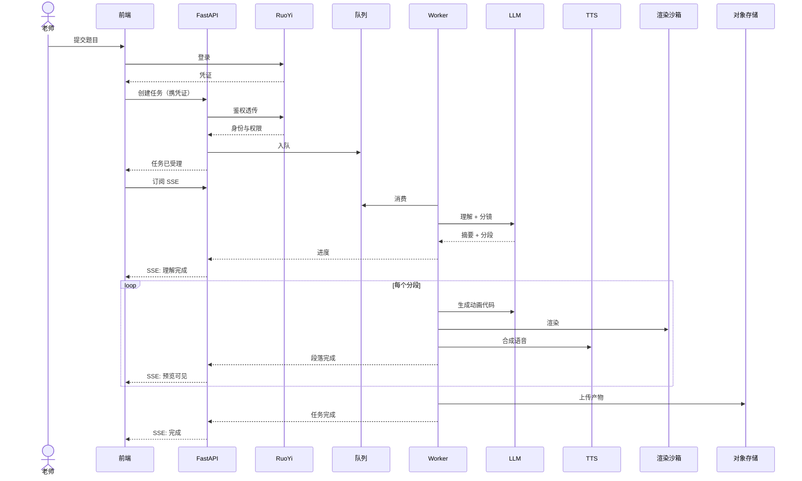

> 图 8-1：视频生成端到端时序

### 8.2 关键场景二：学生 AI 答疑

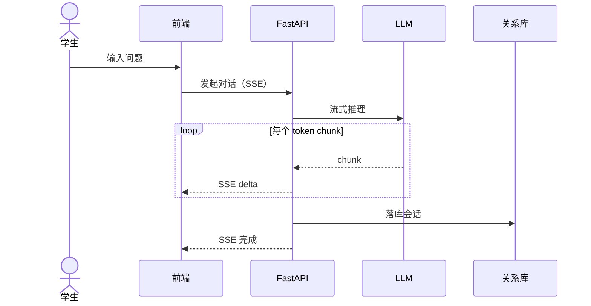

> 图 8-2：AI 答疑流式推理

### 8.3 失败与降级

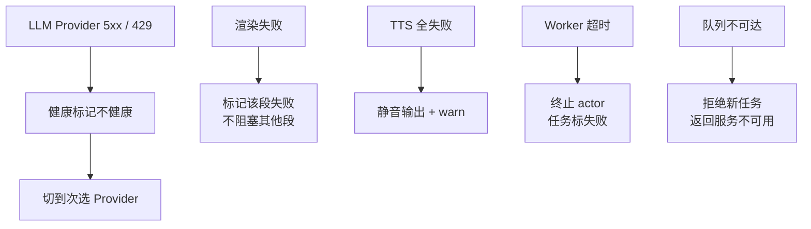

> 图 8-3：五条主降级路径

---

## 9. 部署视图（4+1 Physical View, arc42 §7）

### 9.1 单机部署拓扑

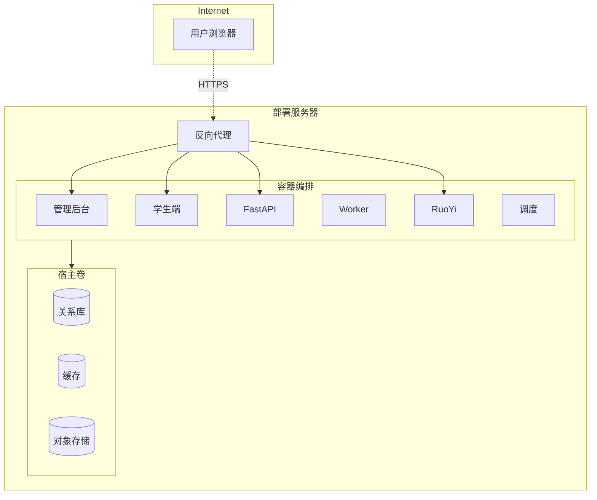

> 图 9-1：当前生产形态（单机 Compose）

### 9.2 网络分区

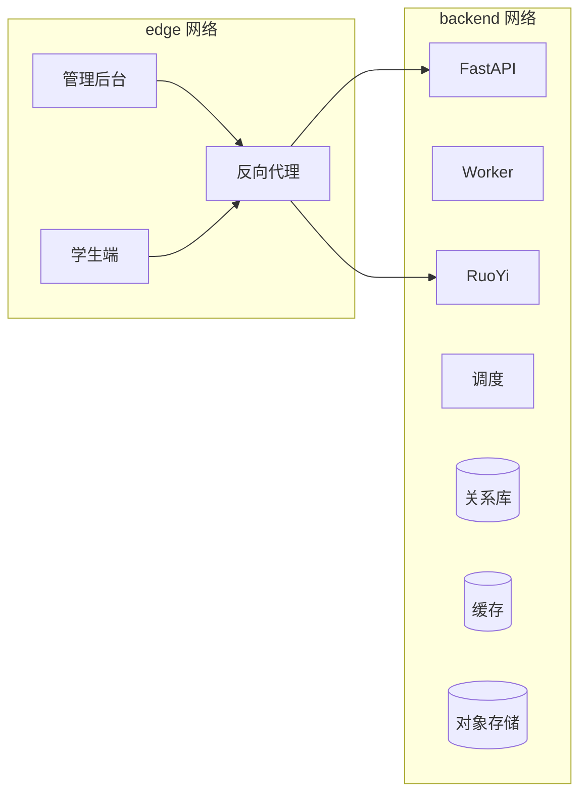

> 图 9-2：edge 与 backend 双网，数据底座不暴露给 edge

### 9.3 演进路线

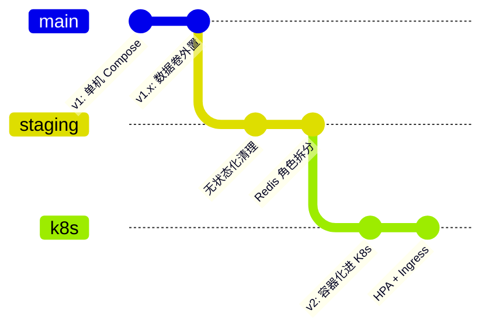

> 图 9-3：从单机到 K8s 的两阶段演进

---

## 10. 横切关注点（arc42 §8）

```mermaid
flowchart TB
    Cross[横切关注点]
    Cross --> C1[配置]
    Cross --> C2[鉴权]
    Cross --> C3[错误处理]
    Cross --> C4[日志与观测]
    Cross --> C5[缓存]
    Cross --> C6[沙箱]
    Cross --> C7[幂等与限流]

    C1 -.分层 .env<br/>按环境覆盖.-> C1d[策略]
    C2 -.账号在 RuoYi<br/>鉴权下沉 FastAPI.-> C2d[策略]
    C3 -.统一错误模型<br/>request_id 贯穿.-> C3d[策略]
    C4 -.结构化 JSON<br/>+ 队列指标.-> C4d[策略]
    C5 -.缓存以 Redis 为主<br/>新增热点走 ADR.-> C5d[策略]
    C6 -.渲染必走沙箱<br/>静态扫描禁危险调用.-> C6d[策略]
    C7 -.幂等键 + 漏桶<br/>统一中间件.-> C7d[策略]
```

> 图 10-1：横切关注点全景。**每点的实现细节见对应专题文档**：鉴权 → 0005 安全；错误模型 → 0004 API；缓存与日志 → 008 运维。

---

## 11. 架构决策记录（arc42 §9）

| ID | 标题 | 状态 | 详见 |
|---|---|---|---|
| ADR-001 | 后端选 FastAPI（异步 / 类型 / OpenAPI） | Accepted | 0002 §3.1 |
| ADR-002 | 异步队列选 Dramatiq（轻量 / Redis broker） | Accepted | 0002 §3.2 |
| ADR-003 | 视频管道全量重写（替换历史实现） | Accepted | 0002 §3.3 |
| ADR-004 | 双前端栈：React 学生端 + Vue 管理后台 | Accepted | 0002 §3.4 |
| ADR-005 | MemPalace 作为 AI 记忆与规范唯一入口 | Accepted | 0002 §3.5 |
| ADR-006 | 多 Provider 路由（含 LLM / TTS / MLLM） | Accepted | 0002 §3.6 |
| ADR-007 | 渲染走 Docker 沙箱 | Accepted | 0002 §3.7 |
| ADR-008 | BMAD（Epic→Story→Implementation） | Accepted | 0002 §3.8 |

---

## 12. 质量需求（arc42 §10）

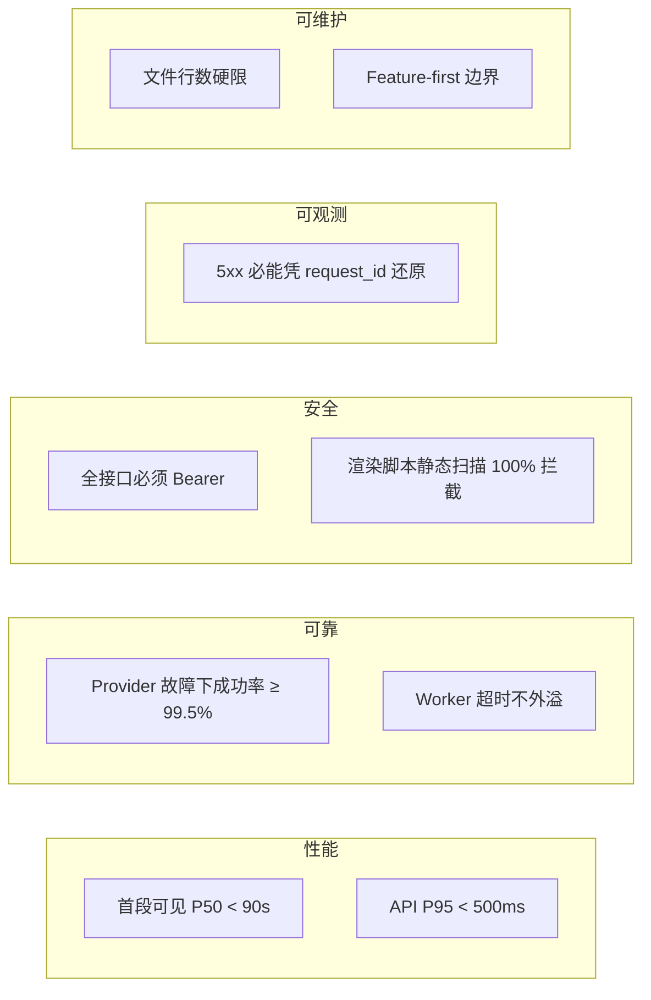

> 图 12-1：核心质量场景一图概览

---

## 13. 风险与技术债（arc42 §11）

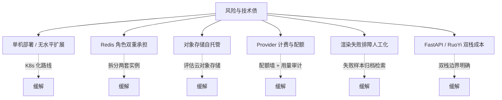

> 图 13-1：六大风险与对应缓解路径

---

## 14. 术语表（arc42 §12）

| 术语 | 含义 |
|---|---|
| Section | 视频中一段独立动画 + 旁白 |
| Codebook | 用于辅助 LLM 生成动画代码的模板库 |
| Preview | 管线未结束但首段已可播放的状态 |
| Provider Binding | 把业务模块绑定到具体 Provider 的配置形态 |
| Sandbox | 渲染脚本的隔离执行环境 |
| Idempotency Key | API 防重提交标识 |
| Failover | Provider 故障时切换到次选的能力 |
| SLI / SLO | 服务等级指标 / 目标 |

---

## 附录：参考资料

- arc42 — <https://arc42.org>
- C4 Model — <https://c4model.com>
- 4+1 View — Kruchten, IEEE Software, Nov 1995
- ISO/IEC/IEEE 42010 软件架构描述
- GB/T 8567-2006 计算机软件文档编制规范

---

> **本文为「总览」性质：图说优先、抽象优先、零路径引用。** 任何「这个东西具体在哪个文件」「内部由哪些类组成」「字段如何定义」「环境变量名怎么写」一律请到对应专题文档查阅；本文不收录。
