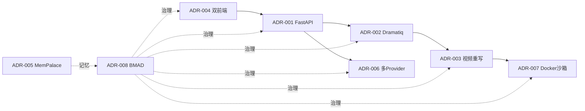

| 版本 | 日期 | 修订内容 | 作者 | 评审 |
|------|------|----------|------|------|
| v0.1.0 | 2026-03-24 | 占位骨架 | 研发团队 | — |
| v1.0.0 | 2026-04-25 | 初版正式 ADR 集合 | Prorise AI Teach 研发团队 | 架构组 |
| v1.0.1 | 2026-04-25 | 对齐到团队权威 8 条 ADR；纠正 student-web 为 React/TS（非 Vue） | Prorise AI Teach 研发团队 | 架构组 |

---

## 1. 概述

### 1.1 目的

汇总 Prorise AI Teach 平台的关键技术选型决策，为新成员、跨团队对接、生产事故复盘、未来重构提供可追溯依据。每条决策遵循 **Michael Nygard ADR** 范式：背景 → 备选 → 决策 → 影响。

### 1.2 适用范围

- 凡是「替换某项核心组件 / 引入新底层依赖 / 改变跨模块约束」的变更，必须以新 ADR 形式追加。
- 一条决策一旦标记 `Accepted`，原文不删除；如被推翻，新增状态 `Superseded by ADR-NNN`。

### 1.3 术语

| 术语 | 含义 |
|------|------|
| ADR | Architecture Decision Record |
| BMAD SoT | `_bmad-output/` 唯一事实来源 |
| Provider | LLM/TTS 等 AI 能力供应商抽象 |

---

## 2. 引用文件

- `0001-系统架构总览.md` — 上下文背景
- `0003-数据模型设计.md` — 数据底座决策落地
- `0005-安全架构.md` — 沙箱与多 Provider 决策的安全侧
- `_bmad-output/INDEX.md` — BMAD SoT
- 外部：Michael Nygard, *Documenting Architecture Decisions*（2011）

---

## 3. ADR 速查表

| 决策ID | 标题 | 状态 | 决策日期 | 背景 | 备选 | 最终决策 | 影响 |
|--------|------|------|----------|------|------|----------|------|
| ADR-001 | 后端 API 框架选 FastAPI（而非 Flask） | Accepted | 2026-02-10 | 需要 async + 类型 + OpenAPI 自动出 | Flask / Django REST / Starlette / FastAPI | **FastAPI** | 全栈 async；OpenAPI 即文档；Pydantic 校验进入业务边界 |
| ADR-002 | 异步任务队列选 Dramatiq（而非 Celery） | Accepted | 2026-02-12 | 需要 Redis 单底座 + 简单可靠的重试 | Celery / RQ / Arq / Dramatiq | **Dramatiq[redis]** | 比 Celery 轻；Prometheus 原生；与 Redis broker 单底座对齐 |
| ADR-003 | 视频管道全量重写为 Code2Video 体系 | Accepted | 2026-04-11 | 旧管线 67 文件 11592 行、修复成本失控 | 局部修补 / 引入 ManimCat 整套 / 重写借鉴 Code2Video | **重写借鉴 Code2Video** | 一次性砍到 ~26 文件 4225 行；首段可见 < 90 s 进入可达 |
| ADR-004 | 双前端栈：React 学生端 + Vue 管理后台 | Accepted | 2026-02-15 | 教务管理与学生消费场景诉求差异巨大 | 单一前端 / 双栈 / 微前端 | **双栈：student-web（React+TS）+ ruoyi-plus-soybean（Vue 3）** | 各取所长；维护成本可控；通过 RuoYi JWT 共享身份 |
| ADR-005 | MemPalace 作为 AI 记忆与规范的唯一入口 | Accepted | 2026-02-20 | 多个 Agent 协作需要稳定记忆与规范回路 | 仅 git+md / 自建记忆库 / MemPalace | **MemPalace MCP** | 所有 Agent 任务前必查 MemPalace；规范、Story、决策可被检索 |
| ADR-006 | 多 Provider 路由（OpenAI / Gemini / Qwen），动态配置 | Accepted | 2026-04-09 | 单 Provider 不能满足可靠性与合规目标 | 直连 SDK / LangChain Router / 自建 Provider 抽象 | **自建 Provider 抽象 + DB 动态配置（registry/failover/health）** | 业务层永远只拿 Protocol；可热切；可观测 |
| ADR-007 | Manim 渲染走 Docker 沙箱（防止本地 LaTeX 缺失污染管道） | Accepted | 2026-04-08 | LLM 生成脚本不可信，且本地 LaTeX 缺失会导致假失败 | 主进程直跑 / chroot / Docker 沙箱 / Firecracker | **Docker 沙箱** | 资源/系统调用可控；脚本静态扫描 + 沙箱双重防护；环境一致性 |
| ADR-008 | BMAD（Epic → Story → Implementation）作为开发流程 | Accepted | 2026-02 | 多人 + 多 Agent 协作需统一可追溯流程 | 自由 PR / Scrum / **BMAD** | **BMAD（`_bmad-output/` 为 SoT）** | 一切计划与实现产物落 `_bmad-output/`；Story 是任务最小单位 |

---

## 4. 决策详记

### ADR-001：后端 API 框架选 FastAPI

- **背景**：业务需要 async 调外部 LLM、SSE 推送、严格的请求/响应类型校验，以及自动 OpenAPI 给前端用作 codegen。
- **备选方案对比**

| 方案 | 类型 | OpenAPI | async | 学习成本 | 评分 |
|------|------|---------|-------|----------|------|
| Flask | 同步 | 需插件 | 一般 | 低 | 中 |
| Django REST | 同步 | 需插件 | 弱 | 中 | 中 |
| Starlette | async | 需手写 | 原生 | 中 | 中 |
| **FastAPI** | async | 原生 | 原生 | 低 | 高 |

- **决策**：FastAPI ≥ 0.115（见 `packages/fastapi-backend/pyproject.toml`）。Python ≥ 3.11（同 `pyproject.toml: requires-python`）。
- **影响**：Pydantic v2 进入业务边界；`Depends` 注入 + 中间件成型；OpenAPI 给前端 codegen 用；与 SSE 工具天然契合。

---

### ADR-002：异步任务队列选 Dramatiq

- **背景**：视频生产是几十秒到几分钟的长任务，不能阻塞 API 进程；需要重试、超时、可观测。
- **备选**：Celery、RQ、Arq、Dramatiq。
- **关键对比**

| 维度 | Celery | RQ | Arq | **Dramatiq** |
|------|--------|----|----|----|
| Broker 选择 | 多（运维重） | Redis | Redis | Redis（已有） |
| Prometheus | 第三方 | 弱 | 弱 | **原生** |
| 错误模型 | 复杂 | 简单 | 简单 | **简单清晰** |
| 中间件链 | 强但重 | 弱 | 弱 | **轻** |
| 与 FastAPI | 一般 | 一般 | 好 | **好** |

- **决策**：`dramatiq[redis] >= 1.17`（`packages/fastapi-backend/pyproject.toml`）。worker 入口 `packages/fastapi-backend/app/worker.py`。
- **落地**：actor `time_limit` 由 `FASTAPI_DRAMATIQ_TASK_TIME_LIMIT_MS` 控制（默认 15 min），patch 重试上限收敛为 1（避免 doom loop）。

---

### ADR-003：视频管道全量重写为 Code2Video

- **背景**：旧管线累积到 67 文件 / 11592 行，公式错位 / 重试风暴 / TTS 串行 / DB 写入不一致等多发故障，修补成本远高于重写。
- **备选**

| 方案 | 工作量 | 风险 | 收益 |
|------|--------|------|------|
| 局部修补（继续打补丁） | 中 | 高（旧问题反复） | 低 |
| 整体引入 ManimCat（Node 栈） | 高 | 高（双栈通信） | 中 |
| **重写借鉴 Code2Video** | 中 | 中 | 高 |

- **决策**：重写为 Code2Video 风格 Pipeline。最终 ~26 文件 4225 行，落 `packages/fastapi-backend/app/features/video/`。
- **影响**：渲染流程清晰可读；按 section 并行 + Semaphore(2)；视觉自修接入；首段可见显著提速。
- **遗留**：参考项目里 4 个 Gap 已立 Issue #161-#164 跟踪（Icon 生成、JSON 修复、TTS 灵活、日志持久化）。

---

### ADR-004：双前端栈（React 学生端 + Vue 管理后台）

- **背景**：教务后台需要表格/表单/角色权限（典型 admin），学生端需要播放器/聊天/SSE/沉浸式（典型 SaaS 消费）。一套前端折中是双输；同时两端各自既有的生态选型也不同。
- **备选**：单 SPA（admin 风格）/ 单 SPA（消费风格）/ 微前端 / 双栈。
- **决策**：

| 端 | 包目录 | 包名 | 技术栈 | 入口 |
|----|--------|------|--------|------|
| 管理后台 | `packages/ruoyi-plus-soybean` | `ruoyi-vue-plus` (v2.0.0) | **Vue 3.5.26** + Vite 7.3.0 + Soybean Admin | Soybean 框架默认入口 |
| 学生端 | `packages/student-web` | `@xiaomai/student-web` | **React + TypeScript** + Vite 6.4.1 | `packages/student-web/src/main.tsx` |

  用户/角色/Provider 由 RuoYi 统一管，两套前端通过 Sa-Token JWT 共享身份。

- **影响**：
  - 学生端选 React 是因为生态对沉浸式 / 流式 / 富播放器场景的组件库更丰富，且团队既有人手熟悉 React。
  - 管理后台选 Vue 是因为可直接复用 Soybean Admin 框架、与 RuoYi-Plus 后端默认前端模板对齐。
  - 维护成本：两端独立发布、独立依赖锁、独立 CI（前端 CI 待补充，后端有 `.github/workflows/fastapi-backend-tests.yml`）。

> ⚠️ 历史文档曾把 student-web 错误描述为 Vue，本版（v1.0.1）已纠正：student-web 是 React + TypeScript（入口 `src/main.tsx`），仅 ruoyi-plus-soybean 是 Vue。

---

### ADR-005：MemPalace 作为 AI 记忆/规范唯一入口

- **背景**：仓库由人 + 多个 AI Agent 协同推进，需要可检索、可回写、可审计的记忆系统。
- **备选**：纯 git+md / 自建向量库 / MemPalace。
- **决策**：MemPalace MCP，规则写入 `CLAUDE.md` / `AGENTS.md`：所有 Agent 编码前必查 MemPalace。
- **影响**：规范、Story、决策、踩坑教训沉淀在 `_bmad-output/` 与 `~/.claude/projects/.../memory/` 中，跨会话不丢失。

---

### ADR-006：多 Provider 路由（OpenAI / Gemini / Qwen），动态配置

- **背景**：单 Provider 出口、合规、价格、配额都不可控。
- **备选**：业务直连 SDK / LangChain Router / 自建 Provider 抽象。
- **决策**：自建抽象层 `packages/fastapi-backend/app/providers/`：

```
providers/
├── protocols.py      # Provider 协议
├── registry.py       # 名 → 实例 + DB 配置
├── factory.py        # 构造
├── failover.py       # 失败切换（按 binding 顺序）
├── health.py         # 健康检查 + 短期缓存
├── llm/              # LLM Provider 实现
└── tts/              # TTS Provider 实现
```

- **DB 配置**：`xm_ai_provider` / `xm_ai_module` / `xm_ai_module_binding` / `xm_ai_resource` 四张表联动（详见 0003 §5）。
- **影响**：业务层永远只拿 Protocol，不依赖具体 SDK；可热切、可注入、可压测；命中率/延迟可观测。

---

### ADR-007：Manim 渲染走 Docker 沙箱

- **背景**：LLM 生成的 Python 脚本可能含 `os.system / subprocess.* / open(/etc/...)` 等危险调用；同时本地宿主常缺失 LaTeX，导致大量"假失败"耗费 Provider 调用配额（历史踩坑 `manimcat-latex-docker-root-cause.md`：本地 6/10 假失败，Docker 渲染 10/10 全过）。
- **备选**：直跑 / chroot / Docker / Firecracker。
- **决策**：Docker 沙箱（`packages/fastapi-backend/docker/`，Manim 镜像内置 LaTeX 与 Manim 依赖）+ 脚本静态扫描双重防护。
- **影响**：所有 Manim 渲染必须经沙箱；扫描器禁用清单作为 lint 门禁；环境一致，渲染成功率显著回升。
- **见**：`0005-安全架构.md` §7。

---

### ADR-008：BMAD 作为开发流程

- **背景**：多人 + 多 Agent 协同需要统一、可追溯的需求与产物管理流程，避免散点 PR。
- **备选**：自由 PR / Scrum / BMAD。
- **决策**：采用 BMAD（Brief → Map → Architecture → Develop），`_bmad-output/` 是仓库唯一事实来源。
  - **路径**：`_bmad-output/{brainstorming,planning-artifacts,implementation-artifacts,research,INDEX.md,project-context.md,mempalace.yaml}`。
  - **流程**：所有研发任务都必须挂在某个 Epic 下的 Story；任何 PR 必须能回链到对应 Story。
  - **执行约束**：Agent 任务必须先 `mempalace wake-up` 再开工；任务结束回写 `INDEX.md` 与 `sprint-status.yaml`。
- **影响**：跨 Agent / 跨人协作可追溯；记忆与规范不漂移；事故复盘有"可溯源"基线。

---

## 5. 决策依赖关系



图 5-1：8 条 ADR 之间的依赖（实线 = 实现依赖；虚线 = 流程治理）

---

## 6. 变更流程

1. 新决策必须新建 ADR，**不能修改已有 ADR 的正文**（只能改状态）。
2. 推翻旧决策时：旧 ADR 状态改为 `Superseded by ADR-NNN`，新增 ADR 引用旧编号。
3. 任何 ADR 必须有：背景、备选、决策、影响、决策人、决策日期。
4. 提 PR 时挂在对应 Epic / Story 下；走架构组（≥ 2 人）评审。
5. 合入后同步 MemPalace、回写 `_bmad-output/INDEX.md`。

---

## 附录 A：参考资料

- Michael Nygard, *Documenting Architecture Decisions* (2011) — <https://cognitect.com/blog/2011/11/15/documenting-architecture-decisions>
- ThoughtWorks ADR — <https://www.thoughtworks.com/insights/articles/architecture-decision-records>
- arc42 §9 Architecture Decisions — <https://docs.arc42.org/section-9/>
