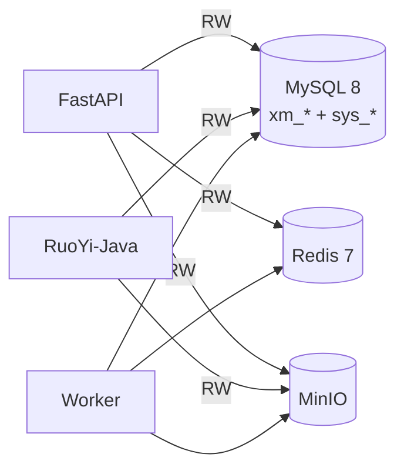
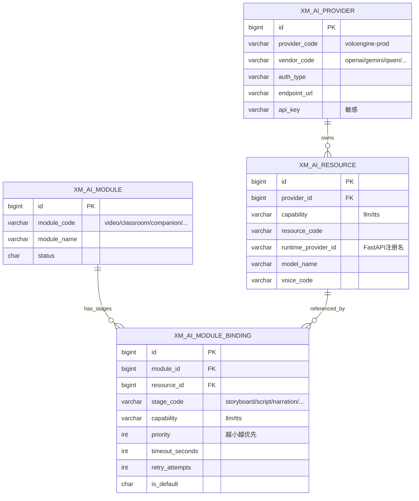
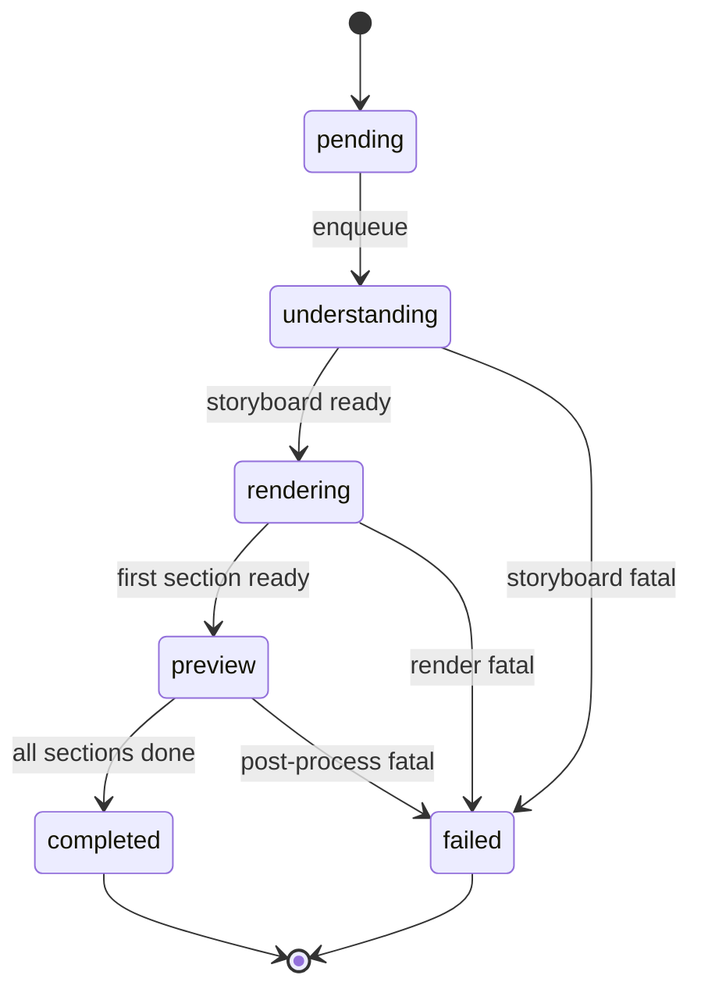
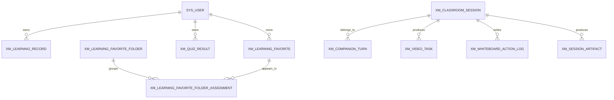
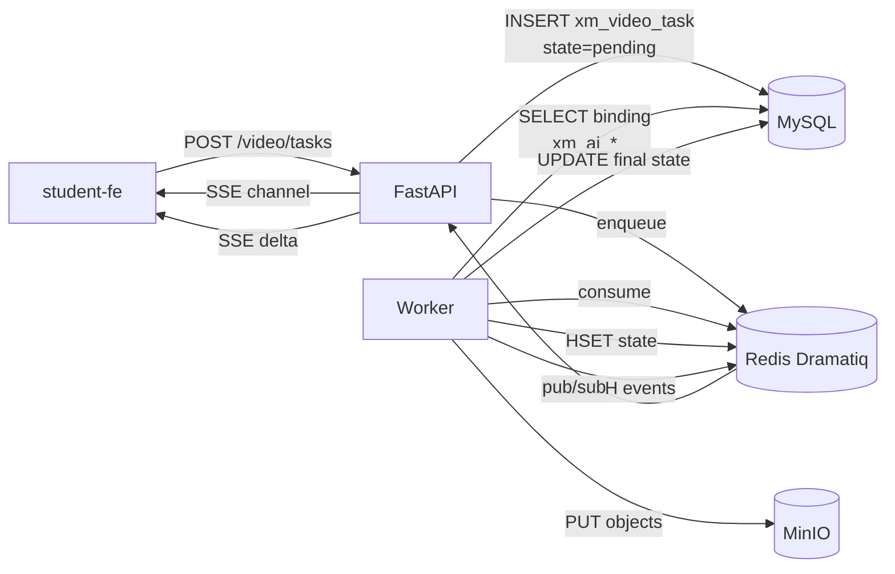
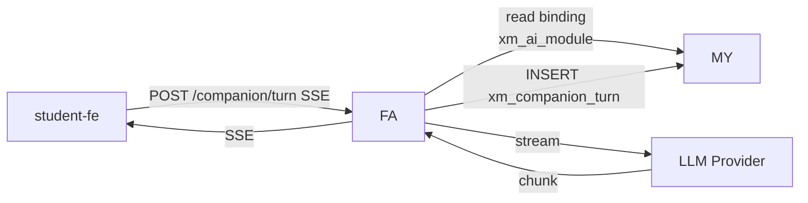

| 版本 | 日期 | 修订内容 | 作者 | 评审 |
|------|------|----------|------|------|
| v0.1.0 | 2026-03-24 | 占位骨架 | 研发团队 | — |
| v1.0.0 | 2026-04-25 | 初版正式数据模型说明，覆盖命名规范、ER 图、AI Provider 配置四表、视频任务、教室会话、companion / learning / 收藏 / 知识库等 5 大主题域 | Prorise AI Teach 研发团队 | DBA + 架构组 |

---

## 1. 概述

### 1.1 目的

定义 Prorise AI Teach 平台数据库（MySQL 8 + Redis 7 + MinIO）的逻辑数据模型、命名规范、关键索引、迁移策略，并给出主表 ER 图与字段对照。**生产 SQL 以 `packages/xm_dev.sql` 为准**，本文是其上层导览。

### 1.2 适用范围

- 后端研发（FastAPI / RuoYi-Java）做表设计、索引、JOIN 时的对照。
- 数据组做指标统计与离线分析时的字段语义查询。
- 测试组识别"哪些数据需要构造"。
- 运维做 MySQL 容量评估与索引优化。

### 1.3 术语

| 术语 | 含义 |
|------|------|
| 租户 | `tenant_id`，多租户字段，默认 `'000000'` |
| 软删 | `del_flag`：`'0'` 存在 / `'1'` 删除 |
| Snowflake ID | RuoYi 雪花 ID 生成器输出的 bigint 主键 |
| 资源（Resource） | AI 能力的最小可调度单元（如某个 LLM 模型 / TTS 音色） |
| 绑定（Binding） | 业务模块的某个阶段绑到某个资源的关系 |

---

## 2. 引用文件

- `packages/xm_dev.sql` — 生产 DDL
- `0001-系统架构总览.md` — 数据底座决策
- `0002-技术选型决策记录.md` — ADR-006 / ADR-010
- `0004-API设计规范.md` — 字段映射到 API 字段（camelCase）
- 外部：MySQL 8.0 Reference Manual；阿里巴巴 Java 开发手册（命名规约）

---

## 3. 数据底座总览

| 存储 | 角色 | 主要内容 |
|------|------|----------|
| MySQL 8 | 关系型主存 | 用户 / 角色 / Provider 配置 / 任务元数据 / 学习记录 / 知识库日志 |
| Redis 7 | 缓存 + Broker + 任务态 | Dramatiq broker、SSE pub/sub、在线 token、阶段进度 |
| MinIO | 对象存储 | 视频 mp4 / 切片 / 缩略图 / 用户上传原图 |



图 3-1：数据底座调用关系

---

## 4. 命名与约定

### 4.1 表

| 前缀 | 来源 | 维护方 |
|------|------|--------|
| `sys_*` | RuoYi-Plus 框架 | RuoYi-Java |
| `xm_*` | 项目自有 | FastAPI / RuoYi 共维 |

### 4.2 通用字段（几乎所有 `xm_*` 表必带）

| 字段 | 类型 | 含义 |
|------|------|------|
| `id` | bigint | Snowflake 主键 |
| `tenant_id` | varchar(20) | 租户，默认 `'000000'` |
| `create_dept` | bigint | 创建部门 |
| `create_by` | bigint | 创建人（user_id） |
| `create_time` | datetime | 创建时间 |
| `update_by` | bigint | 更新人 |
| `update_time` | datetime | 更新时间 |
| `del_flag` | char(1) | 软删 0/1 |

### 4.3 索引规范

- 主键：`id`
- 唯一键：`uk_<table>_<col>`
- 普通索引：`idx_<table>_<col>`
- 多租户表，**所有索引第一列必须是 `tenant_id`**（见 `xm_video_task` 实例 `idx_xm_video_task_user_state_time`）。

### 4.4 字段语义

- 软删用 `del_flag`，不要物理删除（除审计表）。
- 状态字段一律用 `char(1)`，`'0'` 正常 / `'1'` 停用，业务态则用 varchar 枚举（如 `task_state`）。
- 任意 JSON 文本字段命名以 `_json` 结尾（如 `extra_auth_json`、`runtime_settings_json`）。
- 时间一律 `datetime`，禁止 `timestamp`（避免时区问题）。

---

## 5. AI Provider 配置（4 表联动）

这是平台最特殊也最关键的一组表。它把"业务模块的某个阶段"绑定到"具体的 LLM/TTS 资源"，并用 priority + retry 实现 failover。

### 5.1 ER 图



图 5-1：AI Provider 四表 ER

### 5.2 字段语义要点

- **`xm_ai_provider.vendor_code`**：供应商家族编码（`openai/gemini/qwen/deepseek/volcengine`）。
- **`xm_ai_resource.runtime_provider_id`**：必须符合 `vendor-model_or_voice` 规范，**FastAPI 运行时 registry 用此名拉取 Provider 实例**（见 `app/providers/registry.py`）。
- **`xm_ai_module_binding.stage_code`**：`storyboard / script / narration / companion / search` 等，定位"业务模块里哪个阶段"。
- **`priority`**：值越小越优先，failover 按 priority asc 顺序尝试（见 `app/providers/failover.py`）。
- **历史踩坑**：曾有 binding 的 `resource_id` 指向不存在的 provider（幽灵 ID），导致全 LLM 阶段 broken。后续 SQL 加约束 + 启动检查（详见 memory `provider-binding-ghost-ids.md`）。

### 5.3 一次"理解阶段调用 LLM"的查询路径

```sql
SELECT r.runtime_provider_id, b.timeout_seconds, b.retry_attempts
FROM xm_ai_module m
JOIN xm_ai_module_binding b ON b.module_id = m.id AND b.del_flag='0' AND b.status='0'
JOIN xm_ai_resource r       ON r.id = b.resource_id AND r.del_flag='0' AND r.status='0'
WHERE m.module_code = 'video'
  AND b.stage_code  = 'storyboard'
  AND b.capability  = 'llm'
  AND m.tenant_id   = '000000'
ORDER BY b.priority ASC;
```

---

## 6. 视频任务（核心域）

### 6.1 关键表

#### `xm_video_task` — 视频任务长期表

| 字段 | 类型 | 含义 |
|------|------|------|
| `task_id` | varchar(64) | 业务任务 ID（UUID）；与 Redis key、SSE 通道一致 |
| `user_id` | bigint | 关联 `sys_user.user_id` |
| `task_type` | varchar(32) | 任务类型 |
| `task_state` | varchar(20) | `pending / understanding / rendering / preview / completed / failed` |
| `summary` | varchar(512) | 任务摘要（用户可见） |
| `result_ref` | varchar(512) | 视频产物 ref（MinIO key 或外链） |
| `detail_ref` | varchar(512) | 详细产物 ref |
| `error_summary` | varchar(512) | 失败摘要（前端展示用） |
| `source_session_id` | varchar(64) | 来源会话（关联 `xm_classroom_session`） |
| `start_time / complete_time / fail_time` | datetime | 关键节点时间 |

唯一键：`uk_xm_video_task_task_id (tenant_id, task_id)`。

#### `xm_classroom_session` — 教室/学习会话

承载"一次教学会话"的元数据。视频任务、白板动作、companion turn、artifact 都通过 `task_id / session_id` 串起来。

#### `xm_session_artifact`、`xm_whiteboard_action_log`

- `xm_session_artifact` — 会话级产物（图片/草稿/中间结果），按 session 索引。
- `xm_whiteboard_action_log` — 白板动作流（重放用）。

### 6.2 状态机（task_state）



图 6-1：视频任务状态机

### 6.3 Redis 任务态映射（与 DB 互补）

| Key 模式 | 类型 | 含义 |
|----------|------|------|
| `video:task:{task_id}:state` | hash | 实时状态（progress、stage、preview 标志） |
| `video:task:{task_id}:events` | pub/sub channel | SSE 桥接 |
| `video:task:{task_id}:sections:{idx}` | hash | 单 section 状态 |
| `video:task:{task_id}:lock` | string | 防重 |

DB 与 Redis 的同步遵循 ADR-010：**关键节点（completed/failed/preview-ready）由 `VideoTask.finalize()` 回写 DB**，平时只写 Redis。

---

## 7. 学习与答疑（域）

| 表 | 用途 |
|----|------|
| `xm_companion_turn` | AI 答疑每一轮对话 |
| `xm_knowledge_chat_log` | 知识库 RAG 对话日志 |
| `xm_quiz_result` | 学生测验结果 |
| `xm_learning_record` | 学习记录（看了什么、用时） |
| `xm_learning_path` | 学习路径推荐 |
| `xm_learning_recommendation` | 推荐结果 |
| `xm_learning_wrongbook` | 错题本 |
| `xm_learning_favorite*` | 收藏（含文件夹与归属） |
| `xm_user_profile`、`xm_user_work` | 学生画像与作品 |



图 7-1：学习/会话/答疑域 ER（节选）

---

## 8. 用户与权限（RuoYi 域）

| 表 | 来源 | 维护方 |
|----|------|--------|
| `sys_user / sys_role / sys_menu / sys_dept / sys_user_role / sys_role_menu / sys_role_dept` | RuoYi 框架 | RuoYi-Java |
| `sys_oss_config` | RuoYi 框架 | RuoYi-Java（管理 MinIO/OSS） |
| `xm_user_profile / xm_user_work` | 自建 | FastAPI |

> **重要**：FastAPI **不持有用户/角色/菜单**。所有鉴权通过 `runtime_auth.py:RuoYiRequestAuth` 把请求票回传 RuoYi 校验，结合 `core/security.py` 解 JWT（Sa-Token 协议）。

---

## 9. 数据流设计

### 9.1 视频任务数据流



图 9-1：视频任务跨存储数据流

### 9.2 答疑数据流



图 9-2：AI 答疑数据流

---

## 10. 数据迁移策略

### 10.1 DDL 演进

- 当前**事实来源**：`packages/xm_dev.sql`（作为 fresh-install 基线）。
- 增量变更：在 `_bmad-output/implementation-artifacts/` 落 Story，附 SQL diff；与 PR 同步合入。
- 未来：引入 Liquibase 或 Flyway（与 RuoYi 已带的 sql 目录对齐）。

### 10.2 兼容原则

| 类型 | 是否兼容 | 处理 |
|------|----------|------|
| 加列 | 兼容 | 默认值非 NULL；旧代码不感知 |
| 加索引 | 兼容 | 在线 DDL（gh-ost / pt-osc）评估 |
| 删列 | 不兼容 | 必须分两步：先停止读写，再删；并锁定 N 个版本 |
| 改字段语义 | 不兼容 | 必须新列 + 双写 + 切流量 + 回收旧列 |
| 改主键/唯一键 | 不兼容 | 必须维护期 + 数据校验 |

### 10.3 数据治理

- 软删一律 `del_flag='1'`，**禁止 DELETE**（审计场景除外）。
- 所有新表必须带 `tenant_id`，即便当下只有 `'000000'`。
- 敏感字段（`api_key / api_secret / access_token`）不进日志、不进缓存原文（详见 `0005-安全架构.md` §3）。
- 大文本字段（`runtime_settings_json` / `extra_auth_json`）走 TEXT，不走 LONGTEXT，防止滥用。

---

## 11. 容量与索引建议

| 表 | 预估写入 | 关键索引 | 备注 |
|----|----------|----------|------|
| `xm_video_task` | 中（人均日 ~10） | `(tenant_id,user_id,task_state,update_time)` | 按用户列表查询主路径 |
| `xm_classroom_session` | 高 | `(tenant_id,user_id,task_state,update_time)` | 列表 / 历史 |
| `xm_companion_turn` | 高 | `(user_id,session_id)` | 历史回看 |
| `xm_ai_module_binding` | 低（人配） | `(tenant_id,module_id,stage_code,capability,status,priority)` | 路由查询热路径，已优化 |
| `xm_whiteboard_action_log` | 高 | 按 session 索引 | 重放 |

---

## 12. 已知风险与技术债

| 风险 | 严重度 | 处置 |
|------|--------|------|
| `xm_ai_module_binding` 出现幽灵 `resource_id` | 中 | 启动期校验 + UI 不允许选不存在的 resource |
| 视频 DB 与 Redis 状态不一致 | 中 | finalize 回调 + 周期性对账（规划中） |
| 软删后唯一键复用问题 | 低 | 唯一键中已含 `tenant_id`，必要时纳入 `del_flag` |
| 大 JSON 字段缺少 schema 校验 | 中 | Pydantic 模型显式定义；DB 仅落字符串 |

---

## 附录 A：表清单（来自 `packages/xm_dev.sql`）

| # | 表名 | 用途 |
|---|------|------|
| 1 | `xm_ai_module` | AI 模块主数据 |
| 2 | `xm_ai_module_binding` | 模块阶段→资源绑定 |
| 3 | `xm_ai_provider` | Provider 实例配置 |
| 4 | `xm_ai_resource` | LLM/TTS 资源 |
| 5 | `xm_classroom_session` | 教室/学习会话 |
| 6 | `xm_companion_turn` | AI 答疑每轮 |
| 7 | `xm_knowledge_chat_log` | 知识库对话日志 |
| 8 | `xm_landing_lead` | 落地页线索 |
| 9 | `xm_learning_favorite` | 收藏 |
| 10 | `xm_learning_favorite_folder` | 收藏夹 |
| 11 | `xm_learning_favorite_folder_assignment` | 收藏与文件夹关系 |
| 12 | `xm_learning_path` | 学习路径 |
| 13 | `xm_learning_recommendation` | 推荐 |
| 14 | `xm_learning_record` | 学习记录 |
| 15 | `xm_learning_wrongbook` | 错题本 |
| 16 | `xm_quiz_result` | 测验结果 |
| 17 | `xm_session_artifact` | 会话产物 |
| 18 | `xm_user_profile` | 用户画像 |
| 19 | `xm_user_work` | 用户作品 |
| 20 | `xm_video_task` | 视频任务 |
| 21 | `xm_whiteboard_action_log` | 白板动作 |

## 附录 B：参考资料

- 阿里巴巴 Java 开发手册（命名 + 索引规约）
- MySQL 8.0 Reference Manual — <https://dev.mysql.com/doc/refman/8.0/en/>
- RuoYi-Vue-Plus DDL — `packages/RuoYi-Vue-Plus-5.X/script/sql/`
