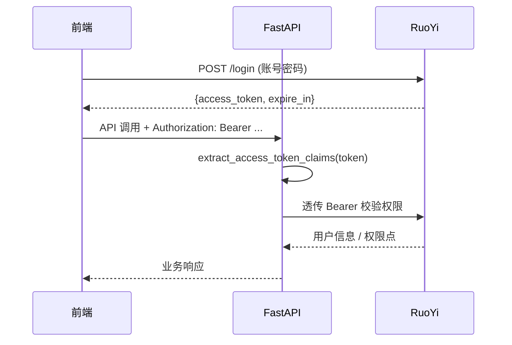

| 版本 | 日期 | 修订内容 | 作者 | 评审 |
|------|------|----------|------|------|
| v0.1.0 | 2026-03-24 | 占位骨架 | 研发团队 | — |
| v1.0.0 | 2026-04-25 | 改写为企业级 API 规范，覆盖路径/方法/版本/状态码/Envelope/分页/SSE/鉴权/幂等/限流/错误码/契约管理 | Prorise AI Teach 研发团队 | 架构组 + 前端 |

---

## 1. 概述

### 1.1 目的

定义 Prorise AI Teach 平台所有 HTTP API（FastAPI 与 RuoYi 同时受约束）应当遵循的统一设计语言：路径、方法、参数、响应、错误、流式、鉴权、版本与契约管理。本规范以 RESTful 为主、SSE 为流式补充，**不引入 GraphQL**。

### 1.2 适用范围

- 后端：所有新增 API 必须符合本规范；存量不符合的标注后逐步迁移。
- 前端：依据本规范出 codegen / 类型定义；不依赖未列出的隐式约定。
- 集成方：通过 OpenAPI 契约对接，不直接读后端代码。

### 1.3 术语

| 术语 | 含义 |
|------|------|
| Envelope | 统一响应包：`{ code, message, data, requestId }` |
| Resource | 名词复数形式的资源路径段 |
| SSE | Server-Sent Events 单向流 |
| RuoYi 鉴权 | 通过 Sa-Token JWT 在 RuoYi 验证身份 |

---

## 2. 引用文件

- `0001-系统架构总览.md` §10 横切关注点
- `0003-数据模型设计.md` — 字段与 API 字段的映射
- `0005-安全架构.md` — 鉴权、CSRF、敏感字段过滤
- `packages/fastapi-backend/app/api/router.py` — 路由总线
- 外部：RFC 7231（HTTP 语义）、RFC 5988（Link）、RFC 7807（Problem+JSON）、RFC 6750（Bearer）、OpenAPI 3.1、Microsoft REST API Guidelines、Google AIP

---

## 3. 全局约束（MUST）

### 3.1 协议与编码

- HTTPS（生产）/ HTTP（仅本地）。
- 字符集：UTF-8。
- Content-Type：JSON 用 `application/json; charset=utf-8`；流式用 `text/event-stream; charset=utf-8`；上传用 `multipart/form-data`。

### 3.2 路径与版本

- 全局前缀：`/api/v1`（FastAPI `core/config.py:115` 默认 `/api/v1`，RuoYi 沿用 `/`）。
- 版本仅以 URL 段表达，**不**用 Header / Query 表达版本。
- 资源用名词复数：`/video/tasks`、`/learning/favorites`，**禁止动词路径**（如 `/getTask`）。
- 嵌套不超过 2 层：`/video/tasks/{task_id}/preview` ✓；`/video/tasks/{task_id}/sections/{idx}/events` 边界（必要时再嵌）。
- 路径参数用 `snake_case`（与 Python 一致）：`{task_id}`、`{asset_key:path}`（见 `features/video/routes.py:143`）。

### 3.3 方法语义

| 方法 | 语义 | 幂等 | Body |
|------|------|------|------|
| GET | 查询 | 是 | 无 |
| POST | 创建 / 触发非幂等动作 | 否（默认） | 有 |
| PUT | 整体替换 | 是 | 有 |
| PATCH | 局部更新 | 否（建议幂等） | 有 |
| DELETE | 删除 | 是 | 一般无 |

### 3.4 状态码

| 码 | 用途 | 何时使用 |
|----|------|----------|
| 200 | 成功（含查询） | 一般 GET / 非创建型 POST |
| 201 | 已创建 | POST 创建资源 |
| 202 | 已接受 | 异步任务（视频提交） |
| 204 | 无内容 | DELETE 成功 |
| 400 | 参数错误 | 请求格式不合法 |
| 401 | 未认证 | 缺 Bearer / token 无效 |
| 403 | 已认证未授权 | 角色/权限不足 |
| 404 | 资源不存在 | 任务 ID 找不到 |
| 409 | 冲突 | 重复提交 / 唯一键冲突 |
| 422 | 业务校验失败 | Pydantic / DTO 校验失败（FastAPI 默认） |
| 429 | 限流 | 网关 / 业务限流 |
| 5xx | 服务端错 | Provider 故障应映射为 502/503 |

> 422 用于「类型/格式合法但业务校验不通过」（Pydantic 默认行为）。客户端需同时处理 400 与 422。

---

## 4. 请求规范

### 4.1 公共 Header

| Header | 必填 | 说明 |
|--------|------|------|
| `Authorization: Bearer <jwt>` | 几乎所有非公开端点 | Sa-Token JWT |
| `X-Request-Id` | 否 | 客户端可传；缺则中间件生成 |
| `X-Tenant-Id` | 否 | 默认 `000000` |
| `X-Idempotency-Key` | 创建型 POST 推荐 | UUID，10 分钟内防重 |
| `Accept` | 否 | 默认 JSON；SSE 端点应是 `text/event-stream` |

### 4.2 命名

- 请求/响应 body 字段：**camelCase**（前端友好；FastAPI 通过 `app/schemas/_camel.py` 自动转换）。
- DB 字段：`snake_case`（见 0003 §4）。
- Query 参数：`camelCase`。
- 枚举值：小写 + 下划线（如 `task_state=preview`）。

### 4.3 分页

```
GET /api/v1/video/tasks?page=1&pageSize=20&sort=-updateTime&taskState=completed
```

| 参数 | 类型 | 默认 | 说明 |
|------|------|------|------|
| `page` | int | 1 | 起始 1 |
| `pageSize` | int | 20 | 上限 100 |
| `sort` | string | `-updateTime` | 前缀 `-` 表降序，多字段逗号分隔 |
| 业务过滤 | 同 schema | — | 同表字段名（camelCase） |

响应：

```json
{
  "code": 200,
  "message": "ok",
  "requestId": "...",
  "data": {
    "items": [ ... ],
    "page": 1,
    "pageSize": 20,
    "total": 137
  }
}
```

### 4.4 过滤与时间范围

- 范围用后缀：`createTimeFrom` / `createTimeTo`，闭区间，ISO-8601。
- 多值用逗号分隔：`taskState=preview,rendering`。
- 模糊查询用 `keyword`，且只对 server 端选定字段做 LIKE。

---

## 5. 响应规范（Envelope）

### 5.1 统一信封

所有 JSON 响应必须用统一信封（FastAPI 通过 `app/schemas/common.py` 与 `_camel.py` 实现）：

```json
{
  "code": 200,
  "message": "ok",
  "data": { ... } ,
  "requestId": "5b0f7c9c-6f1a-4d6f-8b62-..."
}
```

| 字段 | 类型 | 说明 |
|------|------|------|
| `code` | int | 业务码（与 HTTP 状态码可不一致） |
| `message` | string | 人类可读 |
| `data` | object/array/null | 业务数据 |
| `requestId` | string | 与 Header `X-Request-Id` 一致 |

### 5.2 错误响应

```json
{
  "code": 40104,
  "message": "Bearer token 已过期",
  "data": null,
  "requestId": "...",
  "errors": [
    { "field": "summary", "rule": "max_length", "limit": 512 }
  ]
}
```

`errors` 仅在 4xx 校验失败时出现；与 RFC 7807 Problem+JSON 兼容（字段名换成驼峰 + envelope）。

### 5.3 业务错误码命名

5 位数字，前 3 位与 HTTP 类对齐，后 2 位区分细分原因：

| 范围 | 含义 |
|------|------|
| 200xx | 成功扩展（一般只用 20000） |
| 400xx | 客户端入参错 |
| 401xx | 认证类（缺 token / 过期 / 签名错） |
| 403xx | 授权类（无权限 / 无配额 / 黑名单） |
| 404xx | 不存在类 |
| 409xx | 冲突类 |
| 422xx | 业务校验失败 |
| 429xx | 限流 |
| 500xx | 内部错误 |
| 502xx | 上游 Provider 错 |
| 503xx | 暂不可用（broker / DB 不通） |

错误码必须在 `core/errors.py` 集中定义。**不允许散落在业务代码里写裸 dict**。

---

## 6. 流式接口（SSE）

### 6.1 何时用 SSE

- 长任务进度推送（视频管线，见 `features/video/routes.py:343`）。
- LLM 流式回答（companion / learning_coach）。
- 不需要双向通信时优先 SSE，不要随便上 WebSocket。

### 6.2 协议

- `Content-Type: text/event-stream; charset=utf-8`
- `Cache-Control: no-store`
- `X-Accel-Buffering: no`（防 nginx 缓冲）
- 每 20s 必须发心跳（`event: ping`）。
- `id:` 用于断线续传；客户端通过 `Last-Event-Id` 重连。

### 6.3 事件类型

| event | data 字段 | 何时发 |
|-------|-----------|--------|
| `progress` | `{stage, percent}` | 阶段进度 |
| `understanding_done` | `{summary, sections[]}` | 分镜出炉 |
| `section_ready` | `{index, previewRef}` | 单 section 完成 |
| `preview` | `{playableRef}` | 首段可见（用户可点播） |
| `completed` | `{resultRef, detailRef}` | 整片完成 |
| `failed` | `{code, message}` | 失败 |
| `ping` | 空 | 心跳 |

### 6.4 示例

```
event: progress
id: 1714000000-1
data: {"stage":"understanding","percent":12}

event: section_ready
id: 1714000000-7
data: {"index":0,"previewRef":"oss://video/.../section0.mp4"}

event: ping
data: {}
```

---

## 7. 鉴权与授权

### 7.1 流程



图 7-1：鉴权时序

### 7.2 端点鉴权矩阵

| 端点 | 鉴权 | 备注 |
|------|------|------|
| `POST /api/v1/auth/login` | 公开 | RuoYi 透传 |
| `GET /api/v1/auth/me` | Bearer | 当前用户 |
| `GET /health/*` | 公开 | 仅状态 |
| `POST /api/v1/video/tasks` | Bearer + 视频生产权限 | 见 0005 §2 |
| `GET /api/v1/video/published` | 可匿名 | 公开视频列表 |
| `POST /api/v1/companion/turn` | Bearer | 答疑 |

### 7.3 权限点

权限点由 RuoYi 维护（`sys_menu.perms`），FastAPI 端点用 `Depends(require_perm("video:task:create"))` 校验，禁止在业务代码内手写「if user.role == ...」。

---

## 8. 幂等与重试

### 8.1 幂等策略

- 所有创建型 POST **必须**支持 `X-Idempotency-Key`：服务端将 key + body hash 存 Redis 10 min；命中时返回首次结果。
- DELETE / PUT 天然幂等；客户端可放心重试。
- POST 触发非幂等动作（如发送验证码）必须显式声明 `X-Idempotency-Key` 强制。

### 8.2 客户端重试

- 重试只对 5xx / 429 / 网络错误生效。
- 必须使用 **指数退避 + jitter**；初始 200ms，上限 5s，最多 3 次。
- 4xx 不重试。

---

## 9. 限流

### 9.1 维度

| 维度 | 限流键 | 默认 |
|------|--------|------|
| 全局 | IP | 60 req/min |
| 用户 | userId | 业务相关，视频生产 ≤ 5 task/min |
| Provider | providerCode | 由 binding 的 timeout/retry 控制 |

### 9.2 响应

429 响应必须带 `Retry-After`（秒）与业务码 `42901`。

---

## 10. 上传与文件

- 所有上传走 multipart，单文件大小限制由 `FASTAPI_VIDEO_IMAGE_STORAGE_*` 控制。
- 服务端必须做 MIME sniffing，**不信任** Content-Type。
- 上传成功返回对象引用（OSS key），**不返回**完整 URL（避免私桶外泄）。
- 下载/预览私桶资源走 `/video/assets/{asset_key:path}`（见 `features/video/routes.py:143`），由后端签名访问。

---

## 11. 路由总线（事实参照）

实际路由汇聚见 `packages/fastapi-backend/app/api/router.py:22-33`：

| 子路由 | 前缀 | 文件 |
|--------|------|------|
| auth | `/auth` | `features/auth/routes.py:22` |
| contracts | `/contracts` | `api/routes/contracts.py` |
| tasks | `/tasks` | `api/routes/tasks.py` |
| video | `/video` | `features/video/routes.py:70` |
| classroom | `/classroom` | `features/classroom/routes.py` |
| companion | `/companion` | `features/companion/routes.py` |
| knowledge | `/knowledge` | `features/knowledge/routes.py` |
| learning | `/learning` | `features/learning/routes.py` |
| learning_coach | `/learning/coach` | `features/learning_coach/routes.py` |
| health | `/health`（无 v1 前缀） | `api/routes/health.py` |

---

## 12. 接口契约管理

### 12.1 OpenAPI

- FastAPI 自动出 `/openapi.json`、Swagger UI（仅非生产）。
- 生产关闭 Swagger，前端 codegen 走 CI 产出快照。
- 任何 schema 变更必须通过 PR 附 OpenAPI diff，前端审批。

### 12.2 兼容原则

| 类型 | 兼容 | 处理 |
|------|------|------|
| 加可选字段 | 兼容 | 直接发 |
| 加必填字段 | 不兼容 | 走新版本或灰度 |
| 改字段类型/含义 | 不兼容 | 必须新字段 + 双发 + 旧字段标 deprecated |
| 删字段 | 不兼容 | 先标 deprecated 一个迭代再删 |
| 改路径/方法 | 不兼容 | 走 `/api/v2/...`，旧版保留 N 个迭代 |

### 12.3 Deprecated

被标记 deprecated 的端点必须：

- OpenAPI 加 `deprecated: true`
- 响应头 `Deprecation: <date>` 与 `Sunset: <date>`
- 文档明确替代路径

---

## 13. 接口模板（PR Checklist）

新增/修改一个 API，PR 必须满足：

- [ ] 路径符合资源化命名
- [ ] 方法/状态码正确
- [ ] Pydantic schema 落 `app/schemas/` 或 `app/features/<feat>/schemas.py`
- [ ] 响应包 envelope；错误码集中定义
- [ ] 鉴权 `Depends(...)` 写明
- [ ] OpenAPI 自动出且无 Warning
- [ ] 单元 + 契约测试覆盖
- [ ] 前端 codegen 同步
- [ ] 文档更新（含本规范引用）

---

## 14. 接口示例（参考）

### 14.1 创建视频任务

```
POST /api/v1/video/tasks
Authorization: Bearer eyJ...
X-Idempotency-Key: c1b6...
Content-Type: application/json

{
  "summary": "二次函数最值题讲解",
  "sourceArtifactRef": "oss://uploads/.../question.png",
  "voicePreset": "male_calm"
}
```

201：

```json
{
  "code": 201,
  "message": "created",
  "requestId": "...",
  "data": {
    "taskId": "v_2026042500001",
    "taskState": "pending",
    "createTime": "2026-04-25T10:00:00Z"
  }
}
```

### 14.2 订阅 SSE 进度

```
GET /api/v1/video/tasks/v_2026042500001/events
Accept: text/event-stream
Authorization: Bearer eyJ...
Last-Event-Id: 1714000000-7
```

### 14.3 列表查询

```
GET /api/v1/video/tasks?page=1&pageSize=20&sort=-updateTime&taskState=completed
```

---

## 附录 A：错误码段（节选）

| Code | HTTP | 含义 |
|------|------|------|
| 20000 | 200 | 成功 |
| 40001 | 400 | 缺少必填参数 |
| 40101 | 401 | 缺少 Bearer |
| 40104 | 401 | token 已过期 |
| 40301 | 403 | 无权限点 |
| 40302 | 403 | 配额耗尽 |
| 40401 | 404 | 资源不存在 |
| 40901 | 409 | 重复提交（幂等键命中失败） |
| 42201 | 422 | DTO 校验失败 |
| 42901 | 429 | 限流 |
| 50001 | 500 | 内部错误 |
| 50201 | 502 | LLM Provider 故障 |
| 50301 | 503 | Broker 不可达 |

## 附录 B：参考资料

- Microsoft REST API Guidelines — <https://github.com/microsoft/api-guidelines>
- Google AIP — <https://google.aip.dev>
- RFC 7807 Problem Details for HTTP — <https://www.rfc-editor.org/rfc/rfc7807>
- OpenAPI Specification 3.1 — <https://spec.openapis.org/oas/v3.1.0>
- Server-Sent Events — <https://html.spec.whatwg.org/multipage/server-sent-events.html>
