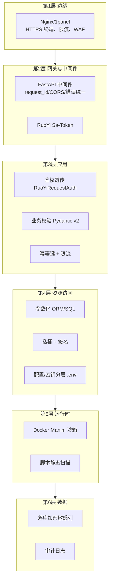
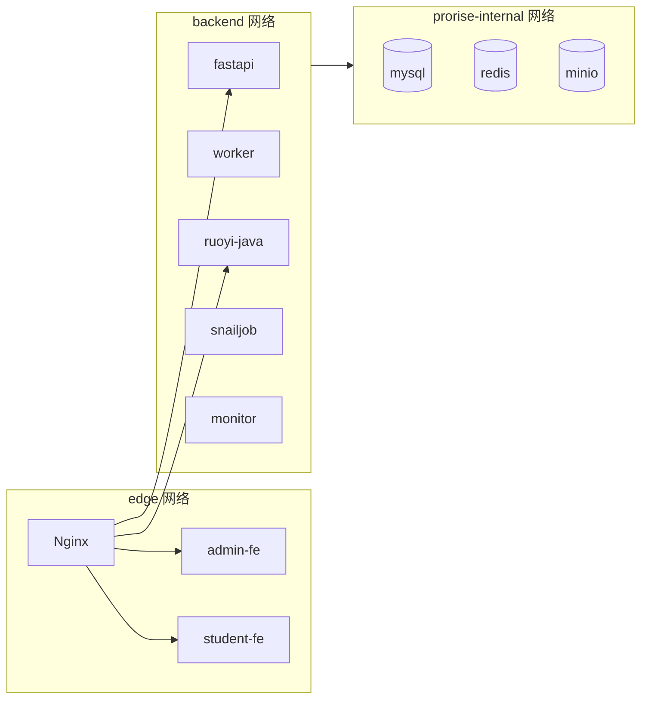
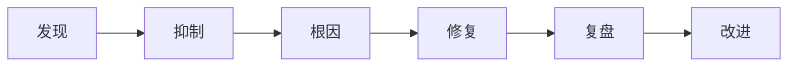

| 版本 | 日期 | 修订内容 | 作者 | 评审 |
|------|------|----------|------|------|
| v0.1.0 | 2026-03-24 | 占位骨架 | 研发团队 | — |
| v1.0.0 | 2026-04-25 | 初版正式安全架构，覆盖纵深防御、身份与权限、数据安全、网络隔离、Manim 沙箱、Provider 调用安全、审计与应急 | Prorise AI Teach 研发团队 | 安全 + 架构组 |

---

## 1. 概述

### 1.1 目的

定义平台的纵深防御架构、安全控制点与责任划分，作为合规审计、安全评审与事故应急的统一参考。本文以 **STRIDE** 威胁分类、**OWASP Top 10 (2021)** 与 **NIST CSF** 为骨架，落地到 Prorise AI Teach 的具体实现。

### 1.2 适用范围

- 后端研发：识别每个端点 / 每个外部调用应做的安全控制。
- 前端研发：识别 token 存储、CSRF、XSS、敏感字段渲染的边界。
- 运维：网络隔离、密钥轮换、审计日志、应急响应。
- 安全：评审与渗透测试时的对照。

### 1.3 术语

| 术语 | 含义 |
|------|------|
| STRIDE | Spoofing/Tampering/Repudiation/Info Disclosure/DoS/Elevation |
| OWASP Top 10 | OWASP 应用安全 Top 10 漏洞清单 |
| RBAC | Role-Based Access Control |
| Sa-Token | RuoYi 使用的轻量鉴权框架（JWT 模式） |
| Manim Sandbox | Docker 隔离的 Python 渲染容器 |

---

## 2. 引用文件

- `0001-系统架构总览.md` §10 横切关注点
- `0002-技术选型决策记录.md` ADR-007 / ADR-008 / ADR-009
- `0003-数据模型设计.md` §10 敏感字段
- `0004-API设计规范.md` §7 鉴权
- `packages/fastapi-backend/app/core/security.py` — JWT 解析
- `packages/fastapi-backend/app/features/auth/runtime_auth.py` — RuoYi 鉴权透传
- `packages/fastapi-backend/docker/manim-sandbox/` — 沙箱镜像
- `deploy/docker-compose.yml` — 网络分区
- 外部：OWASP Top 10 (2021) / OWASP ASVS 4.0 / NIST CSF 2.0 / GDPR / 中华人民共和国个人信息保护法 / 等保 2.0 三级

---

## 3. 安全策略总览（纵深防御）

图 3-1：六层纵深防御

---

## 4. 身份认证与授权

### 4.1 认证

- 用户体系：**所有账号登录仅在 RuoYi**（Sa-Token JWT）。FastAPI 不持有用户库。
- 登录流程：前端 → RuoYi `/login` 拿 `access_token` → 调任意 FastAPI 接口带 `Authorization: Bearer <token>`。
- FastAPI 解析：`core/security.py:extract_access_token_claims` 解 JWT 取 `clientId / userId / tenantId / roleIds`。
- FastAPI 校验权威：`features/auth/runtime_auth.py` 通过 `RuoYiRequestAuth` 把请求票回传 RuoYi，由 RuoYi 决定是否放行（鉴权权威集中在 RuoYi）。
- 在线态：登录成功后写 Redis（`runtime_store.persist_online_token`），登出时由 `delete_online_token_record` 清理。

### 4.2 授权（RBAC + 数据权限）

- **RBAC**：`sys_user → sys_user_role → sys_role → sys_role_menu → sys_menu`，权限点（`perms`）形如 `video:task:create`。
- **数据权限**：RuoYi 提供「按部门/角色」过滤 SQL；FastAPI 跨边界时走 `DataPermissionHelper.ignore` 谨慎短路（仅在系统初始化场景，如 `bindDefaultRoles`）。
- **JWT 风险控制**：JWT secret ≥ 32 字符随机，`RUOYI_JWT_SECRET` 由 `deploy/.env.prod` 注入，**不得入库、不得写入日志、不得出现在错误响应**。

### 4.3 注册 / 找回密码

- 注册可被运营开关控制（`/auth/register/enabled`）。
- 验证码走 `auth/code`，IP + 手机号双限频。
- 密码：服务端 BCrypt（RuoYi 默认）；前端 RSA 公钥加密传输（与 `RUOYI_API_DECRYPT_PUBLIC_KEY` 配对）。

### 4.4 多租户

- 所有业务表带 `tenant_id`，默认 `'000000'`。
- 跨租户访问必须显式声明并由超级管理员授权。

---

## 5. 数据安全

### 5.1 数据分级

| 等级 | 示例 | 控制 |
|------|------|------|
| L1 极敏感 | LLM api_key / api_secret / access_token / 用户密码 | 密文存储、不入日志、内存使用后及时清理 |
| L2 敏感 | 手机号 / 邮箱 / 视频原图 | 仅授权用户/角色可见，需脱敏展示 |
| L3 一般 | 任务摘要 / 学习记录 | 同租户内可见 |
| L4 公开 | 公开视频元信息 | 无限制 |

### 5.2 敏感字段处理

- 落库：`xm_ai_provider.api_key/api_secret/access_token` 长度允许 1000-2000 字符，应用层应进行**应用层加密**后存储（密钥轮换路径见 §10）。
- 传输：仅在 TLS 通道。
- 日志：日志中间件维护 **secret 关键字黑名单**（`api_key`、`access_token`、`password`、`Authorization`），命中字段一律 `***` 脱敏。
- 错误响应：业务异常映射时**不**回带原始 token / 上游 raw response。
- 历史踩坑：`api_key` 含中文导致 httpx 崩溃，已在 LLM/TTS provider 入口做 `isascii()` 防御（`hotfix-api-key-unicode.md`）。

### 5.3 个人信息保护

- 学生端注册要求最小必要数据。
- 学习记录、画像数据按租户隔离。
- 数据删除请求：触发 `del_flag=1` + 28 天后物理清理（与备份策略对齐）。

### 5.4 对象存储

- MinIO 私桶为默认；公开桶仅用于 `xm_landing_lead` / 公开视频。
- 上传：服务端做 MIME sniffing；图像走重编码，不直接落原始字节。
- 下载/预览：通过 FastAPI 端点 `/video/assets/{asset_key:path}` 由后端持私钥签名，**前端永远拿不到 access key**。

---

## 6. 网络与边界安全

### 6.1 compose 网络分区（来自 `deploy/docker-compose.yml`）

图 6-1：网络分区（edge / backend / data）

- **MySQL/Redis 不暴露宿主端口**：仅 backend 网内访问。
- **MinIO 暴露 19000/19001**：但生产应仅对 1panel 反代开放。
- **FastAPI 暴露 18090**：仅 1panel 反代访问，禁止公网直连。

### 6.2 TLS

- 生产仅 HTTPS；HSTS 1 年；TLS ≥ 1.2，禁用弱套件。
- 内部 service-to-service 暂走明文（compose 私网），未来网格化时切 mTLS。

### 6.3 CORS

- FastAPI CORS 中间件按 `FASTAPI_CORS_ALLOWED_ORIGINS` 白名单；生产仅许 `xm.prorisehub.com` 等域。
- 不允许 `*` 与 `Authorization` 同时启用（避免 token 漏出）。

### 6.4 限流与反爬

- 网关层（Nginx）：IP 全局限流。
- 应用层：登录 / 短信 / 视频提交按用户 + IP 双键限流。
- 公开接口（公开视频列表）做基础速率限制 + 防爬指纹。

---

## 7. Manim 渲染沙箱（关键安全控制）

### 7.1 威胁模型

LLM 生成的 Python 脚本是**不可信代码**，威胁包括：

- 文件越权读写（`open('/etc/...')`、`pathlib`）
- 子进程执行（`os.system`、`subprocess.*`）
- 网络外联（`urllib`、`socket`）
- 提权 / 容器逃逸

### 7.2 控制

| 控制 | 实现 |
|------|------|
| **静态扫描** | 提交前用 AST 扫描禁止：`os.system`、`subprocess.*`、`__import__`、`open` 写入路径白名单外、`socket`、`requests`、`urllib`、`builtins` 反射 |
| **沙箱镜像** | `packages/fastapi-backend/docker/manim-sandbox/` 仅装 Manim + 必要依赖；non-root 用户；只读根 FS；可写仅 `/work` 临时卷 |
| **网络隔离** | sandbox 容器 `--network=none`；只能输入/输出文件 |
| **资源限额** | CPU/Memory/PID 限制；timeout 上限 |
| **超时杀进程** | Dramatiq actor 时限 + sandbox 自身 timeout |
| **日志归档** | 失败样本入库归档以备分析（规划中） |

### 7.3 失败处置

- 脚本扫描不过：直接 reject，不进入沙箱。
- 沙箱执行失败：写占位片段 + section failed，不阻塞其他 section。
- 重试不超过 1 次（避免 doom loop）。

---

## 8. AI Provider 调用安全

| 风险 | 控制 |
|------|------|
| 上行 prompt 泄漏用户 PII | prompt 模板审查；用户输入做 PII 脱敏（手机号、身份证） |
| 上行 prompt 注入攻击 | 严格分隔 system / user 段；用户输入做转义 + 长度限制 |
| 下行内容夹带恶意 | 渲染前做白名单（如允许的 Manim API） |
| api_key 泄漏 | 仅从 DB 读；不落代码 / git；轮换走管理后台 |
| Provider 滥用 | failover 优先 + binding `timeout/retry` 上限 + 配额表 |
| Provider 端 524 / null content | 三层防御（`llm-proxy-null-content-fix.md`） |

---

## 9. 应用层安全（OWASP Top 10 对照）

| OWASP | 主要控制 |
|-------|----------|
| A01 Broken Access Control | 端点 `Depends(require_perm(...))`；数据权限；多租户隔离 |
| A02 Cryptographic Failures | TLS；BCrypt；JWT secret 32+；敏感列加密 |
| A03 Injection | Pydantic v2 校验；ORM 参数化；前端转义 |
| A04 Insecure Design | 本文件 + ADR；威胁建模 STRIDE |
| A05 Security Misconfiguration | 分层 .env；生产关 Swagger；CORS 白名单 |
| A06 Vulnerable Components | 依赖锁定（`pyproject.toml` + `uv.lock`）；定期升级 |
| A07 Authn Failures | 密码强度；登录限频；token 过期；登出清在线态 |
| A08 Software & Data Integrity | 镜像签名（规划）；CI 产物签名 |
| A09 Logging & Monitoring | 结构化日志 + request_id；Prometheus；审计表 |
| A10 SSRF | 出站 URL 白名单；MinIO/Provider 白名单；禁用 169.254.169.254 |

---

## 10. 密钥与配置管理

### 10.1 密钥来源

- **生产**：仅 `deploy/.env.prod`（chmod 600，**不进 git**），通过 `--env-file` 注入容器。
- **开发**：`.env.local` / `.env.development.local`（git 忽略）。
- **代码内**：永远没有硬编码 secret；CI 走 secret scan。

### 10.2 密钥清单（节选自 `.env.prod.example`）

| Key | 用途 | 轮换频率 |
|-----|------|----------|
| `RUOYI_JWT_SECRET` | Sa-Token 签名 | 季度 |
| `RUOYI_API_DECRYPT_PUBLIC_KEY/PRIVATE_KEY` | 接口加密 | 半年；如泄漏立即重发 |
| `MYSQL_ROOT_PASSWORD` | 数据库根密码 | 半年 |
| `REDIS_PASSWORD` | Redis | 半年 |
| `MINIO_ROOT_USER/PASSWORD` | 对象存储 | 半年 |
| `xm_ai_provider.api_key` | LLM/TTS 凭据 | Provider 侧策略；至少季度轮换 |
| `GITHUB_PAT` | 部署仓库拉取 | 季度（fine-grained，最小权限） |
| `SERVER_SSH_PASSWORD` | 部署 SSH | 替代为公钥后退役 |

### 10.3 轮换流程

1. 申请 → 安全负责人审批
2. 在 RuoYi 后台或 `.env.prod` 替换
3. 灰度生效（先非主链路）
4. 验证后回收旧密钥
5. 更新审计记录

---

## 11. 审计与可观测

### 11.1 关键审计事件

| 事件 | 来源 | 字段 |
|------|------|------|
| 登录成功 / 失败 | RuoYi `sys_logininfor` | userId, ip, ua, status |
| 权限点变更 | RuoYi `sys_oper_log` | operName, operParam, businessType |
| Provider 配置变更 | RuoYi `sys_oper_log` | provider_code, before, after |
| 视频任务异常 | FastAPI 结构化日志 | task_id, request_id, error_summary |
| 沙箱拒绝执行 | FastAPI 日志 + 失败样本归档 | task_id, scan_violation |

### 11.2 request_id 贯穿

- 中间件注入；日志、SSE、DB error_summary、Redis 任务态都带 request_id。
- 一次故障可一键 grep 出全链路日志。

### 11.3 监控

- Dramatiq Prometheus（actor 失败率、耗时、queue 积压）
- 业务指标：视频任务成功率、首段可见 P50/P95、Provider 路由健康率
- 告警阈值由运维 SLO 文档（详见 `008-部署与运维`）

---

## 12. 应急响应（IR）

图 12-1：IR 6 步

| 阶段 | 行动 |
|------|------|
| 发现 | 监控告警 / 用户反馈 / 日志巡检 |
| 抑制 | 关闭出问题的 Provider / 限流 / 关闭注册 |
| 根因 | 拉 request_id 关联日志 + DB 状态 |
| 修复 | 走 hotfix 分支 + 紧急 PR |
| 复盘 | 24 小时内出 incident report，挂 `_bmad-output/implementation-artifacts/` |
| 改进 | 形成 ADR / 加监控 / 加测试 |

历史 incident 模板见 `_bmad-output/implementation-artifacts/4-3-manim-429-重试风暴热修复-20260410.md`。

---

## 13. 已知风险与改进项

| 风险 | 状态 | 计划 |
|------|------|------|
| 敏感字段尚未一律应用层加密 | 部分覆盖 | Q3 完成全量列加密 |
| Manim 沙箱失败样本未集中归档 | 进行中 | 引入 sandbox audit 表 |
| 单 Redis 同时承载 broker + cache | 已知 | 拆分两实例（K8s 化前完成） |
| 部署服务器 SSH 仍允许密码 | 已知 | 强制公钥并退役密码 |
| API key 含非 ASCII 字符 | 已修复 | 在入口防御并加单测 |

---

## 附录 A：威胁建模 — STRIDE 速查

| 威胁 | 关键端点 | 控制 |
|------|----------|------|
| Spoofing | `/auth/login` | RSA 公钥加密、登录限频、CAPTCHA |
| Tampering | `/video/tasks` | JWT + 业务校验 + 幂等 |
| Repudiation | 任意写操作 | RuoYi 操作日志 + request_id |
| Info Disclosure | `/video/assets/...` | 私桶 + 签名 + 鉴权 |
| DoS | 公开端点 | Nginx + 业务限流 |
| Elevation | RuoYi 后台 | RBAC + 数据权限 + 审计 |

## 附录 B：参考资料

- OWASP Top 10 (2021) — <https://owasp.org/Top10/>
- OWASP ASVS 4.0 — <https://owasp.org/www-project-application-security-verification-standard/>
- NIST Cybersecurity Framework 2.0 — <https://www.nist.gov/cyberframework>
- 等保 2.0 三级
- 个人信息保护法（PIPL）
- Sa-Token 文档 — <https://sa-token.cc>
