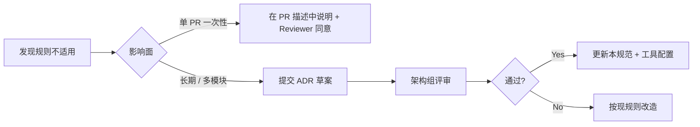

# 编码规范（Coding Standards）

## 修订记录

| 版本 | 日期 | 修订内容 | 作者 | 评审 |
|------|------|----------|------|------|
| v0.1.0 | 2026-04-03 | 文档初始化（最小基线） | 架构组 | — |
| v1.0.0 | 2026-04-25 | 重构为 Google Engineering Practices + 国标风格，按语言分章 | 研发组 | 架构组 |
| v1.0.1 | 2026-04-25 | 修正前端栈事实：student-web = React 19/TSX，admin = Vue 3.5；Python 版本下限明确为 ≥3.11 | 研发组 | team-lead |

## 1. 概述

### 1.1 目的

为 Prorise AI Teach Workspace（Monorepo：FastAPI 后端 + RuoYi-Plus Java 后台 + React 学生端 + Vue 管理后台）建立一套**可执行、可机器校验、可在 PR 中机械化判定**的编码规范，使任意 Story/Epic 在交付时都能被 reviewer、CI 与未来读者按同一标准评估。

### 1.2 适用范围

| 子系统 | 路径 | 语言 / 框架 | 适用章节 |
|--------|------|--------------|----------|
| FastAPI 后端 | `packages/fastapi-backend/` | Python ≥ 3.11；FastAPI / Pydantic / Dramatiq | §3 Python |
| 学生端前端 | `packages/student-web/`（包名 `@xiaomai/student-web`，入口 `src/main.tsx`） | **React 19 + TypeScript**（Vite 6.4.1） | §4 TS、§5 React |
| 管理后台前端 | `packages/ruoyi-plus-soybean/`（包名 `ruoyi-vue-plus`） | **Vue 3.5 + TypeScript**（Soybean Admin / Vite 7.3.0） | §4 TS、§6 Vue 3 |
| RuoYi 后台 | `packages/RuoYi-Vue-Plus-5.X/` | Java 17 / SpringBoot 3 | §7 Java |

### 1.3 阅读对象

研发工程师、Code Reviewer、技术负责人、新人入职第一周。

### 1.4 术语缩写

| 术语 | 全称 | 说明 |
|------|------|------|
| MUST | RFC 2119 强制要求 | 不满足 = PR 一定不通过 |
| SHOULD | RFC 2119 推荐要求 | 不满足需在 PR 中给出理由 |
| MUST NOT | RFC 2119 禁止要求 | 出现即必须修改 |
| ADR | Architectural Decision Record | 架构决策记录 |
| SoT | Source of Truth | 唯一事实来源（本仓库 = `_bmad-output/`） |

## 2. 引用文件

- 内部：`../003-架构设计/0001-系统架构总览.md`、`../003-架构设计/0004-API设计规范.md`、`./0002-Git工作流.md`、`./0003-代码审查标准.md`
- 外部：
  - PEP 8 — Style Guide for Python Code
  - PEP 257 — Docstring Conventions
  - PEP 484 — Type Hints
  - Google Python Style Guide
  - Google TypeScript Style Guide
  - React 官方文档（react.dev）
  - Vue 3 Style Guide（vuejs.org/style-guide/）
  - Google Java Style Guide
  - GB/T 8567-2006 计算机软件文档编制规范
  - RFC 2119 关键字定义

## 3. Python 编码规范（FastAPI 后端）

### 3.1 强制规则（MUST）

| 编号 | 规则 | 校验方式 |
|------|------|----------|
| PY-M-01 | 文件名 `snake_case.py`，类名 `PascalCase`，函数与变量 `snake_case`，常量 `UPPER_SNAKE` | Reviewer + ruff `N` 规则 |
| PY-M-02 | **公共函数与类必须有类型注解**（PEP 484），`-> None` 不可省略 | mypy / Reviewer |
| PY-M-03 | 公共模块、类、函数必须有 docstring（PEP 257；摘要行 ≤ 80 字符） | ruff `D` 规则 |
| PY-M-04 | FastAPI 路由统一挂在 `/api/v1/` 下；长耗时操作必须落到 `tasks` 资源 | 见 `../003-架构设计/0004-API设计规范.md` |
| PY-M-05 | 业务接口响应必须遵守统一响应体（`{code, msg, data}`） | contract test |
| PY-M-06 | 第三方 SDK（OpenAI、httpx、Redis 客户端等）只允许在 `app/integrations/` / `app/providers/` / `app/infra/` 引用，业务代码必须通过抽象接口访问 | grep + Reviewer |
| PY-M-07 | Redis Key 必须显式 `EXPIRE`，禁止永久键 | grep `EXPIRE`、Reviewer |
| PY-M-08 | 异常必须包装为带错误码的业务异常，禁止把原始 stack trace 透传到 HTTP 响应 | contract test |
| PY-M-09 | 单元测试覆盖率门禁：行覆盖 ≥ 70%，新增代码 ≥ 80% | `pytest --cov` |
| PY-M-10 | 任意 IO（HTTP / DB / Redis / 文件）必须有显式 timeout | grep `timeout=` |

### 3.2 推荐做法（SHOULD）

- 优先使用 `pydantic.BaseModel` 而非 `dict` 在层间传递数据。
- 异步函数命名前缀 `a` 仅在与同名同步方法共存时使用，否则保持原名。
- 用 `pathlib.Path` 替代字符串拼接路径。
- 大于 50 行的函数应拆分；模块文件超过 500 行应按职责切分。
- 长循环或外部调用必须有结构化日志（`logger.info("event=...", extra=...)`）。

### 3.3 禁止事项（MUST NOT）

- **MUST NOT** 使用裸 `except:` 或 `except Exception: pass`（必须命名异常 + 记录日志）。
- **MUST NOT** 在生产代码中保留 `print()`、`pdb`、`breakpoint()`。
- **MUST NOT** 使用 `# type: ignore`、`# noqa` 抑制错误而不在同行写明原因。
- **MUST NOT** 在 import 时执行业务副作用（数据库连接、HTTP 调用、读写文件）。
- **MUST NOT** 修改 `pyproject.toml` 后不同步 `.venv`（参见 feedback `Venv Dependency Sync`）。
- **MUST NOT** 通过调大 timeout / 加 `skip` / `as any` 等手段掩盖问题。

### 3.4 工具链

| 工具 | 角色 | 配置位置 | 命令 |
|------|------|----------|------|
| ruff | linter + import 排序 + 一部分格式化 | `packages/fastapi-backend/pyproject.toml`（`[tool.ruff]`，待补） | `ruff check packages/fastapi-backend` |
| black | 格式化（行宽 100） | `pyproject.toml` `[tool.black]`（待补） | `black packages/fastapi-backend` |
| mypy | 静态类型检查 | `pyproject.toml` `[tool.mypy]`（待补） | `mypy packages/fastapi-backend/app` |
| pytest | 单元 / 集成 / 契约测试 | `packages/fastapi-backend/pytest.ini` | `pnpm test:fastapi-backend` |
| pytest-cov | 覆盖率 | 同上 | `pnpm test:fastapi-backend:coverage` |

> 已验证：`packages/fastapi-backend/pyproject.toml` 当前仅声明运行/dev 依赖（fastapi、uvicorn、pydantic-settings、dramatiq[redis]、httpx、openai、cryptography、Jinja2、langgraph、langchain-core、pypdf、partial-json-parser；dev：pytest≥8.3、pytest-asyncio≥1.2、pytest-cov≥6.0），尚未集中 `[tool.ruff]` / `[tool.black]` / `[tool.mypy]` 配置块。新增/对齐这些配置块属于本规范落地的首批配套任务，由架构组在 v1.0.x 范围内补齐；在配置块就位之前，开发者按本节默认值（行宽 100、目标版本 `py311`、严格 `--strict-optional`）本地执行。

### 3.5 违规 vs 合规对比

```python
# 违规：裸 except + 透传堆栈 + 缺类型注解 + 永久 Key
def cache_user(user_id, payload):
    try:
        redis.set(f"user:{user_id}", payload)   # 没有 EXPIRE
    except:                                     # 裸 except
        raise                                    # 透传

# 合规
def cache_user(user_id: int, payload: dict[str, Any]) -> None:
    """Persist user payload into Redis with 1h TTL."""
    try:
        redis.set(f"user:{user_id}", json.dumps(payload), ex=3600)
    except RedisError as exc:
        logger.warning("event=cache_user_failed user_id=%s err=%s", user_id, exc)
        raise CacheUnavailable(code="CACHE_DOWN") from exc
```

## 4. TypeScript 通用规范（适用于 React 学生端 与 Vue 管理后台）

### 4.1 强制规则（MUST）

| 编号 | 规则 |
|------|------|
| TS-M-01 | 文件名：React 组件 `PascalCase.tsx`、Vue 组件 `PascalCase.vue`、模块 `kebab-case.ts`、类型 `*.types.ts`、常量 `*.constants.ts` |
| TS-M-02 | 必须开启 `"strict": true`；禁止 `any`，必要时用 `unknown` + 类型守卫 |
| TS-M-03 | API 响应类型必须由 OpenAPI/契约自动生成或显式声明 interface（参考 `0005-契约与Mock资产规范.md`） |
| TS-M-04 | 导出对象必须有显式返回类型注解；React props / Vue props 必须有类型定义 |
| TS-M-05 | 缩进 2 空格、行尾 LF、文件末尾换行（`.editorconfig` 强制） |
| TS-M-06 | import 排序：`builtin → external → internal alias (@/*) → relative` |
| TS-M-07 | 业务请求统一通过项目封装（学生端 axios / services 层；管理后台 alova）的 client，禁止直接 `fetch` |
| TS-M-08 | API 路径常量统一使用 `/api/v1/...` 前缀，禁止散落 `/api/...` 字面量 |

### 4.2 推荐做法（SHOULD）

- 工具函数纯函数化，避免在 util 层访问 store / router。
- 使用 `as const` 收敛字符串字面量；状态机类型用 discriminated union。
- 优先 `readonly`、`as const`，避免可变默认值。

### 4.3 禁止事项（MUST NOT）

- **MUST NOT** 使用 `// @ts-ignore` 不写理由（必须 `// @ts-expect-error: <issue link>`）。
- **MUST NOT** 提交未走 ESLint 的代码。
- **MUST NOT** 在组件代码中拼装 SQL / 直接调用第三方 SDK。

### 4.4 工具链（实测配置）

| 工具 | 配置文件 | 备注 |
|------|----------|------|
| ESLint | `packages/student-web/eslint.config.mjs` | 学生端（React） |
| ESLint | `packages/ruoyi-plus-soybean/eslint.config.js`（基于 `@soybeanjs/eslint-config`，启用 `vue: true, unocss: true`） | 管理后台（Vue） |
| EditorConfig | `packages/ruoyi-plus-soybean/.editorconfig`（`indent_size=2`、`charset=utf-8`、`end_of_line=lf`） | 全仓库继承 |
| TypeScript | 各 `packages/*/tsconfig.json`，启用 `strict` | — |
| Prettier | 由 `@soybeanjs/eslint-config` 内嵌（admin）；学生端在 ESLint 中处理 | 不重复维护 |

命令（来自仓库根 `package.json`）：

```bash
# 单包
pnpm --filter @xiaomai/student-web lint
pnpm --filter ruoyi-vue-plus lint
# 仓库级聚合
pnpm lint:all
pnpm typecheck:all
```

## 5. React 学生端（`packages/student-web/`）

### 5.1 项目目录（实测）

```
packages/student-web/src/
├── app/         应用初始化与路由
├── components/  通用组件
├── features/    业务特性（按功能分模块）
├── lib/         无副作用工具
├── services/    API 客户端封装
├── shared/      跨 feature 共享
├── stores/      状态（如 zustand 等）
├── styles/      全局样式
├── test/        测试 utils / setup
├── types/       全局类型
└── main.tsx     入口
```

### 5.2 强制规则（MUST）

| 编号 | 规则 |
|------|------|
| RX-M-01 | 必须使用函数组件 + Hooks；禁止类组件 |
| RX-M-02 | 文件命名：组件 `PascalCase.tsx`，hooks `useXxx.ts`，service `kebab-case.ts` |
| RX-M-03 | Props 必须类型化；可选 props 必须给默认值或 `?:` 标记 |
| RX-M-04 | 副作用放在 `useEffect` / 自定义 hook 中，**不能**在组件函数体顶层执行网络请求 |
| RX-M-05 | 跨页面状态走 store（学生端使用的状态库），不允许长链路 prop drilling |
| RX-M-06 | 路由 / API 路径常量集中在 `services/` 或 `shared/constants`；前缀 `/api/v1/` |

### 5.3 目录布局推荐（feature-first）

```
features/<feature>/
├── components/   该 feature 私有组件
├── hooks/        该 feature 私有 hooks
├── services/     该 feature 的 API 封装
├── stores/       该 feature 状态
├── types.ts
└── index.ts      仅 re-export 公开 API
```

跨 feature 共享放 `shared/` 或 `components/`。

### 5.4 违规 vs 合规对比

```tsx
// 违规：类组件 + any + 顶层副作用 + 字面量 API
class Profile extends React.Component<any, any> {
  componentDidMount() {
    fetch('/api/user').then(r => r.json()).then(d => this.setState({ user: d }))
  }
  render() { return <div>{this.state?.user?.name}</div> }
}

// 合规：函数组件 + 显式类型 + service 层 + /api/v1 前缀
import { useEffect, useState } from 'react'
import type { User } from '@/types/user'
import { fetchCurrentUser } from '@/services/user'

export function Profile() {
  const [user, setUser] = useState<User | null>(null)
  useEffect(() => {
    fetchCurrentUser().then(setUser)
  }, [])
  return <div>{user?.name}</div>
}
```

## 6. Vue 3 管理后台（`packages/ruoyi-plus-soybean/`）

### 6.1 强制规则（MUST）

| 编号 | 规则 |
|------|------|
| VUE-M-01 | 必须使用 `<script setup lang="ts">` |
| VUE-M-02 | 多单词组件名（`UserCard.vue`），index/App 等保留例外见 ESLint 配置 |
| VUE-M-03 | 模板中组件名使用 `PascalCase`（`<UserCard />`） |
| VUE-M-04 | Props 必须类型化并标注 `required` 或默认值 |
| VUE-M-05 | 副作用必须放在 `onMounted` / `watchEffect` 中，不能在 `<script setup>` 顶层执行网络请求 |
| VUE-M-06 | 跨页面状态走 Pinia store，不允许通过 `provide/inject` 长链路传递 |

### 6.2 目录布局

```
src/
  views/{feature}/         页面组件
  components/{feature}/    业务组件
  components/common/       通用组件
  composables/             组合式函数
  stores/                  Pinia
  api/                     接口封装（alova）
  types/                   全局类型
```

### 6.3 违规 vs 合规对比

```vue
<!-- 违规：Options API + any + 顶层副作用 -->
<script lang="ts">
export default {
  data(): any { return { user: null } },
  created() { fetch('/api/user').then(r => r.json()).then(d => this.user = d) }
}
</script>

<!-- 合规：<script setup> + 类型化 + onMounted + /api/v1 -->
<script setup lang="ts">
import { onMounted, ref } from 'vue'
import type { User } from '@/types/user'
import { fetchCurrentUser } from '@/api/user'

const user = ref<User | null>(null)
onMounted(async () => {
  user.value = await fetchCurrentUser()
})
</script>
```

## 7. Java 编码规范（RuoYi 后台）

### 7.1 强制规则（MUST）

| 编号 | 规则 |
|------|------|
| JV-M-01 | 包名小写点分（`com.ruoyi.system.service`），类名 `PascalCase`，方法/字段 `camelCase`，常量 `UPPER_SNAKE` |
| JV-M-02 | DTO / VO / Entity 三层职责分离，不复用同一个类 |
| JV-M-03 | Controller 不写业务逻辑，仅做参数校验与转发 |
| JV-M-04 | 数据库访问统一通过 MyBatis-Plus，禁止散落原生 JDBC |
| JV-M-05 | 公共异常通过 `GlobalExceptionHandler` 统一拦截 |
| JV-M-06 | 缩进 4 空格（与 RuoYi 子模块自身 `.editorconfig` 保持一致；与前端 2 空格独立） |

### 7.2 工具链

- Maven Wrapper（`./mvnw`）、Spotless（如启用）、Checkstyle（如启用）。
- IDE 推荐 IntelliJ IDEA + 项目 `.editorconfig`。

## 8. 横切规则

### 8.1 命名

| 元素 | Python | TS（React/Vue 共享） | Vue 模板 | Java |
|------|--------|----------------------|----------|------|
| 文件 | `snake_case.py` | `kebab-case.ts` / 组件 `PascalCase.tsx`/`PascalCase.vue` | — | `PascalCase.java` |
| 类 | `PascalCase` | `PascalCase` | — | `PascalCase` |
| 函数/方法 | `snake_case` | `camelCase` | — | `camelCase` |
| 常量 | `UPPER_SNAKE` | `UPPER_SNAKE` | — | `UPPER_SNAKE` |
| 组件 | — | React 函数组件 PascalCase | `<UserCard />` | — |

### 8.2 注释与文档

- 公共 API 必须有 docstring / TSDoc / Javadoc。
- 注释回答 **WHY**，不复述代码。
- 临时标记仅允许 `TODO(<姓名/工号>): <到期日 YYYY-MM-DD> <内容>`，过期 TODO 视为违规。
- 禁止保留 `TODO/TBD/待补充` 作为最终交付（项目硬规则）。

### 8.3 日志

| 级别 | 用途 |
|------|------|
| DEBUG | 仅本地排查；CI/生产默认关闭 |
| INFO | 关键状态变更、外部依赖调用入口/出口 |
| WARN | 可恢复异常、降级触发 |
| ERROR | 业务失败、不可恢复异常 |

结构化字段：`request_id`、`task_id`、`user_id`、`event`、`duration_ms`。

### 8.4 安全

- 凭证、API Key 一律走 `.env` / 配置中心，禁止硬编码。
- HTTP 客户端必须显式 `timeout` 与重试上限（默认 3 次 + 指数退避，参见 feedback `No Timeout Tuning`）。
- SQL：必须参数化；MyBatis 中禁止 `${}` 直拼用户输入。

## 9. 文件大小与拆分

| 类型 | 软上限 | 硬上限 | 触发动作 |
|------|--------|--------|----------|
| Python 模块 | 300 行 | 500 行 | 软上限审查时提醒；硬上限 PR 必须拆分 |
| TS 模块 | 250 行 | 400 行 | 同上 |
| React 组件（`.tsx`） | 250 行 | 400 行 | 拆 hook / 子组件 |
| Vue 单文件组件 | 350 行（含 template/script/style） | 600 行 | 拆 composable / 子组件 |
| 函数 | 50 行 | 80 行 | 强烈建议拆分 |

参考记忆 `code-structure-standards`。

## 10. PR 检查清单（编码规范专项）

```
[ ] 代码已通过本地 ruff / black / mypy（Python）
[ ] 代码已通过本地 pnpm lint / typecheck（TS / React / Vue）
[ ] 公共 API 有类型注解与 docstring/TSDoc
[ ] 没有 print / breakpoint / console.log 残留
[ ] 没有未注明理由的 type: ignore / @ts-ignore / noqa
[ ] 没有 TODO/TBD/待补充 占位
[ ] 新增依赖已同步 pyproject.toml / package.json，并在 .venv / node_modules 安装
[ ] 文件 / 函数 行数未超硬上限
[ ] 单元测试覆盖率达标（行 ≥ 70%，新增 ≥ 80%）
[ ] 涉及契约变更已同步 OpenAPI / 类型生成（见 0005）
[ ] API 路径使用 /api/v1/ 前缀
```

## 11. 例外与变更流程



> 图 11-1：规范例外申请流程

## 附录 A：术语对照

| 中文 | 英文 | 说明 |
|------|------|------|
| 强制 | MUST | 不满足 = PR 拒绝 |
| 推荐 | SHOULD | 偏离需理由 |
| 禁止 | MUST NOT | 出现即修改 |
| 防腐层 | Anti-Corruption Layer | 见架构总览 §横切关注点 |

## 附录 B：参考资料

- PEP 8 / PEP 257 / PEP 484
- Google Python / TypeScript / Java Style Guide
- React 官方文档：https://react.dev
- Vue 3 Style Guide：https://vuejs.org/style-guide/
- RFC 2119：Key words for use in RFCs to Indicate Requirement Levels
- GB/T 8567-2006 计算机软件文档编制规范
