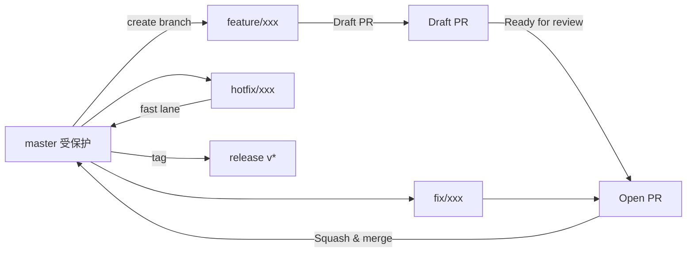
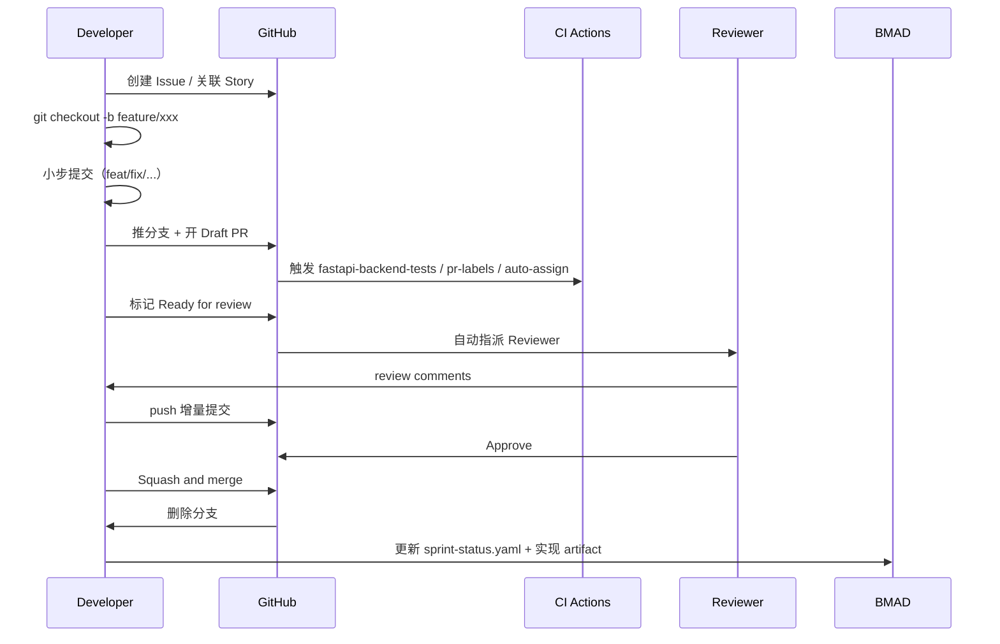
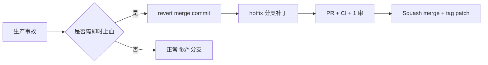

# Git 工作流与协作规范（Git Workflow）

## 修订记录

| 版本 | 日期 | 修订内容 | 作者 | 评审 |
|------|------|----------|------|------|
| v0.1.0 | 2026-03-26 | 初版（最小约定） | 架构组 | — |
| v1.0.0 | 2026-04-25 | 重写为 GitHub Flow + Conventional Commits + 真实 CI 结合的企业规范 | 研发组 | 架构组 |

## 1. 概述

### 1.1 目的

固化本仓库的**分支策略 / 提交信息 / PR 流程 / 合并策略 / 发布与回滚**，使任何开发者在任意时点都能用同一套语义动作完成日常协作。本规范是 `CLAUDE.md` 中"GitHub Flow & 收口规则"的展开实现。

### 1.2 适用范围

- 仓库：`Prorise_ai_teach_workspace`（Monorepo）
- 远端：GitHub（含 Issues / PR / Actions）
- 默认主分支：`master`

### 1.3 阅读对象

研发、Reviewer、Release Manager、新人。

## 2. 引用文件

- 内部：`./0001-编码规范.md`、`./0003-代码审查标准.md`、`./0004-BMAD开发流程.md`
- 外部：
  - Conventional Commits v1.0.0（conventionalcommits.org）
  - Semantic Versioning 2.0.0
  - GitHub Flow（githubflow.github.io）
  - Google Engineering Practices — Code Review

## 3. 分支策略

### 3.1 分支模型（GitHub Flow + 短分支）



> 图 3-1：分支与 PR 生命周期

### 3.2 分支命名规则（强制）

| 前缀 | 用途 | 命名示例 |
|------|------|----------|
| `feature/` | 新功能（对应 BMAD Story） | `feature/4-11-progressive-preview` |
| `fix/` | Bug 修复 | `fix/video-result-detail-fallback` |
| `hotfix/` | 生产紧急修复（直接合 master） | `hotfix/quiz-topic-hint-truncate` |
| `refactor/` | 纯重构（无行为变更） | `refactor/video-pipeline-rewrite` |
| `chore/` | 构建/配置/工具链 | `chore/update-pnpm-10.5` |
| `docs/` | 仅文档 | `docs/dev-handbook-rewrite` |
| `perf/` | 性能优化 | `perf/video-parallel-section-render` |

**规则：**

- MUST：全小写、`-` 分隔、ASCII。
- MUST：包含可识别的语义片段；如对应 Story，建议带 Story 编号（如 `4-11`）。
- SHOULD：单分支生命周期 ≤ 5 个工作日，超期需在 PR 描述中说明原因。
- MUST NOT：直接在 `master` 上开发（除用户明示授权的极少数文档级修改）。

### 3.3 主分支保护规则

| 规则 | 配置 |
|------|------|
| 禁止直接推送 | 强制 |
| 必须通过 PR 合并 | 强制 |
| PR 必须有有效标签 | 强制（`.github/workflows/pr-labels.yml`） |
| PR 必须 1+ 审核通过 | 强制 |
| PR 必须 CI 全绿（`fastapi-backend-tests` 等） | 强制 |
| 禁止强制推送 | 强制 |

## 4. 提交信息规范（Conventional Commits）

### 4.1 格式

```
<type>(<scope>): <subject>

<body 可选，72 列折行>

<footer 可选，BREAKING CHANGE / Closes #123>
```

### 4.2 type 列表（强制）

| type | 用途 | 是否触发版本变化 |
|------|------|------------------|
| `feat` | 新功能 | minor |
| `fix` | Bug 修复 | patch |
| `hotfix` | 生产紧急修复 | patch |
| `perf` | 性能优化（无功能变更） | patch |
| `refactor` | 重构（无外部行为变更） | — |
| `docs` | 仅文档变更 | — |
| `test` | 仅测试变更 | — |
| `build` | 构建系统 / 依赖 | — |
| `ci` | CI 配置 | — |
| `chore` | 杂项（不影响 src/test） | — |
| `style` | 格式化（不改语义） | — |
| `revert` | 回滚提交 | — |

### 4.3 scope 列表（强制）

| scope | 范围 |
|-------|------|
| `fastapi` | `packages/fastapi-backend/` |
| `student-web` | `packages/student-web/` |
| `admin-web` | `packages/ruoyi-plus-soybean/` |
| `ruoyi` | `packages/RuoYi-Vue-Plus-5.X/` |
| `video` | 视频管道（跨模块） |
| `quiz` | 题库/答题模块 |
| `auth` | 认证、注册、权限 |
| `provider` | LLM/TTS Provider 体系 |
| `oss` | 对象存储 |
| `bmad` | `_bmad-output/` 与流程产物 |
| `docs` | `docs/` 仓 |
| `ci` / `config` | 工程化 |

### 4.4 subject 规则

- MUST：祈使语气、首字母小写、≤ 72 字符、不以句号结尾。
- SHOULD：用中文 / 英文均可，但同一仓库保持一致（本仓库历史以"中文 + 英文术语"混排为主）。
- 反例 / 正例：

```
错误："fix bug"                                  （太空泛）
错误："Fixed the issue with login."              （时态错 + 句号）
正确："fix(auth): bindDefaultRoles 用 DataPermissionHelper.ignore 短路数据权限拦截"
正确："perf(video): TTS 并行 + LLM 合并 + Docker 预热"
```

### 4.5 BREAKING CHANGE

- footer 中以 `BREAKING CHANGE:` 开头描述破坏性变更。
- PR 必须打 `breaking-change` 标签（见 `pr-labels.yml`）。

### 4.6 真实样例（来自当前 git log）

```
hotfix(quiz): preload topic_hint 截 180 字防止 Pydantic 校验失败
fix(perm): 学员角色补齐 video:task + classroom:session 全套权限
fix(oss): is_https 必须保持 N（S3 内部 endpoint 协议是 HTTP）
chore(config): 把 user.register.defaultRoleIds 从公用 yml 挪到 application-prod.yml
```

## 5. 日常工作流（GitHub Flow + BMAD 收口）

### 5.1 标准链路



> 图 5-1：日常协作时序

### 5.2 步骤清单（强制）

```bash
# 1. 同步主干
git checkout master && git pull --ff-only

# 2. 创建分支
git checkout -b feature/4-12-foo-bar

# 3. 小步提交
git add -p
git commit -m "feat(video): 引入 section preview 通道"

# 4. 推送 + 开 Draft PR
git push -u origin feature/4-12-foo-bar
gh pr create --draft --title "feat(video): section preview 通道" --label enhancement

# 5. 自测通过后 Ready for review
gh pr ready

# 6. 合并（仅 Squash and merge）
gh pr merge --squash --delete-branch
```

### 5.3 commit 体积建议

- 单次 commit 改动 < 400 行（不含锁文件 / 自动生成代码）。
- 一次只做一类语义变更（`feat` 与 `refactor` 不混提）。
- 调试性 commit 在 PR 合并前必须 squash 整理。

## 6. PR 规范

### 6.1 PR 标签（强制，由 `pr-labels.yml` 校验）

允许的标签：`breaking-change`、`bugfix`、`documentation`、`enhancement`、`refactor`、`performance`、`new-feature`、`maintenance`、`ci`、`dependencies`。

PR 必须打且只能打**至少一个**有效标签，否则 `pr_labels` job 失败。

### 6.2 PR 模板

```markdown
## Summary
- 一句话描述变更与目的

## Why
- 关联 Issue / Story（Closes #123 / Story 4.11）
- 业务/技术动机

## What changed
- 模块 A：……
- 模块 B：……

## How to test
- [ ] 单元：`pnpm test:fastapi-backend:unit`
- [ ] 集成：`pnpm test:fastapi-backend:integration`
- [ ] 前端：`pnpm test:student-web`
- [ ] 手测步骤：……

## Risk & Rollback
- 风险点：……
- 回滚方式：revert <commit-hash>

## Checklist
- [ ] 已自测通过
- [ ] 已加/改测试
- [ ] 已更新文档（docs / _bmad-output）
- [ ] 已打 PR 标签
- [ ] 无 secret / 临时调试代码
```

### 6.3 Draft → Ready 准入

| 项 | 要求 |
|----|------|
| CI | 所有 required workflow 绿 |
| Review | 至少 1 个 approve（重大变更建议 2） |
| Conflicts | 无；冲突由作者 rebase 解决 |
| 标签 | `pr_labels` 通过 |
| 描述 | 完整 PR 模板 |

## 7. 合并策略

| 场景 | 推荐策略 | 备注 |
|------|----------|------|
| 常规 Story / 修复 | **Squash and merge** | 仓库统一选择，保持线性历史 |
| 大型特性分支（10 个以上独立有意义的 commit） | Rebase and merge | 罕见，需架构组同意 |
| 主干同步外部仓 / 镜像 | Merge commit | 仅在与外部仓集成时使用 |

**规则：**

- MUST：默认 **Squash and merge**，分支自动删除。
- MUST：squash 后的 commit message 必须重写为合规 Conventional Commit。
- MUST NOT：使用 `git merge --no-ff` 主干（污染历史）。
- MUST NOT：force push 到 `master`。
- MUST NOT：在已合并到 master 的 commit 上 `--amend`（参见 CLAUDE.md "Git Safety Protocol"）。

## 8. 发布与版本

### 8.1 版本号

- 遵循 SemVer 2.0.0：`MAJOR.MINOR.PATCH`。
- 内部预发布：`v0.x.y-rc.N`。

### 8.2 Tag 与 Release

```bash
git tag -a v0.4.0 -m "release: video pipeline v0.4.0"
git push origin v0.4.0
gh release create v0.4.0 --generate-notes
```

### 8.3 CHANGELOG

- 由 Conventional Commits 自动生成（如启用 `conventional-changelog`）。
- `breaking-change` 与 `new-feature` 标签的 PR 必须出现在 release notes 中。

## 9. 回滚与紧急修复

### 9.1 回滚流程



> 图 9-1：回滚链路

### 9.2 命令

```bash
# revert 一次 squash merge
git revert -m 1 <merge-commit>

# 急救分支
git checkout -b hotfix/<issue> origin/master
```

### 9.3 不允许的回滚方式

- **MUST NOT**：`git reset --hard` 公共分支并强推。
- **MUST NOT**：直接修改历史（`rebase -i` 改已合并历史）。

## 10. 与 BMAD / `_bmad-output/` 的衔接

- 一条 Story → 一个分支 → 一个 PR → 一篇 `_bmad-output/implementation-artifacts/<story>.md`。
- PR 合并后，作者必须：
  1. 更新 `_bmad-output/sprint-status.yaml`（若存在）
  2. 在 `_bmad-output/implementation-artifacts/` 增/补 artifact
  3. 更新 `_bmad-output/INDEX.md` 指向
- 详见 `./0004-BMAD开发流程.md`。

## 11. 例外与变更流程

| 场景 | 处理 |
|------|------|
| 单次破例（如紧急合并跳过 1 项 review 要求） | PR 描述写明 + 通知架构组 + 24h 内补齐 |
| 长期破例（修改本规范） | 提 `docs:` PR + 架构组评审 + 更新本文件版本号 |

## 附录 A：术语对照

| 中文 | 英文 | 说明 |
|------|------|------|
| 主干 | trunk / master | 默认分支 |
| 短分支 | short-lived branch | < 5 工作日 |
| 压缩合并 | squash merge | 多 commit 合一 |
| 紧急修复 | hotfix | 跳过部分流程的快车道 |

## 附录 B：参考资料

- Conventional Commits：https://www.conventionalcommits.org/
- SemVer：https://semver.org/
- GitHub Flow：https://githubflow.github.io/
- Google Eng Practices：https://google.github.io/eng-practices/
