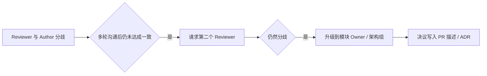

# 代码审查标准（Code Review Standards）

## 修订记录

| 版本 | 日期 | 修订内容 | 作者 | 评审 |
|------|------|----------|------|------|
| v0.1.0 | 2026-03-27 | 初版（最小约定） | 架构组 | — |
| v1.0.0 | 2026-04-25 | 引入 Google CL 标准（Reviewer's Guide / Author's Guide / The Standard of Code Review），结构化分级与决策表 | 研发组 | 架构组 |

## 1. 概述

### 1.1 目的

把 Code Review（CR）由"看一眼差不多就过"升级为**有标准、有 SLA、有结构化反馈**的工程过程。本文档全面对标 Google Engineering Practices 三套小册子，并结合本仓库 GitHub PR + BMAD Story 落地。

### 1.2 适用范围

所有合入 `master` 的 PR（包含 `feat/fix/refactor/perf/docs/chore`）。

### 1.3 阅读对象

- **Reviewer**：必读 §3、§4、§5、§7。
- **Author**：必读 §6、§7、§8。
- **技术负责人**：必读 §9。

## 2. 引用文件

- 内部：`./0001-编码规范.md`、`./0002-Git工作流.md`、`./0004-BMAD开发流程.md`
- 外部：
  - Google Eng Practices — *The Standard of Code Review*
  - Google Eng Practices — *The CL Author's Guide*
  - Google Eng Practices — *How to Do a Code Review*
  - GB/T 8567-2006

## 3. 审查的核心标准（The Standard of Code Review）

> 引用自 Google：**"The primary purpose of code review is to make sure that the overall code health of Google's codebase is improving over time."**

### 3.1 唯一裁定原则

> "Reviewers should favor approving a CL once it is in a state where it definitely improves the overall code health of the system being worked on, even if the CL isn't perfect."

裁定一条 PR 是否合入的**唯一标准**：**合入后整体代码健康度提升**。完美主义不是阻挡合入的理由——但如果合入会让健康度下降，必须打回。

### 3.2 健康度维度

| 维度 | 关注点 |
|------|--------|
| 设计（Design） | 模块边界、抽象合理性、与既有架构契合 |
| 功能（Functionality） | 是否满足 Story / Issue 描述 |
| 复杂度（Complexity） | 过度工程、过早抽象、可被替换为更简单方案 |
| 测试（Tests） | 单元/集成/契约覆盖、测试可读性、断言质量 |
| 命名（Naming） | 见 0001 §7.1 |
| 注释（Comments） | 解释 WHY，不重复 WHAT |
| 风格（Style） | 通过 lint/format 自动化校验 |
| 文档（Documentation） | docs / `_bmad-output/` 同步 |

## 4. Reviewer's Guide（审阅者指南）

### 4.1 Reviewer 的责任顺序

1. **正确性**：代码是否做了它声称要做的事。
2. **设计**：变更是否与系统设计协调。
3. **可读性**：3 个月后另一位工程师能否理解。
4. **测试**：保护正确性的网是否合理。
5. **风格 / 命名 / 注释**。

### 4.2 审阅步骤（推荐）


> 图 4-1：Reviewer 审阅步骤

### 4.3 评论的写法

| 标记前缀 | 含义 | 是否阻断合并 |
|----------|------|--------------|
| `[BLOCK]` | 必须修改才能合入 | 是 |
| `[NIT]` | 鸡毛蒜皮，可改可不改 | 否 |
| `[Q]` | 提问，不一定要改代码 | 否 |
| `[OPT]` | 建议性优化，可后续 PR | 否 |
| `[PRAISE]` | 正向反馈 | 否 |

> 阻断与非阻断必须明确区分；不写前缀视为 `[BLOCK]`。

### 4.4 不应做的事（Reviewer MUST NOT）

- 把"我会怎么写"塞给作者（除非作者写法明显错误）。
- 一次提出 50+ 鸡毛蒜皮 comment 而不指出真正的设计问题。
- 在没有读完 PR 描述的情况下评论。
- 因为个人风格偏好阻断合并。

### 4.5 SLA（响应时效）

| 场景 | 期望响应时间（工作日内） |
|------|---------------------------|
| 紧急 hotfix | 1 小时 |
| 常规 PR | 1 个工作日 |
| 大型 PR（> 800 行） | 2 个工作日 |
| Author 后续修改 | 1 个工作日 |

## 5. CL 大小（Small CLs）

### 5.1 强制限制

| 体积 | 行数（不含锁文件、生成代码、测试快照） | 处理 |
|------|----------------------------------------|------|
| Small | < 200 | 推荐 |
| Medium | 200 - 500 | 可接受 |
| Large | 500 - 800 | 必须在 PR 描述说明拆分理由 |
| Too Large | > 800 | 退回，要求拆分 |

### 5.2 例外

仅以下场景允许 > 800 行：

- 自动生成代码 / 大量数据迁移脚本
- 完整文件重命名/移动（diff 只是路径变化）
- 一次性引入新依赖的 lock 文件

## 6. Author's Guide（作者指南）

### 6.1 写好 PR 描述

PR 描述必须回答 3 个问题：

1. **Why** — 为什么要做这个变更（关联 Issue / Story）。
2. **What** — 改了什么，按模块概述。
3. **How verified** — 怎么自测通过的。

详见 `./0002-Git工作流.md` §6.2 模板。

### 6.2 应对 Reviewer 评论

- 每条 `[BLOCK]` / 默认评论必须**或者修改**、**或者解释**——不能忽略。
- `[NIT]` 可选择不改，但建议礼貌回复一条。
- 不同意 Reviewer 时：先确认理解他/她的关切 → 摆事实 → 必要时升级到第三个 Reviewer 仲裁。

### 6.3 自审清单（提 PR 前）

```
[ ] PR 描述完整，有 Story / Issue 链接
[ ] diff 自我读一遍
[ ] 运行了 lint / typecheck / 测试
[ ] 删除了 console.log / print / 调试 commit
[ ] 拆分到位（按 §5）
[ ] 文档与 _bmad-output 已同步
[ ] PR 标签已打
```

## 7. 审查决策矩阵

| 维度发现 | 严重程度 | 标记 | 决策 |
|----------|----------|------|------|
| 功能缺陷（不能用） | 高 | BLOCK | Request changes |
| 安全风险（凭证泄露 / SQL 注入） | 高 | BLOCK | Request changes，立即通知安全负责人 |
| 设计不当但可工作 | 中 | BLOCK | Request changes 或建议另开 refactor PR |
| 复杂度偏高 | 中 | BLOCK / OPT | 视情况 |
| 缺失测试 | 中 | BLOCK | Request changes |
| 命名 / 注释问题 | 低 | NIT | 不阻断 |
| 风格 / 格式 | 低 | NIT | 应由 lint 自动处理；不应人工评论 |

## 8. 安全审查 Checklist（合入前必须人工过一遍）

| 项 | 说明 |
|----|------|
| 凭证 | 无任何 API Key / Token / 密码硬编码；新增配置走 `.env` |
| 输入校验 | 所有用户输入有 schema / pydantic / class-validator |
| SQL | 参数化（MyBatis 用 `#{}`，Python 用 SQLAlchemy / 参数绑定） |
| 越权 | 路由有权限装饰器 / 拦截器 |
| 日志 | 不打印密码 / token / 完整请求体（脱敏） |
| 依赖 | 新增依赖在 `package.json` / `pyproject.toml` 一并提交，且无已知 CVE |
| CORS / CSRF | 未无意放宽 |

## 9. 升级与仲裁



> 图 9-1：分歧仲裁路径

## 10. 度量

仅作为团队改进信号，**不用于个人考核**。

| 指标 | 目标 |
|------|------|
| Time to first review | < 1 工作日（90 分位） |
| PR cycle time（开 → 合） | < 3 工作日（中位） |
| Review iteration（来回轮次） | 中位 ≤ 2 |
| Reviewer 平均 comment / PR | 健康区间 3-15 |
| 上线后 7 日 hotfix 率 | < 5% |

## 11. 对 AI 辅助审查的态度

允许使用 AI（Claude Code / Copilot）作为**第二意见**，但：

- AI 评论必须经人类 Reviewer 确认后才能 `[BLOCK]`。
- 自动化批量整改（rename / format）不算 Review。
- 安全 / 业务正确性 / 设计判断：**最终责任在人类 Reviewer**。

## 附录 A：术语对照

| 中文 | 英文 | 说明 |
|------|------|------|
| 变更列表 | CL（Change List） | Google 术语，对应 GitHub PR |
| 阻断评论 | Blocking comment | 不修改不能合并 |
| 鸡毛蒜皮 | Nit | 风格 / 个人偏好，不阻断 |

## 附录 B：参考资料

- Google Eng Practices: https://google.github.io/eng-practices/
- *The Standard of Code Review*
- *How to Do a Code Review*
- *The CL Author's Guide*
- ISO/IEC 20246:2017 Software and systems engineering — Work product reviews
