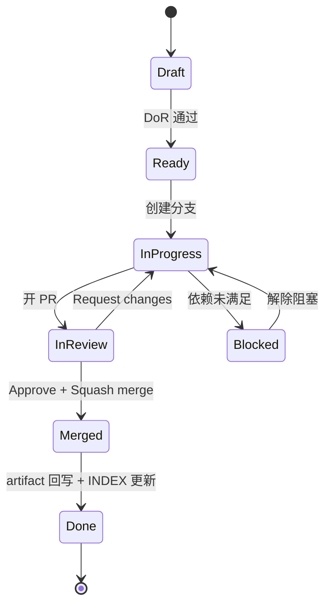
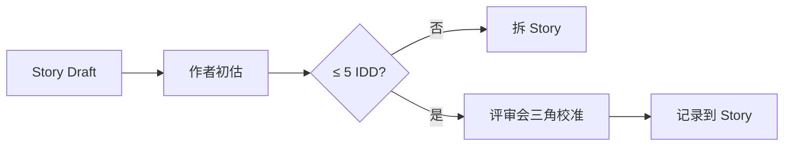
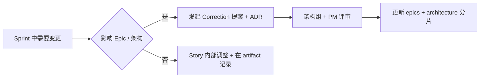

# BMAD 开发流程（BMAD Lifecycle）

## 修订记录

| 版本 | 日期 | 修订内容 | 作者 | 评审 |
|------|------|----------|------|------|
| v0.1.0 | 2026-03-26 | 初版 | 架构组 | — |
| v1.0.0 | 2026-04-25 | 重写为 Epic→Story→Implementation→Review 全链路企业规范，与 `_bmad-output/` 真实目录对齐，引入 DoR / DoD / 收口清单 | 研发组 | 架构组 |
| v1.1.0 | 2026-04-25 | 补全估算（理想人日 + 三角校准）、Sprint 节奏、回顾模板与硬性要求、团队/工程双层度量 | 研发组 | team-lead |

## 1. 概述

### 1.1 BMAD 是什么

BMAD（Business Model + Architecture-Driven Development）是本项目的产品/架构/实现一体化驱动方法。仓库唯一事实来源是 `_bmad-output/`：

| 子目录 | 内容 | 角色 |
|--------|------|------|
| `_bmad-output/planning-artifacts/prd/` | 产品需求文档（分片） | PM |
| `_bmad-output/planning-artifacts/architecture/` | 架构设计（分片） | 架构师 |
| `_bmad-output/planning-artifacts/ux-design-specification/` | UX 设计 | 设计 |
| `_bmad-output/planning-artifacts/epics/` | Epic 列表 + 拆 Story 标准 + 依赖模型 | PM + 架构 |
| `_bmad-output/implementation-artifacts/` | 每个 Story 的实施 / 收口 artifact | 开发者 |
| `_bmad-output/research/` | 早期调研 | 全体 |
| `_bmad-output/INDEX.md` | 唯一导航入口 | 文档 owner |

### 1.2 目的

把每条业务功能从"想法 → 上线"的链路**强制结构化**，让产品、架构、实现、回写、检索全部基于 `_bmad-output/` 同一份事实。

### 1.3 阅读对象

PM、架构师、研发、Reviewer、新人。

## 2. 引用文件

- 内部：`./0001-编码规范.md`、`./0002-Git工作流.md`、`./0003-代码审查标准.md`、`./0005-契约与Mock资产规范.md`
- BMAD 内部：
  - `_bmad-output/INDEX.md`
  - `_bmad-output/planning-artifacts/epics/02-document-usage-rule.md`
  - `_bmad-output/planning-artifacts/epics/07-story-definition-standard.md`
  - `_bmad-output/planning-artifacts/epics/10-epic-list.md`
  - `_bmad-output/planning-artifacts/epics/12-detailed-planning-format.md`
- 外部：
  - GB/T 8567-2006 计算机软件文档编制规范
  - Atlassian *Definition of Ready / Definition of Done* 模板

## 3. 角色与责任（RACI）

| 活动 | PM | 架构师 | 研发 | Reviewer | QA | Owner |
|------|----|--------|------|----------|-----|-------|
| PRD 撰写 | R/A | C | I | — | — | PM |
| 架构设计 / ADR | C | R/A | I | C | I | 架构师 |
| Epic 拆 Story | R/A | R | C | — | C | PM |
| Story DoR 评审 | A | C | R | — | C | PM |
| 实现 | I | C | R/A | — | — | 研发 |
| Code Review | — | C | C | R/A | — | Reviewer |
| 测试 | — | — | R | — | A | QA |
| 收口 artifact | I | I | R/A | C | C | 研发 |
| Sprint 总结 | A | C | C | C | C | PM |

> R=Responsible / A=Accountable / C=Consulted / I=Informed

## 4. 主流程


> 图 4-1：BMAD 全链路

## 5. 阶段定义

### 5.1 阶段 1：产品 / 架构

- **输入**：业务需求、用户访谈、调研。
- **产物**：
  - PRD 分片（`_bmad-output/planning-artifacts/prd/`）
  - 架构设计（`_bmad-output/planning-artifacts/architecture/`）
  - UX（`_bmad-output/planning-artifacts/ux-design-specification/`）
- **门禁**：PRD 与架构均通过 1 次书面评审（在 PR 中评审或专门会议）。

### 5.2 阶段 2：Epic → Story 拆分

- 依据：`_bmad-output/planning-artifacts/epics/07-story-definition-standard.md`。
- Story 命名：`<Epic 编号>.<序号>-<短描述>`，文件名小写、连字符分隔（与既有 `0-1-monorepo-...md` / `4-11-视频等待页...md` 一致）。
- 每条 Story MUST 包含：
  - 背景 / 目标
  - 验收标准（Acceptance Criteria）
  - 依赖（前置 Story / 契约 / 技术决策）
  - 风险与回滚
  - 估时（理想人日）

### 5.3 阶段 3：实现

- 1 Story → 1 分支 → 1 PR（合并策略 Squash，见 `0002`）。
- 实现期间产出：代码 + 测试 + 契约（如改动）+ 实施 artifact 草稿。
- 长任务实现期可在 artifact 中维护"在做" / "已完成" / "待跟进"小节。

### 5.4 阶段 4：审查与合入

- 见 `./0003-代码审查标准.md`。
- 合并后必须删除分支。

### 5.5 阶段 5：收口（Done 真正达成）

- **MUST**：PR 合并后同日内完成：
  1. `_bmad-output/implementation-artifacts/<story>.md` 定稿
  2. 必要时更新 `_bmad-output/INDEX.md` 链接
  3. 同步更新 `docs/01开发人员手册/` 受影响章节
  4. 在 MemPalace 写入对应 wing 记忆（参见 `CLAUDE.md` "Memory & Document Management"）
- **MUST**：用户验收清单（如适用）放在 `docs/01开发人员手册/` 对应模块章节中，前端类必须含可点击操作清单。

## 6. Story 状态机



> 图 6-1：Story 状态机

## 7. Definition of Ready（DoR）

Story 进入 `Ready` 必须满足：

| 项 | 要求 |
|----|------|
| 业务目标 | 一句话能说清"为谁解决什么问题" |
| 验收标准 | 至少 3 条、可观测、可测试 |
| 依赖 | 列出前置 Story / 契约 / Provider |
| 契约 | 影响接口已在 OpenAPI / 契约目录登记（见 `0005`） |
| 影响面 | 涉及模块、库、迁移已识别 |
| 估时 | 理想人日（≤ 5 个工作日，超出则要求拆分） |
| 风险 | 已识别 + 回滚方案 |

> 参考：`_bmad-output/implementation-artifacts/0-6-story-交付门禁与并行开发-dor-dod-冻结.md`

## 8. Definition of Done（DoD）

| 项 | 要求 |
|----|------|
| 代码 | 通过 lint / typecheck / 单元测试 / 集成测试 |
| 测试 | 行覆盖 ≥ 70%（新增 ≥ 80%），契约/集成有相应用例 |
| 契约 | OpenAPI / Mock / 类型生成同步 |
| 文档 | docs / `_bmad-output/implementation-artifacts/` 同步 |
| 记忆 | MemPalace 已回写（如属重要决策） |
| Review | ≥ 1 approve、PR 标签合规 |
| 验收 | 用户验收（前端类必须人工点过一遍） |
| 监控 | 关键路径有日志 / 指标（关键 Story） |
| 回滚 | 回滚步骤已写入 PR 描述 |

> 任何一项未满足，Story 不得置 `Done`。

## 9. 实施 artifact 模板

存放路径：`_bmad-output/implementation-artifacts/<story-id>.md`

```markdown
# Story <id>: <标题>

## 背景与目标
- 关联 Epic：…
- 业务动机：…

## 范围与不在范围
- In: …
- Out: …

## 实施记录
- yyyy-mm-dd：开始
- yyyy-mm-dd：完成 X / Y / Z
- 关键决策：见下 §决策

## 决策（ADR-lite）
| 决策 | 背景 | 备选 | 最终 | 影响 |
|------|------|------|------|------|

## 测试与验证
- 单元：…
- 集成：…
- 手测步骤：…
- 用户验收：…

## 风险与回滚
- 风险：…
- 回滚：revert <commit>

## 关联
- PR：#xxx
- Issue：#xxx
- 受影响文档：docs/...
```

## 10. 与 GitHub / 工程化的衔接

| 关键事件 | GitHub 动作 | BMAD 动作 |
|----------|-------------|-----------|
| Story Ready | 创建 Issue（标题含 Story ID） | DoR 写入 epics 文档 |
| 开始实现 | 创建分支 + Draft PR | artifact 草稿建立 |
| 提交评审 | Ready for review | artifact 标记 In Review |
| 合并 | Squash merge + 删除分支 | artifact 状态置 Done，回写 INDEX |
| 发布 | tag + release | （如属里程碑）写入 `docs/01开发人员手册/009-里程碑与进度/` |

## 11. 并行开发与依赖管理

- 多 Story 并行时，依赖图见 `_bmad-output/planning-artifacts/epics/06-dependency-model.md`。
- 跨 Story 共用契约：必须先冻结契约 Story（如 0-2、0-4、0-5、0-6）再启动业务 Story。
- 跨模块（FastAPI + 前端）的功能：建议拆为契约 Story + 后端 Story + 前端 Story 三段。

## 12. 估算（Estimation）

### 12.1 估算单位

本仓库采用**理想人日（IDD：Ideal Dev Day）** 作为唯一估算单位，避免抽象点（Story Point）在跨小组对齐时漂移。

| 单位 | 定义 |
|------|------|
| 1 IDD | 一名熟悉该模块的开发者、无中断、净编码 + 自测 + 文档时间 |
| 0.5 IDD | 半天工作量 |
| 复杂 Story 上限 | 5 IDD（超过必须拆分） |

### 12.2 估算流程



> 图 12-1：估算流程

### 12.3 三角校准（Triangulation）

进入 Ready 之前，至少由以下三方各出 1 个估值，取**最大值**写入 Story：

- 作者本人
- 1 名同模块同侪
- Reviewer 或模块 Owner

三方差距 > 100% 时必须再讨论一轮，或先做 0.5 IDD 的探针 Spike。

### 12.4 误差跟踪

每条 Story 完成后在 implementation-artifact 中记录 `estimated` / `actual`，季度回顾时统计偏差区间，作为下一季度估算校准基线。

## 13. Sprint 节奏

| 项 | 约定 |
|----|------|
| Sprint 长度 | 2 周（10 个工作日） |
| 计划会 | Sprint 第 1 天上午，输出 sprint plan |
| 站会 | 每个工作日 15 分钟（昨日 / 今日 / 阻塞） |
| 评审会 | Sprint 末日上午，演示已完成 Story |
| 回顾会 | Sprint 末日下午，输出回顾纪要（见 §14） |
| Sprint 状态 | 落到 `_bmad-output/sprint-status.yaml`（如启用），由 PM/SM 维护 |

## 14. 回顾（Retrospective）

### 14.1 目的

把每个 Sprint / Epic 的"做对的、做错的、不知道的"沉淀为下一个 Sprint 的可执行改进项，避免同一类问题反复发生。

### 14.2 模板（Start / Stop / Continue + 行动项）

```markdown
# Sprint <N> 回顾（<日期范围>）

## What went well（继续做）
- …

## What hurt us（停止做）
- …

## What we want to try（开始做）
- …

## 关键学习（决策 / 反例）
- …

## 行动项（下个 Sprint 必须落地）
| 行动 | Owner | DDL | 验收 |
|------|-------|-----|------|
| … | … | … | … |
```

### 14.3 强制规则

- **MUST**：每个 Sprint 必须开 1 次回顾，时长 ≥ 60 分钟。
- **MUST**：回顾输出落到 `_bmad-output/implementation-artifacts/retro-<sprint-id>.md`。
- **MUST**：未完成的行动项滚动进入下个 Sprint 回顾的"行动项追踪"区。
- **SHOULD**：每个 Epic 收尾时再做 1 次"Epic 回顾"，重点在架构与跨 Sprint 学习。

### 14.4 回顾与 MemPalace

回顾中产生的「**反例 / 教训**」必须按 `CLAUDE.md` 中 MemPalace 规则写入对应 wing，并在 `feedback-*.md` 形式存档（参考记忆 `feedback-multi-agent-refactor`、`feedback-no-timeout-tuning` 的结构）。

## 15. 度量（DORA + BMAD 内部）

### 15.1 团队级度量

| 指标 | 定义 | 目标 |
|------|------|------|
| Story 周期时间 | Ready → Done | 中位 ≤ 5 工作日 |
| Story 完成率 | Sprint 计划中按时完成的占比 | ≥ 80% |
| 估算偏差 | (actual − estimated) / estimated | 中位 \|x\| ≤ 30% |
| 回顾行动项关闭率 | 上 Sprint 行动项在本 Sprint 内关闭比例 | ≥ 80% |

### 15.2 工程级度量（DORA）

详见 `../008-部署与运维/` 中 SRE + DORA 章节，本文不重复。BMAD 流程对其的贡献点：Story 粒度足够小 → 部署频率上升、变更失败率下降。

## 16. 例外与变更流程



> 图 16-1：BMAD 变更流程

## 17. PR 检查清单（BMAD 专项，附加于 0002 §6.2）

```
[ ] PR 标题与 Story ID 一致
[ ] 关联 Issue 已 link
[ ] _bmad-output/implementation-artifacts/<story>.md 已更新
[ ] _bmad-output/INDEX.md 链接已校正（若涉及）
[ ] 受影响 docs/ 章节已同步
[ ] 已写入 MemPalace 重要决策（若属高价值）
```

## 附录 A：术语对照

| 中文 | 英文 | 说明 |
|------|------|------|
| 唯一事实来源 | Source of Truth | `_bmad-output/` |
| 实施产物 | Implementation Artifact | 每个 Story 的收口文档 |
| 准入定义 | Definition of Ready (DoR) | Story 可启动条件 |
| 完成定义 | Definition of Done (DoD) | Story 完成条件 |

## 附录 B：参考资料

- `_bmad-output/INDEX.md`
- `_bmad-output/planning-artifacts/epics/07-story-definition-standard.md`
- `_bmad-output/planning-artifacts/epics/12-detailed-planning-format.md`
- Atlassian — Agile DoR/DoD
- GB/T 8567-2006
