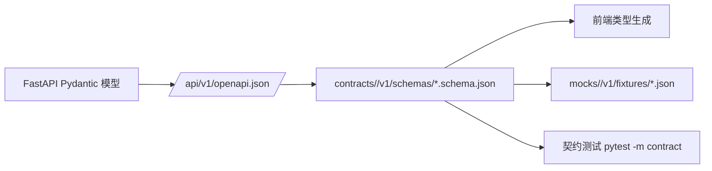
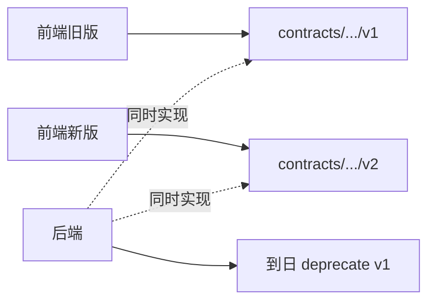
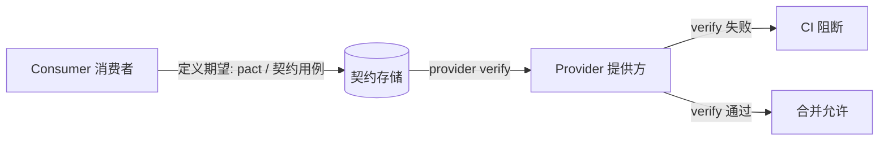

# 契约与 Mock 资产规范（Contracts & Mocks Governance）

## 修订记录

| 版本 | 日期 | 修订内容 | 作者 | 评审 |
|------|------|----------|------|------|
| v0.1.0 | 2026-03-29 | 初版（最小落点） | Epic 0 Owner | — |
| v1.0.0 | 2026-04-25 | 重写为企业级规范：OpenAPI / JSON Schema / Mock 治理三位一体，含目录结构、版本策略、PR 检查清单、违规对比 | 研发组 | 架构组 |
| v1.1.0 | 2026-04-25 | 新增 §13 消费者驱动契约（CDC）章节，含本仓库 4 个跨进程边界的 CDC 落地形态与强制规则 | 研发组 | team-lead |

## 1. 概述

### 1.1 目的

把 `contracts/`（API/事件/状态契约）与 `mocks/`（前端开发/测试用 fixtures）作为**前后端协作的唯一锚点**进行治理，避免出现"页面注释、聊天记录、Issue 自由文本各执一词"的契约漂移现象。本规范同时是 PR 与 CI 校验的依据。

### 1.2 适用范围

- 仓库内 `contracts/` 与 `mocks/` 目录
- 所有公开给前端 / 第三方的 HTTP / SSE / Redis 事件 / Provider 接口
- FastAPI 后端导出的 OpenAPI（`/api/v1/openapi.json`）

### 1.3 阅读对象

后端开发者（契约定义方）、前端开发者（契约消费方）、架构师、Reviewer。

## 2. 引用文件

- 内部：`./0001-编码规范.md`、`../003-架构设计/0004-API设计规范.md`、`./0004-BMAD开发流程.md`
- 外部：
  - OpenAPI Specification 3.1.0
  - JSON Schema Draft 2020-12
  - Server-Sent Events（W3C）
  - GB/T 8567-2006

## 3. 唯一落点（Source of Truth）

| 资产类型 | 必须放在 | 禁止放在 |
|----------|----------|----------|
| HTTP API schema | `contracts/<domain>/<vN>/schemas/*.schema.json` 或 OpenAPI 文档 | 前端类型注释、PR 描述、聊天记录 |
| 事件 schema（SSE / 消息队列） | `contracts/<domain>/<vN>/schemas/*-event.schema.json` | 前端 switch case 自定义 |
| 错误码 | `contracts/<domain>/<vN>/errors/<domain>-error-codes.md` | 后端 raise 处散落字符串 |
| 状态枚举 | `contracts/<domain>/<vN>/states/<domain>-status.md` | 业务代码 if-else 字面量 |
| 示例 payload | `contracts/<domain>/<vN>/examples/*.json` | README 嵌入式片段 |
| Mock fixtures | `mocks/<domain>/<vN>/fixtures/*.json` | 前端组件内 mockData 常量 |

## 4. 目录结构（强制）

### 4.1 contracts

```
contracts/
├── README.md                          总入口
├── _shared/                           跨域共享（错误码命名空间等）
└── <domain>/                          如 auth / task / video / classroom
    ├── README.md                      域说明 + 版本索引
    └── v{major}/                      v1 / v2 ...
        ├── README.md                  本版本说明
        ├── CHANGELOG.md               同主版本内增量记录
        ├── schemas/                   *.schema.json
        ├── examples/                  <resource>.<scenario>.json
        ├── errors/                    <domain>-error-codes.md
        └── states/                    <domain>-status.md
```

实际存在域（截至本版本）：`auth/`、`center/`、`classroom/`、`companion/`、`evidence/`、`learning/`、`task/`、`tasks/`、`video/`、`_shared/`。

> 注：当前 `contracts/tasks/` 尚未严格按 `vN` 分层（schemas 直挂域根），此为 v0 临时形态；新增/迁移到 v1 应遵循本节结构。变更通过 BMAD Story 推进，不在本规范单方面强行重构。

### 4.2 mocks

```
mocks/
├── README.md
├── _shared/
└── <domain>/
    └── v{major}/
        ├── README.md
        └── fixtures/                  *.json
```

## 5. 命名规则（强制）

| 资产 | 命名 | 示例 |
|------|------|------|
| 域目录 | 小写英文语义词 | `auth`、`task`、`video` |
| schema 文件 | `<domain>-<resource>.schema.json` | `task-snapshot.schema.json` |
| 事件 schema | `<resource>-event.schema.json` | `sse-event.schema.json` |
| 示例 payload | `<resource>.<scenario>.json` | `task.success.json`、`task.failed.json` |
| 错误码文档 | `<domain>-error-codes.md` | `task-error-codes.md` |
| 状态枚举文档 | `<domain>-status.md` | `task-status.md` |
| Story 关联文档 | `story-<epic>.<seq>-<短描述>.md` | `story-1.1-统一认证契约与会话语义.md` |

**MUST**：所有文件名 ASCII，扩展名小写。
**MUST NOT**：文件名包含日期 / 版本号（版本通过目录 `v1/v2` 表达）。

## 6. OpenAPI 与 Schema 双轨制

### 6.1 关系



> 图 6-1：契约/Mock/测试三向同步

### 6.2 规则

- **MUST**：HTTP API 的真理来自 FastAPI Pydantic 模型 + OpenAPI 导出。
- **MUST**：跨语言 / 跨进程消费（前端、Java RuoYi、第三方）的 schema 必须 commit 到 `contracts/` 中。
- **MUST**：当 Pydantic 模型变更影响公开接口时，PR 必须同步更新 `contracts/` 与 `mocks/`。
- **SHOULD**：前端类型由 `contracts/*.schema.json` 自动生成（如使用 `openapi-typescript` / `json-schema-to-typescript`）。

## 7. 版本与兼容性

### 7.1 版本规则

| 变更类型 | 处理 |
|----------|------|
| 添加可选字段 / 新增端点 | 同主版本内更新；写 `CHANGELOG.md` |
| 修改字段含义但保持类型 | 同主版本内更新 + 在前端 release notes 写明 |
| 删除字段 / 改类型 / 改必填 | **破坏性变更**：必须新建 `v{N+1}/` 目录 |
| 错误码新增 | 同主版本；`task-error-codes.md` 末尾追加 |
| 错误码语义变更 | 破坏性 → `v{N+1}` |

### 7.2 双版本并存



> 图 7-1：破坏性变更的双轨过渡

### 7.3 弃用流程

```
1. 新版本 vN+1 发布并稳定 ≥ 1 个 Sprint
2. 在 v{N}/README.md 顶部加 "Deprecated since YYYY-MM-DD" 横幅
3. 通知前端切换
4. 切换完成 + 全 monitor 显示无 vN 流量 ≥ 1 周
5. 删除 vN/，commit 标 "chore(contracts): remove deprecated vN"
```

## 8. Mock 治理

### 8.1 Mock 与契约的对齐

- **MUST**：每个 fixture 在文件头注明对应契约版本 + 场景（成功 / 失败 / 边界）。
- **MUST**：fixture 字段必须通过对应 schema 校验（建议 CI 中跑 `ajv validate`）。
- **MUST NOT**：前端单测 / 组件代码内嵌业务 mock 数据；统一从 `mocks/<domain>/vN/fixtures/` 读取。

### 8.2 命名场景

| 场景后缀 | 用途 |
|----------|------|
| `.success.json` | 正常路径 |
| `.failed.json` | 业务失败（带错误码） |
| `.timeout.json` | 超时 |
| `.partial.json` | 部分成功 / 渐进 |
| `.empty.json` | 空数据 / 空列表 |

### 8.3 状态流样例

涉及多步状态机（如视频任务 pending → preview → completed）的 fixture：

- 放在 `mocks/<domain>/v1/fixtures/<resource>-flow/` 子目录
- 顺序文件名 `01-pending.json`、`02-preview.json`、`03-completed.json`

## 9. 错误码规范

| 项 | 要求 |
|----|------|
| 全局格式 | `<domain>.<category>.<reason>`，如 `auth.token.expired` |
| 分级 | `info` / `warn` / `error` / `fatal` |
| 必填字段 | `code`、`message_key`（i18n）、`http_status`、`retryable: bool`、`scenario` |
| 不允许 | 同义错误码并存（一定要去重） |

错误码文档示例（条目）：

```markdown
### task.queue.full

| 字段 | 值 |
|------|----|
| HTTP | 503 |
| 等级 | error |
| message_key | task.queue_full |
| 可重试 | yes（指数退避） |
| 触发场景 | Dramatiq 队列满 |
| 前端建议 | 提示用户稍后重试 + 不清空表单 |
```

## 10. 违规 vs 合规对比

```ts
// ❌ 违规：前端组件内嵌 mock + 字面量状态 + 自由文本判断
const fakeTask = { id: 1, status: 'doing', msg: '处理中' }
if (resp.message?.includes('过期')) logout()

// ✅ 合规：从 fixture 读 + 走错误码 + 走类型生成
import successFixture from '@/../mocks/task/v1/fixtures/task.success.json'
import type { TaskSnapshot } from '@/types/contracts/task'   // 从 schema 生成
import { ErrorCodes } from '@/constants/error-codes'

if (resp.code === ErrorCodes.AUTH_TOKEN_EXPIRED) logout()
```

## 11. 发布门禁（PR 必查）

```
[ ] 影响公开接口 → 已更新对应 schema
[ ] schema 变更 → 已同步 OpenAPI 导出
[ ] schema 变更 → 已同步 examples / fixtures
[ ] 错误码新增 → 已写入 <domain>-error-codes.md，并通知前端
[ ] 状态枚举变更 → 已写入 <domain>-status.md
[ ] 破坏性变更 → 已建 v{N+1} 目录 + 双轨过渡计划
[ ] CHANGELOG.md 已记录
[ ] mocks fixture 已与新 schema 校验通过
```

## 12. CI 自动化建议

| 校验 | 工具 | 触发 |
|------|------|------|
| schema 语法 | `ajv compile` 或 `check-jsonschema` | 任意 `contracts/**/*.schema.json` 变更 |
| examples ⇔ schema | `ajv validate` | 同上 |
| OpenAPI 导出对齐 | `openapi-diff` 比对前后版本 | FastAPI 路由相关变更 |
| 错误码唯一性 | 简单脚本扫描 `errors/*.md` | 任意 errors 变更 |

> 当前仓库 CI 仅有 `fastapi-backend-tests` / `pr-labels` / `auto-assign`；契约自动校验属本规范落地的下一步配套（建议作为独立 Story）。

## 13. 消费者驱动契约（CDC：Consumer-Driven Contracts）

### 13.1 动机

OpenAPI / JSON Schema 描述「提供方承诺什么」，**CDC 反过来描述「消费者依赖什么」**。在前后端、FastAPI ↔ RuoYi、视频管道 ↔ Provider 这些跨进程边界上，CDC 能在变更发生**之前**捕获破坏性影响，避免"提供方以为兼容、消费者实际坏掉"。

### 13.2 角色与流程



> 图 13-1：CDC 反向校验链路

### 13.3 在本仓库落地的形态

考虑到当前仓库尚未引入 Pact Broker，CDC 在 **v1.x 以"轻量内置方式"实现**，不强制引入新工具：

| 边界 | Consumer | Provider | 契约形态 | 校验位置 |
|------|----------|----------|----------|----------|
| 学生端（React） ↔ FastAPI | `packages/student-web` | `packages/fastapi-backend` | `contracts/<domain>/v1/examples/*.json` + 学生端基于 schema 生成的类型 | 后端 `pytest -m contract`（`packages/fastapi-backend/tests/contracts/`） |
| 管理后台（Vue） ↔ RuoYi Java | `packages/ruoyi-plus-soybean` | `packages/RuoYi-Vue-Plus-5.X` | RuoYi 已有响应封装 + `contracts/<domain>/` | 后端单元/集成测试 |
| 视频管道 ↔ LLM/TTS Provider | FastAPI 编排层 | OpenAI / Gemini / Qwen 适配器 | `contracts/_shared/` + provider 适配器测试 | `tests/unit/providers/` |
| FastAPI ↔ Dramatiq Worker | API | Worker | `contracts/tasks/sse-event.schema.json`、`task-snapshot.schema.json` | `tests/contracts/` |

### 13.4 强制规则

- **MUST**：每个公开接口必须在 `contracts/<domain>/v1/examples/` 下至少有一个 `success` 与一个 `failed` 场景样例，且这些样例**也是消费者的契约用例**。
- **MUST**：后端 `tests/contracts/` 下的契约测试必须以这些样例做断言，不能仅校验自身 Pydantic。
- **MUST**：消费者（前端 / 其他后端）发现现有样例缺少自己依赖的场景时，**先**在 `contracts/<domain>/v1/examples/` 中补一个新场景文件 + 在自己仓内写一条断言用例 → **再**找提供方落实。提供方在该场景未通过前不得合并相关变更。
- **SHOULD**：升级到 Pact / Spring Cloud Contract / Schemathesis 等工具属本规范 v2 范畴，需独立 Story 推进。
- **MUST NOT**：以"提供方说兼容了"为由跳过场景级断言。

### 13.5 PR 检查清单（CDC 增量）

```
[ ] 公开接口的 success/failed 场景样例完整
[ ] 消费者新增依赖场景已落到 contracts/<domain>/v1/examples/
[ ] 后端 tests/contracts/ 下有用例断言新场景
[ ] schema 破坏性变更已通过双轨（v{N+1}）而非原地修改
```

## 14. 例外与变更流程

| 场景 | 处理 |
|------|------|
| 紧急临时契约（线上事故修复） | 允许暂落到 `_shared/hotfix/`，事故关闭后 24h 内迁回正式版本目录 |
| 内部实验接口（仅供研发本地） | 放到 `contracts/<domain>/sandbox/`，必须有 `experimental: true` 标识；**MUST NOT** 出现在生产 OpenAPI |
| 变更本规范 | 提 `docs:` PR + 架构组评审 |

## 附录 A：术语对照

| 中文 | 英文 | 说明 |
|------|------|------|
| 契约 | Contract | 跨语言、跨进程的接口/事件/状态形式约束 |
| 灯具 | Fixture | 模拟数据样例 |
| 破坏性变更 | Breaking change | 不兼容旧消费方的变更 |
| 双轨 | Dual-track | 新旧版本并存过渡 |

## 附录 B：参考资料

- OpenAPI 3.1.0：https://spec.openapis.org/oas/v3.1.0
- JSON Schema 2020-12：https://json-schema.org/specification.html
- W3C SSE：https://html.spec.whatwg.org/multipage/server-sent-events.html
- 仓内：`contracts/README.md`、`mocks/README.md`、`contracts/tasks/`（参考实现）
