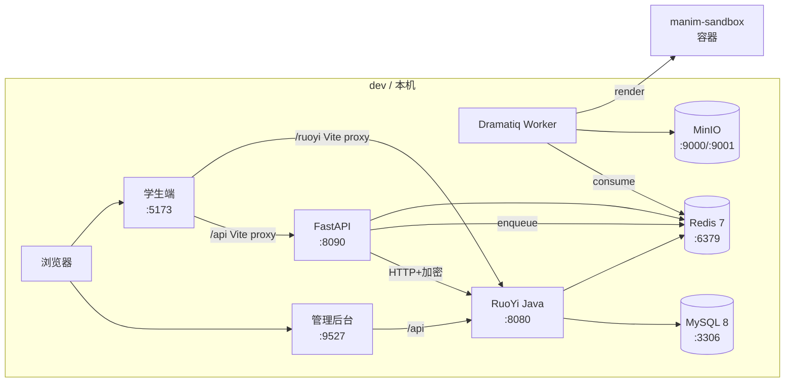
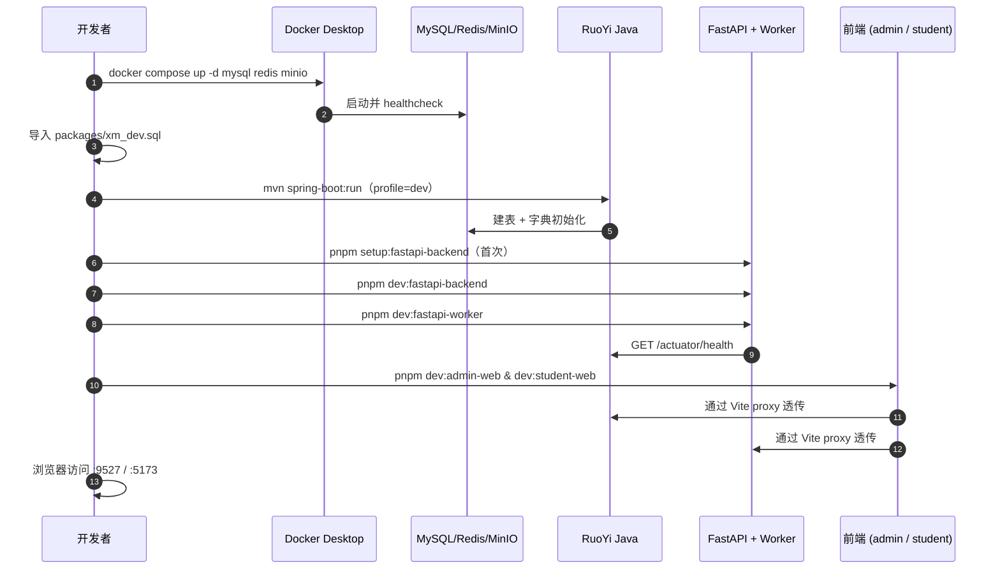

| 版本 | 日期 | 修订内容 | 作者 | 评审 |
|------|------|----------|------|------|
| v1.0.0 | 2026-04-25 | 文档初版（Runbook 重写） | environment-writer | team-lead |

## 1. 概述

本文档定义 Prorise AI Teach 仓库的**开发环境基线**：四级环境矩阵、强制工具版本、整体拓扑与一键启动序列。任何在本机或 CI 中跑代码、调接口、做联调的人都必须先按本篇校验环境，再阅读 0002~0004 的分模块 Runbook。

**目的**：让新开发者从零到首段视频跑通 ≤ 60 分钟。
**适用对象**：FastAPI 后端工程师 / RuoYi Java 工程师 / 前端工程师 / 测试 / 运维。

| 缩写 | 含义 |
|------|------|
| FE | 前端（Frontend），含管理后台 + 学生端 |
| BE | 后端，FastAPI + RuoYi 双栈 |
| DRX | Dramatiq worker（视频生成异步队列） |
| OSS | 对象存储（MinIO 本地 / 腾讯 COS 生产） |

## 2. 引用文件

- 内部：[0002-前端项目启动](./0002-前端项目启动.md) · [0003-后端项目启动](./0003-后端项目启动.md) · [0004-数据库与中间件](./0004-数据库与中间件.md)
- 内部：[../003-架构设计/0001-系统架构总览.md](../003-架构设计/0001-系统架构总览.md)
- 外部：`deploy/docker-compose.yml`、`packages/fastapi-backend/.env.example`、`pnpm-workspace.yaml`

## 3. 环境矩阵

| 维度 | dev（本机） | test（CI / 联调机） | staging（预发） | prod（生产） |
|------|-------------|---------------------|-----------------|--------------|
| 拓扑 | 进程级混合（pnpm + venv + Docker DB） | docker compose 全栈 | docker compose（独立网段） | docker compose + 1panel 反代 |
| FastAPI Reload | true | false | false | false |
| `FASTAPI_ENV` | development | test | staging | production |
| 数据库 | Docker mysql:8.0（本地端口 3306） | docker compose mysql:8.0 | 独立 mysql 实例 | 独立 mysql 实例（卷持久化） |
| Redis | Docker redis:7-alpine | docker compose redis:7-alpine | 独立 redis | 独立 redis（AOF + 密码） |
| OSS | 本地 MinIO `http://127.0.0.1:9000` | 本地 MinIO | 测试 COS bucket | 腾讯 COS prod bucket |
| LLM Provider | 各人 RuoYi 后台自配 | mock 或共享 key | 共享 staging key | 生产 key（RuoYi 加密存储） |
| 数据来源 | `packages/xm_dev.sql` 全量导入 | mysqldump 快照还原 | 上游同步 | 真实数据 |
| 端口范围 | 8080/8090/9527/5173/3306/6379/9000/9001 | 同 dev（容器内） | `HOST_*_PORT` 由 `.env.prod` 决定 | 反代后仅 80/443 |

> **决策依据见** `deploy/docker-compose.yml:1-50`：dev 出于热更新效率不进容器；prod 通过 `backend / edge / prorise-internal` 三网段隔离。

## 4. 强制工具版本

> 所有版本声明均**有据可查**：根 `package.json:4`、`packages/student-web/package.json:7`、`packages/fastapi-backend/pyproject.toml:9`、`deploy/docker-compose.yml`。

| 工具 | 版本要求 | 校验命令 | 期望输出 |
|------|----------|----------|----------|
| Node.js | `>=20.19.0` | `node -v` | `v20.19.x` 或更高 |
| pnpm | `>=10.5.0`（`packageManager` 锁定 10.5.0） | `pnpm -v` | `10.5.0` |
| Python | `>=3.11`（推荐 3.12） | `python3 --version` | `Python 3.11.x / 3.12.x` |
| Java | JDK 17（RuoYi-Plus 5.X 要求） | `java -version` | `openjdk version "17.x"` |
| Maven | 3.8+ | `mvn -v` | `Apache Maven 3.8+` |
| Docker | Engine 24+ + Compose v2 | `docker version && docker compose version` | `Engine 24.x` + `Compose v2.x` |
| Git | 2.40+ | `git --version` | `git version 2.40+` |
| MySQL Client | 8.x（命令行调试） | `mysql --version` | `Ver 8.0.x` |
| LaTeX (可选) | TeX Live 2023+（视频本地渲染） | `latex --version` | `pdfTeX 3.141592653` |

**一键校验脚本**（保存为 `scripts/check-env.sh` 自用）：

```bash
#!/usr/bin/env bash
set -e
echo "node:    $(node -v)"
echo "pnpm:    $(pnpm -v)"
echo "python:  $(python3 --version)"
echo "java:    $(java -version 2>&1 | head -1)"
echo "docker:  $(docker --version)"
echo "compose: $(docker compose version --short)"
```

## 5. 系统拓扑



图 5-1：dev 环境进程拓扑。生产拓扑见 [`../008-部署与运维/0001-部署架构.md`](../008-部署与运维/0001-部署架构.md)。

## 6. 启动序列



图 6-1：dev 一次完整启动顺序。任意上游未就绪，下游必报 502 或连接拒绝——**严格按序启动**。

## 7. 端口分配

| 端口 | 占用方 | 来源（file:line） |
|------|--------|-------------------|
| 8080 | RuoYi Java SpringBoot | `deploy/docker-compose.yml:230`、`packages/RuoYi-Vue-Plus-5.X/ruoyi-admin/src/main/resources/application.yml` |
| 8090 | FastAPI | `packages/fastapi-backend/.env.example:18`、`deploy/docker-compose.yml:250` |
| 9527 | 管理后台 Vite dev | `packages/ruoyi-plus-soybean/vite.config.ts`（`port: 9527`） |
| 9725 | 管理后台 Vite preview | 同上（`port: 9725`） |
| 5173 | 学生端 Vite dev | `packages/student-web/vite.config.ts`（`server.port: 5173`） |
| 4173 | 学生端 Vite preview | 同上 |
| 3306 | MySQL | `deploy/docker-compose.yml:42` |
| 6379 | Redis | `deploy/docker-compose.yml:67` |
| 9000 | MinIO API | `deploy/docker-compose.yml:103` |
| 9001 | MinIO Console | `deploy/docker-compose.yml:104` |
| 9191 | Dramatiq Prometheus（仅 staging/prod） | `packages/fastapi-backend/.env.example`（`FASTAPI_DRAMATIQ_PROMETHEUS_PORT`） |

> 端口冲突时**改宿主映射**，不要改容器内端口——容器内端口被代码硬编码（如 `FASTAPI_PORT=8090`、Java `server.port=8080`）。

## 8. 一键启动（dev）

```bash
# 1. 基础设施（首次执行 + 平时只在重启机器后执行）
cd deploy && docker compose up -d mysql redis minio && cd ..

# 2. 首次：装依赖
pnpm install                  # 全部 JS 工作区
pnpm setup:fastapi-backend    # 创建 .venv 并 pip install -e

# 3. 启动应用层（4 个进程，concurrently 一把梭）
pnpm dev:all                  # = student + fastapi + worker + admin
```

`pnpm dev:all` 定义见根 `package.json:43`，使用 `concurrently` 并行 4 进程，颜色区分日志。如要单独调试某个进程，参见 0002 / 0003。

## 9. 验证清单

每次启动完毕跑一次以下断言，**全绿才算环境就绪**：

| 检查项 | 命令 | 期望 |
|--------|------|------|
| MySQL 可连 | `docker exec xm-mysql mysqladmin ping -uroot -p$MYSQL_ROOT_PASSWORD` | `mysqld is alive` |
| Redis 可连 | `docker exec xm-redis redis-cli -a $REDIS_PASSWORD ping` | `PONG` |
| MinIO 健康 | `curl -fsS http://127.0.0.1:9000/minio/health/live` | `200` |
| RuoYi 启动 | `curl -fsS http://127.0.0.1:8080/` | HTML 或 `{"code":200}` |
| FastAPI 启动 | `curl -fsS http://127.0.0.1:8090/` | `{"code":200,"data":{"app":"...","version":"..."}}` |
| Worker 在线 | `pgrep -f "dramatiq app.worker" \| wc -l` | ≥ 1 |
| 管理后台 | 浏览器 `http://127.0.0.1:9527` | 登录页 |
| 学生端 | 浏览器 `http://127.0.0.1:5173` | 首页 |

## 10. 架构决策记录（ADR）

| 决策ID | 标题 | 状态 | 决策日期 | 背景 | 备选 | 最终决策 | 影响 |
|--------|------|------|----------|------|------|----------|------|
| ADR-005-001 | dev 不全 Docker 化 | Accepted | 2026-03-15 | 全容器化 reload 慢 + IDE 调试不便 | a) 全 Docker；b) 进程混合 | 选 b），DB 走 Docker、应用走 venv/pnpm | 启动复杂但热更新 < 1s |
| ADR-005-002 | pnpm workspace 而非 npm/yarn | Accepted | 2026-03-15 | 仓库 4 个包 + 嵌套 ruoyi-plus-soybean | a) yarn workspaces；b) pnpm | pnpm（disk-efficient + strict） | `pnpm-lock.yaml` 必须提交 |
| ADR-005-003 | Python 用 venv 而非 poetry/uv | Accepted | 2026-03-20 | 团队混用工具混乱 | a) poetry；b) uv；c) venv+pip | venv + `pip install -e` | 简单、低门槛，CI 可控 |

## 11. 常见错误 + 排查 FAQ

### Q1：`pnpm install` 报 `ERR_PNPM_UNSUPPORTED_ENGINE`

**原因**：Node 或 pnpm 版本低于 `engines` 要求（`>=20.19.0` / `>=10.5.0`）。
**排查**：`node -v && pnpm -v`。
**修复**：`corepack enable && corepack prepare pnpm@10.5.0 --activate`；Node 升级走 `nvm install 20`。

### Q2：`docker compose up` 报 `network prorise-internal not found`

**原因**：`deploy/docker-compose.yml:22` 声明 `prorise-internal` 是 external 网络，本机首次部署没建。
**修复**：`docker network create prorise-internal`。

### Q3：FastAPI 启动报 `pydantic_settings.SettingsError: ...env.example`

**原因**：`packages/fastapi-backend/.env.example` 是模板，**不会被自动加载**；本地需要 `.env.local` 或 `.env`。
**修复**：`cp packages/fastapi-backend/.env.example packages/fastapi-backend/.env.local` 并填值。

### Q4：端口 8090 被占用（macOS）

**原因**：上一次未清理的 uvicorn 进程，或 Lansweeper / 其他服务抢占。
**排查**：`lsof -nP -iTCP:8090 -sTCP:LISTEN`。
**修复**：`kill -9 <PID>` 或临时改 `FASTAPI_PORT=8091`，但前端代理目标也要同步。

### Q5：`pnpm dev:fastapi-worker` 报 `virtualenv is missing`

**原因**：未跑 `pnpm setup:fastapi-backend` 创建 `.venv`。
**修复**：在仓库根执行 `pnpm setup:fastapi-backend`，等装完再启动 worker。

### Q6：浏览器访问学生端 `5173` 接口全 404

**原因**：Vite proxy 没把 `/api` 转发到 FastAPI（FastAPI 没起来或端口不一致）。
**排查**：开 DevTools Network 看请求 URL；看 `packages/student-web/vite.config.*` 中的 `server.proxy`。
**修复**：先确认 `curl http://127.0.0.1:8090/` 通；再启动 student dev。

## 附录 A：术语对照

| 中文 | 英文 | 说明 |
|------|------|------|
| 管理后台 | Admin Console | 老师/管理员后台，基于 ruoyi-plus-soybean |
| 学生端 | Student Web | 学生面向的 React 应用，`packages/student-web` |
| 双后端 | Dual Backend | RuoYi（业务/权限）+ FastAPI（AI/视频） |
| 任务运行时 | Task Runtime | Dramatiq queue + worker 集群 |

## 附录 B：参考资料

- pnpm Workspaces：<https://pnpm.io/workspaces>
- FastAPI 0.115 文档：<https://fastapi.tiangolo.com/>
- Dramatiq：<https://dramatiq.io/>
- RuoYi-Vue-Plus 5.X：<https://gitee.com/dromara/RuoYi-Vue-Plus>
