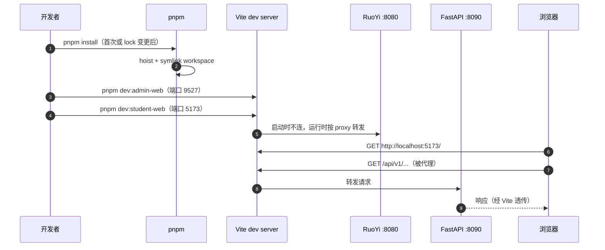

| 版本 | 日期 | 修订内容 | 作者 | 评审 |
|------|------|----------|------|------|
| v1.0.0 | 2026-04-25 | 文档初版（Runbook 重写，校正端口与路径） | environment-writer | team-lead |

## 1. 概述

本仓库前端**双栈并存**：

- **管理后台** `packages/ruoyi-plus-soybean`（pnpm workspace name `ruoyi-vue-plus`），Vue 3 + Vite + Naive UI / Soybean Admin，对接 RuoYi Java（`:8080`）。
- **学生端** `packages/student-web`（pnpm workspace name `@xiaomai/student-web`），React 19 + Vite + Tailwind + Radix UI，对接 FastAPI（`:8090`）+ RuoYi（透传）。

二者在**同一个 pnpm workspace**下并行启动，互不依赖；都通过 Vite dev server 的 proxy 转发到对应后端。

## 2. 引用文件

- 内部：[0001-开发环境总览](./0001-开发环境总览.md) · [0003-后端项目启动](./0003-后端项目启动.md)
- 内部：[../006-模块开发指南/0001-前端模块开发.md](../006-模块开发指南/0001-前端模块开发.md)
- 配置：根 `package.json:11-30`、`pnpm-workspace.yaml`、`packages/ruoyi-plus-soybean/vite.config.ts`、`packages/student-web/vite.config.ts`、各 `.env*`

## 3. 环境矩阵

| 维度 | dev | test（CI / preview） | staging | prod |
|------|-----|----------------------|---------|------|
| 启动方式 | `pnpm dev:admin-web` / `dev:student-web` | `pnpm build` + `pnpm preview` | docker compose `admin-fe` / `student-fe` | 同 staging（独立机） |
| 端口（admin） | 9527 | 9725（preview） | 80（容器内） | 80 → 1panel 反代 |
| 端口（student） | 5173 | 4173（preview） | 80（容器内） | 80 → 1panel 反代 |
| Vite mode | `dev` | `prod` | `prod` | `prod` |
| API 地址 | Vite proxy → 本地 :8080 / :8090 | 同 dev | 容器内 service name | 反代域名 |
| 加密透传 | `VITE_APP_ENCRYPT=Y` | 同 dev | 同 dev | 同 dev |

## 4. 工具版本

| 工具 | 要求 | 校验 |
|------|------|------|
| Node | ≥ 20.19.0（`engines.node`） | `node -v` |
| pnpm | 10.5.0（`packageManager` 锁定） | `pnpm -v` |
| Vite（管理后台） | 7.3.0 | `pnpm --filter ruoyi-vue-plus exec vite --version` |
| Vite（学生端） | 6.4.1 | `pnpm --filter @xiaomai/student-web exec vite --version` |
| Vue（管理后台） | 3.5.26 | `package.json` |
| React（学生端） | 19 | `package.json` |
| 浏览器 | Chrome 120+ / Edge 120+（开发） | DevTools |

## 5. 目录结构

```
packages/
├── ruoyi-plus-soybean/        # 管理后台（workspace name: ruoyi-vue-plus）
│   ├── src/                   #   主应用源码（Vue 3）
│   ├── build/                 #   Vite 插件与代理配置（被 vite.config.ts 引用）
│   ├── packages/              #   嵌套子包（被根 pnpm-workspace.yaml 第二行收录）
│   ├── public/                #   静态资源
│   ├── .env / .env.dev / .env.prod / .env.test
│   ├── vite.config.ts         # port: 9527 / preview: 9725
│   └── package.json           # scripts: dev / build / preview / typecheck / lint
└── student-web/               # 学生端（workspace name: @xiaomai/student-web）
    ├── src/
    ├── .env.example
    ├── vite.config.ts         # port: 5173 / preview: 4173
    └── package.json
```

> `pnpm-workspace.yaml` 显式收录两层：`packages/*` 与 `packages/ruoyi-plus-soybean/packages/*`，因此可以直接 `pnpm --filter <name>` 路由到任意子包。

## 6. 启动序列



图 6-1：双前端启动 + 请求代理时序。

## 7. 启动步骤

### 7.1 首次准备

```bash
# 仓库根目录
corepack enable
corepack prepare pnpm@10.5.0 --activate

pnpm install                       # 安装根 + 所有 workspace 依赖
```

`pnpm install` 输出末尾应有 `Done in <时间>`，无 `ERR_PNPM_*` 报错。`node_modules` 出现在根 + 各 package。

### 7.2 启动管理后台

```bash
# 在仓库根目录
pnpm dev:admin-web                 # 等价 pnpm --filter ruoyi-vue-plus dev
```

定义见根 `package.json:32`，等价于 `vite --mode dev`，加载 `packages/ruoyi-plus-soybean/.env` + `.env.dev`。

**期望输出**：

```
  VITE v7.x.x  ready in <ms>
  ➜  Local:   http://localhost:9527/
  ➜  Network: ...
```

浏览器打开 `http://localhost:9527/`，进入登录页（默认账号见 RuoYi 文档；初次登录后必须改密码）。

### 7.3 启动学生端

```bash
pnpm dev:student-web               # 等价 pnpm --filter @xiaomai/student-web dev
```

**期望输出**：

```
  VITE v7.x.x  ready in <ms>
  ➜  Local:   http://localhost:5173/
```

浏览器打开 `http://localhost:5173/`，进入学生端首页。

### 7.4 并行启动（推荐）

```bash
pnpm dev:all
```

定义见根 `package.json:43`：用 `concurrently` 一次拉起 student / fastapi / worker / admin 四个进程，颜色标签分别是 `blue / green / yellow / magenta`。

## 8. 环境变量

### 8.1 管理后台关键变量

参考 `packages/ruoyi-plus-soybean/.env.dev`：

| 变量 | 默认值 | 说明 |
|------|--------|------|
| `VITE_SERVICE_BASE_URL` | `http://localhost:8080` | RuoYi 后端基地址（仅 dev 直连） |
| `VITE_APP_BASE_API` | `/dev-api` | Vite proxy 前缀（运行时由 proxy 转发到 `VITE_SERVICE_BASE_URL`） |
| `VITE_APP_CLIENT_ID` | `e5cd7e489...` | OAuth client_id，与后端字典一致 |
| `VITE_APP_ENCRYPT` | `Y` | 是否启用接口加密（与后端 `FASTAPI_RUOYI_ENCRYPT_ENABLED` 必须一致） |
| `VITE_HEADER_FLAG` | `encrypt-key` | 加密头名称 |
| `VITE_APP_RSA_PUBLIC_KEY` | （示例值）| 客户端 RSA 公钥，与后端 `RUOYI_API_DECRYPT_PRIVATE_KEY` 配对 |

### 8.2 学生端关键变量

参考 `packages/student-web/.env.example`：

| 变量 | 默认值 | 说明 |
|------|--------|------|
| `VITE_RUOYI_BASE_URL` | （注释）`http://127.0.0.1:8080` | 仅在 Vite proxy 关闭或跨域直连时启用 |
| `VITE_FASTAPI_BASE_URL` | （注释）`http://127.0.0.1:8090` | 同上 |
| `VITE_APP_ENCRYPT` | `Y` | 加密总开关 |
| `VITE_APP_SSE` | `Y` | 启用 SSE（视频生成进度推送） |
| `VITE_APP_USE_MOCK` | `N` | 是否走 MSW 本地 mock |
| `VITE_APP_DEFAULT_LOCALE` | `zh-CN` | 默认语言 |

> **加密密钥必须与后端配套**：学生端 `VITE_APP_RSA_PUBLIC_KEY` ↔ 后端 `RUOYI_API_DECRYPT_PRIVATE_KEY`；任一替换则两端都换。

## 9. 常用命令

| 任务 | 管理后台 | 学生端 |
|------|----------|--------|
| 启动 dev | `pnpm dev:admin-web` | `pnpm dev:student-web` |
| 生产构建 | `pnpm build:admin-web` | `pnpm build:student-web` |
| 类型检查 | `pnpm typecheck:admin-web` | `pnpm typecheck:student-web` |
| Lint | `pnpm lint:admin-web` | `pnpm lint:student-web` |
| 单测 | （由各子包定义） | `pnpm test:student-web` |
| E2E | — | `pnpm test:student-web:e2e`（vitest browser） |
| 覆盖率 | — | `pnpm test:student-web:coverage` |
| 预览构建 | `pnpm --filter ruoyi-vue-plus preview` | `pnpm --filter @xiaomai/student-web preview` |

## 10. 验证清单

| # | 检查 | 命令 / 操作 | 期望 |
|---|------|-------------|------|
| 1 | 依赖装好 | `pnpm install` | `Done in ...` 无错 |
| 2 | 类型通过 | `pnpm typecheck:all` | 无 ts 错误 |
| 3 | 管理后台启动 | `pnpm dev:admin-web` | `http://localhost:9527/` 200 |
| 4 | 学生端启动 | `pnpm dev:student-web` | `http://localhost:5173/` 200 |
| 5 | 后台登录 | 浏览器 → 登录页 | 字典/菜单接口 200，登录成功 |
| 6 | 学生端登录 | 浏览器 → 学生端登录 | `/api/v1/auth/login` 200 |
| 7 | 加密正确 | DevTools Network 看请求体 | 请求体为加密 base64，响应能解密 |
| 8 | SSE 生效 | 触发视频生成 | EventStream 连接保持 |

## 11. 常见错误 + 排查 FAQ

### Q1：`pnpm install` 卡在 `Resolving …`

**原因**：npm registry 慢或被墙。
**修复**：
```bash
pnpm config set registry https://registry.npmmirror.com
pnpm config set strict-peer-dependencies false
pnpm install
```

### Q2：管理后台启动后 `EADDRINUSE 9527`

**原因**：上次 `pnpm dev:admin-web` 没退干净。
**排查**：`lsof -nP -iTCP:9527 -sTCP:LISTEN`。
**修复**：`kill -9 <PID>`；或临时改 `vite.config.ts` 的 `port` 字段。

### Q3：学生端登录 401，但密码正确

**原因**：加密开关与后端不一致。
**排查**：对比 `packages/student-web/.env*` 的 `VITE_APP_ENCRYPT` 与 `packages/fastapi-backend/.env*` 的 `FASTAPI_RUOYI_ENCRYPT_ENABLED`。
**修复**：两端必须**同 Y 同 N**；同时 RSA 公私钥要配对（参见 §8.2）。

### Q4：管理后台白屏，console 报 `Failed to fetch /dev-api/...`

**原因**：Vite proxy 没生效，或 RuoYi Java 没启动。
**排查**：
```bash
curl -fsS http://127.0.0.1:8080/        # RuoYi 是否在线
```
**修复**：先把 0003-后端启动跑通；确认 `VITE_SERVICE_BASE_URL=http://localhost:8080`。

### Q5：`pnpm --filter <name>` 找不到 package

**原因**：workspace 没收录或 name 不一致。
**排查**：
```bash
pnpm m ls --json | jq -r '.[].name'
```
**修复**：管理后台用 `ruoyi-vue-plus`（不是 `ruoyi-plus-soybean`），学生端用 `@xiaomai/student-web`。

### Q6：构建 `pnpm build:student-web` 报 `Out of memory`

**原因**：Vite + tsx + tailwind 内存峰值高。
**修复**：`NODE_OPTIONS=--max-old-space-size=4096 pnpm build:student-web`。

### Q7：浏览器一直预览旧版本

**原因**：Vite HMR 缓存或 Service Worker 卡住。
**修复**：
```bash
rm -rf packages/ruoyi-plus-soybean/node_modules/.vite
rm -rf packages/student-web/node_modules/.vite
```
浏览器 DevTools → Application → Service Workers → Unregister。

## 附录 A：术语对照

| 中文 | 英文 | 说明 |
|------|------|------|
| 管理后台 | Admin Console | `ruoyi-plus-soybean` 实例 |
| 学生端 | Student Web | `student-web`（React 19 + Tailwind） |
| 工作区 | pnpm Workspace | 由 `pnpm-workspace.yaml` 收录 |
| 接口加密 | API Encrypt | RSA + AES，header 标记 `encrypt-key` |

## 附录 B：参考资料

- pnpm Filtering：<https://pnpm.io/filtering>
- Vite proxy 配置：<https://vite.dev/config/server-options.html#server-proxy>
- Soybean Admin：<https://docs.soybeanjs.cn/>
- RuoYi-Plus-Soybean：<https://gitee.com/xlsea/ruoyi-plus-soybean>
