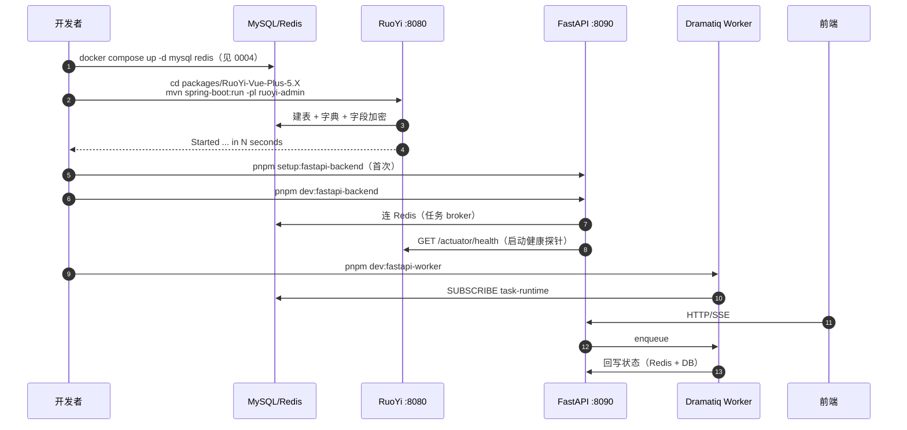

| 版本 | 日期 | 修订内容 | 作者 | 评审 |
|------|------|----------|------|------|
| v1.0.0 | 2026-04-25 | 文档初版（Runbook 重写，对齐 venv + dramatiq） | environment-writer | team-lead |

## 1. 概述

后端是**双栈双进程**：

- **RuoYi Java**（`packages/RuoYi-Vue-Plus-5.X`）：SpringBoot 3 + JDK 17，承担权限/字典/SAAS 多租户/业务表 CRUD，监听 `:8080`。
- **FastAPI**（`packages/fastapi-backend`）：Python 3.11+，承担 AI / 视频管道 / Provider 路由 / SSE，监听 `:8090`。
- **Dramatiq Worker**：FastAPI 同包，独立进程，消费 Redis 队列 `task-runtime` 跑视频/异步任务。

dev 环境下三者**各跑各的进程**，不进容器；中间件（MySQL / Redis / MinIO）由 Docker 提供（详见 0004）。

## 2. 引用文件

- 内部：[0001-开发环境总览](./0001-开发环境总览.md) · [0004-数据库与中间件](./0004-数据库与中间件.md)
- 内部：[../006-模块开发指南/0002-fastapi后端模块.md](../006-模块开发指南/0002-fastapi后端模块.md) · [../006-模块开发指南/0003-ruoyi-java模块.md](../006-模块开发指南/0003-ruoyi-java模块.md)
- 配置：`packages/fastapi-backend/pyproject.toml`、`packages/fastapi-backend/.env.example`、`packages/fastapi-backend/run_dev.py`、`packages/fastapi-backend/scripts/start-worker.sh`
- 配置：`packages/RuoYi-Vue-Plus-5.X/ruoyi-admin/src/main/resources/application*.yml`

## 3. 环境矩阵

| 维度 | dev | test | staging | prod |
|------|-----|------|---------|------|
| FastAPI 启动 | `pnpm dev:fastapi-backend`（uvicorn reload） | pytest 集成测试 | docker compose `fastapi` | 同 staging |
| Worker 启动 | `pnpm dev:fastapi-worker` | 由 fixture 拉起 | docker compose `fastapi-worker` | 同 staging |
| RuoYi 启动 | `mvn spring-boot:run` 或 IDE | mvn test | docker compose `ruoyi-java` | 同 staging |
| `FASTAPI_ENV` | development | test | staging | production |
| `FASTAPI_RELOAD` | true | false | false | false |
| `FASTAPI_LOG_LEVEL` | INFO（按需 DEBUG） | WARNING | INFO | INFO |
| Spring profile | dev | test | prod | prod |
| 数据库 | 本地 Docker MySQL | 内存 / 测试 schema | 独立实例 | 独立实例 |
| Provider 来源 | `FASTAPI_PROVIDER_RUNTIME_SOURCE=ruoyi`（RuoYi 后台配置） | mock | ruoyi | ruoyi |

## 4. 工具版本

| 工具 | 要求 | 来源 |
|------|------|------|
| Python | ≥ 3.11（推荐 3.12） | `packages/fastapi-backend/pyproject.toml:9` |
| pip | 24+ | 内置 |
| JDK | 17（LTS） | RuoYi-Plus 5.X 要求 |
| Maven | 3.8+ | RuoYi 项目根 `pom.xml` |
| Docker | 24+ Compose v2 | 跑中间件 |

## 5. 目录结构（FastAPI）

```
packages/fastapi-backend/
├── app/
│   ├── main.py                 # FastAPI app 实例
│   ├── core/config.py          # pydantic-settings (FASTAPI_ 前缀)
│   ├── api/                    # 路由层
│   ├── services/               # 业务编排
│   ├── infrastructure/         # 外部依赖封装
│   ├── worker.py               # Dramatiq actor 注册入口
│   └── ...
├── tests/                      # pytest 单元/集成/契约
├── scripts/start-worker.sh     # worker 启动脚本（处理旧进程 + 加载 settings）
├── run_dev.py                  # uvicorn 启动入口（读 settings.host/port/reload）
├── pyproject.toml
├── .env.example                # 完整可配置项参考
├── .env.local / .env / ...     # 实际加载（按 FASTAPI_ENV）
└── .venv/                      # 虚拟环境（gitignore）
```

## 6. 启动序列



图 6-1：dev 后端三进程启动序列。

## 7. FastAPI 启动步骤

### 7.1 首次准备 venv

```bash
# 仓库根
pnpm setup:fastapi-backend
```

定义见根 `package.json:6`，等价于：
```bash
python3 -m venv packages/fastapi-backend/.venv
packages/fastapi-backend/.venv/bin/python -m pip install --upgrade pip
packages/fastapi-backend/.venv/bin/pip install -e packages/fastapi-backend[dev]
```

> **铁律**：新增 `pyproject.toml` 依赖后必须重跑这条命令同步 `.venv`。单元测试通过不代表应用能启动（曾因 `Jinja2` 漏装翻车，参见 memory `feedback-jinja2-venv`）。

### 7.2 准备 `.env`

```bash
cp packages/fastapi-backend/.env.example packages/fastapi-backend/.env.local
# 编辑 .env.local，至少填：
#   FASTAPI_REDIS_URL
#   FASTAPI_RUOYI_BASE_URL
#   FASTAPI_RUOYI_ENCRYPT_PUBLIC_KEY / PRIVATE_KEY（与 RuoYi 字典一致）
```

`pydantic-settings` 加载顺序：`.env.defaults` → `.env.local` / `.env.<env>` → 进程环境变量。

### 7.3 启动 API

```bash
pnpm dev:fastapi-backend
# = packages/fastapi-backend/.venv/bin/python packages/fastapi-backend/run_dev.py
```

`run_dev.py` 内部读取 `Settings.host / port / reload`，调用 `uvicorn.run("app.main:app", ...)`，并把 `app/` 目录加入 reload 监听。

**期望输出**：

```
INFO:     Will watch for changes in these directories: ['.../packages/fastapi-backend/app']
INFO:     Uvicorn running on http://0.0.0.0:8090
INFO:     Application startup complete.
```

### 7.4 启动 Worker

```bash
pnpm dev:fastapi-worker
# = packages/fastapi-backend/scripts/start-worker.sh
```

脚本（`packages/fastapi-backend/scripts/start-worker.sh`）做三件事：
1. 校验 `.venv/bin/python` 存在；
2. 用 venv 内的 Python 读 `Settings`，导出 `WORKER_PROCESSES / WORKER_THREADS / PROMETHEUS_*`；
3. `pgrep -f "dramatiq app.worker"` 杀掉旧进程，`exec dramatiq app.worker -p N -t M` 起新的。

**期望输出**：

```
[Dramatiq] PID xxxx ... boot 1 process(es) and 2 thread(s) per process
```

### 7.5 一并启动（推荐）

```bash
pnpm dev:all   # student + fastapi + worker + admin
```

## 8. RuoYi Java 启动步骤

### 8.1 编译

```bash
cd packages/RuoYi-Vue-Plus-5.X
mvn clean install -DskipTests -T 4
```

首轮编译会拉一些 Dromara 依赖，配 Aliyun mirror 可加速：

```xml
<!-- ~/.m2/settings.xml -->
<mirror>
  <id>aliyun</id>
  <mirrorOf>central</mirrorOf>
  <url>https://maven.aliyun.com/repository/public</url>
</mirror>
```

### 8.2 启动 admin 模块

```bash
cd packages/RuoYi-Vue-Plus-5.X
mvn spring-boot:run -pl ruoyi-admin -Dspring-boot.run.profiles=dev
```

或 IDEA 直接 Run `RuoYiApplication`，VM Options 加 `-Dspring.profiles.active=dev`。

**期望输出**：末尾出现 `Started RuoYiApplication in <N> seconds`，`/actuator/health` 返回 `{"status":"UP"}`。

### 8.3 默认凭证

`packages/xm_dev.sql` 提供完整字典 + 测试账号；首次必登 ruoyi 后台改密码（见 [../004-开发规范/0001-编码规范.md](../004-开发规范/0001-编码规范.md) 强制规则）。

## 9. 关键 FastAPI 环境变量

参考 `packages/fastapi-backend/.env.example`：

| 变量 | 默认 | 必填 | 说明 |
|------|------|------|------|
| `FASTAPI_ENV` | development | ✓ | 运行环境枚举 |
| `FASTAPI_HOST` | 0.0.0.0 | | 监听地址 |
| `FASTAPI_PORT` | 8090 | | 监听端口 |
| `FASTAPI_RELOAD` | true | | dev 热更新 |
| `FASTAPI_LOG_LEVEL` | INFO | | DEBUG/INFO/WARN/ERROR |
| `FASTAPI_API_V1_PREFIX` | /api/v1 | | 接口前缀（前端必须一致） |
| `FASTAPI_REDIS_URL` | redis://localhost:6379/0 | ✓ | Dramatiq broker |
| `FASTAPI_DRAMATIQ_QUEUE_NAME` | task-runtime | | 队列名 |
| `FASTAPI_DRAMATIQ_WORKER_THREADS` | 2 | | worker 线程数 |
| `FASTAPI_DRAMATIQ_WORKER_PROCESSES` | 1 | | worker 进程数 |
| `FASTAPI_DRAMATIQ_TASK_TIME_LIMIT_MS` | 36000000 | | 单任务最大执行（毫秒，默认 10 小时；Manim 渲染长） |
| `FASTAPI_RUOYI_BASE_URL` | http://127.0.0.1:8080 | ✓ | 上游 RuoYi |
| `FASTAPI_RUOYI_ENCRYPT_ENABLED` | true | | 加密开关，与前端一致 |
| `FASTAPI_RUOYI_ENCRYPT_PUBLIC_KEY` | — | ✓（开启加密时） | 上游公钥 |
| `FASTAPI_RUOYI_ENCRYPT_PRIVATE_KEY` | — | ✓（开启加密时） | 本地私钥 |
| `FASTAPI_PROVIDER_RUNTIME_SOURCE` | ruoyi | | Provider 来源（ruoyi / mock） |

> **新增 Settings 字段必须同步 `.env.example` + 所有 `.env.<env>`**（零差集），否则部署会因缺字段崩溃（见 memory `feedback-env-file-sync`）。

## 10. 常用命令

| 任务 | 命令 |
|------|------|
| 跑全部测试 | `pnpm test:fastapi-backend` |
| 单元测试 | `pnpm test:fastapi-backend:unit` |
| API 契约 | `pnpm test:fastapi-backend:api` |
| 集成测试 | `pnpm test:fastapi-backend:integration` |
| 覆盖率 | `pnpm test:fastapi-backend:coverage` |
| CI 全套 | `pnpm test:fastapi-backend:ci` |
| 单跑某文件 | `packages/fastapi-backend/.venv/bin/python -m pytest packages/fastapi-backend/tests/<path> -v` |
| 重启 worker | 直接重跑 `pnpm dev:fastapi-worker`（脚本会 kill 旧进程） |
| RuoYi 单测 | `cd packages/RuoYi-Vue-Plus-5.X && mvn test -pl ruoyi-admin` |

## 11. 验证清单

| # | 检查 | 命令 | 期望 |
|---|------|------|------|
| 1 | venv 完整 | `packages/fastapi-backend/.venv/bin/python -c "import fastapi, dramatiq, openai"` | 无 ImportError |
| 2 | RuoYi 健康 | `curl -fsS http://127.0.0.1:8080/actuator/health` | `{"status":"UP"}` |
| 3 | FastAPI 启动 | `curl -fsS http://127.0.0.1:8090/` | `{"code":200,...}` |
| 4 | OpenAPI 可用 | 浏览器 `http://127.0.0.1:8090/docs` | Swagger UI |
| 5 | Worker 在线 | `pgrep -f "dramatiq app.worker"` | 有 PID |
| 6 | 任务可入队 | `redis-cli -a $REDIS_PASSWORD LLEN dramatiq:task-runtime` | 数字 |
| 7 | RuoYi 透传 | 学生端登录 → DevTools 看 `/api/v1/auth/login` | 200 |
| 8 | 数据库可写 | RuoYi 后台改字典 → 验证 MySQL 行变化 | 行更新 |

## 12. 常见错误 + 排查 FAQ

### Q1：`pnpm dev:fastapi-backend` 报 `ModuleNotFoundError: app`

**原因**：当前工作目录不是仓库根，或 `.venv` 没在 `packages/fastapi-backend/` 下。
**修复**：
```bash
cd <repo-root>
ls packages/fastapi-backend/.venv/bin/python   # 必须存在
pnpm setup:fastapi-backend                     # 重建
```

### Q2：FastAPI 启动报 `pydantic_core._pydantic_core.ValidationError: ... ruoyi_encrypt_public_key`

**原因**：`.env.local` 没填上加密公私钥，但 `FASTAPI_RUOYI_ENCRYPT_ENABLED=true`。
**修复**：要么把加密关了 (`FASTAPI_RUOYI_ENCRYPT_ENABLED=false`)，要么把 RuoYi 字典 `sys_config` 中 `sys.api.encrypt.publicKey/privateKey` 复制过来。两端密钥**必须同源**。

### Q3：Worker 启动后立刻退出，日志只一行 `boot 1 process(es)...`

**原因**：`app.worker` 模块导入时报错被吞了。
**排查**：
```bash
packages/fastapi-backend/.venv/bin/python -c "import app.worker"
```
**修复**：根据 ImportError 修复缺失依赖或循环引用。

### Q4：调用接口报 502，FastAPI 日志显示 `httpx.ConnectError: ... 127.0.0.1:8080`

**原因**：RuoYi Java 没启动 / 还在初始化。
**修复**：等 `Started RuoYiApplication` 输出再调；或先 `curl http://127.0.0.1:8080/actuator/health` 探活。

### Q5：Dramatiq 任务卡 `enqueued` 不执行

**原因**：worker 没起，或 worker 连的 Redis URL 与 API 不一致（典型：API 走 `localhost`，worker 走容器 hostname）。
**排查**：
```bash
redis-cli -a $REDIS_PASSWORD LLEN dramatiq:task-runtime    # 队列堆积
ps -ef | grep dramatiq                                       # worker 是否在线
```
**修复**：保证 API + Worker 加载同一份 `.env.local`。

### Q6：`mvn spring-boot:run` 报 `Failed to determine a suitable driver class`

**原因**：MySQL 没起 / 连接串错。
**修复**：先看 0004 把 MySQL 跑起来；检查 `application-dev.yml` 中 `spring.datasource.dynamic.datasource.master.url`。

### Q7：FastAPI 单测全过，但启动应用 `ImportError`

**原因**：`pyproject.toml` 加了新依赖但没重新 `pip install -e`（典型：Jinja2、partial-json-parser）。
**修复**：`pnpm setup:fastapi-backend` 重新执行（写入 memory 规范，参见 `feedback-jinja2-venv`）。

### Q8：worker 处理任务报 `OSError: [Errno 24] Too many open files`

**原因**：macOS 默认 ulimit 256 太低。
**修复**：`ulimit -n 4096` 后重启 worker；长期方案写入 shell rc。

## 附录 A：术语对照

| 中文 | 英文 | 说明 |
|------|------|------|
| 双后端 | Dual Backend | RuoYi（业务）+ FastAPI（AI） |
| 任务运行时 | Task Runtime | Dramatiq queue + worker |
| Provider 路由 | Provider Routing | LLM/TTS/STT 多供应商动态切换 |
| 加密透传 | Encrypted Pass-through | 学生端 → FastAPI → RuoYi 全链路加密 |

## 附录 B：参考资料

- FastAPI：<https://fastapi.tiangolo.com/>
- Dramatiq：<https://dramatiq.io/>
- pydantic-settings：<https://docs.pydantic.dev/latest/concepts/pydantic_settings/>
- RuoYi-Vue-Plus 5.X：<https://gitee.com/dromara/RuoYi-Vue-Plus>
- SpringBoot 3 Actuator：<https://docs.spring.io/spring-boot/docs/3.x/reference/html/actuator.html>
