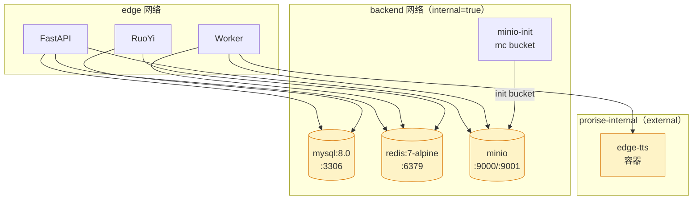
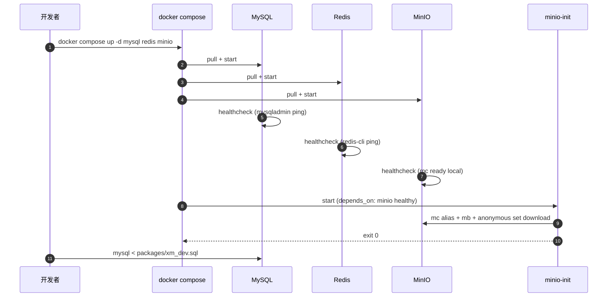

| 版本 | 日期 | 修订内容 | 作者 | 评审 |
|------|------|----------|------|------|
| v1.0.0 | 2026-04-25 | 文档初版（Runbook 重写，对齐实际 compose） | environment-writer | team-lead |

## 1. 概述

本仓库 dev / 生产共用同一份 `deploy/docker-compose.yml`，区别仅在 `.env` 与 profile：

- **MySQL 8.0**：业务表 + RuoYi 元数据 + 视频任务记录。
- **Redis 7-alpine**：会话缓存 + Dramatiq broker（队列 `task-runtime`）+ 短期 KV。
- **MinIO**（dev/staging）/ **腾讯 COS**（prod）：对象存储，承担视频成片 / 字幕 / 缩略图 / 用户上传图。
- **edge-tts**（外部容器，prod 复用）：TTS 服务，挂在 `prorise-internal` 网络。

dev 模式下中间件用 Docker 一把起，**应用进程在宿主直跑**——这条决策来自 `ADR-005-001`（见 0001 §10）。

## 2. 引用文件

- 内部：[0001-开发环境总览](./0001-开发环境总览.md) · [0003-后端项目启动](./0003-后端项目启动.md)
- 内部：[../008-部署与运维/0001-部署架构.md](../008-部署与运维/0001-部署架构.md)
- 配置：`deploy/docker-compose.yml`（350 行权威）、`deploy/sql/06-data-fixup.sql`、`packages/xm_dev.sql`、`packages/fastapi-backend/.env.example`

## 3. 环境矩阵

| 维度 | dev | test | staging | prod |
|------|-----|------|---------|------|
| MySQL 镜像 | `mysql:8.0` | 同 dev | 同 dev | 同 dev |
| Redis 镜像 | `redis:7-alpine` | 同 dev | 同 dev | 同 dev |
| MinIO | `minio/minio:RELEASE.2025-04-22T22-12-26Z` | 同 dev | 共享 staging bucket | 替换为腾讯 COS |
| 数据持久化 | named volume `mysql-data` 等 | 跑完销毁 | named volume + 备份 | named volume + RDB 快照 |
| 端口暴露 | 全部映射到宿主（3306/6379/9000） | 同 dev | 仅 MinIO 暴露 | MySQL/Redis 不暴露公网 |
| 加密 | 无 | 无 | TLS（外部反代） | TLS + 网段隔离 |
| 健康检查 | 全部启用 | 同 dev | 同 dev | 同 dev |
| 数据来源 | `packages/xm_dev.sql` | 同 dev | 上游 mysqldump 同步 | 真实业务数据 |

## 4. 拓扑



图 4-1：中间件分层与网络分区（见 `deploy/docker-compose.yml:14-23`）。dev 不开 `prorise-internal`；该网段为生产从 1panel 老服务复用 edge-tts 而设。

## 5. 启动序列



图 5-1：dev 中间件首次启动 + bucket 初始化时序。

## 6. 启动步骤

### 6.1 准备 `.env`

```bash
cd deploy
cp .env.example .env.dev   # 若不存在，参考下方模板创建
```

最小可用 `deploy/.env.dev`（dev）：

```ini
TZ=Asia/Shanghai

# MySQL
MYSQL_ROOT_PASSWORD=devroot123
MYSQL_DATABASE=ry-vue

# Redis
REDIS_PASSWORD=devredis123

# MinIO
MINIO_ROOT_USER=minioadmin
MINIO_ROOT_PASSWORD=minioadmin123
MINIO_DEFAULT_BUCKET=xm-dev

# 宿主端口
HOST_MYSQL_PORT=3306
HOST_REDIS_PORT=6379
HOST_MINIO_API_PORT=9000
HOST_MINIO_CONSOLE_PORT=9001
```

> **不要把 `.env.dev` 提交到仓库**，已在 `.gitignore` 屏蔽。

### 6.2 启动中间件

```bash
cd deploy
docker compose --env-file .env.dev up -d mysql redis minio
```

dev 不需要起 `ruoyi-*` / `fastapi*` / `*-fe`，应用层走 0002 / 0003。

### 6.3 等待健康

```bash
docker compose --env-file .env.dev ps
# 期望 STATE=running，HEALTH=healthy
```

`docker-compose.yml` 给所有基础服务都配了 healthcheck（`:60-90`、`:107-111`），不要省。

### 6.4 初始化 MinIO bucket

`minio-init` 服务（`:114-128`）会自动跑：
```sh
mc alias set local http://minio:9000 $MINIO_ROOT_USER $MINIO_ROOT_PASSWORD
mc mb --ignore-existing local/$MINIO_DEFAULT_BUCKET
mc anonymous set download local/$MINIO_DEFAULT_BUCKET
```

如果想手动重跑：

```bash
docker compose --env-file .env.dev up minio-init
```

### 6.5 导入数据

```bash
# 1. 主数据（含字典 / 菜单 / 测试账号）
docker exec -i xm-mysql mysql -uroot -p$MYSQL_ROOT_PASSWORD ry-vue \
  < packages/xm_dev.sql

# 2. 数据修正补丁（按需）
docker exec -i xm-mysql mysql -uroot -p$MYSQL_ROOT_PASSWORD ry-vue \
  < deploy/sql/06-data-fixup.sql
```

> 顺序固定：先 `xm_dev.sql` 再 `06-data-fixup.sql`，否则 fixup 找不到表。生产部署由 `deploy/scripts/deploy.sh` 串行处理，逻辑相同。

## 7. 配置参数详解

### 7.1 MySQL

参考 `deploy/docker-compose.yml:42-65`：

| 参数 | 类型 | 默认 | 必填 | 说明 |
|------|------|------|------|------|
| `MYSQL_ROOT_PASSWORD` | string | — | ✓ | root 密码 |
| `MYSQL_DATABASE` | string | `ry-vue` | ✓ | 默认建库名 |
| `--character-set-server` | flag | `utf8mb4` | | 字符集 |
| `--collation-server` | flag | `utf8mb4_unicode_ci` | | 排序规则（**不要用 _general_ci**，emoji/zh 混排会撞排序） |
| `--max_allowed_packet` | flag | `128M` | | 应对 RuoYi 大 BLOB |
| `--innodb_buffer_pool_size` | flag | `512M` | | dev 够用，prod 视内存调整 |

### 7.2 Redis

参考 `:67-90`：

| 参数 | 默认 | 说明 |
|------|------|------|
| `REDIS_PASSWORD` | — | 必填，应用 + worker 都必须用同一份 |
| `--appendonly yes` | 启用 | AOF 持久化 |
| `--maxmemory` | `512mb` | dev；prod 视情况上调 |
| `--maxmemory-policy` | `allkeys-lru` | 满了淘汰最久未用 |

### 7.3 MinIO

参考 `:92-128`：

| 参数 | 默认 | 说明 |
|------|------|------|
| `MINIO_ROOT_USER` / `_PASSWORD` | — | 控制台账号 |
| `--console-address ":9001"` | | 控制台端口 |
| `MINIO_DEFAULT_BUCKET` | `xm-dev` | `minio-init` 自动创建 |
| `mc anonymous set download` | | bucket 内对象匿名可读（视频/缩略图分发用） |

## 8. 验证清单

| # | 检查 | 命令 | 期望 |
|---|------|------|------|
| 1 | MySQL 在线 | `docker exec xm-mysql mysqladmin ping -uroot -p$MYSQL_ROOT_PASSWORD` | `mysqld is alive` |
| 2 | 表已建 | `docker exec xm-mysql mysql -uroot -p$MYSQL_ROOT_PASSWORD ry-vue -e "SHOW TABLES" \| wc -l` | ≥ 100 |
| 3 | 字典数据 | `... -e "SELECT COUNT(*) FROM sys_dict_data"` | > 0 |
| 4 | Redis 在线 | `docker exec xm-redis redis-cli -a $REDIS_PASSWORD ping` | `PONG` |
| 5 | Redis AOF | `docker exec xm-redis redis-cli -a $REDIS_PASSWORD CONFIG GET appendonly` | `yes` |
| 6 | MinIO API | `curl -fsS http://127.0.0.1:9000/minio/health/live` | 200 |
| 7 | MinIO Console | 浏览器 `http://127.0.0.1:9001` | 登录页 |
| 8 | bucket 存在 | `docker run --rm --network deploy_backend minio/mc \| ...`（或 Console 看） | `xm-dev` 在列表 |
| 9 | Dramatiq 队列空 | `docker exec xm-redis redis-cli -a $REDIS_PASSWORD KEYS "dramatiq:*"` | 启动后才有 |

## 9. 备份与恢复

### 9.1 MySQL

```bash
# 备份
docker exec xm-mysql mysqldump -uroot -p$MYSQL_ROOT_PASSWORD \
  --single-transaction --routines --triggers ry-vue \
  > backup-$(date +%F).sql

# 恢复（先 down 应用层再灌）
docker exec -i xm-mysql mysql -uroot -p$MYSQL_ROOT_PASSWORD ry-vue \
  < backup-2026-04-25.sql
```

### 9.2 Redis

```bash
docker exec xm-redis redis-cli -a $REDIS_PASSWORD BGSAVE
docker cp xm-redis:/data/dump.rdb ./redis-backup-$(date +%F).rdb
```

### 9.3 MinIO

```bash
mc alias set local http://127.0.0.1:9000 $MINIO_ROOT_USER $MINIO_ROOT_PASSWORD
mc mirror local/xm-dev ./minio-backup-$(date +%F)/
```

## 10. 常见错误 + 排查 FAQ

### Q1：`docker compose up` 报 `network deploy_prorise-internal not found`

**原因**：`deploy/docker-compose.yml:22` 把 `prorise-internal` 声明为 `external: true`，本机没建这个网络。
**修复**：
```bash
docker network create prorise-internal
```
（dev 即使不用 edge-tts 也得有这张网，因为 `fastapi-worker` 服务把它列在 networks 里。）

### Q2：MySQL 容器一直 `unhealthy`，日志 `Access denied for user 'root'@'localhost'`

**原因**：之前用过另一份密码的 `mysql-data` volume 没清理，新密码连不上旧数据。
**修复**：
```bash
docker compose --env-file .env.dev down
docker volume rm deploy_mysql-data    # 警告：会清空数据
docker compose --env-file .env.dev up -d mysql
```
**长期方案**：换密码必须 reset volume，或用 ALTER USER 改密码。

### Q3：导入 `xm_dev.sql` 报 `Unknown collation: 'utf8mb4_0900_ai_ci'`

**原因**：MySQL 客户端 < 8.0，无法识别 8.0 默认排序规则。
**修复**：用容器内的 `mysql` 客户端导入（如 §6.5 的 `docker exec`）；或本地装 mysql-client 8.x。

### Q4：Redis `redis-cli` 连接报 `NOAUTH Authentication required`

**原因**：`.env.dev` 改了 `REDIS_PASSWORD` 但没传给 `redis-cli`。
**修复**：`redis-cli -a $REDIS_PASSWORD ping`，或先 `export REDIS_PASSWORD=...`。

### Q5：MinIO Console 登录失败

**原因**：`MINIO_ROOT_USER / MINIO_ROOT_PASSWORD` 改过但 volume 还是旧值——MinIO 启动时只在**空目录**才采用环境变量。
**修复**：清 volume 重建，或进容器 `mc admin user add`。

### Q6：FastAPI / Worker 报 `redis.exceptions.ConnectionError: Error 111 connecting`

**原因**：应用 `.env.local` 写的 `redis://localhost:6379`，但应用跑在容器中（应该用 service name `redis`）。
**排查**：确认应用是 dev 进程模式（连 `localhost`）还是容器模式（连 `redis`）。
**修复**：dev 走宿主用 `localhost:6379`；容器化部署改 `FASTAPI_REDIS_URL=redis://:${REDIS_PASSWORD}@redis:6379/0`。

### Q7：磁盘报警，MinIO 占用过大

**原因**：视频成品 + 中间帧没清理。
**修复**：
```bash
mc alias set local http://127.0.0.1:9000 $MINIO_ROOT_USER $MINIO_ROOT_PASSWORD
mc rm --recursive --force local/xm-dev/CASES/   # 清中间产物
```
或在 RuoYi 后台跑「视频归档清理」任务。

### Q8：MySQL 启动报 `[ERROR] [MY-010119] [Server] Aborting`

**原因**：内存不足（`innodb_buffer_pool_size=512M` + 容器 limit 不够）。
**修复**：调小 buffer pool（dev 可降到 `256M`），或给 Docker Desktop 多分配内存。

## 附录 A：术语对照

| 中文 | 英文 | 说明 |
|------|------|------|
| 数据卷 | Named Volume | Docker 管理的持久化存储 |
| 健康检查 | Healthcheck | compose 内置 liveness 检查 |
| 桶 | Bucket | MinIO/COS 对象命名空间 |
| AOF | Append-Only File | Redis 持久化机制 |
| 排序规则 | Collation | 字符串比较规则 |

## 附录 B：参考资料

- MySQL 8.0 Reference：<https://dev.mysql.com/doc/refman/8.0/en/>
- Redis 7 Configuration：<https://redis.io/docs/management/config/>
- MinIO Server：<https://min.io/docs/minio/container/index.html>
- Docker Compose 健康检查：<https://docs.docker.com/compose/compose-file/05-services/#healthcheck>
- RuoYi-Plus DDL：`packages/RuoYi-Vue-Plus-5.X/script/sql/ry_vue_5.X.sql`
