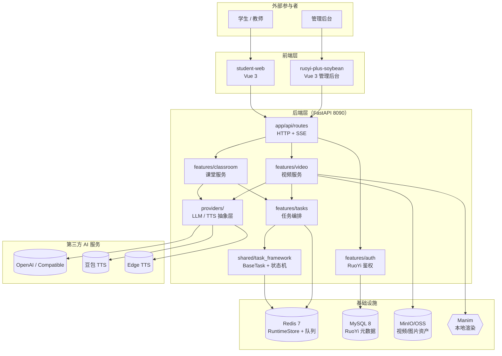
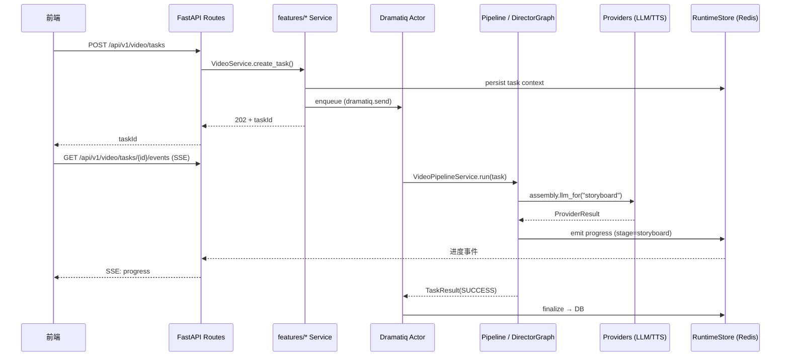

# 模块总览与依赖关系

| 版本 | 日期 | 修订内容 | 作者 | 评审 |
|------|------|----------|------|------|
| v1.0.0 | 2026-04-25 | 文档初版 — 落地 arc42 §5 Building Block | 研发团队 | 架构组 |

## 1. 概述

本章按 arc42 §5 Building Block 视图，统一描述 FastAPI Backend 内部各业务模块的边界、职责、依赖与运行时调用关系。所有「具体模块详情」由 0002~0006 单独展开，本文档只回答三个问题：

1. **系统切成了哪些「构建块」？** —— 模块划分。
2. **它们如何协作？** —— 依赖与调用方向。
3. **谁拥有谁的入口？** —— 责任 & 接口归属。

阅读对象：研发新人、架构评审、跨模块联调负责人。

### 术语缩写

| 术语 | 含义 |
|------|------|
| Provider | LLM / TTS 抽象层（`app/providers/`），承担多厂商失败转移 |
| Pipeline | 视频生成流水线（10 阶段），位于 `app/features/video/pipeline/` |
| Director Graph | 课堂多 Agent 调度图，基于 LangGraph |
| BaseTask | 异步任务基类（`app/shared/task_framework/base.py`） |
| Runtime Store | Redis 任务状态存储（`app/infra/redis_client.py`） |

## 2. 引用文件

- 内部：[../003-架构设计/0001-系统架构总览.md](../003-架构设计/0001-系统架构总览.md)、[./0002-课堂服务模块.md](./0002-课堂服务模块.md)、[./0003-视频服务模块.md](./0003-视频服务模块.md)、[./0004-AI-LLM集成.md](./0004-AI-LLM集成.md)、[./0005-TTS语音合成.md](./0005-TTS语音合成.md)、[./0006-Manim动画引擎.md](./0006-Manim动画引擎.md)
- 外部：arc42 v8.2 §5、ISO/IEC/IEEE 42010:2022（架构描述）、C4 Model（Simon Brown）

## 3. 顶层 C4 Container 视图

> **图 3-1：** FastAPI Backend 顶层 C4 Container 视图。前端两套（学生端 + 管理后台）共享同一组 `/api/v1` 路由；所有 AI 调用统一走 `app/providers/`，业务模块从不直接 import 厂商 SDK。

## 4. 模块清单与职责

| 模块路径 | 职责 | 关键入口 file:line |
|----------|------|-------------------|
| `app/features/classroom/` | 课堂会话、Director 多 Agent 编排、PDF 检索、SSE 流式对话 | `routes.py:48`、`orchestration/director_graph.py:384` |
| `app/features/video/` | 视频任务全生命周期：创建 / 预处理 / 流水线 / 取消 / 删除 / 发布 | `routes.py:74`、`tasks/video_task_actor.py:24` |
| `app/providers/` | LLM/TTS 抽象层 + 注册表 + Failover + Health 探测 | `factory.py:36`、`registry.py:33` |
| `app/features/video/pipeline/` | Code2Video 10 阶段流水线 + Manim 渲染 | `orchestration/orchestrator.py:313`、`engine/agent.py:99` |
| `app/shared/task_framework/` | `BaseTask`、`TaskContext`、状态机、错误码 | `base.py`、`status.py` |
| `app/features/tasks/` | Dramatiq 任务消费者、SSE 进度通道 | `app/worker.py:85`（actor 注册） |
| `app/features/auth/` | 与 RuoYi-Plus 后端的 token 透传 + 用户解析 | `runtime_auth.py` |
| `app/infra/` | Redis、HTTP 客户端、OSS 工厂等基础设施 | `redis_client.py` |

## 5. 模块依赖矩阵

> 表中行 = 调用方，列 = 被调用方；`✔` 表示存在直接 import / 函数调用；`SSE` 表示通过事件流耦合；`—` 表示无依赖。

| 调用方 \ 被调用方 | classroom | video | providers | task_framework | tasks(actor) | auth | infra |
|-------------------|:---------:|:-----:|:---------:|:--------------:|:------------:|:----:|:-----:|
| **classroom**     | —         | —     | ✔         | ✔              | ✔            | ✔    | ✔     |
| **video**         | —         | —     | ✔         | ✔              | ✔            | ✔    | ✔     |
| **providers**     | —         | —     | —         | ✔ (errcode)    | —            | —    | ✔     |
| **task_framework**| —         | —     | —         | —              | —            | —    | ✔     |
| **tasks (actor)** | ✔ (SSE)   | ✔     | —         | ✔              | —            | —    | ✔     |
| **auth**          | —         | —     | —         | —              | —            | —    | ✔     |
| **infra**         | —         | —     | —         | —              | —            | —    | —     |

> **图 5-1：模块依赖矩阵**。`providers` 是「下游叶子」——任何业务模块都可调它，但它绝不反向 import 业务模块；`task_framework` 同理。这条分层规则是模块边界的硬约束（违反将导致循环 import 与测试不可隔离）。

## 6. 运行时关键调用链

> **图 6-1：** 视频任务从 HTTP 入口到 Pipeline 的调用链。课堂会话调用链结构相同，仅把 `Pipeline` 换成 `DirectorGraph`。

## 7. 共享内核

所有 `features/*` 模块共享以下内核组件，**禁止**业务模块各自重写：

| 组件 | 文件 | 职责 |
|------|------|------|
| `BaseTask` | `app/shared/task_framework/base.py` | `prepare()` / `run()` / `finalize()` / `handle_error()` 生命周期 |
| `TaskContext` | `app/shared/task_framework/context.py` | task_id / user_id / metadata 不变量载体 |
| `TaskErrorCode` | `app/shared/task_framework/status.py` | 全局错误码（`coerce_task_error_code` 在 `app/providers/failover.py:24` 引用） |
| `RuntimeStore` | `app/infra/redis_client.py` | Redis 任务状态读写、SSE 事件总线 |
| `ProviderFactory` | `app/providers/factory.py:36` | LLM/TTS 实例装配的唯一入口 |

## 8. 扩展点（开放给业务模块）

| 扩展点 | 文件 | 用途 |
|--------|------|------|
| `ProviderRegistry.register()` | `app/providers/registry.py:64` | 注册新厂商 LLM/TTS 实现（`vendor-{id}` 命名） |
| `BaseTask` 子类 | `app/features/*/tasks/*.py` | 新业务任务（须实现 prepare/run/finalize） |
| `@router.get/post` | `app/features/*/routes*.py` | 新 HTTP/SSE 端点 |
| Code2Video Stage 钩子 | `pipeline/orchestration/orchestrator.py:125` `_C2V_STAGE_MAP` | 新增 / 重排流水线阶段 |

## 9. 已知陷阱（跨模块）

1. **不要在 routes 里直接调 Provider** —— 必须经 `Service → Pipeline / Graph → Provider` 路径，否则 SSE 进度无法广播。
2. **TaskContext 必须先 persist 到 RuntimeStore，再 enqueue actor** —— 顺序颠倒会出现 actor 先于 context 启动而 404 的竞态（参考 `app/features/video/service/create_task.py`）。
3. **Provider 实例不要跨任务复用** —— `ProviderFactory.clone()`（`app/providers/factory.py:48`）显式复制注册表用于请求级隔离；直接 `lru_cache` 实例会导致超时配置串扰。
4. **Pipeline 抛 `VideoPipelineError`，业务路由不要再二次包装** —— 错误码已经映射好（`app/features/video/pipeline/errors.py`）。

## 10. 引用代码与文件清单

- `app/features/classroom/routes.py:48` — `get_classroom_service` DI 入口
- `app/features/classroom/orchestration/director_graph.py:384` — `DirectorGraph.run`
- `app/features/video/routes.py:74` — `get_video_service` DI
- `app/features/video/tasks/video_task_actor.py:24` — `VideoTask` 全生命周期
- `app/features/video/pipeline/orchestration/orchestrator.py:313` — `VideoPipelineService`
- `app/providers/factory.py:36` — `ProviderFactory`（统一装配入口）
- `app/providers/registry.py:33` — `ProviderRegistry`（注册表 + 别名解析）
- `app/providers/failover.py:30` — `RETRYABLE_ERROR_CODES` + 失败转移
- `app/shared/task_framework/base.py` — `BaseTask`
- `app/worker.py:85` — Dramatiq actor 注册入口

## 附录 A：术语对照

| 术语 | 英文 | 解释 |
|------|------|------|
| 构建块 | Building Block | arc42 §5 中的最小可独立部署/测试单元 |
| 失败转移 | Failover | Provider 链中前者失败时按优先级切换到下一个 |
| 健康存储 | Health Store | Redis 中的 Provider 健康快照 |

## 附录 B：参考资料

- arc42 Template — <https://docs.arc42.org/section-5/>
- C4 Model — <https://c4model.com/>
- Code2Video（参考实现） — manim-to-video-claw scenext
