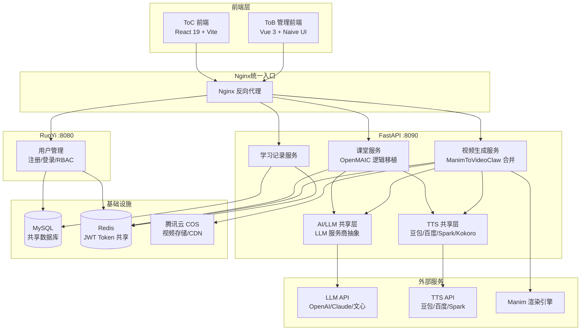

# 模块总览与依赖关系

> **状态**: 草稿
> **负责人**: [待指定]
> **最后更新**: 2026-03-24

---

## 模块列表

| 模块 | 职责 | 技术栈 | 负责人 | PRD 编号 |
|------|------|--------|--------|----------|
| **课堂服务** | OpenMAIC 核心功能移植：主题生成课堂、4 种 Agent 风格、幻灯片生成、交互式测验、多 Agent 讨论、SSE 进度推送、白板布局管理 | FastAPI + LangGraph | 待指定 | FR-CS-001 ~ FR-CS-007 |
| **视频生成服务** | ManimToVideoClaw 合并：题目理解、分镜生成、Manim 代码生成与自修复、渲染、视频合成、COS 上传、OCR 图片识别 | Python + Manim + FFmpeg | 待指定 | FR-VS-001 ~ FR-VS-009 |
| **AI/LLM 共享层** | LLM 服务商抽象（OpenAI/Claude/文心）、Provider 缓存策略、Prompt 模板管理 | FastAPI + LangGraph | 待指定 | 共享层（跨模块） |
| **TTS 语音合成** | 多服务商 TTS 抽象工厂：豆包/百度/Spark/Kokoro，自动故障切换 | Python（抽象工厂模式） | 待指定 | FR-VS-006 |
| **用户管理** | 注册/登录、JWT Token 认证（共享 Redis）、个人资料管理、RBAC 权限控制 | RuoYi API 对接（Java Spring Boot） | 待指定 | FR-UM-001 ~ FR-UM-004 |
| **ToC 前端** | 首页双入口、课堂页面、视频生成页、播放器页、个人中心、i18n 国际化 | React 19 + Vite + TypeScript + Shadcn/ui | 待指定 | FR-UI-001 ~ FR-UI-006 |
| **视频播放器** | 视频播放、倍速控制、进度拖拽、全屏切换 | Video.js / ReactPlayer（前端组件） | 待指定 | FR-VP-001 ~ FR-VP-004 |
| **学习记录** | 生成历史记录、收藏管理、删除记录 | FastAPI + MySQL（复用 RuoYi 数据库） | 待指定 | FR-LR-001 ~ FR-LR-003 |
| **管理后台后端** | ToB 用户管理、RBAC 权限、系统配置（赛后扩展） | Java Spring Boot（RuoYi-Vue-Plus-5.X） | 待指定 | 已有，不修改 |
| **管理后台前端** | ToB 管理端界面（赛后扩展） | Vue 3 + Naive UI（ruoyi-plus-soybean） | 待指定 | 已有，不修改 |

### 模块与目录映射

| 模块 | 代码目录 | 状态 |
|------|----------|------|
| 课堂服务 | `packages/fastapi-backend/` (课堂模块) | 🚧 建设中 |
| 视频生成服务 | `packages/fastapi-backend/` (视频模块) | 🚧 建设中 |
| AI/LLM 共享层 | `packages/fastapi-backend/` (共享层) | 🚧 建设中 |
| TTS 语音合成 | `packages/fastapi-backend/` (共享层) | 📚 待迁移 |
| 用户管理 | `packages/RuoYi-Vue-Plus-5.X/` (API 对接) | ✅ 已有 |
| ToC 前端 | `packages/user/` | 📋 待建 |
| 管理后台后端 | `packages/RuoYi-Vue-Plus-5.X/` | ✅ 已有 |
| 管理后台前端 | `packages/ruoyi-plus-soybean-master/` | ✅ 已有 |

---

## 模块依赖图



---

## 接口边界

### 课堂服务（FR-CS）

| 方向 | 接口 | 协议 | 说明 |
|------|------|------|------|
| **输入** | `POST /api/classroom/generate` | HTTP + SSE | 接收主题文本 + Agent 风格，流式返回课堂内容 |
| **输入** | `POST /api/classroom/chat` | HTTP + SSE | 接收用户消息，多 Agent 讨论流式传输 |
| **输出** | 课堂 JSON（幻灯片、测验、对话记录） | JSON | 返回结构化课堂数据 |
| **依赖** | AI/LLM 共享层 | 内部调用 | LangGraph 编排调用 LLM |
| **依赖** | TTS 共享层 | 内部调用 | Agent 语音合成 |
| **依赖** | Redis | JWT 验证 | 共享 Token 认证 |

### 视频生成服务（FR-VS）

| 方向 | 接口 | 协议 | 说明 |
|------|------|------|------|
| **输入** | `POST /api/video/generate` | HTTP | 接收题目文本/图片，触发视频生成流水线 |
| **输入** | `GET /api/video/status/{task_id}` | HTTP / SSE | 查询生成进度 |
| **输出** | 视频 CDN URL | JSON | 返回腾讯云 COS 可访问地址 |
| **内部流水线** | 题目理解 → 分镜生成 → Manim 代码生成 → 渲染 → TTS → 合成 → 上传 | 内部 | LangGraph 编排 |
| **依赖** | AI/LLM 共享层 | 内部调用 | 题目理解、分镜、代码生成 |
| **依赖** | TTS 共享层 | 内部调用 | 旁白语音合成 |
| **依赖** | Manim 渲染引擎 | 子进程调用 | 执行 Manim Python 代码 |
| **依赖** | 腾讯云 COS | HTTP SDK | 视频文件上传 |

### AI/LLM 共享层

| 方向 | 接口 | 协议 | 说明 |
|------|------|------|------|
| **输入** | 内部 Python API | 函数调用 | 课堂服务和视频服务调用 |
| **输出** | LLM 生成结果（文本/JSON） | 函数返回 | 统一返回格式 |
| **外部依赖** | OpenAI / Claude / 文心 API | HTTPS | 抽象工厂模式，可插拔切换 |

### TTS 语音合成共享层

| 方向 | 接口 | 协议 | 说明 |
|------|------|------|------|
| **输入** | 内部 Python API | 函数调用 | 接收文本 + 语音风格参数 |
| **输出** | 音频文件（MP3/WAV） | 文件流 | 采样率 >= 16kHz |
| **外部依赖** | 豆包/百度/Spark/Kokoro TTS API | HTTPS | 主备自动切换 |

### 用户管理（RuoYi 对接）

| 方向 | 接口 | 协议 | 说明 |
|------|------|------|------|
| **输入** | RuoYi 标准 API（注册/登录/资料） | HTTP | ToC 前端直接调用 RuoYi :8080 |
| **输出** | JWT Token | JSON | 写入共享 Redis |
| **共享** | Redis JWT Token | Redis 读取 | FastAPI 侧验证 Token 无需 HTTP 调用 |
| **共享** | MySQL 用户表 | SQL 只读 | FastAPI 只读用户数据 |

### ToC 前端

| 方向 | 接口 | 协议 | 说明 |
|------|------|------|------|
| **输出** | 调用课堂服务 API | HTTP + SSE | 课堂生成与互动 |
| **输出** | 调用视频服务 API | HTTP + SSE | 视频生成与状态查询 |
| **输出** | 调用 RuoYi 用户 API | HTTP | 注册/登录/资料管理 |
| **输出** | 调用学习记录 API | HTTP | 历史/收藏管理 |

---

## 开发优先级

### M1：技术验证（第 1 周）

> 核心目标：双模块 Demo 跑通

| 优先级 | 模块 | 任务 | 验证目标 |
|--------|------|------|----------|
| **P0** | 视频生成服务 | Manim 渲染 + TTS + 视频合成端到端跑通 | 输入题目文本 → 输出可播放 MP4 |
| **P0** | AI/LLM 共享层 | LLM Provider 抽象 + 基本调用 | 至少 1 个 LLM 可用 |
| **P0** | 课堂服务 | LangGraph 编排基础框架 + 课堂生成原型 | 输入主题 → 输出课堂 JSON |
| **P1** | TTS 共享层 | 至少 1 个 TTS 服务商集成 | 文本 → 音频文件 |

### M2：MVP 开发（第 2-4 周）

| 优先级 | 模块 | 任务 |
|--------|------|------|
| **P0** | 课堂服务 | 完整 OpenMAIC 功能移植（幻灯片、测验、多 Agent 讨论） |
| **P0** | 视频生成服务 | 完整流水线（OCR、分镜、代码自修复、COS 上传） |
| **P0** | ToC 前端 | 首页双入口 + 课堂页面 + 视频生成页 + 播放器页 |
| **P0** | 用户管理 | JWT 共享 Redis 认证对接 |
| **P1** | 视频播放器 | 播放/倍速/进度/全屏 |
| **P1** | 学习记录 | 历史记录 + 收藏管理 |
| **P2** | ToC 前端 | 个人中心 + i18n 国际化 |

### M3：测试上线（第 5 周）

| 优先级 | 模块 | 任务 |
|--------|------|------|
| **P0** | 全模块 | E2E 测试、性能优化、Bug 修复 |
| **P0** | 基础设施 | Nginx 配置、腾讯云 COS 部署、域名配置 |
| **P1** | 管理后台 | RuoYi 后台基础配置（赛后扩展） |

### M4：赛事提交（4 月 25 日）

| 优先级 | 模块 | 任务 |
|--------|------|------|
| **P0** | 全平台 | 演示视频制作 + 答辩 PPT |
| **P0** | 全模块 | 稳定性保障、零故障演示 |

### 依赖关系链

```
AI/LLM 共享层 ──→ 课堂服务 ──→ ToC 前端
      │                              ↑
      ├──→ TTS 共享层 ──→ 视频生成服务 ─┘
      │                       │
      │                       ├──→ Manim 渲染引擎
      │                       └──→ 腾讯云 COS
      │
RuoYi 用户管理 ──→ Redis JWT 共享 ──→ FastAPI 认证中间件
```

> **关键路径**：AI/LLM 共享层 → 视频生成服务 → ToC 前端。M1 阶段必须优先验证视频生成和 AI 集成的端到端可行性。
