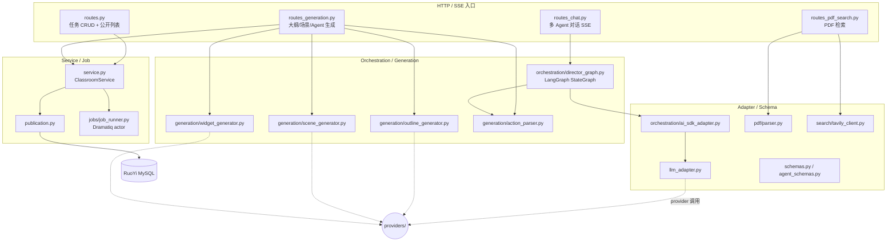
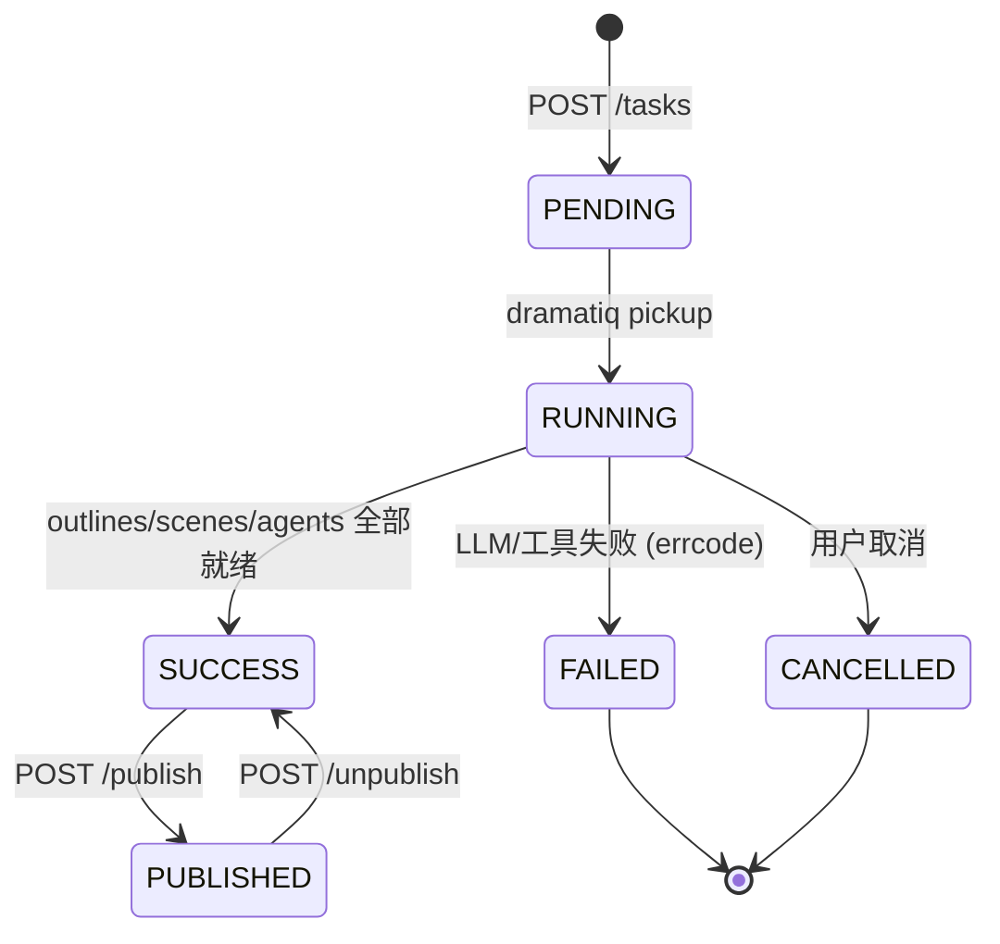

# 课堂服务模块（classroom）

| 版本 | 日期 | 修订内容 | 作者 | 评审 |
|------|------|----------|------|------|
| v1.0.0 | 2026-04-25 | 文档初版 — arc42 §5 Building Block | 课堂研发组 | 架构组 |

## 1. 概述

课堂服务模块（`app/features/classroom/`）承担「AI 智能体课堂」核心：教师上传 PDF/题目 → 后端生成大纲、场景、Agent Profile → 学生侧实时多 Agent 对话（SSE）。本模块整合自原 OpenMAIC 老仓，已统一到 FastAPI Backend，是当前后端最大的业务模块（≈40 个 .py，含 5 个子包）。

**阅读对象：** 课堂方向研发、Agent 编排联调人员、QA 测试。

## 2. 引用文件

- 内部：[../003-架构设计/0001-系统架构总览.md](../003-架构设计/0001-系统架构总览.md)、[./0001-模块总览与依赖关系.md](./0001-模块总览与依赖关系.md)、[./0004-AI-LLM集成.md](./0004-AI-LLM集成.md)
- 外部：LangGraph 文档（StateGraph 编排）、SSE W3C `text/event-stream`

## 3. 模块定位与职责

### 3.1 职责清单

| 职责 | 入口 | 备注 |
|------|------|------|
| 课堂任务 CRUD | `routes.py:63`（bootstrap）/ `routes.py:72`（create）/ `routes.py:82`（list） | RESTful，对接 RuoYi 元数据 |
| 大纲生成（异步流式） | `routes_generation.py:198` `generate_scene_outlines_stream` | SSE，调 `OutlineGenerator` |
| 场景内容 / 行为 / Agent Profile 生成 | `routes_generation.py:250 / :276 / :302` | 三段式生成 |
| 多 Agent 对话编排 | `routes_chat.py:49 classroom_chat` → `DirectorGraph` | LangGraph |
| PDF 文本检索 | `routes_pdf_search.py` + `pdf/parser.py` | 用户上传后 chunk + 关键词 |
| 课堂发布 / 取消发布 / 公开列表 | `routes.py:200/213/226` | 发布走 `publication.py` |

### 3.2 不做什么（边界）

- **不做** Provider 选型 —— 一律走 `app/providers/`（见 [0004](./0004-AI-LLM集成.md)）。
- **不做** 视频生成 —— 通过 `learning_coach` 子模块联动 video，但视频流水线归 [0003](./0003-视频服务模块.md)。
- **不做** RuoYi 鉴权解码 —— 委托 `auth/` 与 `runtime_auth.py`。

## 4. 接口契约

### 4.1 HTTP 端点（节选）

| 方法 | 路径 | 入参 | 出参 | 鉴权 | 入口 file:line |
|------|------|------|------|------|----------------|
| GET  | `/api/v1/classroom/bootstrap` | — | `ClassroomBootstrapResponse` | RuoYi token | `routes.py:63` |
| POST | `/api/v1/classroom/tasks` | `ClassroomTaskCreateRequest` | 任务 ID + 状态 | RuoYi token | `routes.py:72` |
| GET  | `/api/v1/classroom/tasks/{task_id}/events` | — | SSE: progress/error/done | RuoYi token | `routes.py:160` |
| GET  | `/api/v1/classroom/tasks/{task_id}/replay` | — | SSE 回放 | RuoYi token | `routes.py:171` |
| POST | `/api/v1/classroom/tasks/{task_id}/chat` | `ChatRequest` | SSE: agent_event/tool_event | RuoYi token | `routes_chat.py:49` |
| POST | `/api/v1/classroom/tasks/{task_id}/generate/outlines/stream` | — | SSE: outline_chunk | RuoYi token | `routes_generation.py:198` |
| POST | `/api/v1/classroom/tasks/{task_id}/publish` | `PublishRequest` | 发布快照 | RuoYi token | `routes.py:200` |

### 4.2 SSE 事件（Chat 通道）

| 事件 | payload | 说明 |
|------|--------|------|
| `agent_event` | `{ agentId, content, eventType }` | Director 决策出来的 Agent 发言 |
| `tool_event` | `{ tool, args, result }` | Agent 调用工具（PDF 检索 / 计算等） |
| `provider_switch` | `{ from, to, reason }` | LLM 失败转移（来自 `failover.py:73`） |
| `done` | `{ status }` | 流结束 |

## 5. 内部结构（C4 Component）

> **图 5-1：** 课堂模块内部组件关系。**编排层** 是核心：`DirectorGraph` 用 LangGraph 跑「Director → Agent → Director」循环；**生成层** 各 generator 都直接调 `providers/` 出文本/JSON。

## 6. 数据流与状态

### 6.1 课堂任务状态机

> **图 6-1：** 课堂任务状态。SSE `events` 通道把每次状态迁移广播给前端，前端根据 `errorCode` 判断是否可重试。

### 6.2 Director Graph 循环

`DirectorGraph` 在 `orchestration/director_graph.py:384` 注册 `LangGraph` 双节点（`_director_node:148` + `_agent_generate_node:245`），通过 `_director_edge:239` 决策边继续/终止。状态字段定义见 `OrchestratorState:58`。每轮 LLM 调用经 `ai_sdk_adapter.py` 适配为我们的 `LLMProvider.generate()`。

## 7. 扩展点

| 扩展点 | 文件 | 用法 |
|--------|------|------|
| 新增 Agent 类型 | `generation/prompts/agent_profiles.py` + `agent_schemas.py` | 加 prompt + schema，无需改 graph |
| 新增工具调用 | `orchestration/tool_schemas.py` | 注册工具 + 在 `_agent_generate_node` 处理 |
| 替换 PDF 解析器 | `pdf/parser.py` | 接口稳定，可替 PyMuPDF / unstructured |
| 替换搜索后端 | `search/tavily_client.py` | 当前 Tavily，按相同接口可换 SerpAPI |
| 自定义大纲风格 | `generation/prompts/outline.py` / `interactive_outline.py` | 仅改 prompt 模板 |

## 8. 性能与容量

| 维度 | 当前实测 | 目标 | 说明 |
|------|---------|------|------|
| 大纲生成首 chunk | ≈ 1.2s（OpenAI gpt-4o-mini） | < 2s | 流式返回，前端可即时渲染 |
| 单轮 Agent 对话延迟 | ≈ 3-6s | < 8s | LangGraph 循环 + 工具调用 |
| `time_limit`（job_runner actor） | 30 分钟 | — | `jobs/job_runner.py:45` `time_limit=30 * 60 * 1000` |
| 单课堂最大 Agent 数 | 6 | — | 由 prompt 与 graph 决策约束 |

## 9. 已知陷阱

1. **SSE 通道断链不会终止后端任务** —— `_chat_stream` 协程感知客户端断开后会停止 yield，但 `DirectorGraph._run_graph` 仍跑完（避免重复计费）。重连只能用 replay。
2. **`_to_orch_context` 必须保留 `agentId`** —— `routes_chat.py:184`；前端断线重连后失去 agentId 会触发整轮重置。
3. **PDF chunk 不要超过 4000 字符** —— `pdf/parser.py` 切片后塞进 prompt，过长会触发上游 token 超限并被 `failover.py` 误判为不可用。
4. **`publication.py` 写库需透传 RuoYi token** —— 直接用本进程 root token 会导致 `data_scope` 不正确。
5. **不要在 generation/ 下做缓存** —— prompt 与 LLM 输出强相关，缓存会让 A/B 测试失真。

## 10. 引用代码与文件清单

- `app/features/classroom/service.py:29` — `ClassroomService`（继承 `BaseTaskMetadataService`）
- `app/features/classroom/routes.py:48` — `get_classroom_service` DI
- `app/features/classroom/routes_chat.py:49` — `classroom_chat` SSE 入口
- `app/features/classroom/routes_chat.py:140` — `_chat_stream` 协程主循环
- `app/features/classroom/orchestration/director_graph.py:148` — `_director_node`
- `app/features/classroom/orchestration/director_graph.py:245` — `_agent_generate_node`
- `app/features/classroom/orchestration/director_graph.py:384` — `DirectorGraph`
- `app/features/classroom/generation/outline_generator.py` — 大纲流式生成
- `app/features/classroom/generation/scene_generator.py` — 场景内容生成
- `app/features/classroom/generation/widget_generator.py` — 互动组件生成
- `app/features/classroom/jobs/job_runner.py:45` — `@dramatiq.actor` 30 分钟超时
- `app/features/classroom/pdf/parser.py` — PDF 文本提取
- `app/features/classroom/publication.py` — 发布到公开课堂

## 附录 A：术语对照

| 术语 | 英文 | 解释 |
|------|------|------|
| Director | Director Agent | 由 LangGraph 主节点扮演的「调度员」，决策下一步谁说话 |
| Outline | Scene Outline | 课堂的大纲，多个 Scene 组成 |
| Widget | Interactive Widget | 课堂场景中的可交互组件（题目、白板等） |

## 附录 B：参考资料

- LangGraph — <https://langchain-ai.github.io/langgraph/>
- OpenMAIC 历史代码（已合并至 classroom） — `_bmad-output/INDEX.md`
