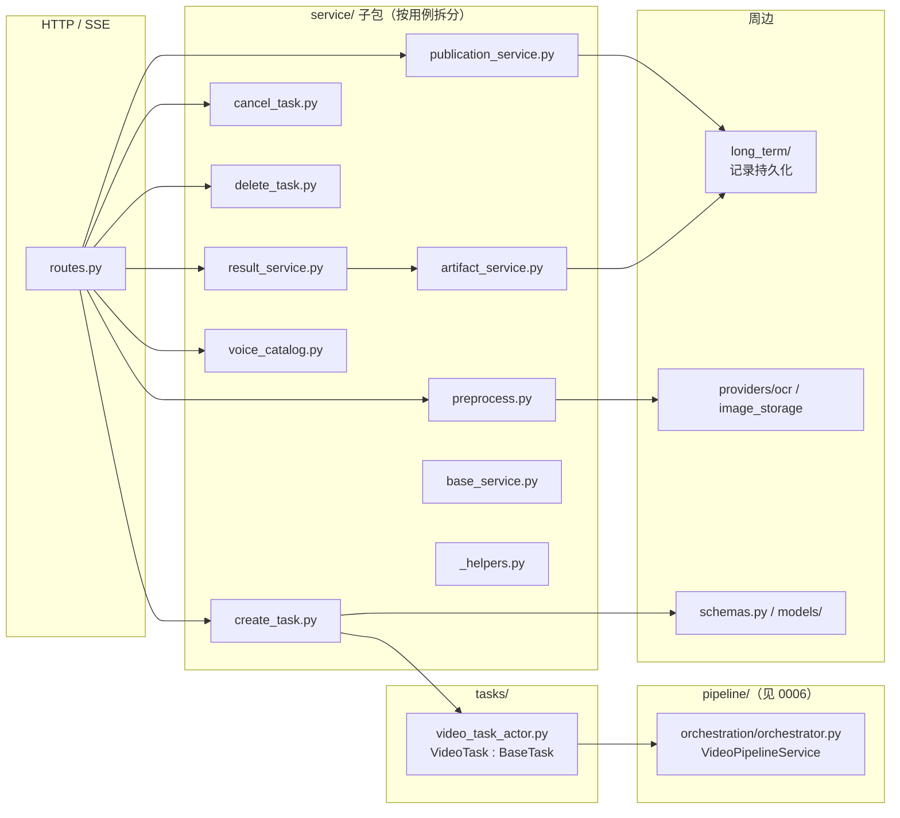
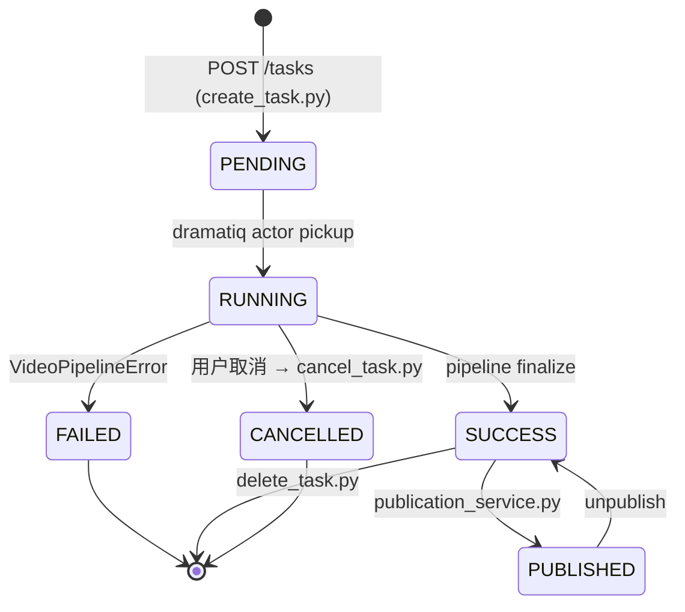
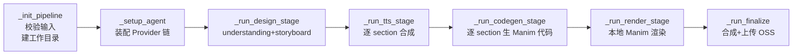

# 视频服务模块（video）

| 版本 | 日期 | 修订内容 | 作者 | 评审 |
|------|------|----------|------|------|
| v1.0.0 | 2026-04-25 | 文档初版 — Code2Video 集成后 arc42 §5 落地 | 视频研发组 | 架构组 |

## 1. 概述

视频服务模块（`app/features/video/`）负责「AI 教学视频自动生成」全生命周期：从用户上传知识点 / 图片 → 触发 Code2Video 10 阶段流水线 → 输出带 TTS 配音 + 字幕的 Manim 动画。本文档聚焦 **服务层与生命周期**；流水线引擎本身见 [0006-Manim动画引擎.md](./0006-Manim动画引擎.md)。

**阅读对象：** 视频方向研发、Pipeline 调试人员、QA、运维（资源监控）。

## 2. 引用文件

- 内部：[./0001-模块总览与依赖关系.md](./0001-模块总览与依赖关系.md)、[./0006-Manim动画引擎.md](./0006-Manim动画引擎.md)、[../003-架构设计/0002-技术选型决策记录.md](../003-架构设计/0002-技术选型决策记录.md)（ADR-003 Code2Video 选型）
- 外部：Manim CE 文档、Dramatiq 文档

## 3. 模块定位与职责

| 职责 | 入口 | 备注 |
|------|------|------|
| HTTP/SSE 接口 | `routes.py:74-510` | 12+ 路由 |
| 任务创建 | `service/create_task.py` | 持久化 + dramatiq 入队 |
| 图像预处理 / OCR | `service/preprocess.py` + `providers/ocr.py` | 用户上传图作为 reference |
| 任务取消 | `service/cancel_task.py` | 协作式取消（标志位 + 分阶段感知） |
| 任务删除 | `service/delete_task.py` | 物理 + 元数据级 |
| 结果查询 | `service/result_service.py` | 含 preview 阶段性段视频 |
| 视频发布 | `service/publication_service.py` | 发布到公开视频列表 |
| Voice Catalog | `service/voice_catalog.py` | 提供前端音色选择 |
| 流水线驱动 | `tasks/video_task_actor.py:24` | `BaseTask` 子类，调 `VideoPipelineService` |

### 边界（不做什么）

- **不做** 渲染本身 —— 渲染由 `pipeline/engine/agent.py` 负责（见 0006）。
- **不做** Provider 失败转移 —— 由 `app/providers/failover.py` 负责。

## 4. 接口契约

### 4.1 HTTP 端点（节选）

| 方法 | 路径 | 入参 | 出参 | 鉴权 | 入口 file:line |
|------|------|------|------|------|----------------|
| GET | `/api/v1/video/bootstrap` | — | 状态 + 配额 | RuoYi | `routes.py:116` |
| POST | `/api/v1/video/preprocess` | `image` (multipart) | OCR + reference 路径 | RuoYi | `routes.py:129` |
| GET | `/api/v1/video/voices` | — | 音色列表 | RuoYi | `routes.py:166` |
| POST | `/api/v1/video/tasks` | `VideoCreateRequest` | 202 + taskId | RuoYi | `routes.py:192` |
| GET | `/api/v1/video/tasks` | `?page&size` | 分页 | RuoYi | `routes.py:230` |
| GET | `/api/v1/video/tasks/{task_id}` | — | 元数据快照 | RuoYi | `routes.py:255` |
| GET | `/api/v1/video/tasks/{task_id}/result` | — | 完整结果 | RuoYi | `routes.py:323` |
| POST | `/api/v1/video/tasks/{task_id}/cancel` | — | 状态 | RuoYi | `routes.py:276` |
| DELETE | `/api/v1/video/tasks/{task_id}` | — | 204 | RuoYi | `routes.py:301` |

### 4.2 SSE 进度事件

通过 `/api/v1/tasks/{task_id}/events`（共享通道）推送，**事件类型**：

| 事件 | 字段 | 触发点 |
|------|------|--------|
| `progress` | `stage`、`stageLabel`、`stageProgress`、`progress`（绝对 0-100） | `VideoPipelineService._emit_stage`（orchestrator.py:339） |
| `provider_switch` | `from_provider`、`to_provider`、`reason` | `failover.py:73` |
| `failed` | `errorCode`、`failedStage` | `_handle_pipeline_failure` |
| `done` | `status`、`videoUrl` | `_run_finalize` |

## 5. 内部结构

> **图 5-1：** 视频模块按「用例驱动」拆 service 子包（避免单文件 service.py 膨胀）。`VideoTask` 是衔接 `service/create_task` 与 `pipeline/` 的唯一桥梁。

## 6. 数据流与状态

### 6.1 任务生命周期

> **图 6-1：** 视频任务状态机。SSE `failed` 事件携带 `errorCode`，前端据此区分「可重试」「需要联系运维」「输入有误」三类。

### 6.2 Code2Video 10 阶段（驱动顺序）

`VideoPipelineService.run()`（`orchestration/orchestrator.py:449`）严格按以下顺序串接：

> **图 6-2：** 视频流水线 10 阶段（在内部又细分为 understanding / storyboard / manim_gen / manim_fix / render / render_verify / tts / compose / upload）。Stage 与 SSE 进度的映射定义在 `orchestrator.py:125 _C2V_STAGE_MAP`。

## 7. 扩展点

| 扩展点 | 文件 | 用法 |
|--------|------|------|
| 新增视频生成模式（如纯图模式） | `service/create_task.py` + `models/create_task.py` | 加新 `inputType` 分支 |
| 新增 OCR Provider | `providers/ocr.py` | 接同样接口 |
| 新增 Voice Catalog 来源 | `service/voice_catalog.py` | 维持音色 schema |
| 调整阶段进度权重 | `pipeline/models.py` `VideoStageProfile` | 修改各阶段对外 progress 占比 |
| 自定义阶段失败行为 | `_mark_section_failed`（orchestrator.py:1662） | 失败转「跳过 / 整体失败 / 软降级」 |

## 8. 性能与容量

| 维度 | 实测 / 配置 | 来源 / 说明 |
|------|-----------|----------|
| 单视频生成总时长（10 sections, 5 min 视频） | ≈ 4-7 min | 实测，参考 `video-pipeline-benchmark.md` 记忆 |
| dramatiq actor `time_limit` | 15 min | `app/worker.py` 配置（已从默认 10 → 15） |
| 单 task 工作目录 | `.runtime/video-assets/video/CASES/{task_id}/` | `orchestrator.py:541` |
| 视频上传 OSS | 完成后由 `pipeline/orchestration/upload.py` 推送 | OSS 配置见 `app/core/config.py` |
| 并发渲染上限 | section 串行（默认） | `parallel sections` 探索分支已废弃，详见记忆 |

## 9. 已知陷阱

1. **`runtime_auth.py` token 必须在 actor 启动前 dump 到 Redis** —— 否则 actor 端无法回调 RuoYi 写元数据；调用顺序见 `service/create_task.py`。
2. **`finalize()` 是回写 DB status 的唯一可靠点** —— 历史曾出现「dispatch 完成只写 Redis 不写 DB」bug（见记忆 `video-pipeline-db-status-bug`）。
3. **取消是协作式** —— 各阶段开头 `_get_cancelled_result` 检查（orchestrator.py:457/462/468/...），不会强杀正在跑的渲染子进程。
4. **`api_key` 必须 ASCII** —— `OpenAICompatibleLLMProvider.__init__` 显式 `isascii()` 校验（`providers/llm/openai_compatible_provider.py:24`），否则 httpx 直接崩溃。
5. **Preview 段视频与最终视频不要混用** —— `result_service.py` 优先返回最新 preview，但仅在阶段未 finalize 时；finalize 后必须返回 OSS URL。
6. **本地 Manim 安装是硬依赖** —— `pipeline/sandbox.py` 已删除 Docker 沙箱执行器，仅保留静态 AST 安全扫描（`scan_script_safety`）。运维必须保证 worker 容器内有 Manim + LaTeX。

## 10. 引用代码与文件清单

- `app/features/video/routes.py:74` — `get_video_service`
- `app/features/video/routes.py:192` — `POST /tasks` 入口
- `app/features/video/service/create_task.py` — 创建逻辑
- `app/features/video/service/cancel_task.py` — 取消逻辑（177 行）
- `app/features/video/service/result_service.py` — 结果聚合（225 行）
- `app/features/video/service/publication_service.py` — 视频发布（276 行）
- `app/features/video/tasks/video_task_actor.py:24` — `VideoTask` 类
- `app/features/video/tasks/video_task_actor.py:89` — `finalize()` 回写 DB
- `app/features/video/pipeline/sandbox.py:35` — `scan_script_safety`
- `app/features/video/pipeline/orchestration/orchestrator.py:313` — `VideoPipelineService`
- `app/features/video/pipeline/orchestration/orchestrator.py:125` — `_C2V_STAGE_MAP`
- `app/features/video/long_term/service.py` — 任务长期记录服务

## 附录 A：术语对照

| 术语 | 英文 | 解释 |
|------|------|------|
| 段视频 | Section / Clip | 一个 Scene 渲染出来的 mp4 片段 |
| 流水线 | Pipeline | Code2Video 的 10 阶段编排 |
| 工作目录 | CASES | `.runtime/video-assets/video/CASES/{task_id}/` |
| 协作式取消 | Cooperative Cancel | 不强杀子进程，靠各阶段轮询 Redis 标志 |

## 附录 B：参考资料

- 记忆：`video-pipeline-implementation.md`、`video-pipeline-benchmark.md`
- ADR-003：Code2Video 重写视频管道
