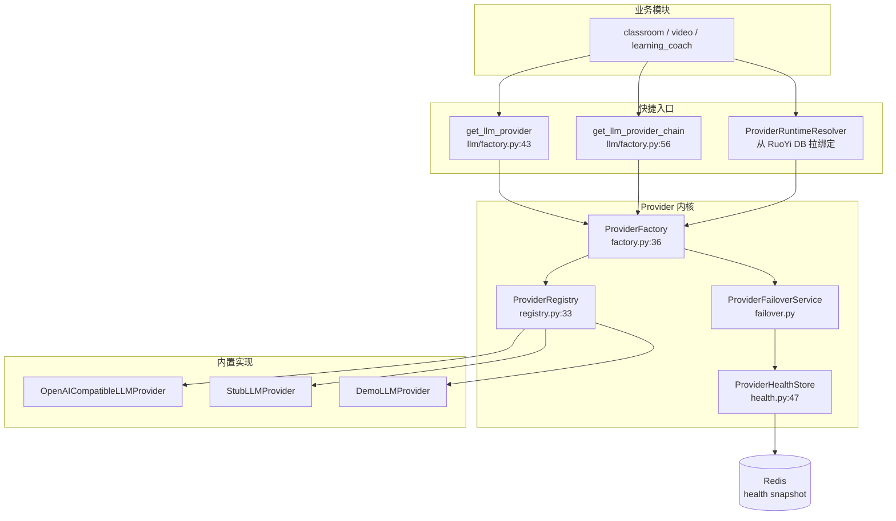
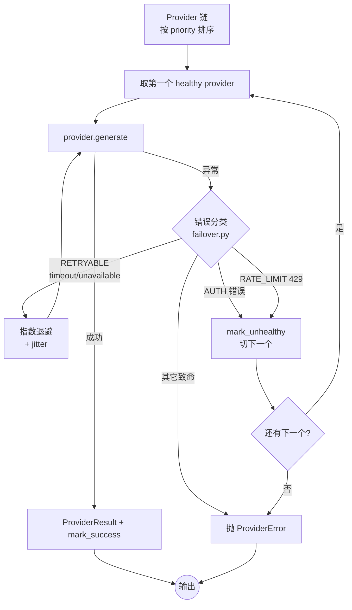
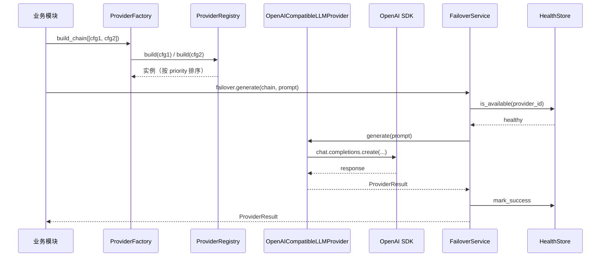

# AI / LLM 集成（providers.llm）

| 版本 | 日期 | 修订内容 | 作者 | 评审 |
|------|------|----------|------|------|
| v1.0.0 | 2026-04-25 | 文档初版 — 落地 Provider 抽象层 + 失败转移设计 | 平台研发组 | 架构组 |

## 1. 概述

LLM 集成采用 **Provider 抽象层**：业务模块（classroom / video）只面向 `LLMProvider` 协议编程，具体厂商（OpenAI / Compatible / Stub / Demo）由注册表 + Factory 在运行时装配。Provider 链支持优先级排序与失败转移（Failover），健康状态持久化在 Redis。

本章只覆盖 **LLM**；TTS 见 [0005](./0005-TTS语音合成.md)；运行时绑定（RuoYi 后台配置）见 [../003-架构设计/0001-系统架构总览.md](../003-架构设计/0001-系统架构总览.md)。

## 2. 引用文件

- 内部：[./0001-模块总览与依赖关系.md](./0001-模块总览与依赖关系.md)、[./0005-TTS语音合成.md](./0005-TTS语音合成.md)
- 外部：OpenAI Python SDK、httpx、Pydantic v2

## 3. 模块定位与职责

| 职责 | 入口 | 备注 |
|------|------|------|
| 协议定义 | `app/providers/protocols.py:96 LLMProvider` | `runtime_checkable` Protocol |
| 注册表 | `app/providers/registry.py:33 ProviderRegistry` | 别名解析 + 优先级 |
| 工厂装配 | `app/providers/factory.py:36 ProviderFactory` | 按运行时配置组装实例链 |
| 内置 Provider 注册 | `app/providers/llm/factory.py:18 register_llm_providers` | stub / demo / openai-compatible |
| 失败转移 | `app/providers/failover.py:30 RETRYABLE_ERROR_CODES` | 错误分类 + 重试 + 切换 |
| 健康存储 | `app/providers/health.py:47 ProviderHealthStore` | Redis 快照 + 可用性查询 |
| 运行时解析 | `app/providers/runtime_config_service.py:168 ProviderRuntimeResolver` | 从 RuoYi DB 拉绑定生成 Provider 链 |
| OpenAI 兼容实现 | `app/providers/llm/openai_compatible_provider.py:15` | 全部走 OpenAI Python SDK |

## 4. 接口契约

### 4.1 `LLMProvider` 协议

```python
# app/providers/protocols.py:96-103
@runtime_checkable
class LLMProvider(ProviderProtocol, Protocol):
    """LLM Provider 运行时协议。"""
    async def generate(self, prompt: str) -> ProviderResult: ...

@runtime_checkable
class VisionLLMProvider(LLMProvider, Protocol):
    """支持多模态（图像 + 文本）。"""
    async def generate_vision(
        self, prompt: str, *,
        image_base64: str, image_media_type: str = "image/jpeg",
    ) -> ProviderResult: ...
```

### 4.2 配置模型

`ProviderRuntimeConfig`（`protocols.py:46`）冻结值对象：

| 字段 | 类型 | 默认 | 说明 | 必填 |
|------|------|------|------|------|
| `provider_id` | str | — | `vendor-{model_or_voice}`，正则 `^[a-z0-9]+-[a-z0-9][a-z0-9_-]*$` | 是 |
| `priority` | int | 100 | 越小越优先 | 否 |
| `timeout_seconds` | float | 30.0 | httpx/SDK 超时 | 否 |
| `retry_attempts` | int | 0 | 同 Provider 重试次数 | 否 |
| `health_source` | str | `"unconfigured"` | 健康源标签（DB / config） | 否 |
| `settings` | Mapping | `{}` | 厂商专有：`base_url` / `api_key` / `model_name` 等 | 视厂商 |

### 4.3 `ProviderResult`（统一传输对象）

```python
# protocols.py:73
@dataclass(slots=True, frozen=True)
class ProviderResult:
    provider: str               # provider_id
    content: str                # 模型输出
    metadata: Mapping[str, Any] # model / usage / finishReason / priority / timeoutSeconds ...
```

## 5. 内部结构与决策图



> **图 5-1：** Provider 装配与决策。业务侧三种入口（直接拿单个 / 拿一条链 / 从 RuoYi DB 解析）最终都收口到 `ProviderFactory.build/build_chain`。

### 5.1 失败转移决策图



> **图 5-2：** Failover 决策。`MAX_RETRY_BACKOFF_SECONDS=8`、`MAX_RETRY_JITTER_SECONDS=1.0`（`failover.py:51-52`）。健康状态持久化到 Redis，供后续请求短路探测。

## 6. 数据流

### 6.1 单次 LLM 调用



> **图 6-1：** 一次成功 LLM 调用。`OpenAICompatibleLLMProvider._chat`（`providers/llm/openai_compatible_provider.py:73`）使用官方 SDK 而非裸 httpx。

## 7. 内置 Provider 与默认优先级

> 来源：`app/providers/llm/factory.py:20-40`

| Provider ID | 用途 | `default_priority` | 关键 Settings |
|-------------|------|--------------------|---------------|
| `stub-llm` | 单测 / 离线 | 100 | — |
| `demo-chat` | demo 演示 | 10 | — |
| `openai-compatible` | 主力（OpenAI / Edge / 自建网关） | 20 | `base_url`、`api_key`（ASCII）、`model_name`、`temperature`、`headers`、`extra_body` |

> **TTS 对比：** TTS 默认主力 `doubao-tts`（priority=20）+ `openai-tts`（priority=30），见 [0005](./0005-TTS语音合成.md)。

## 8. 扩展点

### 8.1 新增厂商 LLM Provider

1. 实现 `LLMProvider` 协议（必须 `runtime_checkable` 通过）。
2. 在 `app/providers/llm/factory.py:18 register_llm_providers` 内调用 `registry.register(...)`，约定 `vendor-{model}` 命名。
3. （可选）在 `runtime_config_service.py` 增加配置解析逻辑，让 RuoYi 后台可下拉。

### 8.2 多模态扩展

实现 `VisionLLMProvider.generate_vision`，传 base64 图像；视频流水线 storyboard 阶段在 `pipeline/orchestration/orchestrator.py` 通过 `assembly.llm_for("storyboard")` 拿到的实例若实现该协议会自动启用。

## 9. 性能与容量

| 维度 | 实测 / 配置 | 来源 |
|------|------------|------|
| 单次 LLM 调用 P50 | 2-6s（OpenAI gpt-4o-mini） | 视频管道 benchmark |
| 单次 LLM 调用 P95 | 12s | 同上 |
| Failover 重试上限退避 | 8s | `failover.py:51` |
| Provider 健康 TTL | 由 `health.py` 控制（默认 60s） | 复合 cooldown |
| Token 用量上报 | 写入 `metadata.usage`，目前**未持久化** | 计费由上游网关聚合 |

## 10. 已知陷阱

1. **`api_key` 必须 ASCII** —— `openai_compatible_provider.py:24`、`tts/openai_provider.py:35`、`tts/doubao_provider.py` 三处都加了 `isascii()` 校验。后台粘贴 API Key 时常带中文空格，必须人工清理。
2. **`provider_id` 正则强约束** —— `^[a-z0-9]+-[a-z0-9][a-z0-9_-]*$`（`protocols.py:11`）。RuoYi 数字 ID（如 `202604070402`）需要被 resolver 转换成合法 ID（见 `runtime_config_service.py:671` 注释）。
3. **Provider 实例不可跨任务复用其 timeout** —— `ProviderRuntimeConfig` 是 frozen，但 OpenAI SDK client 内部带连接池；`ProviderFactory.clone()` 用于请求级隔离。
4. **Failover 不会捕获普通 `Exception`** —— 必须先经 `coerce_task_error_code` 分类，未分类异常会直接外抛。
5. **健康存储缓存可能投毒** —— 如果 LLM 网关短暂 5xx 触发标记 unhealthy，链路所有请求都会跳过它直到 cooldown；考虑重大问题前用 `ProviderFailoverService` 的 `ignore_cached_unhealthy=True` 临时绕过。

## 11. 引用代码与文件清单

- `app/providers/protocols.py:46` — `ProviderRuntimeConfig`
- `app/providers/protocols.py:96` — `LLMProvider` Protocol
- `app/providers/registry.py:64` — `ProviderRegistry.register`
- `app/providers/registry.py:145` — `ProviderRegistry.build`（含 Protocol 校验）
- `app/providers/factory.py:36` — `ProviderFactory`
- `app/providers/factory.py:114` — `create_failover_service`
- `app/providers/failover.py:30` — `RETRYABLE_ERROR_CODES`
- `app/providers/health.py:47` — `ProviderHealthStore`
- `app/providers/llm/factory.py:18` — `register_llm_providers`
- `app/providers/llm/openai_compatible_provider.py:15` — 主力实现
- `app/providers/llm/openai_compatible_provider.py:24` — ASCII 校验
- `app/providers/llm/openai_compatible_provider.py:73` — `_chat` 通用入口
- `app/providers/llm/openai_client_factory.py` — `create_async_client` + URL 规范化
- `app/providers/runtime_config_service.py:168` — `ProviderRuntimeResolver`
- `app/providers/runtime_config_service.py:101` — `assembly.llm_for(stage)`

## 附录 A：术语对照

| 术语 | 英文 | 解释 |
|------|------|------|
| 失败转移 | Failover | 主 provider 失败后切到次优先级 |
| 多模态 | Multimodal | 同一次调用同时输入图像与文本 |
| 健康源 | Health Source | 标签字符串，标识本配置来自哪个数据源（如 `ruoyi-binding`） |

## 附录 B：参考资料

- OpenAI SDK Python — <https://github.com/openai/openai-python>
- 记忆：`video-pipeline-implementation.md`、`provider-binding-ghost-ids.md`
