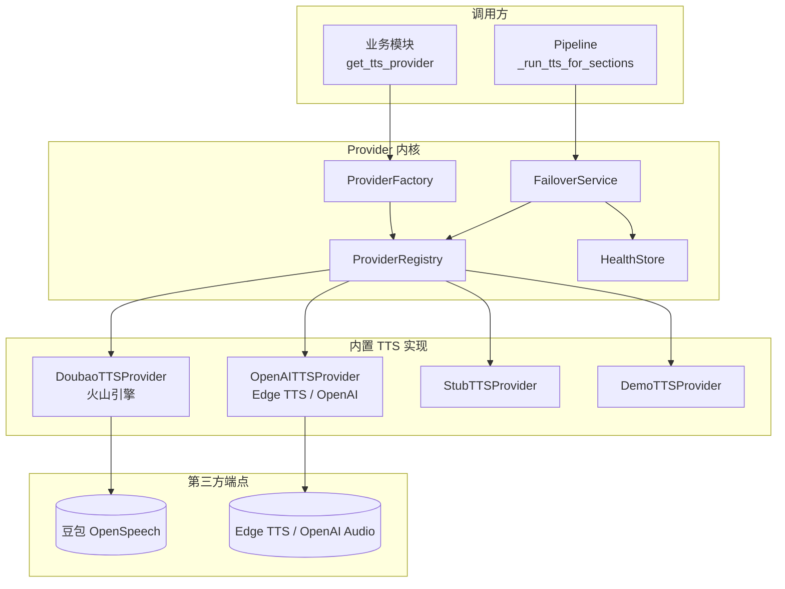
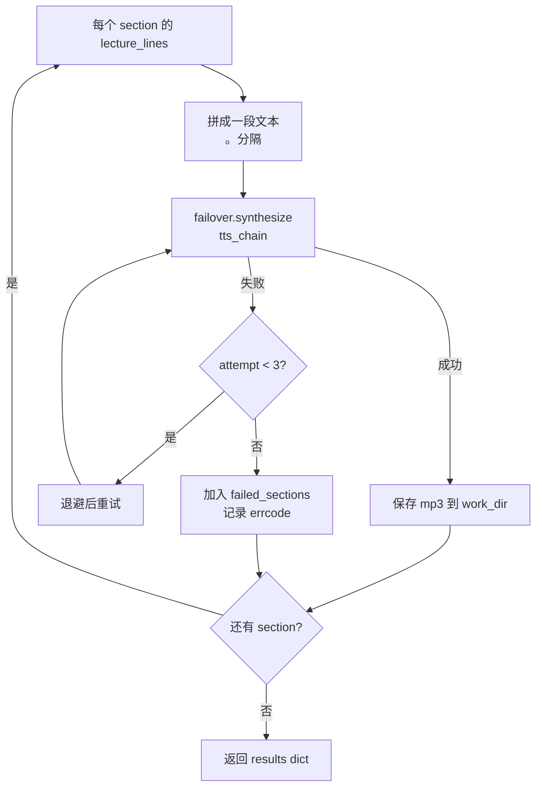
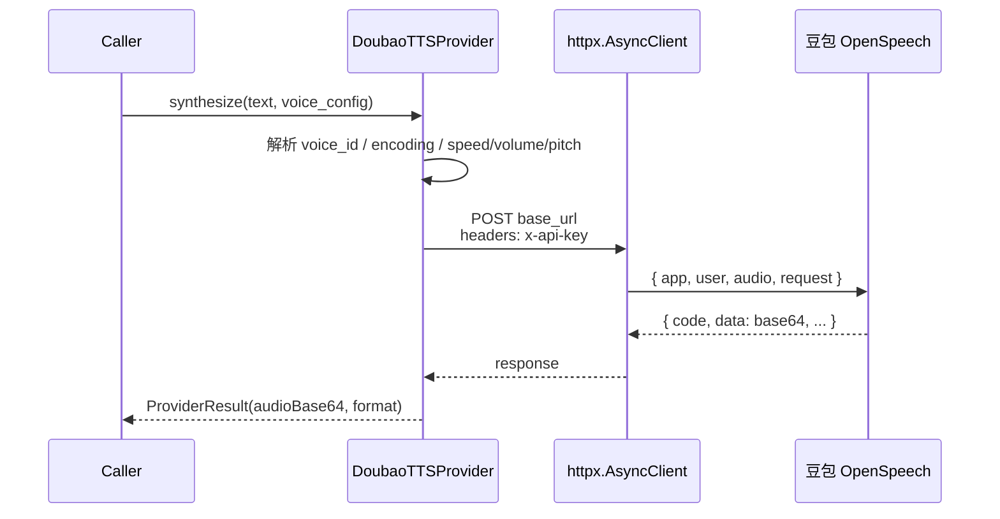
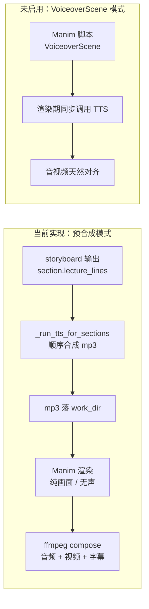

# TTS 语音合成（providers.tts）

| 版本 | 日期 | 修订内容 | 作者 | 评审 |
|------|------|----------|------|------|
| v1.0.0 | 2026-04-25 | 文档初版 — TTS Provider 抽象层 + 视频管道集成 | 视频研发组 | 架构组 |

## 1. 概述

TTS（Text-To-Speech）模块负责把视频流水线生成的「讲课文本」转为音频片段。架构与 LLM 同构：业务面向 `TTSProvider` 协议，内置豆包 / OpenAI 兼容（Edge TTS 等）实现，支持失败转移与音色选择。

**音频与视频集成方式（当前实现）：** 当前实现 **不使用** `manim-voiceover` 的 `VoiceoverScene`。Pipeline 在 `_run_tts_for_sections` 阶段提前合成完整音频文件（"预合成 / Preloaded"模式），把 mp3 落到 `work_dir`，再由 `compose` 阶段用 ffmpeg 把音频与已渲染 Manim 视频合并 + 字幕叠加。Manim 渲染脚本本身只生成无声画面（`pipeline/script_templates.py:14` 仅 `from manim import *`，无 voiceover 依赖）。这种「TTS 先于渲染、渲染后再合成」的策略是有意设计：避免 Manim 渲染进程内做网络调用、便于音频缓存、便于失败重试。

阅读对象：视频研发、Provider 平台运维、QA。

## 2. 引用文件

- 内部：[./0004-AI-LLM集成.md](./0004-AI-LLM集成.md)、[./0003-视频服务模块.md](./0003-视频服务模块.md)、[./0006-Manim动画引擎.md](./0006-Manim动画引擎.md)
- 外部：豆包 OpenSpeech TTS API、OpenAI Audio Speech API、Edge TTS（travisvn/openai-edge-tts）

## 3. 模块定位与职责

| 职责 | 入口 | 备注 |
|------|------|------|
| 协议定义 | `app/providers/protocols.py:121 TTSProvider` | `synthesize(text, voice_config) -> ProviderResult` |
| 内置 Provider 注册 | `app/providers/tts/factory.py:19 register_tts_providers` | stub / demo / doubao / openai |
| 豆包实现 | `app/providers/tts/doubao_provider.py:52 DoubaoTTSProvider` | 火山引擎 cluster=`volcano_tts` |
| OpenAI 兼容 | `app/providers/tts/openai_provider.py:21 OpenAITTSProvider` | 路径 `/audio/speech` |
| Voice Catalog（前端音色列表） | `app/features/video/service/voice_catalog.py` | 给前端下拉用 |
| 管道接入 | `app/features/video/pipeline/orchestration/orchestrator.py:223 _run_tts_for_sections` | 逐 section 合成，自带退避重试 |

### 边界

- **不做** 字幕渲染 —— 字幕由 `pipeline/orchestration/subtitle.py` 处理。
- **不做** 音频后处理（混音 / 拼接） —— 由 ffmpeg + `compose` 阶段处理。

## 4. 接口契约

### 4.1 `TTSProvider` 协议

```python
# app/providers/protocols.py:120
@runtime_checkable
class TTSProvider(ProviderProtocol, Protocol):
    async def synthesize(self, text: str, voice_config: Any | None = None) -> ProviderResult: ...
```

### 4.2 `ProviderResult.metadata` 约定（TTS）

| 字段 | 类型 | 说明 |
|------|------|------|
| `audioBase64` | str | base64 编码音频字节 |
| `audioFormat` | str | `mp3` / `wav` / `ogg` |
| `voice` | str | 实际下发音色 ID |
| `model` | str | 模型 / cluster 名 |
| `priority` | int | 来源链 priority |

### 4.3 `voice_config` 入参（来自 RuoYi 或前端）

| 字段（容忍多种命名） | 类型 | 说明 |
|--------|------|------|
| `voice_id` / `voiceId` / `voice_code` | str | 音色 ID（必填，否则 raise `ProviderConfigurationError`） |
| `speed_ratio` / `speed` | float | 语速倍率，默认 1.0 |
| `volume_ratio` | float | 音量倍率，默认 1.0 |
| `pitch_ratio` | float | 音调倍率，默认 1.0 |
| `format` / `audio_format` | str | 音频编码，默认 mp3 |

> 实际读取逻辑：`doubao_provider.py:40 _read_voice_value`。同一字段同时容忍 snake_case 与 camelCase（前端 Vue 习惯 camelCase）。

## 5. 内部结构与决策图



> **图 5-1：** TTS Provider 装配。结构与 LLM 一致（同一注册表 / 工厂 / Failover），仅协议方法换成 `synthesize`。

### 5.1 视频流水线 TTS 决策



> **图 5-2：** Pipeline 内 TTS 重试策略。每个 section 最多重试 3 次（`orchestrator.py:242 for attempt in range(1,4)`）；多 section 之间串行（避免厂商 RPS 限流）。

## 6. 内置 Provider 与默认优先级

> 来源：`app/providers/tts/factory.py:21-48`

| Provider ID | 端点 | 默认优先级 | 关键 Settings |
|-------------|------|--------|---------------|
| `stub-tts` | 内存 stub | 100 | — |
| `demo-voice` | demo | 10 | — |
| `doubao-tts` | 豆包 / 火山引擎 | 20 | `base_url`、`api_key`（ASCII）、`cluster`（默认 `volcano_tts`）、`voice_code`、`encoding`、`auth_header`（默认 `x-api-key`）、`app_id`、`app_token` |
| `openai-tts` | OpenAI / Edge TTS | 30 | `base_url`、`api_key`、`model_name`（默认 `tts-1`）、`voice_code`（默认 `alloy`） |

> **图示：** 数字越小越优先；豆包是当前生产主力，OpenAI/Edge 作为兜底。

## 7. 数据流

### 7.1 单次合成（豆包）



> **图 7-1：** 豆包合成请求。`reqid` 每次都用 `uuid4()`（`doubao_provider.py:133`），便于豆包侧链路追踪。

### 7.2 预合成（Preloaded）模式 vs 渲染期 voiceover



> **图 7-2：** 项目当前选用「TTS 预合成 → 落盘 → 后合成」路径（`pipeline/orchestration/orchestrator.py:472 _run_tts_stage` 在 storyboard 之后立即跑）。这等价于一种 **Preloaded TTS** 设计：网络抖动只影响 TTS 阶段、不会拖慢 Manim 渲染；坏处是音视频时长需要 compose 阶段对齐（详见 [0006-Manim动画引擎.md](./0006-Manim动画引擎.md) §6 阶段图）。`manim-voiceover` / `VoiceoverScene` **未集成**（pyproject 未含此依赖，`script_templates.py:14` 只 import `manim`）。

### 7.3 Mock / Fallback / Stub

| 角色 | Provider ID | 实现 | 用途 |
|------|------------|------|------|
| 单测 stub | `stub-tts` | `app/providers/tts/stub_provider.py:8 StubTTSProvider` | 单测和离线，返回固定音频字节 |
| 演示 fallback | `demo-voice` | `app/providers/demo_provider.py DemoTTSProvider` | UI demo / 无 key 环境兜底 |
| 链式失败转移 | 任意已注册 ID | `failover.py ProviderFailoverService.synthesize` | 主 → 次 → stub 兜底 |

**接入方式**：在 RuoYi 后台或 `FASTAPI_TTS_PROVIDER_CHAIN` 环境变量里把 `stub-tts` 放在链尾即可。`build_chain` 按 `priority` 排序自动接管。

## 8. 扩展点

| 扩展点 | 文件 | 用法 |
|--------|------|------|
| 新增 TTS 厂商 | 新建 `providers/tts/{vendor}_provider.py` + 在 `tts/factory.py:19` 注册 | 实现 `synthesize` 即可 |
| 修改默认音色 | `voice_catalog.py` + RuoYi 后台绑定 | 不动代码 |
| 切换音频格式 | `voice_config.format` | mp3 / wav / ogg |
| 加流式 TTS | 当前协议 `synthesize` 是一次性返回；流式需扩展 Protocol（建议 `synthesize_stream` 新方法） | 影响管道 IO 模型 |

## 9. 性能与容量

| 维度 | 实测 / 配置 | 来源 |
|------|------------|------|
| 单段 TTS（≈100 字） | 1.5-3s（豆包） | 视频管道 benchmark |
| 单视频 TTS 总耗时 | 10 sections × 3s ≈ 30s | 主瓶颈之一（曾考虑并行，记忆 `video-pipeline-perf-optimization.md`） |
| 单 task 重试上限 | 3 次 / section | `orchestrator.py:242` |
| 客户端连接池 | 每个 Provider 实例一个 `AsyncClient`，靠 `_client_lock` 双检建连 | `doubao_provider.py:81 _get_client` |
| 首字节延迟（TTFB） | 豆包 ≈ 400-800ms / Edge TTS ≈ 600-1500ms | 实测；OpenAI 兼容路径过 CDN 时偶发 1.5s+ |
| 并发限制 | section 间 **串行**（默认） | `_run_tts_for_sections` 按 sections 顺序 `for` 循环，不开并发；故意限速以避开厂商 RPS（豆包 5 RPS 友好上限） |
| 缓存命中 | 当前 **未做** 业务级 mp3 缓存 | 同 task 内不会重复合成同一段；跨 task 不共享。如需启用，建议以 `sha256(provider_id + voice + text)` 为 key 落盘 |
| 内存占用 | 单段 mp3 约 30-100KB；在内存停留到 compose 完成 | 任务 `work_dir` 满后由 video 模块 cleanup 任务回收 |

## 10. 已知陷阱

1. **`api_key` 必须 ASCII** —— `doubao_provider.py:62`、`openai_provider.py:35` 都加了显式校验，避免历史的「中文 key 致 httpx 崩溃」事故（记忆 `hotfix-api-key-unicode.md`）。
2. **空文本会 raise ValueError** —— `doubao_provider.py:96`；上游必须先过滤空 lecture_line，否则整段 section TTS 失败。
3. **OpenAI Edge TTS 返回 content-type 必须包含 `audio`** —— 否则 `openai_provider.py:79` 抛 `ConnectionError`；若网关返回 JSON 错误，需要在 `failover.py` 走错误分类。
4. **Voice ID 不要硬编码在业务代码** —— 必须从 `voice_catalog` 拉，避免后台改音色时业务代码失效。
5. **音频拼接顺序** —— `_run_tts_for_sections` 按 `sections` 顺序产出 dict，但 dict 迭代顺序不保证；下游 compose 阶段必须按 `section.id` 显式排序。
6. **Provider 注册映射 bug（已修，避免回归）** —— 历史上 RuoYi 后台 `provider_binding.runtime_provider_id` 字段被 mapper 误映射为 `providerId`，导致 OpenAI TTS provider 永远拿不到正确 ID（记忆 `tts-provider-registration-fix.md`）。新增 binding 字段或调整 ORM mapper 时，**必须**同步检查 `app/providers/runtime_config_service.py` 里的 `binding.provider_id` 读取路径以及 `validate_provider_id` 的格式校验（`protocols.py:36`）。
7. **`provider_id` 含中文（含全角空格）会触发 Pydantic 报错** —— 与 `api_key` 不同，错误更隐蔽：失败发生在 `ProviderRuntimeConfig.__post_init__`，给出的是 "Provider 标识符必须遵循 {vendor}-{model_or_voice} 格式"。检查 RuoYi 后台粘贴值。
8. **预合成路径下，Manim 渲染异常导致音画错位** —— 任一 section 的 Manim 渲染失败被 fallback 到默认时长，会让该段音频比画面长。compose 阶段需要按音频时长截断或 padding 视频（详见 `pipeline/orchestration/media_utils.py`）。

## 11. 引用代码与文件清单

- `app/providers/protocols.py:120` — `TTSProvider` Protocol
- `app/providers/tts/factory.py:19` — `register_tts_providers`
- `app/providers/tts/factory.py:51` — `get_tts_provider`
- `app/providers/tts/factory.py:64` — `get_tts_provider_chain`
- `app/providers/tts/doubao_provider.py:52` — `DoubaoTTSProvider`
- `app/providers/tts/doubao_provider.py:81` — `_get_client`（连接池）
- `app/providers/tts/doubao_provider.py:94` — `synthesize`
- `app/providers/tts/openai_provider.py:21` — `OpenAITTSProvider`
- `app/providers/tts/openai_provider.py:57` — `synthesize`
- `app/providers/tts/stub_provider.py:8` — `StubTTSProvider`（mock/fallback）
- `app/providers/runtime_config_service.py` — RuoYi binding → provider 链解析（`provider_id` 映射 bug 修复点）
- `app/providers/protocols.py:36` — `validate_provider_id` 正则
- `app/features/video/pipeline/orchestration/orchestrator.py:472` — `_run_tts_stage` 入口
- `app/features/video/pipeline/script_templates.py:14` — Manim 脚本头（无 voiceover 依赖证据）
- `app/features/video/pipeline/orchestration/orchestrator.py:223` — `_run_tts_for_sections`
- `app/features/video/service/voice_catalog.py` — 音色目录（40 行）

## 附录 A：术语对照

| 术语 | 英文 | 解释 |
|------|------|------|
| 音色 | Voice | 厂商提供的预置发音人（豆包 `BV001_streaming` 等） |
| 失败转移 | Failover | 与 LLM 同构 |
| 音频格式 | Encoding | mp3 / wav / ogg |

## 附录 B：参考资料

- 豆包 OpenSpeech TTS — <https://www.volcengine.com/docs/6561>
- OpenAI Audio Speech API — <https://platform.openai.com/docs/guides/text-to-speech>
- 记忆：`tts-provider-registration-fix.md`、`voiceover-scene-migration.md`
