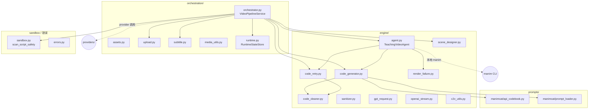
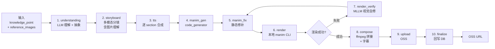
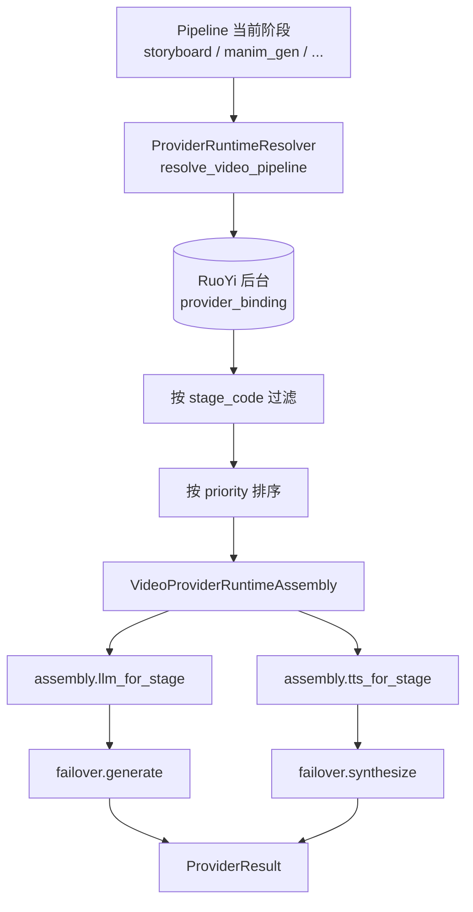

# Manim 动画引擎与 Code2Video 流水线

| 版本 | 日期 | 修订内容 | 作者 | 评审 |
|------|------|----------|------|------|
| v1.0.0 | 2026-04-25 | 文档初版 — Code2Video 全量集成后落地 | 视频研发组 | 架构组 |

## 1. 概述

本模块（`app/features/video/pipeline/`）是 Prorise AI Teach 视频生成的「内核」：以 Code2Video（manim-to-video-claw scenext 参考）为蓝本重写，从知识点/图片到 Manim 动画 + TTS 配音视频，分 10 个阶段、由 `VideoPipelineService` 串联。本文档描述 **流水线 + Manim 引擎** 自身；视频服务的 HTTP 层与生命周期见 [0003](./0003-视频服务模块.md)。

阅读对象：流水线开发者、Manim 渲染调试者、QA、运维。

## 2. 引用文件

- 内部：[./0003-视频服务模块.md](./0003-视频服务模块.md)、[./0004-AI-LLM集成.md](./0004-AI-LLM集成.md)、[./0005-TTS语音合成.md](./0005-TTS语音合成.md)、[../003-架构设计/0002-技术选型决策记录.md](../003-架构设计/0002-技术选型决策记录.md)（ADR-003）
- 外部：Manim Community Edition、manim-voiceover、ffmpeg、LaTeX（XeLaTeX/dvisvgm）

## 3. 模块定位与职责

| 职责 | 入口 | 备注 |
|------|------|------|
| 流水线协调器 | `pipeline/orchestration/orchestrator.py:313 VideoPipelineService` | 2789 行，10 阶段串联（已计划再次拆分） |
| 教学 Agent 引擎 | `pipeline/engine/agent.py:99 TeachingVideoAgent` | 977 行，移植自 Code2Video |
| 场景设计器 | `pipeline/engine/scene_designer.py` | LLM Stage 1：从概念到 design |
| 代码生成器 | `pipeline/engine/code_generator.py:27 generate_code_from_design` | LLM Stage 2：design → Manim 代码 |
| 代码清洗 | `pipeline/engine/code_cleaner.py` | extract / clean / normalize |
| 代码修复重试 | `pipeline/engine/code_retry.py` + `auto_fix.py` | 渲染失败时 LLM 修复 |
| 视觉验证 | `pipeline/engine/render_failure.py` | 渲染后 MLLM 视觉自修 |
| 静态安全扫描 | `pipeline/sandbox.py:35 scan_script_safety` | AST 黑名单 |
| Prompt 模板 | `pipeline/prompts/manimcat/` | API codebook 注入 |
| 资产上传 | `pipeline/orchestration/upload.py` | OSS / 本地 |
| 字幕处理 | `pipeline/orchestration/subtitle.py` | 文本 → SRT |

## 4. 接口契约

### 4.1 `VideoPipelineService.run`

```python
# pipeline/orchestration/orchestrator.py:449
async def run(self, task: BaseTask) -> TaskResult:
    """Execute full video generation pipeline (thin coordinator)."""
```

| 参数 | 类型 | 说明 |
|------|------|------|
| `task` | `BaseTask`（实际为 `VideoTask`） | 携带 `task_id` / `metadata.sourcePayload` / `runtime_store` |

| 返回 | 含义 |
|------|------|
| `TaskResult(SUCCESS, videoUrl=..., context=...)` | 视频生成成功，OSS URL 在 `context` |
| `TaskResult(CANCELLED, ...)` | 用户中途取消 |
| 抛 `VideoPipelineError(stage, error_code, message)` | 任一阶段不可恢复失败 |

### 4.2 阶段事件（SSE）

来自 `_emit_stage`（`orchestrator.py:339`），SSE 字段：

| 字段 | 类型 | 来源 |
|------|------|------|
| `stage` | str | `VideoStage` 枚举值 |
| `stageLabel` | str | `VideoStageProfile.display_label`（中文） |
| `stageProgress` | float 0-1 | 阶段内进度 |
| `progress` | int 0-100 | 全局进度（防回退保护） |
| `failedStage` | str（仅失败时） | 出错的阶段 |

## 5. 内部结构



> **图 5-1：** Pipeline 内部结构。`orchestrator.py` 是 thin coordinator，业务工作量集中在 `engine/`。

## 6. 数据流：Code2Video 10 阶段



> **图 6-1：** Code2Video 10 阶段。Stage 名映射定义在 `orchestrator.py:125 _C2V_STAGE_MAP`，`VideoStage` 枚举见 `pipeline/models.py:16`。

## 7. Provider Router 决策（Pipeline 视角）



> **图 7-1：** 流水线在每个阶段开始时按 `stage_code` 取专属 LLM/TTS 链；`storyboard` 阶段会优先走 `VisionLLMProvider`（必须实现 `generate_vision`）。详见 `runtime_config_service.py:183 resolve_video_pipeline`。

## 8. Manim 渲染机制

| 项 | 实现 | 文件 |
|----|------|------|
| 完整代码渲染 | `TeachingVideoAgent.render_full_video_with_sections` | `engine/agent.py:525` |
| 单段渲染 | `TeachingVideoAgent.render_section` | `engine/agent.py:585` |
| 主场景渲染 | `_render_main_scene` | `engine/agent.py:764` |
| 单 Scene 渲染 | `_render_single_scene` | `engine/agent.py:810` |
| 找渲染输出 | `_find_rendered_scene_video` | `engine/agent.py:861` |
| 静态扫描 | `scan_script_safety`（AST 黑名单） | `pipeline/sandbox.py:35` |
| 失败补丁 | `_request_patch_repair` | `engine/agent.py:918` |
| 状态通知 | `_notify_section_status` | `engine/agent.py:964` |

**Manim 调用方式：** 直接调用本地 `manim` CLI（与 ManimCat 对齐），**不再使用 Docker 沙箱**（曾被废弃，原因：增加 LaTeX 镜像维护成本，且 ManimCat 实测本地稳定）。安全保障由 `scan_script_safety` 在交付前做 AST 静态校验：

```python
# app/features/video/pipeline/sandbox.py:13
FORBIDDEN_IMPORTS = {
    "os": SANDBOX_FS_VIOLATION,
    "pathlib": SANDBOX_FS_VIOLATION,
    "subprocess": SANDBOX_PROCESS_VIOLATION,
    "socket": SANDBOX_NETWORK_VIOLATION,
    "requests": SANDBOX_NETWORK_VIOLATION,
    "httpx": SANDBOX_NETWORK_VIOLATION,
}
FORBIDDEN_CALLS = {"eval": ..., "exec": ..., "__import__": ...}
```

## 9. 扩展点

| 扩展点 | 文件 | 用途 |
|--------|------|------|
| 新增阶段 | `orchestrator.py:125 _C2V_STAGE_MAP` + `pipeline/models.py:16 VideoStage` | 加枚举值与进度区间 |
| 新增 prompt | `pipeline/prompts/manimcat/*.md` + `prompt_loader.py` | 模板渲染 |
| 自定义 API codebook | `prompts/manimcat/api_codebook.py` | 控制 LLM 可用 Manim 子集 |
| 自定义 Layout | `script_templates.py` + agent `_resolve_layout_family` | center_stage / two_column |
| 渲染质量调整 | `agent.py:388 _normalize_render_quality` | low / medium / high |
| 修改重试策略 | `engine/code_retry.py` | 修复轮数与 prompt |

## 10. 性能与容量

| 维度 | 实测 / 配置 | 来源 |
|------|------------|------|
| 单视频总耗时（10 sections, ~5min） | 4-7 分钟 | `video-pipeline-benchmark.md` |
| 单 section 渲染 | 30-90s（Manim CLI） | 同上 |
| LLM 调用数 / 视频 | 优化后 26-43 次（早期 77+） | 记忆 `manimcat-branch-test-results.md` |
| Section 渲染并发 | 串行（默认） | 并行尝试已废弃 |
| 工作目录 | `.runtime/video-assets/video/CASES/{task_id}/` | `orchestrator.py:541` |
| 共享资产目录 | `assets/icon`、`assets/reference`、`json_files/` | `orchestrator.py:543` |
| Worker `time_limit` | 15 分钟 | 已从 10 调到 15（记忆 `dramatiq-time-limit-fix.md`） |

## 11. 已知陷阱

1. **本地必须装 Manim + LaTeX** —— 历史曾因 LaTeX 缺失出现 `agent.py:655` 假失败，导致 6/10 section 全挂（记忆 `manimcat-latex-docker-root-cause.md`）。运维必须把 `xelatex` `dvisvgm` `ffmpeg` 装进 worker 镜像。
2. **MLLM 反馈循环要打开** —— `use_feedback=False` 会让公式偏移没人修（记忆 `video-formula-positioning-root-cause.md`）。开关由 RuoYi 后台 `mllm_feedback` binding 决定。
3. **`_C2V_STAGE_MAP` 改顺序需要同步前端** —— 进度区间错位会让前端看到 0%→100% 跳变。
4. **静态扫描不是真沙箱** —— 它只能挡常见危险 import；真正隔离应在 K8s 上跑独立 worker pod，限 CPU/Memory + 禁止出网。
5. **多任务工作目录隔离** —— 必须 `CASES/{task_id}/`，否则缓存污染（记忆 `video-task-isolation-fix.md`）。
6. **`orchestrator.py` 已 2789 行** —— 后续新逻辑应优先抽到 engine 子模块，避免再臃肿（记忆中的「611 行 run()」教训）。

## 12. 引用代码与文件清单

- `app/features/video/pipeline/orchestration/orchestrator.py:313` — `VideoPipelineService`
- `app/features/video/pipeline/orchestration/orchestrator.py:449` — `run` 主循环
- `app/features/video/pipeline/orchestration/orchestrator.py:125` — `_C2V_STAGE_MAP`
- `app/features/video/pipeline/orchestration/orchestrator.py:223` — `_run_tts_for_sections`
- `app/features/video/pipeline/orchestration/orchestrator.py:339` — `_emit_stage`
- `app/features/video/pipeline/engine/agent.py:99` — `TeachingVideoAgent`
- `app/features/video/pipeline/engine/agent.py:208` — `generate_design`
- `app/features/video/pipeline/engine/agent.py:451` — `generate_all_code`
- `app/features/video/pipeline/engine/agent.py:525` — `render_full_video_with_sections`
- `app/features/video/pipeline/engine/agent.py:585` — `render_section`
- `app/features/video/pipeline/engine/agent.py:918` — `_request_patch_repair`
- `app/features/video/pipeline/engine/code_generator.py:27` — `generate_code_from_design`
- `app/features/video/pipeline/engine/code_cleaner.py` — `extract_code_from_response` / `clean_manim_code`
- `app/features/video/pipeline/engine/scene_designer.py` — `check_response_quality` / `generate_unique_seed`
- `app/features/video/pipeline/sandbox.py:13` — `FORBIDDEN_IMPORTS`
- `app/features/video/pipeline/sandbox.py:35` — `scan_script_safety`
- `app/features/video/pipeline/models.py:16` — `VideoStage` 枚举
- `app/features/video/pipeline/prompts/manimcat/api_codebook.py` — Manim API 注入

## 附录 A：术语对照

| 术语 | 英文 | 解释 |
|------|------|------|
| Section | Section / Scene | 视频中的一段（对应 Manim 的一个 Scene 类） |
| Storyboard | 分镜 | 由 LLM 输出的逐 section 设计稿 |
| Codebook | API Codebook | 注入 prompt 的 Manim 可用 API 字典 |
| Layout Family | center_stage / two_column | 屏幕排版模板族 |
| 视觉自修 | MLLM Feedback | 渲染后多模态模型审视并提补丁 |

## 附录 B：参考资料

- Manim CE — <https://docs.manim.community/>
- manim-voiceover — <https://github.com/ManimCommunity/manim-voiceover>
- 参考实现：manim-to-video-claw scenext / ManimCat
- 记忆：`pipeline-rewrite-session.md`、`code2video-integration.md`、`manimcat-alignment-rewrite-wave3.md`
