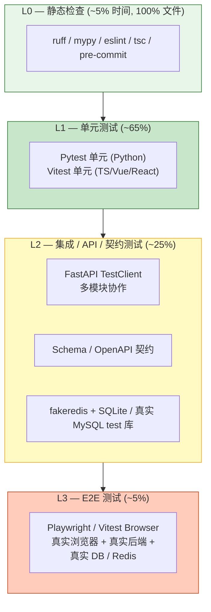
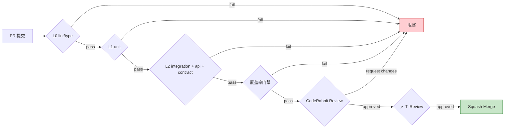

# 测试总体策略

| 版本 | 日期 | 修订内容 | 作者 | 评审 |
|------|------|----------|------|------|
| v1.0.0 | 2026-04-25 | 文档初版，建立 ISO/IEC/IEEE 29119 + Test Pyramid 体系 | dev-handbook-enterprise-rewrite/testing | 架构组 |

## 1. 概述

### 1.1 目的

本文档定义 Prorise AI Teach 平台的**整体测试策略**：测试金字塔、L0–L3 测试分级、覆盖率门禁、质量门、责任分工与度量体系，作为 `0002-单元测试指南.md`、`0003-集成测试指南.md`、`0004-E2E测试指南.md` 的总纲。

### 1.2 适用范围

| 适用 | 不适用 |
|------|--------|
| FastAPI 后端（`packages/fastapi-backend/`，Python ≥ 3.11） | RuoYi-Plus Java 端业务测试（沿用 SpringBoot Starter Test，本文不展开） |
| 学生端 `packages/student-web/`（**React + TypeScript / TSX**，Vite 6） | 第三方 SaaS 服务（OpenAI / Gemini API 自测，由 Provider 侧负责） |
| 管理后台 `packages/ruoyi-plus-soybean/`（**Vue 3 Soybean Admin**，**测试体系待补充**，参见 §5.2） | 真实硬件设备测试（无） |
| Code2Video 视频生成管道 | 性能基准与压测（详见 `008-部署与运维/`） |

### 1.3 阅读对象

研发工程师、测试工程师、架构师、SRE、PR Reviewer、技术 Leader。

### 1.4 术语缩写

| 缩写 | 全称 | 含义 |
|------|------|------|
| L0 | Static Check | 静态检查（lint / type-check） |
| L1 | Unit Test | 单元测试 |
| L2 | Integration Test | 集成测试（含 API 路由层） |
| L3 | E2E Test | 端到端测试 |
| SUT | System Under Test | 被测系统 |
| DOR | Definition of Ready | 就绪定义 |
| DOD | Definition of Done | 完成定义 |
| RACI | Responsible/Accountable/Consulted/Informed | 责任分配矩阵 |

## 2. 引用文件

### 2.1 内部文档

- `../004-开发规范/0008-story-交付门禁与-dor-dod.md`
- `../004-开发规范/0009-coderabbitai-pr-审查规范.md`
- `0002-单元测试指南.md`、`0003-集成测试指南.md`、`0004-E2E测试指南.md`
- `_bmad-output/INDEX.md`（Epic/Story SoT）

### 2.2 外部标准

- ISO/IEC/IEEE 29119-1:2022 *Software and systems engineering — Software testing — Concepts and definitions*
- ISO/IEC/IEEE 29119-2:2021 *Test processes*
- ISO/IEC/IEEE 29119-3:2021 *Test documentation*
- ISO/IEC 25010:2011 *Systems and software Quality Requirements and Evaluation (SQuaRE)*
- IEEE 829-2008 *Test Documentation*（参考）
- Mike Cohn, *Succeeding with Agile*（Test Pyramid 原始概念）
- Martin Fowler, *The Practical Test Pyramid*（2018）

## 3. 测试目标与原则

### 3.1 目标（与 ISO/IEC 25010 质量模型对齐）

| 质量属性 | 测试目标 | 主要测试层级 |
|----------|----------|--------------|
| 功能正确性（Functional Correctness） | 业务逻辑产出预期结果 | L1 / L2 |
| 功能完整性（Functional Completeness） | Story 验收清单全覆盖 | L2 / L3 |
| 可靠性（Reliability） | 异常路径、重试、熔断符合契约 | L1 / L2 |
| 性能效率（Performance Efficiency） | 关键接口 P95 ≤ SLO | L2 / 压测（独立） |
| 兼容性（Compatibility） | OpenAPI 契约不破坏既有客户端 | Contract（L2 子层） |
| 可维护性（Maintainability） | 测试自身可读、可重跑 | 全层级 |
| 安全性（Security） | 鉴权、注入防御 | L2 / L3 / 安全扫描 |

### 3.2 原则（MUST）

1. **测试即规约**：测试是 Story 的可执行验收标准，不是事后产物。
2. **快速反馈优先**：金字塔下层测试必须在 PR 提交后 5 分钟内给出结果。
3. **隔离与确定性**：单元测试不依赖网络、文件、数据库；集成测试使用真实组件但隔离数据。
4. **真实优先**：能用真实组件就不用 Mock（如 fakeredis 替代 Mock Redis；TestClient 替代 Mock Route）。
5. **失败即停**：任何 L0–L2 测试失败必须阻塞 PR 合并；不允许 `xfail` / `skip` 掩盖问题。
6. **零容忍掩盖手法**：禁止 `pytest.mark.skip` 跳测、`@ts-ignore` 绕过类型、`expect.fail()` 占位、把 timeout 调到天文数字。

### 3.3 反模式（MUST NOT）

| 反模式 | 危害 | 正确做法 |
|--------|------|----------|
| `pytest.mark.skip("flaky")` | 隐藏 bug，技术债积累 | 修根因；如确不可修，写 issue + `xfail(strict=True, reason=...)` |
| `await asyncio.sleep(5)` 等异步完成 | 时序不稳，CI 慢 | 使用事件 / 条件变量 / `wait_for` |
| 测试中 `time.sleep(10)` | 同上 | fakeredis + 显式状态判定 |
| Mock 整个 ORM 层 | 测的是 Mock 不是代码 | 用 SQLite in-memory 或测试库 |
| 一个测试函数 200 行 | 失败定位难 | 拆分为多个 `test_xxx_when_yyy` |
| 复制-粘贴断言 | 维护成本高 | 提取 fixture / helper |

## 4. 测试金字塔与分级（L0–L3）

### 4.1 金字塔模型


*图 4-1：Prorise AI Teach 测试金字塔（数量比例 / 自下而上执行）*

### 4.2 L0–L3 分级矩阵

| 层级 | 测试范围 | 工具 | 单测耗时 | 数量比例 | 失败处置 | 触发时机 |
|------|----------|------|----------|----------|----------|----------|
| **L0 静态检查** | 单文件语法、类型、风格 | ruff / mypy / eslint / tsc | < 50 ms | 100% 文件 | 阻塞 commit | pre-commit + CI |
| **L1 单元测试** | 单函数 / 单类，无 I/O | pytest（`-m unit`）/ vitest（`*.test.ts`） | < 200 ms / 个 | ~65% | 阻塞 PR | 每次 push |
| **L2 集成测试** | 多模块协作、Route → Service → Repository | pytest（`-m integration` / `-m api` / `-m contract`） + fakeredis + httpx.MockTransport | < 2 s / 个 | ~25% | 阻塞 PR | 每次 push |
| **L3 E2E 测试** | 跨前后端、真实浏览器 | Vitest Browser（`*.browser.test.ts`）+ Playwright | < 30 s / 个 | ~5% | 阻塞 release | nightly + pre-release |

### 4.3 各层级"在范围 / 不在范围"

#### L1 单元测试

- **在范围**：纯函数、Service 类的业务逻辑分支、Pydantic Schema 校验、Vue/React 组件渲染快照、工具函数。
- **不在范围**：HTTP 路由、真实数据库、真实 Redis、跨模块协作、外部 API。

#### L2 集成测试

- **在范围**：FastAPI 路由 + 鉴权依赖 + Service + Mock 外部依赖；Schema 契约（OpenAPI / JSON Schema）；任务队列 dispatch；DB 迁移正确性。
- **不在范围**：浏览器 UI 操作、跨服务调用真实远端（用 `httpx.MockTransport` 隔离）。

#### L3 E2E 测试

- **在范围**：登录 → 答题 → 视频生成 → 结果页 关键路径；管理后台 CRUD；前端 SSR/CSR 一致性。
- **不在范围**：性能压测（独立体系）、单浏览器内核多版本回归（仅 chromium）。

## 5. 测试范围与不在范围

### 5.1 在范围

- FastAPI 后端所有 `packages/fastapi-backend/app/features/**` 模块
- 学生端 `packages/student-web/src/**`（测试文件 colocated 在源码旁，约定 `*.test.{ts,tsx}` 与 `*.browser.test.{ts,tsx}`）
- 视频管道 `packages/fastapi-backend/app/features/video/pipeline/**`
- 任务框架 `packages/fastapi-backend/app/shared/task_framework/**`
- 鉴权 `packages/fastapi-backend/app/core/security.py`、`packages/fastapi-backend/app/features/auth/**`

### 5.2 不在范围 / 待补充

| 项 | 现状 | 处置 |
|----|------|------|
| 管理后台 `packages/ruoyi-plus-soybean/`（含其内嵌 `packages/{alova,axios,...}` 子包） | **目前无任何 `*.test.*` / `*.spec.*` 文件，未配置 vitest** | 视为「测试体系待补充」；新功能 PR 需按本文档约定逐步补建。先期靠 §5.3 E2E 与人工 UAT 兜底 |
| RuoYi-Plus Java 端业务测试 | 由 RuoYi 上游 + Java 团队负责 | 不展开 |
| AI Provider 真实可用性测试 | 由 `008-部署与运维/` 健康巡检负责 | 不展开 |
| 数据库迁移生产演练 | 由发布流程负责 | 不展开 |
| 大模型生成内容质量评估 | 由 `_bmad-output/` 评测体系负责 | 不展开 |

### 5.3 管理后台过渡期方案

在 ruoyi-plus-soybean 自测体系建立前：

- L1：新业务文件提交时同 PR 补 `*.test.ts`（沿用项目根的 vitest 模式，必要时新增 `vitest.config.ts`）
- L3：通过学生端 Playwright 触达后端的方式间接验证关键 CRUD（详见 `0004-E2E测试指南.md` §7.2）
- 人工 UAT：每个迭代结束按清单走查（产物挂在 Story 验收段）

## 6. 测试环境与数据

### 6.1 环境矩阵

| 环境 | 用途 | DB | Redis | 外部 LLM | 触发 |
|------|------|-----|-------|----------|------|
| Local Dev | 开发自测 | 本地 MySQL / SQLite | 本地 Redis 或 fakeredis | 真实或 stub | 手动 |
| CI（GitHub Actions） | PR / push 自动化 | SQLite in-memory | fakeredis | 全 Mock | push / PR |
| Staging | 类生产验证 | 独立 MySQL test 库 | 独立 Redis DB-1 | sandbox key | nightly |
| Production | 仅冒烟 | 生产只读探针 | — | — | release 后 5 分钟 |

### 6.2 数据策略

- **L1**：内联构造，不持久化。
- **L2**：fixture 创建 + 用例结束 rollback；禁止跨用例共享状态。
- **L3**：独立账号池 + 用例前后清理 + 标记 `e2e-` 前缀以便识别。

详细做法见 `0003-集成测试指南.md` §4 与 `0004-E2E测试指南.md` §5。

## 7. 工具与框架

| 层级 | 后端 | 前端（学生端） | 前端（管理后台 ruoyi-plus-soybean） |
|------|------|----------------|---------------------------------------|
| L0 | ruff、mypy、pre-commit | eslint、tsc、stylelint | eslint、tsc（已配置） |
| L1 | pytest、pytest-asyncio、pytest-cov | vitest（jsdom） | **未配置**（待补：vitest 推荐） |
| L2 | FastAPI TestClient、fakeredis、httpx.MockTransport、SQLite in-memory | vitest（msw） | **未配置** |
| L3 | — | Vitest Browser（playwright）、`*.browser.test.ts` | **未配置**（过渡期靠人工 UAT） |

**版本基线**（来自 `packages/fastapi-backend/pyproject.toml`、`packages/student-web/package.json`）：

- pytest >= 8.3, < 9.0
- pytest-asyncio >= 1.2, < 2.0
- pytest-cov >= 6.0, < 7.0
- vitest（peer 与 vite 5）
- @vitest/browser-playwright

## 8. 覆盖率与质量门禁

### 8.1 覆盖率指标定义

- **行覆盖（Line Coverage）**：被执行的可执行行 / 总可执行行
- **分支覆盖（Branch Coverage）**：被覆盖的判定分支 / 总判定分支
- **变更覆盖（Patch Coverage）**：当前 PR 新增/修改代码的行覆盖率（更重要）

### 8.2 门禁阈值（MUST）

| 指标 | 后端 FastAPI | 学生端 | 管理后台（建立后启用） | 视频管道（核心） |
|------|--------------|--------|------------------------|------------------|
| 整体行覆盖 | ≥ 70% | ≥ 60% | ≥ 50%（建立后） | ≥ 75% |
| 整体分支覆盖 | ≥ 60% | ≥ 50% | — | ≥ 65% |
| **PR 变更覆盖** | **≥ 80%** | **≥ 70%** | **≥ 60%（建立后）** | **≥ 85%** |
| 关键模块（`packages/fastapi-backend/app/core/security.py`、`app/features/auth/**`、`app/shared/task_framework/**`） | ≥ 85% | — | — | — |

> **PR 变更覆盖**比整体覆盖更重要：旧代码可逐步补，新代码必须达标。

### 8.3 质量门（Quality Gate）

合并到 `master` 前必须全部通过：


*图 8-1：PR 合并前的质量门链（参考 `.github/workflows/fastapi-backend-tests.yml`）*

### 8.4 流水线实现（参考 `.github/workflows/fastapi-backend-tests.yml`）

```yaml
# 关键 step
- name: Run FastAPI backend layered suite
  run: pnpm test:fastapi-backend:ci  # collect-only + unit + api + integration

- name: Run FastAPI backend coverage
  run: pnpm test:fastapi-backend:coverage  # --cov=app --cov-report=term-missing
```

对应根 `package.json` 脚本：

| 脚本 | 含义 |
|------|------|
| `pnpm test:fastapi-backend:unit` | 仅 `-m unit` |
| `pnpm test:fastapi-backend:api` | `-m 'api or contract'` |
| `pnpm test:fastapi-backend:integration` | `-m integration` |
| `pnpm test:fastapi-backend:contracts` | `-m contract` |
| `pnpm test:fastapi-backend:coverage` | 全量 + `--cov=app` |
| `pnpm test:fastapi-backend:ci` | collect-only + unit + api + integration（CI 默认） |
| `pnpm test:student-web` | vitest run |
| `pnpm test:student-web:e2e` | vitest browser |
| `pnpm test:student-web:coverage` | vitest coverage |

> **CI 现状（已验证 `.github/workflows/`）**：仅 `fastapi-backend-tests.yml` 一条工作流。前端（student-web vitest / 浏览器）**尚未接入 GitHub Actions**——目前依赖本地 `pnpm test:student-web` + Reviewer 把关。**前端 CI 待补充**，详见 `0004-E2E测试指南.md` §8.2 给出的建议工作流（属规划稿）。

## 9. 责任分工（RACI）

| 活动 | Dev | Reviewer | QA | SRE | Architect |
|------|-----|----------|-----|-----|-----------|
| 编写 L1 单元测试 | **R/A** | C | I | — | — |
| 编写 L2 集成 / 契约测试 | **R/A** | C | C | I | I |
| 编写 L3 E2E 测试 | R | C | **A** | I | — |
| Story 验收用例评审 | C | C | **R/A** | — | C |
| 覆盖率门禁配置 | C | I | C | C | **R/A** |
| CI 测试稳定性维护 | C | I | C | **R/A** | I |
| 测试环境数据管理 | I | — | **R/A** | C | — |
| 缺陷分级与回归测试 | R | I | **R/A** | I | C |

> R = Responsible（执行）、A = Accountable（最终负责）、C = Consulted（协商）、I = Informed（知会）

## 10. 缺陷管理

### 10.1 缺陷分级

| 级别 | 定义 | 修复 SLA | 是否阻塞发布 |
|------|------|----------|--------------|
| P0 - Blocker | 核心流程不可用、数据丢失、安全漏洞 | 4 小时内 | 阻塞 |
| P1 - Critical | 关键功能严重损坏、有 workaround | 24 小时内 | 阻塞 |
| P2 - Major | 非关键功能损坏 / 体验严重劣化 | 一个迭代内 | 不阻塞但需排期 |
| P3 - Minor | 视觉、文案、边角 case | 排期可选 | 不阻塞 |

### 10.2 流程

1. 发现 → GitHub Issue（label: `bug`、`P0/P1/P2/P3`）
2. 复现路径 + 期望/实际行为 + 影响面 + 截图/日志
3. 修复 PR 必须包含**回归测试**（在 L1 或 L2 加用例覆盖该 case）
4. 合并后关联 Issue 自动关闭

## 11. 度量与报告

### 11.1 关键指标

| 指标 | 计算口径 | 目标 | 数据源 |
|------|----------|------|--------|
| 测试通过率 | 通过 / 总数 | ≥ 99.5% | CI 日志 |
| 平均流水线时长 | PR 触发到全部 job 完成 | ≤ 8 min | GitHub Actions |
| 测试稳定性（Flake Rate） | 重跑通过 / 首次失败 | ≤ 0.5% | GitHub Actions |
| Patch Coverage | 见 §8.2 | 见 §8.2 | pytest-cov / vitest c8 |
| 缺陷逃逸率 | 生产缺陷 / 总缺陷 | ≤ 5% | Issue 标签统计 |
| 单测时长 P95 | 单个测试函数耗时 | ≤ 1 s | pytest `--durations` |

### 11.2 报告周期

- **每 PR**：覆盖率注释、失败用例 diff、CodeRabbit 摘要
- **每周**：sprint 测试报告（写入 `_bmad-output/sprint-status.yaml`）
- **每 Epic**：测试覆盖度回顾（写入对应 Epic 文档 retro 段）

## 12. 与其他章节的链接

- 单测怎么写 → `0002-单元测试指南.md`
- 集成 / API / 契约怎么写 → `0003-集成测试指南.md`
- E2E 怎么写 → `0004-E2E测试指南.md`
- DOR / DOD → `../004-开发规范/0008-story-交付门禁与-dor-dod.md`
- PR Review → `../004-开发规范/0009-coderabbitai-pr-审查规范.md`

## 附录 A：术语对照

| 中文 | 英文 | 说明 |
|------|------|------|
| 测试金字塔 | Test Pyramid | 自下而上数量递减、价值递增 |
| 测试替身 | Test Double | Mock/Stub/Spy/Fake 的统称 |
| 契约测试 | Contract Test | 验证 API Schema 不破坏调用方 |
| 变更覆盖 | Patch Coverage | 当前 PR 修改行的覆盖率 |
| 不稳定测试 | Flaky Test | 同一代码反复跑结果不一致 |

## 附录 B：参考资料

- ISO/IEC/IEEE 29119:2021/2022 系列
- ISO/IEC 25010:2011
- Martin Fowler, *The Practical Test Pyramid* — https://martinfowler.com/articles/practical-test-pyramid.html
- Google Testing Blog — *Just Say No to More End-to-End Tests*
- 项目 CI：`.github/workflows/fastapi-backend-tests.yml`
- pytest 配置：`packages/fastapi-backend/pytest.ini`
- vitest 配置：`packages/student-web/vitest.config.ts`、`packages/student-web/vitest.browser.config.ts`
