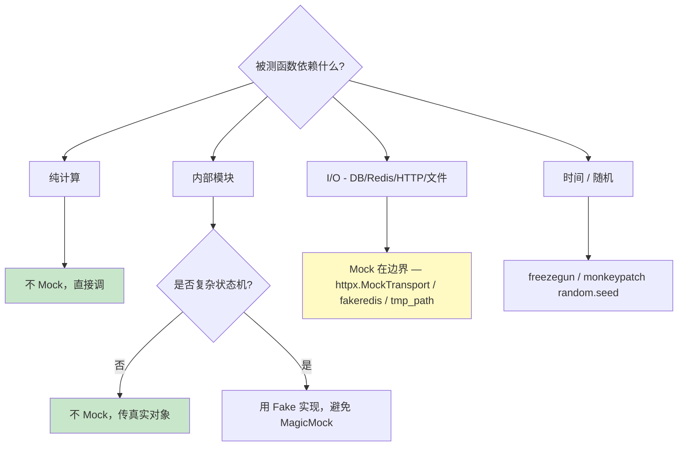

# 单元测试指南

| 版本 | 日期 | 修订内容 | 作者 | 评审 |
|------|------|----------|------|------|
| v1.0.0 | 2026-04-25 | 文档初版，对齐 Pytest + Vitest 实操规范 | dev-handbook-enterprise-rewrite/testing | 架构组 |

## 1. 概述

### 1.1 目的

定义 L1 单元测试的**目标、命名、目录、Mock 策略、覆盖率门禁与反模式**，覆盖：

- FastAPI 后端（Pytest，Python ≥ 3.11，`packages/fastapi-backend/`）
- 学生端（Vitest jsdom，**React + TypeScript / TSX**，`packages/student-web/`，配置 `vitest.config.ts`）
- 管理后台（Vue 3 Soybean Admin，`packages/ruoyi-plus-soybean/`）：**当前无 vitest 配置与单测文件，体系待补充**——本指南规则适用，新增业务文件时同 PR 补建（可借鉴学生端 vitest 配置）

### 1.2 适用范围

- 在范围：单函数、单类、单组件渲染、纯逻辑分支、Schema 校验
- 不在范围：HTTP 路由（→ `0003-集成测试指南.md` §3）、跨模块协作（→ §3）、真实浏览器交互（→ `0004-E2E测试指南.md`）

### 1.3 阅读对象

研发工程师、Reviewer、新入职工程师。

### 1.4 术语缩写

| 缩写 | 全称 | 说明 |
|------|------|------|
| SUT | System Under Test | 被测系统 |
| AAA | Arrange-Act-Assert | 三段式测试结构 |
| FIRST | Fast / Isolated / Repeatable / Self-validating / Timely | 单元测试五原则 |
| Test Double | Mock / Stub / Spy / Fake | 测试替身的统称 |

## 2. 引用文件

- `0001-测试总体策略.md` §3、§4、§8
- `../004-开发规范/0001-编码规范.md`
- 配置文件：`packages/fastapi-backend/pytest.ini`、`packages/fastapi-backend/tests/conftest.py`、`packages/student-web/vitest.config.ts`
- ISO/IEC/IEEE 29119-4:2021 *Test techniques*
- Roy Osherove, *The Art of Unit Testing*

## 3. 测试目标与原则

### 3.1 FIRST 原则

| 字母 | 含义 | 落地要求 |
|------|------|----------|
| **F**ast | 单测 < 200 ms / 个 | 不允许 sleep、不允许网络/磁盘 IO |
| **I**solated | 用例间无共享状态 | 不依赖外部用例顺序、不依赖全局变量 |
| **R**epeatable | 任何机器、任何时间结果一致 | 不依赖时区、不依赖随机种子（除非 seed 已 fixed） |
| **S**elf-validating | 用 assert 自动判定 | 禁止打印日志由人眼判断 |
| **T**imely | 与产品代码同 PR 提交 | DOD 强制 |

### 3.2 AAA 结构（强制）

```python
def test_user_can_be_marked_inactive():
    # Arrange — 构造数据 + SUT
    user = User(id=1, status="active")

    # Act — 触发被测行为
    user.mark_inactive()

    # Assert — 唯一一段断言
    assert user.status == "inactive"
```

### 3.3 测试目标

每个测试函数回答**唯一一个问题**："当 X 条件下，Y 行为是否产生 Z 结果？"

## 4. 命名与目录规范

### 4.1 后端（Pytest）

#### 目录结构（来自 `packages/fastapi-backend/tests/`）

```
tests/
├── conftest.py              # 全局 fixture
├── unit/                    # L1 单元（标记 unit）
│   ├── auth/
│   ├── core/
│   ├── video/
│   ├── task_framework/
│   ├── learning/
│   ├── learning_coach/
│   ├── classroom/
│   ├── companion/
│   ├── infra/
│   ├── providers/
│   ├── shared/
│   ├── assets/
│   └── openmaic/
├── api/                     # L2 路由（标记 api，本指南不涉及）
├── integration/             # L2 集成（不涉及）
├── contracts/               # L2 契约（不涉及）
└── helpers/                 # 测试辅助
```

> 目录与 `app/features/<feature>/` 一一对应，便于 grep 定位。

#### 命名

| 元素 | 规则 | 示例 |
|------|------|------|
| 文件名 | `test_<被测模块>.py` | `test_video_cancel_service.py` |
| 函数名 | `test_<场景>_<期望结果>` | `test_cancel_returns_404_when_task_missing` |
| 类（可选） | `Test<被测类>` | `class TestVideoRuntimeStore:` |
| 参数化 ID | `pytest.param(..., id="explicit-name")` | `id="missing-token"` |

#### 标记（pytest markers）

`packages/fastapi-backend/tests/conftest.py:64-78` 已经按目录自动加 marker。**手写测试无需重复加** `@pytest.mark.unit`，但跨标记可手动叠加：

```python
@pytest.mark.slow  # 仅在标记 slow 时手动添加
def test_long_running_compute(): ...
```

### 4.2 前端（Vitest）

#### 目录约定

- 学生端：源文件旁同名 `*.test.ts` / `*.test.tsx`（被 `vitest.config.ts:13` 的 `include` 匹配）
- 浏览器测试：`*.browser.test.ts`（被 browser config 匹配，属于 L3，不在本指南范围）

```
packages/student-web/src/
├── features/
│   └── quiz/
│       ├── quiz-card.tsx
│       ├── quiz-card.test.tsx        # 单元（jsdom）
│       └── quiz-card.browser.test.tsx # E2E（playwright，见 0004）
```

#### 命名

| 元素 | 规则 | 示例 |
|------|------|------|
| 文件 | `<src>.test.tsx` | `quiz-card.test.tsx` |
| describe | `describe('<被测对象>')` | `describe('QuizCard')` |
| it/test | `it('should <期望> when <条件>')` | `it('should disable submit when answer is empty')` |

## 5. 工具与命令

### 5.1 Pytest

| 命令 | 用途 |
|------|------|
| `pnpm test:fastapi-backend:unit` | 仅运行 `-m unit`（CI 默认） |
| `pnpm test:fastapi-backend` | 跑所有 marker（本地全量） |
| `pnpm test:fastapi-backend:coverage` | 全量 + `--cov=app --cov-report=term-missing` |
| `packages/fastapi-backend/.venv/bin/python -m pytest tests/unit/auth -k login -vv` | 局部调试 |
| `pytest --durations=10` | 输出最慢 10 个用例 |
| `pytest -x --ff` | 失败即停 + 失败优先 |

### 5.2 Vitest

| 命令 | 用途 |
|------|------|
| `pnpm test:student-web` | 一次性运行（CI） |
| `pnpm --filter @xiaomai/student-web test:watch` | 本地 watch |
| `pnpm test:student-web:coverage` | 覆盖率（c8） |

## 6. Mock 策略（核心）

### 6.1 Mock 决策树


*图 6-1：Mock 决策树（优先真实对象 → Fake → Mock）*

### 6.2 Mock 工具选择

| 场景 | 工具 | 文件示例 |
|------|------|----------|
| HTTP 客户端（RuoYiClient/外部 API） | `httpx.MockTransport` | `tests/conftest.py:36`、`tests/integration/learning/test_learning_result_persistence.py:30` |
| Redis / 任务状态 | `fakeredis`（aiofakeredis 异步版） | `tests/unit/task_framework/` |
| 时间 | `freezegun.freeze_time` 或 `monkeypatch.setattr('module.datetime', ...)` | — |
| 文件系统 | pytest 内置 `tmp_path` fixture | `tests/unit/video/test_understanding_vision_hotfix.py:14` |
| 配置（Settings） | `monkeypatch.setattr('app.x.get_settings', lambda: MockSettings())` | 同上 |
| 异步 callable | `unittest.mock.AsyncMock` | `tests/unit/video/test_video_cancel_service.py:7` |
| 普通 callable | `unittest.mock.MagicMock` | 同上 |
| FastAPI 鉴权 | `app.dependency_overrides[get_access_context]`（封装在 `tests/conftest.py:override_auth`） | `tests/conftest.py:30` |

### 6.3 Mock 原则（MUST）

1. **只 Mock 外部边界**——DB / Redis / HTTP / 文件系统 / 大模型；不要 Mock 自家 Service。
2. **优先 Fake 而非 Mock**——`fakeredis` 比 `MagicMock(spec=Redis)` 更真实。
3. **断言行为而非实现**——断言"调用了某个公共方法返回结果"，不要断言"私有方法被调 3 次"。
4. **Mock 必须 spec**——`MagicMock(spec=RuoYiClient)`，避免 typo 静默通过。

### 6.4 Mock 反模式（MUST NOT）

| 反模式 | 为什么不行 | 替代 |
|--------|------------|------|
| `MagicMock()` 无 spec | typo 不会报错 | 加 `spec=` 或用真实类 |
| Mock 自家纯函数 | 等于不测 | 直接调用真实函数 |
| `monkeypatch.setattr('module.func', lambda *a, **kw: None)` 静默吞错 | 隐藏问题 | 抛 `RuntimeError("not expected to be called")` |
| 在 SUT 内部 patch private 方法绕过校验 | 测试失去意义 | 重构 SUT，让校验路径可被外部触发 |

## 7. 测试模板

### 7.1 后端 Pytest 模板（同步）

参考 `packages/fastapi-backend/tests/unit/video/test_understanding_vision_hotfix.py:14`：

```python
"""单元测试：<模块用途>。

每个测试函数遵循 AAA 结构，命名 test_<场景>_<期望>。
"""
import pytest

from app.features.<feature>.<module> import target_function


def test_target_returns_none_when_input_empty():
    # Arrange / Act
    result = target_function("")

    # Assert
    assert result is None


def test_target_reads_jpeg(tmp_path, monkeypatch):
    # Arrange
    class MockSettings:
        video_image_storage_root = str(tmp_path)

    monkeypatch.setattr(
        "app.features.video.pipeline.services.get_settings",
        lambda: MockSettings(),
    )
    img = tmp_path / "test.jpg"
    img.write_bytes(b"\xff\xd8\xff\xe0\x00\x10JFIF")

    # Act
    result = target_function(f"local://{img.name}")

    # Assert
    assert result is not None
    b64, mime = result
    assert mime == "image/jpeg"
    assert len(b64) > 0


@pytest.mark.parametrize(
    "raw,expected",
    [
        pytest.param("", None, id="empty-string"),
        pytest.param("invalid", None, id="not-a-uri"),
        pytest.param("local://nonexistent.jpg", None, id="missing-file"),
    ],
)
def test_target_handles_invalid_input(raw, expected):
    assert target_function(raw) is expected
```

### 7.2 后端 Pytest 模板（异步）

参考 `packages/fastapi-backend/tests/unit/video/test_video_cancel_service.py:1`：

```python
from __future__ import annotations
from unittest.mock import AsyncMock, MagicMock

import pytest

from app.core.security import AccessContext
from app.features.video.service.cancel_task import cancel_video_task


def _build_access_context(*, user_id: str = "10001") -> AccessContext:
    return AccessContext(
        user_id=user_id,
        username="video_student",
        roles=("student",),
        permissions=("*:*:*",),
        token="test-token",
        client_id="test-client-id",
        request_id="req-test",
        online_ttl_seconds=600,
    )


@pytest.mark.asyncio
async def test_cancel_returns_not_found_when_task_missing():
    # Arrange
    store = MagicMock()
    store.get = AsyncMock(return_value=None)
    ctx = _build_access_context()

    # Act / Assert
    with pytest.raises(LookupError):
        await cancel_video_task(task_id="not-exist", store=store, ctx=ctx)
```

### 7.3 前端 Vitest 模板（组件）

```typescript
// packages/student-web/src/features/quiz/quiz-card.test.tsx
import { describe, it, expect, vi } from 'vitest';
import { render, screen, fireEvent } from '@testing-library/react';

import { QuizCard } from './quiz-card';

describe('QuizCard', () => {
  it('should render the question text', () => {
    render(<QuizCard question="2+2=?" options={['3', '4']} onSubmit={vi.fn()} />);
    expect(screen.getByText('2+2=?')).toBeInTheDocument();
  });

  it('should call onSubmit with selected option when user clicks submit', () => {
    const onSubmit = vi.fn();
    render(<QuizCard question="2+2=?" options={['3', '4']} onSubmit={onSubmit} />);

    fireEvent.click(screen.getByRole('radio', { name: '4' }));
    fireEvent.click(screen.getByRole('button', { name: /submit/i }));

    expect(onSubmit).toHaveBeenCalledExactlyOnceWith('4');
  });

  it('should disable submit when no option is selected', () => {
    render(<QuizCard question="2+2=?" options={['3', '4']} onSubmit={vi.fn()} />);
    expect(screen.getByRole('button', { name: /submit/i })).toBeDisabled();
  });
});
```

### 7.4 前端 Vitest 模板（纯函数 + Mock 模块）

```typescript
import { describe, it, expect, vi, beforeEach } from 'vitest';

vi.mock('@/lib/clock', () => ({
  now: vi.fn(),
}));
import { now } from '@/lib/clock';
import { formatRelativeTime } from './format';

describe('formatRelativeTime', () => {
  beforeEach(() => {
    vi.mocked(now).mockReturnValue(new Date('2026-04-25T10:00:00Z'));
  });

  it('returns "刚刚" when within 60 seconds', () => {
    const ts = new Date('2026-04-25T09:59:30Z');
    expect(formatRelativeTime(ts)).toBe('刚刚');
  });
});
```

## 8. 覆盖率门禁

### 8.1 阈值（来自 `0001-测试总体策略.md` §8.2）

| 指标 | 后端 | 学生端 | 关键模块（auth/core/task_framework） |
|------|------|--------|---------------------------------------|
| 行覆盖 | ≥ 70% | ≥ 60% | ≥ 85% |
| 分支覆盖 | ≥ 60% | ≥ 50% | ≥ 75% |
| PR 变更覆盖 | ≥ 80% | ≥ 70% | ≥ 90% |

### 8.2 本地覆盖率检查

```bash
# 后端
pnpm test:fastapi-backend:coverage
# 输出含 "TOTAL  xxxx  yyyy  zz%" 与每个文件的 missing line

# 前端
pnpm test:student-web:coverage
# 输出 coverage/index.html
```

### 8.3 CI 自动门禁

`.github/workflows/fastapi-backend-tests.yml` 已经在 PR 上跑 `pnpm test:fastapi-backend:coverage`；阈值由 PR Review 通过 CodeRabbit + 人工把关（详见 `../004-开发规范/0009-coderabbitai-pr-审查规范.md`）。

## 9. 反模式（MUST NOT）

| 反模式 | 危害 | 修复方式 |
|--------|------|----------|
| `pytest.mark.skip("flaky later")` | 隐藏 bug | 修根因；不可修则 `xfail(strict=True, reason="GH-#123")` |
| `time.sleep(2)` 等异步完成 | 不稳定且慢 | `await asyncio.wait_for(event.wait(), timeout=1)` |
| `assert True` / `assert result is not None` 单一断言 | 没测到业务 | 至少断言 1 个具体值 |
| 一个 `test_xxx` 函数测 5 件事 | 失败定位难 | 拆分为 5 个独立 test |
| `MagicMock` 无 `spec=` | typo 永远不报错 | `MagicMock(spec=RealClass)` 或用真实对象 |
| `@ts-ignore` / `as any` 绕过类型 | 类型保护失效 | 修类型；不可修则用 `as unknown as T` 并加 `// FIXME(#issue)` |
| `expect(true).toBe(true)` 占位 | 假绿色 | 删掉或写真测试 |
| 测试中 `print` / `console.log` | 污染输出 | 删掉，用断言代替 |
| 共享可变全局 fixture | 用例顺序耦合 | `scope="function"` + 工厂函数 |
| 把 `timeout` 调到 60s 让 flaky 通过 | 掩盖性能问题 | 找根因（死锁、忘 await）|

## 10. PR 检查清单（DOD）

提交 PR 前自检：

- [ ] 所有新增/修改函数有对应 test
- [ ] `pytest -m unit` / `vitest run` 全绿
- [ ] 无 `skip`、`xfail` 不带 reason / GH issue
- [ ] 无 `time.sleep` / 大于 5s 的 timeout
- [ ] Mock 都有 `spec=` 或使用真实对象
- [ ] 文件命名、函数命名符合 §4
- [ ] AAA 结构清晰（每个测试 ≤ 30 行）
- [ ] PR 变更覆盖 ≥ 阈值（§8）
- [ ] `pytest --durations=10` 没有超过 1s 的 unit

## 附录 A：术语对照

| 中文 | 英文 | 说明 |
|------|------|------|
| 测试替身 | Test Double | Mock/Stub/Spy/Fake 总称 |
| 假对象 | Fake | 简化但能用的实现，如 fakeredis |
| 间谍 | Spy | 记录调用但不改变行为 |
| 桩 | Stub | 返回固定值 |

## 附录 B：参考资料

- Pytest 官方：https://docs.pytest.org/
- Vitest 官方：https://vitest.dev/
- pytest-asyncio：https://pytest-asyncio.readthedocs.io/
- fakeredis：https://github.com/cunla/fakeredis-py
- 项目配置：`packages/fastapi-backend/pytest.ini`、`packages/fastapi-backend/tests/conftest.py`
