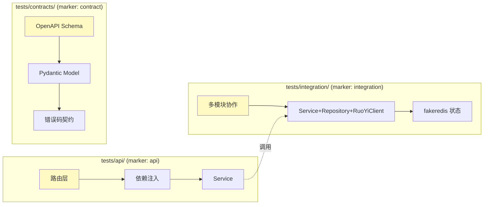
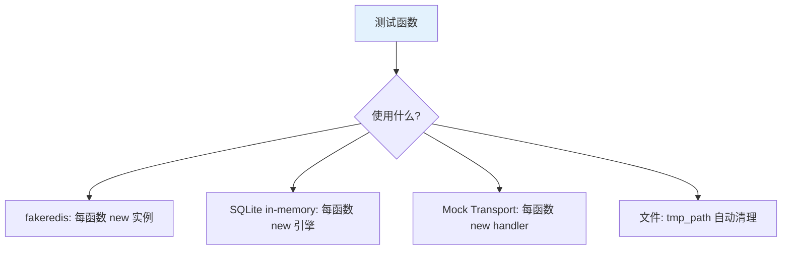

# 集成测试指南

| 版本 | 日期 | 修订内容 | 作者 | 评审 |
|------|------|----------|------|------|
| v1.0.0 | 2026-04-25 | 文档初版，对齐 FastAPI TestClient + fakeredis + 契约测试规范 | dev-handbook-enterprise-rewrite/testing | 架构组 |

## 1. 概述

### 1.1 目的

定义 L2 集成测试（含 API 路由、Schema 契约、跨模块协作）的实操规范。覆盖：

- **API 测试**（`tests/api/`，marker `api`）：FastAPI 路由 + 鉴权 + Service
- **集成测试**（`tests/integration/`，marker `integration`）：多模块协作、数据持久化、任务派发
- **契约测试**（`tests/contracts/`，marker `contract`）：OpenAPI Schema 不破坏既有客户端

### 1.2 适用范围

| 在范围 | 不在范围 |
|--------|----------|
| FastAPI 路由请求/响应 | 真实浏览器 UI（→ `0004-E2E测试指南.md`） |
| Service 调用 RuoYiClient（用 Mock Transport） | RuoYi-Plus Java 端业务测试 |
| Redis 状态读写（fakeredis） | 真实生产 Redis 集群验证 |
| 任务队列 dispatch 流程 | 长跑性能压测 |
| OpenAPI Schema 兼容性 | 业务正确性细粒度（→ `0002-单元测试指南.md`） |

### 1.3 阅读对象

后端工程师、测试工程师、Reviewer。

### 1.4 术语缩写

| 缩写 | 说明 |
|------|------|
| TestClient | `fastapi.testclient.TestClient`，基于 httpx |
| Mock Transport | `httpx.MockTransport`，拦截 httpx 客户端请求 |
| Fake | 简化但功能正确的实现（如 fakeredis） |
| Contract | API 契约（Schema + 错误码 + 鉴权要求） |

## 2. 引用文件

- `0001-测试总体策略.md` §4.2、§4.3、§8
- `0002-单元测试指南.md`（边界规则）
- `../003-架构设计/0004-API设计规范.md`
- 配置：`packages/fastapi-backend/pytest.ini`、`packages/fastapi-backend/tests/conftest.py`、`packages/fastapi-backend/tests/helpers/app.py`
- ISO/IEC/IEEE 29119-4:2021（集成测试技术）
- IEEE 1012-2016 *V&V Process*

## 3. 集成测试范围

### 3.1 三个子层


*图 3-1：集成测试三个子层与 SUT 边界*

### 3.2 子层职责

| 子层 | SUT 边界 | Mock 边界 | 主要断言 |
|------|----------|-----------|----------|
| API（`tests/api/`） | HTTP 入口 → Service | 数据库/Redis/外部 HTTP | 状态码、响应 Schema、副作用调用次数 |
| Integration（`tests/integration/`） | Service → Repository → 外部边界 | 仅外部 HTTP（用 MockTransport） | 多步业务流、数据落地正确性、状态机转换 |
| Contract（`tests/contracts/`） | 整个 OpenAPI 文档 | — | Schema 字段不增删（破坏性变更） |

## 4. 测试环境与数据

### 4.1 环境策略（CI 默认 = SQLite + fakeredis）

| 资源 | CI / 默认 | 本地可选 | 何时切真实 |
|------|-----------|----------|------------|
| HTTP 客户端（RuoYi/外部 API） | `httpx.MockTransport` | 同 CI | 永不（避免环境耦合） |
| Redis | `fakeredis.FakeAsyncRedis` | 本地 redis:7 | 调试 race condition 时本地切真实 |
| MySQL | SQLite in-memory（迁移到位时） | 独立 test 库 | nightly Staging |
| 鉴权 | `dependency_overrides[get_access_context]` | 同 CI | E2E 才用真 token |

### 4.2 数据生命周期

每个测试函数独立：

1. **Setup**：fixture 构造 SUT、注入 Mock Transport、覆盖鉴权依赖
2. **Exercise**：通过 TestClient 发请求 / 直接调 Service
3. **Verify**：断言响应 + 内部状态（`captured_payloads` 列表）
4. **Teardown**：fixture 自动清理（pytest 默认 function scope）

### 4.3 数据库迁移测试

涉及 Alembic 迁移的 PR 必须包含一个集成测试，验证：

```python
@pytest.mark.integration
def test_alembic_upgrade_then_downgrade_is_reversible(tmp_path):
    db_url = f"sqlite:///{tmp_path}/test.db"
    cfg = Config("alembic.ini")
    cfg.set_main_option("sqlalchemy.url", db_url)

    command.upgrade(cfg, "head")
    command.downgrade(cfg, "base")  # 必须可逆，否则发布回滚卡死
```

## 5. 工具链与命令

### 5.1 框架与依赖

| 用途 | 库 | 版本 | 引用 |
|------|-----|------|------|
| TestClient | `fastapi.testclient` | 随 fastapi | `tests/integration/learning/test_learning_result_persistence.py:6` |
| Mock HTTP | `httpx.MockTransport` | httpx 0.27+ | `tests/conftest.py:42` |
| Fake Redis | `fakeredis` | >= 2.21 | `tests/unit/task_framework/` |
| 异步 | `pytest-asyncio` | >= 1.2, < 2.0 | `pyproject.toml` |
| 覆盖率 | `pytest-cov` | >= 6.0 | 同上 |

### 5.2 命令

```bash
# 仅 API 路由测试
pnpm test:fastapi-backend:api

# 仅集成测试
pnpm test:fastapi-backend:integration

# 仅契约测试
pnpm test:fastapi-backend:contracts

# CI 三件套（collect-only 检查 + unit + api + integration）
pnpm test:fastapi-backend:ci

# 局部调试（带详细输出）
packages/fastapi-backend/.venv/bin/python -m pytest \
    -m "api or integration" \
    -k "video and cancel" \
    -vv -x packages/fastapi-backend/tests
```

### 5.3 自动 marker 机制

`packages/fastapi-backend/tests/conftest.py:64-78` 实现：测试根据所在目录自动获得 marker（unit/api/integration/contract/e2e），**无需手写** `@pytest.mark.integration`。

## 6. 编写规范（API 测试）

### 6.1 标准 API 测试结构

参考 `tests/integration/learning/test_learning_result_persistence_api.py:1`：

```python
import json
import httpx
import pytest
from fastapi.testclient import TestClient

from app.features.learning.routes import get_learning_service
from app.features.learning.service import LearningService
from tests.conftest import build_mock_client_factory
from tests.helpers.app import create_authed_app


def _create_client(handler) -> TestClient:
    """构造一个已注入鉴权 + Mock RuoYi 的 TestClient。"""
    app = create_authed_app()  # 内部已 override_auth
    factory = build_mock_client_factory(handler)  # tests/conftest.py:36
    app.dependency_overrides[LearningService.client_factory_dep] = lambda: factory
    return TestClient(app)


@pytest.fixture
def captured() -> tuple[list[dict], list[str]]:
    return [], []


def test_post_learning_record_persists_to_ruoyi(captured):
    payloads, paths = captured

    def handler(request: httpx.Request) -> httpx.Response:
        paths.append(request.url.path)
        payloads.append(json.loads(request.content) if request.content else None)
        return httpx.Response(200, json={"code": 200, "msg": "ok", "data": {...}})

    client = _create_client(handler)

    # Act
    resp = client.post(
        "/api/v1/learning/records",  # FastAPI 入站接口走 /api/v1 前缀
        json={"userId": "10001", "records": [{"checkpoint": "ch01"}]},
    )

    # Assert: 响应
    assert resp.status_code == 200
    assert resp.json()["code"] == 200

    # Assert: 副作用（调了 RuoYi 一次，路径正确）
    assert paths == ["/api/xm/learning/records"]
    assert payloads[0]["userId"] == "10001"
```

### 6.2 鉴权处理

`tests/conftest.py:30` 提供的 `override_auth(app, ctx=None)`：

```python
from tests.conftest import override_auth, MOCK_ACCESS_CONTEXT

# 默认超管
app = create_app()
override_auth(app)

# 自定义角色
override_auth(app, AccessContext(
    user_id="20001",
    username="student",
    roles=("student",),
    permissions=("learning:read",),
    ...
))
```

### 6.3 错误路径必测项

| 场景 | 期望状态码 | 期望错误码 |
|------|------------|------------|
| 未登录 | 401 | AUTH-001 |
| 无权限 | 403 | AUTH-002 |
| 入参缺字段 | 422 | VALIDATION-001 |
| 资源不存在 | 404 | RESOURCE-001 |
| 业务规则失败 | 409 | BIZ-xxx |
| 上游 RuoYi 5xx | 502 | UPSTREAM-001 |
| 上游超时 | 504 | UPSTREAM-002 |

每个新路由 PR **必须**至少覆盖：1 条 happy path + 401 + 422 + 1 条业务异常。

## 7. 编写规范（集成测试）

### 7.1 多模块协作示例

```python
@pytest.mark.asyncio
async def test_video_create_then_cancel_writes_redis_state(fake_redis):
    # Arrange
    store = VideoRuntimeStateStore(redis=fake_redis)
    ctx = _build_access_context()

    # Act 1: 创建任务
    task_id = await create_video_task(store=store, ctx=ctx, payload={...})
    assert await store.get(task_id) is not None

    # Act 2: 取消任务
    await cancel_video_task(task_id=task_id, store=store, ctx=ctx)

    # Assert: 状态机转到 CANCELLED
    state = await store.get(task_id)
    assert state.status == TaskStatus.CANCELLED
    assert state.internal == TaskInternalStatus.TERMINATED
```

### 7.2 Mock Transport 模式（标准化）

`tests/conftest.py:36-58` 提供 `build_mock_client_factory(handler)`，所有外部 HTTP 调用（RuoYi、AI Provider）必须通过此模式：

```python
def handler(request: httpx.Request) -> httpx.Response:
    if request.url.path == "/api/users/10001":
        return httpx.Response(200, json={"code": 200, "data": {"name": "Alice"}})
    if request.url.path.startswith("/api/x/"):
        return httpx.Response(404, json={"code": 404, "msg": "not found"})
    pytest.fail(f"unexpected request: {request.url}")  # 关键：未预期请求 = 测试失败

factory = build_mock_client_factory(handler)
```

> 关键原则：**未预期的外部调用必须 `pytest.fail`**，不要静默放行。

### 7.3 异步与并发

| 场景 | 写法 |
|------|------|
| 异步函数测试 | `@pytest.mark.asyncio` + `async def test_xxx` |
| 等待事件 | `await asyncio.wait_for(event.wait(), timeout=1.0)`；**禁止** `asyncio.sleep(N)` 轮询 |
| 并发场景 | `await asyncio.gather(coro1, coro2)` + 断言最终状态 |
| 超时验证 | `with pytest.raises(asyncio.TimeoutError): await asyncio.wait_for(...)` |

## 8. 编写规范（契约测试）

### 8.1 目的

确保对客户端公开的 API 契约不被破坏。参考 `tests/contracts/test_openapi_contracts.py`。

### 8.2 检查项

| 检查 | 工具 | 失败处理 |
|------|------|----------|
| 路径不丢失 | 比对 `app.openapi()["paths"]` 与基线 JSON | 阻塞 PR，需评审 + 客户端协同 |
| 字段不删除 | 递归比对 schema | 同上 |
| 错误码不收窄 | 比对 `responses` 块 | 同上 |
| 鉴权要求不放宽 | `security` 字段比对 | 必须显式 review |

### 8.3 基线管理

- 基线文件：`tests/contracts/baselines/openapi-vN.json`（每次主版本升级新建）
- 破坏性变更必须更新基线 + Story 标注 `breaking-change` + 文档同步

## 9. 数据隔离

### 9.1 状态隔离层级


*图 9-1：每个测试函数都有独立外部状态副本*

### 9.2 共享状态规则（MUST NOT）

- 不允许 `scope="session"` 的可变 Redis fixture
- 不允许全局 `_seen_ids = set()`
- 不允许测试用例改环境变量未还原（用 `monkeypatch.setenv` 自动还原）

## 10. 反模式（MUST NOT）

| 反模式 | 危害 | 修复 |
|--------|------|------|
| 用真实 RuoYi/外部 API | CI 不稳，依赖网络 | 用 `httpx.MockTransport` |
| 测试中 `time.sleep(5)` 等任务完成 | 慢且 flaky | `await asyncio.wait_for(condition, timeout)` |
| Mock 整个 Service 让路由层"通过" | 等于不测 | Mock 边界（HTTP/Redis），保留 Service |
| 一个测试发 10 次请求做 5 件事 | 失败定位难 | 拆分多个 test |
| 未覆盖错误路径 | 生产报 500 才发现 | §6.3 强制清单 |
| `app.dependency_overrides` 不清理 | 污染下个用例 | 用 fixture 在 teardown 清空 |
| 把 `timeout=60` 调高来"修复" flaky | 掩盖死锁/性能问题 | 找根因 |
| 直接连真生产 RuoYi 跑测试 | 数据污染 | 永远禁止 |
| `assert response.status_code == 200` 后无后续断言 | 没测业务 | 加响应体字段断言 + 副作用断言 |

## 11. CI 集成

### 11.1 触发与执行

`.github/workflows/fastapi-backend-tests.yml`：

| Step | 命令 | 职责 |
|------|------|------|
| Setup Python 3.11 | `actions/setup-python@v5` | 解释器 |
| Setup pnpm 10.5.0 | `pnpm/action-setup@v4` | 包管理 |
| Install env | `pnpm setup:fastapi-backend` | uv venv + 安装依赖 |
| Layered suite | `pnpm test:fastapi-backend:ci` | collect-only + unit + api + integration |
| Coverage | `pnpm test:fastapi-backend:coverage` | 全量 + cov 报告 |

### 11.2 失败处置

| 失败类型 | 处置 |
|----------|------|
| Lint/Type | 自动阻塞，本地 `pnpm lint` 修 |
| 任意测试失败 | 阻塞 PR，**禁止 skip** |
| 覆盖率不达标 | CodeRabbit 留言 + 人工 review，按阈值要求补测 |
| Flaky 重跑通过 | 视为失败处理，必须修根因，不允许"重跑就过"心态 |

## 12. PR 检查清单

- [ ] 新增/修改路由有 happy + 401 + 422 + 业务异常 4 类用例
- [ ] 所有外部 HTTP 都走 `httpx.MockTransport`，未预期调用 `pytest.fail`
- [ ] 异步用 `pytest-asyncio` 而非 `asyncio.run`
- [ ] 无 `time.sleep` / `asyncio.sleep(>0.1)` / `xfail` 无 reason
- [ ] OpenAPI 契约破坏性变更已更新基线 + Story 备注
- [ ] `pnpm test:fastapi-backend:ci` 全绿
- [ ] PR 变更覆盖 ≥ 80%（关键模块 ≥ 90%）

## 附录 A：术语对照

| 中文 | 英文 | 说明 |
|------|------|------|
| 集成测试 | Integration Test | 多组件协作，边界 Mock |
| 契约测试 | Contract Test | 验证对外 API 不破坏 |
| 假对象 | Fake | fakeredis 等 |
| 测试桩 | Stub | 固定返回值的 Mock |

## 附录 B：参考资料

- FastAPI 测试官方文档：https://fastapi.tiangolo.com/tutorial/testing/
- httpx MockTransport：https://www.python-httpx.org/advanced/transports/#mock-transport
- fakeredis：https://github.com/cunla/fakeredis-py
- 项目代码：
  - `packages/fastapi-backend/tests/conftest.py`
  - `packages/fastapi-backend/tests/helpers/app.py`
  - `packages/fastapi-backend/tests/integration/learning/test_learning_result_persistence_api.py`
  - `.github/workflows/fastapi-backend-tests.yml`
