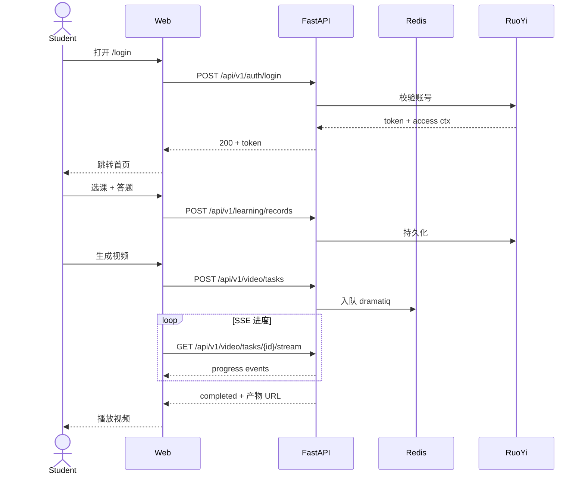

# E2E 测试指南

| 版本 | 日期 | 修订内容 | 作者 | 评审 |
|------|------|----------|------|------|
| v1.0.0 | 2026-04-25 | 文档初版，对齐 Vitest Browser + Playwright 实操规范 | dev-handbook-enterprise-rewrite/testing | 架构组 |

## 1. 概述

### 1.1 目的

定义 L3 端到端（E2E）测试的范围、工具、用例编写、稳定性策略与 UAT 用例规范。本项目 E2E 主要基于：

- 学生端（**React + TypeScript / TSX**）：**Vitest Browser**（Playwright provider，配置文件 `packages/student-web/vitest.browser.config.ts`），文件名约定 `*.browser.test.{ts,tsx}`
- 管理后台（**Vue 3 Soybean Admin**，`packages/ruoyi-plus-soybean/`）：当前**无 E2E 体系**——E2E 待补充，建议接入独立 Playwright 项目；过渡期靠人工 UAT

### 1.2 适用范围

| 在范围 | 不在范围 |
|--------|----------|
| 学生端关键用户路径（登录 → 学习 → 测验 → 视频观看） | 单组件渲染（→ `0002-单元测试指南.md`） |
| 管理后台核心 CRUD（视频生成、用户管理）UAT | 后端纯逻辑（→ `0002`/`0003`） |
| 跨 SPA 路由 + Pinia/Zustand 状态 | 性能压测（独立体系） |
| SSR/CSR 一致性、首屏渲染 | 多浏览器内核回归（仅 chromium） |
| 真实 API 集成（dev/staging 环境） | 第三方 SaaS 真实调用（除非冒烟） |

### 1.3 阅读对象

前端工程师、QA、产品验收人。

### 1.4 术语缩写

| 缩写 | 全称 | 说明 |
|------|------|------|
| E2E | End-to-End | 端到端 |
| UAT | User Acceptance Test | 用户验收测试 |
| POM | Page Object Model | 页面对象模式 |
| SUT | System Under Test | 被测系统 |
| flake | flaky test | 不稳定测试 |

## 2. 引用文件

- `0001-测试总体策略.md` §4.2、§4.3
- `0002-单元测试指南.md`、`0003-集成测试指南.md`（边界划分）
- 配置：`packages/student-web/vitest.browser.config.ts`
- ISO/IEC/IEEE 29119-4:2021 *Test techniques*（用例设计）
- IEEE 1012-2016 *V&V*

## 3. E2E 测试目标与原则

### 3.1 目标

1. **关键路径正确性**：用户从登录到完成核心任务的链路无回归
2. **跨层兼容性**：前端、后端、DB、Redis、AI Provider 协同正确
3. **UAT 入口**：产品/QA 在 staging 环境对照清单验收
4. **回归保护网**：在 L1/L2 测不到的浏览器渲染、SSR、Hydration、SEO meta 等场景兜底

### 3.2 原则（MUST）

| 原则 | 落地 |
|------|------|
| 用例少而精 | 总数 ≤ 30 条，每条覆盖一条用户路径 |
| 测稳不测全 | 浏览器只跑 chromium；多浏览器靠 BrowserStack 季度回归 |
| 显式等待 | 全部用 `expect.poll` / `locator.waitFor`，禁止 `sleep` |
| 数据可清理 | 测试账号 `e2e-` 前缀；用例后置清理 |
| 失败可追溯 | 失败自动截图、保存 trace（playwright trace） |
| 接近用户视角 | 用 `getByRole` / `getByText` 选择器，不用脆弱的 CSS 选择器 |

### 3.3 反原则（MUST NOT）

- 不用 E2E 测**业务规则细节**（属于 L1）
- 不用 E2E 测**API 错误码**（属于 L2）
- 不为 E2E 调高超时（默认 10s 触发 = 性能或同步问题，必须修根因）

## 4. 工具与配置

### 4.1 Vitest Browser（学生端）

配置：`packages/student-web/vitest.browser.config.ts`

| 关键参数 | 值 | 含义 |
|----------|-----|------|
| `provider` | `@vitest/browser-playwright` | Playwright 驱动 |
| `headless` | `true` | CI 无头；本地调试可临时改 `false` |
| `actionTimeout` | `10_000` | 动作超时 10s |
| `viewport` | `1440 × 960` | 默认视口 |
| `instances[0].browser` | `chromium` | 仅 chromium |
| `fileParallelism` | `false` | 用例文件**串行**执行（避免抢端口/抢账号） |
| `include` | `src/**/*.browser.test.{ts,tsx}` | 文件名约定 |
| `setupFiles` | `./src/test/browser/setup.ts` | 全局 setup |
| `import.meta.env.VITE_APP_USE_MOCK` | `'Y'` | 默认开 Mock 数据；接真后端时改为 `'N'` |

### 4.2 命令

| 命令 | 用途 |
|------|------|
| `pnpm test:student-web:e2e` | 等价于 `pnpm test:browser`，CI 默认 |
| `pnpm --filter @xiaomai/student-web test:browser` | 单独跑 |
| 本地有头调试 | 临时改 config `headless: false` 后跑 |
| `--reporter=html` | 生成可视化报告（需 vitest 升级时启用） |

### 4.3 Playwright Trace（推荐启用）

在 `setup.ts` 中按失败开启 trace：

```typescript
import { afterEach } from 'vitest';

afterEach(async (ctx) => {
  if (ctx.task.result?.state === 'fail') {
    // vitest browser 已自动截图；如需 trace 见 vitest browser playwright 文档
  }
});
```

### 4.4 独立 Playwright 项目（**待补充**，用于管理后台 + 真后端 E2E）

> **现状**：仓库**未配置独立 Playwright 项目**（仅 `references/OpenMAIC/playwright.config.ts` 是参考资料，不属本项目）。
>
> 学生端的 vitest browser（§4.1）足以覆盖单 SPA + Mock 后端的 E2E；但**管理后台 Soybean Admin** 与**接 staging 真后端**的全链路场景需要独立 Playwright（多项目、多浏览器矩阵、Trace、Visual Diff）。下面给出**建议的目录与配置草案**，供补充时直接落地。

**建议目录结构**：

```
e2e/                                    # 仓库根新增
├── playwright.config.ts
├── package.json                        # 独立依赖 @playwright/test
├── fixtures/
│   ├── auth.ts                         # 学生 / 管理员账号 fixture
│   └── api.ts                          # 后台数据预置 helper
├── pages/                              # POM
│   ├── student/{login,learning,quiz,video,coach}.page.ts
│   └── admin/{login,video-tasks,users}.page.ts
└── specs/
    ├── student/*.spec.ts               # UAT-S-001 ~ UAT-S-014
    └── admin/*.spec.ts                 # UAT-A-001 ~ UAT-A-006
```

**建议 `e2e/playwright.config.ts`**：

```typescript
import { defineConfig, devices } from '@playwright/test';

export default defineConfig({
  testDir: './specs',
  timeout: 30_000,
  expect: { timeout: 5_000 },
  fullyParallel: false,             // 学生端账号串行；改 true 须先解决账号池
  forbidOnly: !!process.env.CI,
  retries: process.env.CI ? 1 : 0,  // 仅重试 1 次；不允许通过重试掩盖 flake
  workers: process.env.CI ? 2 : undefined,
  reporter: [
    ['html', { open: 'never' }],
    ['junit', { outputFile: 'reports/junit.xml' }],
  ],
  use: {
    baseURL: process.env.E2E_BASE_URL ?? 'http://127.0.0.1:5666',
    trace: 'retain-on-failure',     // 失败保留 trace
    screenshot: 'only-on-failure',
    video: 'retain-on-failure',
  },
  projects: [
    { name: 'student-chromium', testMatch: /student\/.*\.spec\.ts/, use: { ...devices['Desktop Chrome'] } },
    { name: 'student-firefox',  testMatch: /student\/.*\.spec\.ts/, use: { ...devices['Desktop Firefox'] } },
    { name: 'student-webkit',   testMatch: /student\/.*\.spec\.ts/, use: { ...devices['Desktop Safari'] } },
    { name: 'student-mobile',   testMatch: /student\/.*\.spec\.ts/, use: { ...devices['Pixel 7'] } },
    { name: 'admin-chromium',   testMatch: /admin\/.*\.spec\.ts/,   use: { ...devices['Desktop Chrome'] } },
  ],
  webServer: process.env.E2E_BASE_URL
    ? undefined
    : {
        command: 'pnpm --filter @xiaomai/student-web dev',
        url: 'http://127.0.0.1:5666',
        reuseExistingServer: !process.env.CI,
        timeout: 120_000,
      },
});
```

**职责划分**：

| 范围 | 工具 | 触发频率 | 浏览器 |
|------|------|----------|--------|
| 学生端单 SPA + Mock 数据快速回归 | `vitest browser`（已就绪） | 每次 PR | chromium 1 |
| 学生端 + 真后端 / 跨浏览器 / 移动端 | 独立 Playwright（**待补充**） | nightly + pre-release | chromium / firefox / webkit / Pixel 7 |
| 管理后台 Soybean Admin | 独立 Playwright（**待补充**） | nightly + pre-release | chromium |

## 5. 测试环境与数据

### 5.1 环境矩阵

| 环境 | 后端 | DB | 用途 | 触发 |
|------|------|-----|------|------|
| Local | dev FastAPI（127.0.0.1:8090） | 本地 MySQL | 开发自测 | 手动 |
| CI Mock | Mock 数据（`VITE_APP_USE_MOCK=Y`） | — | 每次 push（默认） | push/PR |
| Staging | staging FastAPI | staging DB | nightly + 发布前 | 定时 + 手动 |
| Production 冒烟 | prod | — | 发布后 5 分钟最小集（≤ 5 用例） | release 后 |

### 5.2 测试账号

| 角色 | 账号前缀 | 来源 | 清理 |
|------|----------|------|------|
| 学生 | `e2e-student-<run_id>` | 用例前 setup 创建 | 用例后 teardown 删除 |
| 教师/管理 | `e2e-admin-<run_id>` | 同上 | 同上 |

> 严禁用真实用户账号跑 E2E。

### 5.3 数据清理

```typescript
// src/test/browser/setup.ts
import { beforeAll, afterAll } from 'vitest';
import { createE2EAccount, deleteE2EAccount } from './fixtures';

declare global {
  // eslint-disable-next-line no-var
  var __E2E_ACCOUNT__: { username: string; password: string };
}

beforeAll(async () => {
  globalThis.__E2E_ACCOUNT__ = await createE2EAccount({ role: 'student' });
});

afterAll(async () => {
  await deleteE2EAccount(globalThis.__E2E_ACCOUNT__.username);
});
```

## 6. 用例编写规范

### 6.1 命名

| 元素 | 规则 | 示例 |
|------|------|------|
| 文件 | `<feature>.browser.test.tsx` | `quiz-flow.browser.test.tsx` |
| describe | 业务流程名 | `describe('Quiz Flow', ...)` |
| it | `should <用户可观察结果> when <场景>` | `it('should show feedback when student submits a wrong answer')` |

### 6.2 标准用例结构（POM 推荐）

```typescript
// src/features/quiz/quiz-flow.browser.test.tsx
import { describe, it, expect } from 'vitest';
import { page } from '@vitest/browser/context';

import { LoginPage, QuizPage } from '@/test/browser/pages';

describe('Quiz Flow (E2E)', () => {
  it('should let a logged-in student finish a quiz and see score', async () => {
    const login = new LoginPage(page);
    const quiz = new QuizPage(page);

    await login.goto();
    await login.signIn(globalThis.__E2E_ACCOUNT__);

    await quiz.start({ topicId: 'demo-001' });
    await quiz.answer({ index: 0, option: 'A' });
    await quiz.submit();

    await expect.element(quiz.scoreText).toBeVisible();
    await expect.element(quiz.scoreText).toContainText(/分数/);
  });
});
```

### 6.3 Page Object 示例

```typescript
// src/test/browser/pages/login.page.ts
import type { BrowserPage } from '@vitest/browser/context';

export class LoginPage {
  constructor(private readonly page: BrowserPage) {}

  goto() {
    return this.page.goto('/login');
  }

  async signIn(creds: { username: string; password: string }) {
    await this.page.getByLabel('用户名').fill(creds.username);
    await this.page.getByLabel('密码').fill(creds.password);
    await this.page.getByRole('button', { name: '登录' }).click();
    await this.page.getByRole('navigation', { name: '主导航' }).waitFor();
  }
}
```

### 6.4 等待策略

| 场景 | 写法 | 反例 |
|------|------|------|
| 元素出现 | `await locator.waitFor({ state: 'visible' })` | `await sleep(2000)` |
| 文本变化 | `await expect.element(loc).toContainText(/.../)` | 轮询 `setTimeout` |
| 网络完成 | `await page.waitForResponse(/\/api\/quiz/)` | 估时 sleep |
| 路由切换 | `await expect.poll(() => page.url()).toContain('/result')` | sleep |

## 7. UAT 用例清单（核心路径）

### 7.1 学生端核心路由清单（已验证 `packages/student-web/src/app/routes/index.tsx`）

| 路由 | 页面用途 | 鉴权 |
|------|----------|------|
| `/landing` | 营销落地页 | 公开 |
| `/login` | 登录 | 公开 |
| `/login/social-callback` | 第三方登录回调 | 公开 |
| `/video/public/:resultId` | 公开视频分享页 | 公开 |
| `/learning` | 学习中心 | 需登录 |
| `/history` | 历史记录 | 需登录 |
| `/favorites` | 收藏 | 需登录 |
| `/wrongbook` | 错题本 | 需登录 |
| `/profile` / `/profile/setup` / `/profile/setup/preferences` / `/profile/setup/tour` | 用户资料与引导 | 需登录 |
| `/classroom/input` / `/classroom/generating/:taskId` / `/classroom/play/:classroomId` / `/classroom/settings` | 课堂模式 | 需登录 |
| `/video/input` / `/video/:taskId/generating` / `/video/:taskId` | 视频生成与查看 | 需登录 |
| `/coach/:sessionId` | AI 学习助手会话 | 需登录 |
| `/checkpoint/:sessionId` / `/quiz/:sessionId` / `/quiz/:sessionId/review/:quizId` | 检查点 / 测验 / 复盘 | 需登录 |
| `/path` / `/learning-paths` / `/learning-paths/new` / `/learning-paths/:pathId` | 学习路径 | 需登录 |
| `/companion/replay/:sessionId` | 同伴学习回放 | 需登录 |

### 7.2 学生端核心 UAT 用例（基于真实路由）

| 编号 | 用例 | 前置 | 关键路由 | 步骤要点 | 期望 |
|------|------|------|----------|----------|------|
| UAT-S-001 | 公开落地页可访问 | 无 | `/landing` | 直接访问 | 200，营销内容渲染、CTA 按钮可见 |
| UAT-S-002 | 学生账密登录 | 账号已开通 | `/login` → `/learning` | 填写表单 → 提交 | 跳转 `/learning`，AppShell 主导航出现 |
| UAT-S-003 | 第三方登录回调 | OAuth 通道可达 | `/login/social-callback` | 携带 code 参数访问 | token 写入 store，跳转默认首页 |
| UAT-S-004 | 学习中心入口 | 已登录 | `/learning` | 点击首推内容卡 | 进入对应学习路径详情 |
| UAT-S-005 | 学习路径详情 | 有路径 | `/learning-paths/:pathId` | 点击下一节 | 进入 quiz 或 checkpoint |
| UAT-S-006 | Quiz 答题 | 在 `/quiz/:sessionId` | `/quiz/:sessionId` | 选项 → 提交 | 显示反馈 + 得分；错答持久化进 wrongbook |
| UAT-S-007 | 错题本回顾 | 有错题 | `/wrongbook` | 进入 → 点击错题 | 列出错题，可跳转复做 |
| UAT-S-008 | AI 学习助手会话（核心 AI 答疑） | 已登录 | `/coach/:sessionId` | 输入问题 → 等待流式响应 | SSE/WS 流式增量渲染答案，含工具调用气泡 |
| UAT-S-009 | 视频生成入口 | 已登录 | `/video/input` | 填写表单 → 提交 | 跳转 `/video/:taskId/generating`，进度条出现 |
| UAT-S-010 | 视频生成进度 SSE | 任务派发成功 | `/video/:taskId/generating` | 等待 SSE 推送 | 进度从 0 → 100；阶段标签滚动；失败有可重试入口 |
| UAT-S-011 | 视频播放 + 字幕 | 视频就绪 | `/video/:taskId` | 进入并播放 | `<video>` 可播；字幕轨可切换；进度条不卡 |
| UAT-S-012 | 公开视频分享页 | 任务为公开 | `/video/public/:resultId` | 未登录直接访问 | 视频可播，无私密信息泄露 |
| UAT-S-013 | 课堂生成与播放 | 已登录 | `/classroom/input` → `/classroom/generating/:taskId` → `/classroom/play/:classroomId` | 入参 → 等待 → 播放 | 三个阶段无中断；播放页可暂停继续 |
| UAT-S-014 | 路由守卫拦截 | 未登录 | 任意需登录路由 | 直接访问 `/learning` | `RequireAuthRoute` 重定向 `/login`，登录后回跳原地址 |

> **覆盖层级**：UAT-S-001~003 公开路由 / UAT-S-004~007 学习核心 / UAT-S-008 AI 答疑 / UAT-S-009~013 视频与课堂 / UAT-S-014 鉴权守卫。

### 7.3 管理后台 UAT（`packages/ruoyi-plus-soybean`，**Playwright 体系待补充**）

下表为目标用例规划，落地需新建独立 `playwright.config.ts`（详见 §4.4）。

| 编号 | 用例 | 期望 |
|------|------|------|
| UAT-A-001 | 管理员登录 | 进入控制台 |
| UAT-A-002 | 创建视频任务 | 表单提交后任务列表出现 |
| UAT-A-003 | 查看视频任务详情与产物 | 详情含 artifact 链接、进度日志 |
| UAT-A-004 | AI Provider 配置 CRUD | 新建/启用/禁用 Provider，前台路由生效 |
| UAT-A-005 | 用户与角色编辑 | 角色变更后学生端鉴权立即生效 |
| UAT-A-006 | 学习内容审核 | 通过 / 驳回 状态可在学生端反映 |

### 7.4 跨浏览器与设备矩阵

> 矩阵建立在独立 Playwright 项目（§4.4）之上；当前 vitest browser 仅覆盖 chromium 桌面。

| 用例集 | chromium 桌面 | firefox 桌面 | webkit (Safari) | Pixel 7 移动 | 触发频率 |
|--------|:-------------:|:------------:|:---------------:|:------------:|----------|
| UAT-S-001 公开落地页 | ✅ | ✅ | ✅ | ✅ | 每次 PR + nightly |
| UAT-S-002~003 登录 / 回调 | ✅ | ✅ | ✅ | ✅ | 每次 PR + nightly |
| UAT-S-008 AI 答疑（流式 SSE/WS） | ✅ | ✅ | ✅ | — | nightly（webkit 流式 polyfill 风险高，必须覆盖） |
| UAT-S-009~011 视频生成 / 播放 | ✅ | ✅ | ✅ | ✅ | nightly + pre-release |
| UAT-S-012 公开视频分享 | ✅ | ✅ | ✅ | ✅ | 每次 PR + nightly（分享是公开入口，破坏面广） |
| UAT-S-013 课堂全链 | ✅ | — | — | — | nightly（重，仅 chromium） |
| UAT-S-014 路由守卫 | ✅ | ✅ | — | — | 每次 PR |
| UAT-A-001~006 管理后台 | ✅ | — | — | — | nightly（管理端只测 chromium） |

**关键判断**：

- **webkit 必测项**：`<video>` 播放（webm/HEVC 兼容差异）、`EventSource`/`ReadableStream`（流式 SSE）、CSS `:has`、字体渲染回退。
- **移动端必测项**：登录键盘行为、视频全屏、横竖屏切换、触摸滚动。
- 不测项：IE11、旧 Edge、Android < 10 自带浏览器（团队明确不支持）。

### 7.5 视觉回归（Visual Regression）

> **现状**：暂未启用。规划方案如下。

启用范围（**不全量**，避免 flake 噪声）：

| 页面 | 截图区域 | 容差 | 理由 |
|------|----------|------|------|
| `/landing` | 首屏 hero + CTA 区 | `maxDiffPixelRatio: 0.01` | 营销页改动频繁但布局稳定 |
| `/login` | 表单卡片 | `maxDiffPixelRatio: 0.005` | 公共入口，破坏面大 |
| `/video/:taskId` 播放器骨架 | 播放器外框（不含视频帧） | `maxDiffPixelRatio: 0.02` | 控件位置回归 |
| `/quiz/:sessionId` 题干区 | 题干 + 选项 | `maxDiffPixelRatio: 0.01` | 题型组件复用多 |

实施要点：

```typescript
// e2e/specs/student/visual.spec.ts
import { test, expect } from '@playwright/test';

test.describe('Visual Regression', () => {
  test('landing hero', async ({ page }) => {
    await page.goto('/landing');
    // 等待字体加载完成，避免字形闪烁导致假阳性
    await page.evaluate(() => document.fonts.ready);
    await expect(page.locator('[data-testid="landing-hero"]')).toHaveScreenshot('landing-hero.png', {
      maxDiffPixelRatio: 0.01,
      animations: 'disabled',
    });
  });
});
```

**铁律**：

- 字体未就绪 / 动画未禁用 → 假阳性，**必须** `document.fonts.ready` + `animations: 'disabled'`。
- 基线变更必须 reviewer 显式 approve（PR diff 含 `*-actual.png`）。
- 不对**含动态内容**（视频帧、用户名、随机推荐）截图，只截布局骨架。
- 失败 ≥ 3 次/周 → 重新评估该页是否值得纳入。

### 7.6 数据隔离细则

```mermaid
flowchart LR
    A[E2E run_id] --> B[创建 e2e-{run_id}-* 账号]
    B --> C[运行用例 in transaction-like scope]
    C --> D{是否成功?}
    D -- yes --> E[teardown 删账号 + 清缓存]
    D -- no --> F[保留 trace + screenshot, 仍清账号]
    style A fill:#e3f2fd
    style E fill:#c8e6c9
    style F fill:#fff9c4
```
*图 7-1：E2E 数据生命周期（每个 run 独立账号池）*

| 数据类别 | 隔离手段 | 备注 |
|----------|----------|------|
| 学生账号 | `e2e-student-<run_id>` 前缀，每 run 新建 / 用完删除 | run_id = `${date}-${gha_run_id}` |
| 管理员账号 | `e2e-admin-<run_id>`，role=admin 但禁止跨租户 | 不复用真实管理员 |
| 学习记录 / 错题 | 绑定 e2e 账号；账号删除级联删 | 走 RuoYi 端 `/api/xm/learning/records` |
| 视频任务 | 走 dramatiq 队列；账号删除时 cancel + 删除产物 | OSS 文件由后端清理 |
| LLM 调用 | 走 sandbox key + 短 prompt 模板 | 禁止跑生产 key 的真 LLM |
| 浏览器存储 | 每用例独立 context；用完销毁 | Playwright `test.use({ storageState })` |

### 7.7 流程图


*图 7-2：学生端核心 E2E 路径（UAT-S-001 ~ S-013）*

## 8. CI 集成

### 8.1 触发策略

| 触发 | 用例集 | 期望耗时 |
|------|--------|----------|
| 每次 PR | 仅 Mock 模式 E2E（≤ 10 用例） | ≤ 5 min |
| nightly | 全量 E2E（接 staging 真后端） | ≤ 20 min |
| pre-release | 全量 E2E + 冒烟 | ≤ 25 min |
| post-release | 生产冒烟（≤ 5 用例只读） | ≤ 2 min |

### 8.2 GitHub Actions 片段（**当前未实施 / 规划稿**）

> **CI 现状（已验证）**：`.github/workflows/` 中只有 `fastapi-backend-tests.yml` / `auto-assign.yml` / `lock.yml` / `pr-labels.yml`——**没有任何前端测试 CI**。下面的 yaml 是**建议新增**的草案，尚未落地；当前学生端测试与 E2E 仅依赖本地 `pnpm test:student-web` / `pnpm test:student-web:e2e` + Reviewer 把关。

```yaml
# .github/workflows/student-web-e2e.yml（**建议新增 / 待补充**，目前不存在）
name: Student Web E2E
on:
  pull_request:
    paths: ["packages/student-web/**"]
  schedule:
    - cron: "0 17 * * *"  # 每日 UTC 17:00 = 北京 01:00

jobs:
  e2e:
    runs-on: ubuntu-latest
    steps:
      - uses: actions/checkout@v4
      - uses: pnpm/action-setup@v4
        with: { version: "10.5.0" }
      - uses: actions/setup-node@v4
        with: { node-version: "20", cache: "pnpm" }
      - run: pnpm install --frozen-lockfile
      - name: Install Playwright browsers
        run: pnpm --filter @xiaomai/student-web exec playwright install --with-deps chromium
      - run: pnpm test:student-web:e2e
      - name: Upload artifacts on failure
        if: failure()
        uses: actions/upload-artifact@v4
        with:
          name: e2e-traces
          path: packages/student-web/test-results/
```

### 8.3 失败处置

| 失败类型 | 处置 |
|----------|------|
| 单次失败 | CI 自动重跑 1 次（vitest `retry: 1`），仍失败则标 fail |
| 同一用例 3 次/周失败 | 标 `flaky`、立 issue、24h 内修根因或暂时移出主流水线 |
| 真后端 5xx | 通知后端 oncall，前端用例本身不算失败 |

## 9. 反模式（MUST NOT）

| 反模式 | 危害 | 修复 |
|--------|------|------|
| `await page.waitForTimeout(5000)` | 慢 + flaky | 用 `waitFor` / `expect.poll` |
| 用 `nth-child(3)` 选 DOM | 易碎 | 用 `getByRole` / `data-testid` |
| 在 E2E 测错误码细节 | 滥用 | 移到 L2 |
| 测试间共享登录态全局 | 用例耦合 | 每用例独立 setup 或 cookie 注入 |
| 把 `actionTimeout` 调到 60s | 掩盖性能问题 | 找根因 |
| 用真实生产账号 | 数据污染 | `e2e-` 前缀 + 自动清理 |
| 把失败用例 `.skip` 直接合并 | 假绿色 | 修根因或回滚 PR |
| 调用真实付费 LLM API | 成本失控 | 走 Mock 或 sandbox key |
| 在 E2E 里嵌套 5 层 if/else | 不像测试 | 拆成多个 it |

## 10. 度量与改进

| 指标 | 目标 | 数据源 |
|------|------|--------|
| E2E 通过率 | ≥ 99% | CI |
| Flake Rate | ≤ 2% | CI 重跑统计 |
| 单用例时长 P95 | ≤ 30s | vitest reporter |
| 总流水线时长 | ≤ 5min（PR）/ 20min（nightly） | GitHub Actions |
| UAT 清单覆盖率 | 100% 核心路径 | 手工评审 |

## 11. PR 检查清单

- [ ] 新增/修改的核心路径有 `*.browser.test.tsx` 用例
- [ ] 用例使用 POM 抽象，无脆弱 CSS 选择器
- [ ] 等待策略全部为显式条件等待，无 `setTimeout`/`waitForTimeout`
- [ ] 测试账号走 `e2e-` 前缀 + 用例后清理
- [ ] CI（PR 通道）执行通过，失败可上传 trace
- [ ] UAT 清单（§7）若新增路径已同步更新

## 附录 A：术语对照

| 中文 | 英文 | 说明 |
|------|------|------|
| 端到端测试 | End-to-End Test | 跨前后端用户路径测试 |
| 用户验收测试 | User Acceptance Test | 产品/QA 对照清单验证 |
| 页面对象 | Page Object | 封装页面交互的类 |
| 跟踪文件 | Trace | Playwright 失败时记录的可重放文件 |

## 附录 B：参考资料

- Vitest Browser Mode：https://vitest.dev/guide/browser/
- Playwright：https://playwright.dev/
- Page Object Model 模式：Martin Fowler / Microsoft Playwright Docs
- 项目配置：`packages/student-web/vitest.browser.config.ts`
- 项目脚本：`packages/student-web/package.json` → `test:browser`
