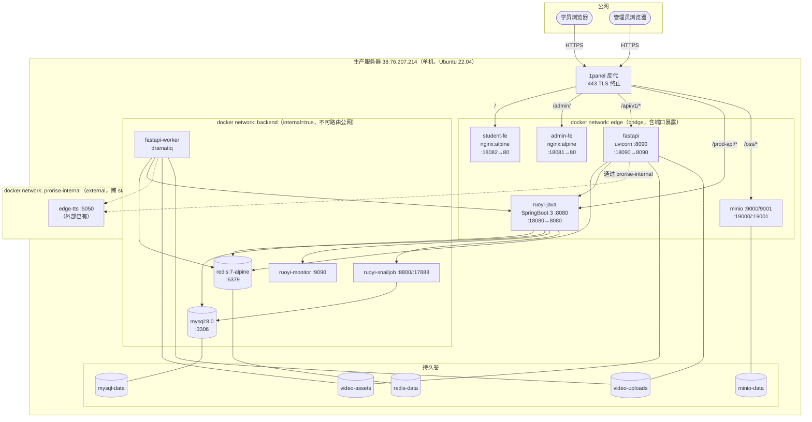
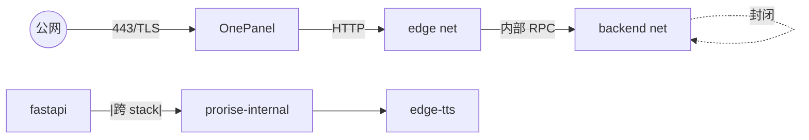
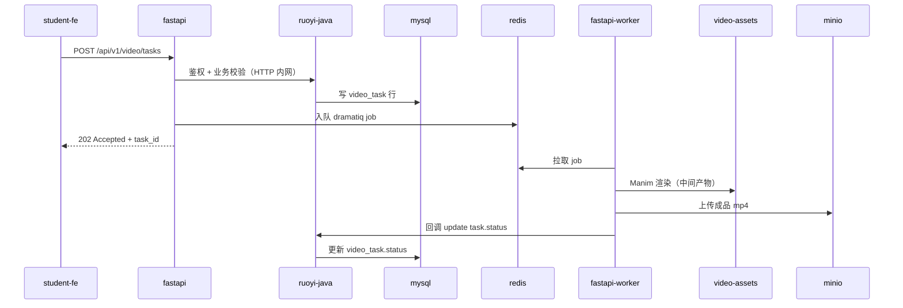

| 版本 | 日期 | 修订内容 | 作者 | 评审 |
|------|------|----------|------|------|
| v0.1.0 | 2026-03-24 | 初始草稿（仅占位） | — | — |
| v1.0.0 | 2026-04-25 | 按 SRE + DORA 规范全量改写：补齐部署拓扑 C4 视图、网络分区、服务清单、Docker→K8s 演进路径 | Ops Writer | Architecture Specialist |

---

## 1. 概述

### 1.1 目的
统一描述 Prorise AI Teach 平台的**生产部署拓扑**，作为发布、扩容、故障排查的「唯一物理事实」来源。任何与部署机器、网络、端口、卷、网关相关的描述若与本文冲突，以本文为准（次级事实源是 `deploy/docker-compose.yml`）。

### 1.2 适用范围
- 生产环境（`xm.prorisehub.com`，单机 Docker Compose 形态）
- 准生产 / Staging（占位章节，当前与生产共享拓扑，仅环境变量隔离）
- K8s 演进规划（§7，未落地，仅作架构对齐）

### 1.3 阅读对象
| 角色 | 关注章节 |
|------|----------|
| 后端 / 前端开发 | §3 服务清单、§4 网络分区、§5 端口映射 |
| 运维 / SRE | 全部，重点 §6 卷与持久化、§7 演进路径 |
| 架构师 | §2 总览、§7 演进路径、§8 风险 |
| 安全 | §4 网络分区、§5 暴露面、§9 密级与凭据 |

### 1.4 术语缩写
| 术语 | 全称 | 说明 |
|------|------|------|
| C4 | Context-Container-Component-Code | 架构可视化方法论（Simon Brown） |
| BFF | Backend For Frontend | 面向前端的网关层（此处 1panel 反代） |
| SoT | Source of Truth | 事实唯一来源 |
| DORA | DevOps Research and Assessment | DevOps 度量框架（详见 0002） |

## 2. 引用文件

**内部：**
- `../003-架构设计/0001-系统架构总览.md`：逻辑架构（与本文物理架构对齐）
- `../003-架构设计/0004-API设计规范.md`：服务接口契约
- `./0002-CI-CD流水线.md`：发布流水线（如何把代码送到本文描述的拓扑）
- `./0003-监控与告警.md`：本文拓扑上的可观测性
- `deploy/README.md`：可执行的部署 SOP
- `deploy/docker-compose.yml`：服务编排 SoT

**外部：**
- C4 Model: <https://c4model.com/>
- Docker Compose Spec v3.8: <https://compose-spec.io/>
- Google SRE Book §3 Embracing Risk: <https://sre.google/sre-book/embracing-risk/>

## 3. 部署拓扑总览

### 3.1 C4 - Deployment View



> 图 3-1：生产部署 C4-Deployment 视图（节点 = 容器/卷/网络，箭头 = 流量方向）。

### 3.2 服务分层
| 层 | 服务 | 数量 | 职责 |
|----|------|------|------|
| 入口 | 1panel + nginx | 1 | TLS 终止、域名分流、ACME 续签 |
| 前端 | admin-fe / student-fe | 2 | 静态资源 SPA |
| 应用 | fastapi / ruoyi-java | 2 | 业务 API（异步 / 业务核心） |
| 异步 | fastapi-worker / ruoyi-snailjob | 2 | Dramatiq 视频管道 / 定时任务 |
| 中间件 | mysql / redis / minio | 3 | 状态存储 |
| 辅助 | ruoyi-monitor / minio-init / edge-tts | 3 | Spring Boot Admin / bucket 初始化 / TTS（外部 stack） |

## 4. 网络分区与安全组

### 4.1 三网模型

| 网络 | 类型 | internal | 成员 | 设计意图 |
|------|------|----------|------|----------|
| `backend` | bridge | **true**（不可对外） | mysql, redis, ruoyi-{java,monitor,snailjob}, fastapi(+worker), minio, minio-init | 数据面与内部 RPC，零公网暴露 |
| `edge` | bridge | false | admin-fe, student-fe, fastapi, ruoyi-java, minio | 唯一对外面，由 1panel 反代 |
| `prorise-internal` | bridge（external） | — | fastapi(+worker), edge-tts | 跨 stack 共享 TTS（避免重复部署 edge-tts） |

`fastapi` 与 `ruoyi-java` 是**双网桥接节点**（同时加入 backend 与 edge），是 backend 网络唯一被外部访问的途径——任何对 mysql / redis 的访问都必须经过这两个应用层服务。该模式相当于 K8s 中的 NetworkPolicy + Ingress 双重隔离。

### 4.2 流量图



> 图 4-1：流量分区——公网仅可达 1panel；backend 网络对公网零路由；fastapi 经第三网络复用外部 TTS。

### 4.3 端口暴露面

| 宿主端口 | 容器端口 | 协议 | 目标 | 1panel 路由 |
|----------|----------|------|------|-------------|
| 18080 | ruoyi-java:8080 | HTTP | RuoYi 业务 API | `/prod-api/*` |
| 18081 | admin-fe:80 | HTTP | 管理后台 | `/admin/` |
| 18082 | student-fe:80 | HTTP | 学员端 | `/` |
| 18090 | fastapi:8090 | HTTP | FastAPI 业务 API | `/api/v1/*` |
| 19000 | minio:9000 | HTTP | S3 API | `/oss/*` |
| 19001 | minio:9001 | HTTP | MinIO 控制台 | 仅内网（不反代） |

> 端口 1xxxx 段是 1panel 约定的「应用层」段，避免与 1panel 自身（80/443/2222 等）冲突。来源 `deploy/.env.prod.example:23-29`。

## 5. 服务清单

### 5.1 服务详表（来源 `deploy/docker-compose.yml`）

| 服务 | 镜像 | 启动命令 | depends_on | 健康检查 | 重启策略 |
|------|------|----------|------------|----------|----------|
| mysql | mysql:8.0 | mysqld（自定义参数见下） | — | mysqladmin ping | unless-stopped |
| redis | redis:7-alpine | redis-server --appendonly yes --maxmemory 512mb | — | redis-cli ping | unless-stopped |
| minio | minio:RELEASE.2025-04-22 | server /data --console-address :9001 | — | mc ready local | unless-stopped |
| minio-init | minio/mc | mc mb + anonymous set download | minio(healthy) | — | no |
| ruoyi-snailjob | xm/ruoyi-snailjob:prod | java -jar | mysql(healthy) | Dockerfile 内 curl | unless-stopped |
| ruoyi-monitor | xm/ruoyi-monitor:prod | java -jar | — | curl / | unless-stopped |
| ruoyi-java | xm/ruoyi-admin:prod | java -jar | mysql/redis/snailjob/monitor | curl / | unless-stopped |
| fastapi | xm/fastapi:prod | api（uvicorn） | redis(healthy), ruoyi-java(healthy) | curl / | unless-stopped |
| fastapi-worker | xm/fastapi:prod（复用） | worker（dramatiq） | fastapi(started) | — | unless-stopped |
| admin-fe | xm/admin-fe:prod | nginx -g daemon off | — | wget / | unless-stopped |
| student-fe | xm/student-fe:prod | nginx -g daemon off | — | wget / | unless-stopped |

### 5.2 关键参数

**MySQL** (`deploy/docker-compose.yml:50-55`):
```bash
--character-set-server=utf8mb4
--collation-server=utf8mb4_unicode_ci
--default-authentication-plugin=mysql_native_password
--max_allowed_packet=128M
--innodb_buffer_pool_size=512M
```
> `default-authentication-plugin=mysql_native_password` 是为兼容 RuoYi MyBatis-Plus 数据源；切换到 `caching_sha2_password` 需同步升级 JDBC 连接串。

**Redis**：AOF 持久化 + `allkeys-lru` 淘汰，512MB 上限——超过后冷 key 直接淘汰，**不会阻塞写入**，业务侧需容忍 cache miss（详见 `0003-监控与告警.md` SLI #cache）。

**FastAPI**（`deploy/docker-compose.yml:248-281`）：
- `FASTAPI_VIDEO_RENDER_QUALITY`、`FASTAPI_VIDEO_SECTION_CODEGEN_CONCURRENCY`、`FASTAPI_DRAMATIQ_TASK_TIME_LIMIT_MS` 全部走环境变量，未硬编码（参见 `packages/fastapi-backend/app/core/config.py:111`、`:131`）。
- 日志级别由 `FASTAPI_LOG_LEVEL` 控制（`packages/fastapi-backend/app/core/logging.py:64`），生产推荐 `INFO`，故障调查临时改 `DEBUG` 后**必须 24h 内回滚**（DEBUG 会暴露 prompt/敏感字段）。

## 6. 持久化与数据流

### 6.1 卷映射

| 卷名 | 挂载点 | 用途 | 备份策略 |
|------|--------|------|----------|
| `mysql-data` | mysql:/var/lib/mysql | 业务数据库 | `mysqldump` 每日 03:00（`deploy/scripts/dump-mysql.sh`） |
| `redis-data` | redis:/data | AOF 文件 | 不备份（缓存可重建） |
| `minio-data` | minio:/data | OSS 对象 | MinIO mc mirror 异地（计划中，未落地） |
| `video-assets` | fastapi(+worker):/app/.runtime/video-assets | 视频生成中间产物 | 不备份（按 task_id 隔离，可重跑） |
| `video-uploads` | fastapi(+worker):/data/uploads/video | 用户上传原图 | 周备份到 OSS |
| `fastapi-secrets` | fastapi(+worker):/app/.runtime/secrets | API key 缓存 | 不备份（从 RuoYi 拉取重建） |
| `ruoyi-*-logs` | java 容器:/ruoyi/server/logs | RuoYi 应用日志 | 30 天滚动（Logback 配置内） |

### 6.2 数据流（写路径）



> 图 6-1：视频任务从前端到对象存储的写路径。FastAPI 是「调度入口」，RuoYi 是「业务事实源」，Dramatiq+Worker 是「执行单元」。

## 7. 演进路径：Docker Compose → K8s

当前形态选型理由（ADR-101，见 §9）：单机 + 单租户 + 流量 < 100 QPS，Docker Compose 的运维复杂度回报比远高于 K8s。但平台规模到达以下任一阈值时启动迁移：

- **触发条件**：日活 > 5k，或视频任务并发持续 > 8 个，或单机 CPU 95P > 70% 持续 1 周。
- **目标形态**：3 节点 K3s + Helm Chart。

### 7.1 迁移阶段

| 阶段 | 目标 | 工件 | 不变量 |
|------|------|------|--------|
| Phase 0（当前） | 单机 Compose | `deploy/docker-compose.yml` | 网络三分区、卷命名 |
| Phase 1 | 抽出 Helm Chart（仍单节点） | `deploy/helm/xm-prod/` | 镜像 tag 与 Compose 共享 |
| Phase 2 | 多节点 K3s + 共享存储 | NFS / Longhorn | mysql / redis 主从 |
| Phase 3 | 多副本 fastapi-worker + HPA | metrics-server | Dramatiq 已天然支持横向扩 |
| Phase 4 | mysql 出栈到 RDS | 云厂商托管 | 数据迁移走 binlog 增量 |

### 7.2 不变量映射
| Compose 概念 | K8s 等价物 |
|--------------|------------|
| `networks: [backend]` + `internal: true` | `NetworkPolicy: ingress {} + egress 显式白名单` |
| `depends_on.condition: service_healthy` | `initContainer + readinessProbe` |
| `volumes: video-assets` | `PersistentVolumeClaim`（ReadWriteMany，必须 NFS/Longhorn） |
| `xm/fastapi:prod` 双角色（api/worker） | 同 image，2 个 Deployment + 不同 args |

## 8. 横切关注点

### 8.1 时区
所有容器统一注入 `TZ=${TZ}`（默认 `Asia/Shanghai`），避免 RuoYi Quartz / Dramatiq 时区错位。

### 8.2 资源限额
当前 Compose **未设置 cpu/mem limit**。Phase 1 必须补齐，依据是 §6 SLO 容量规划。临时硬编码上限：
- mysql InnoDB 缓冲池 512MB
- redis 512MB（lru）
- ruoyi-admin JVM `-Xmx2g`（来源 `.env.prod.example:55`）

### 8.3 时序与启动顺序
依赖 `depends_on.condition: service_healthy` 保证「mysql 就绪 → ruoyi-java 启动」；`fastapi-worker` 仅 `service_started`（非 healthy）依赖 fastapi——这是有意为之，worker 失败不影响 API 可用性，反过来也成立。

## 9. 架构决策（ADR）

| 决策ID | 标题 | 状态 | 决策日期 | 背景 | 备选 | 最终决策 | 影响 |
|--------|------|------|----------|------|------|----------|------|
| ADR-101 | 单机 Docker Compose 形态 | Accepted | 2026-03-20 | 业务初期，团队 < 5 人 | K8s / Nomad / 裸机 systemd | Docker Compose（learning curve 最低） | 单点风险；< 5k DAU 可接受 |
| ADR-102 | backend 网络 internal=true | Accepted | 2026-03-22 | mysql/redis 不能直连公网 | 仅靠防火墙 / 不隔离 | 容器网络层 + 防火墙双重 | 任何新服务访问数据层都必须 join backend |
| ADR-103 | edge-tts 走外部 prorise-internal 网络 | Accepted | 2026-04-02 | 复用宿主已有 TTS 容器 | compose 内重新部署 | 外部网络共享 | 跨 stack 耦合，需文档化 |
| ADR-104 | fastapi/worker 共用镜像 | Accepted | 2026-04-05 | 减少构建/分发体积 | 拆两个镜像 | 同镜像 + entrypoint 分流 | `command: api / worker` 切换 |
| ADR-105 | 凭据通过 `.env.prod` 注入而非 Docker Secret | Accepted | 2026-03-25 | 单机部署，无 swarm/k8s | Docker Secret / Vault | `.env.prod` + gitignore | Phase 2 迁移时切 Vault |

## 10. 风险与技术债

| 风险 | 影响 | 当前缓解 | 计划 |
|------|------|----------|------|
| 单机部署，硬件故障即全站 down | P0 | 1panel 自动重启 + 每日 mysqldump | Phase 2 多节点 |
| `mysql_native_password` 已是 MySQL 8 的弱密插件 | 中 | 仅内网访问，强密码 | 切 caching_sha2_password 时同步 RuoYi JDBC |
| MinIO 数据无异地备份 | 高 | — | 接 mc mirror 到对象存储冷桶 |
| FastAPI 日志级别硬编码 INFO 默认（已修复） | 低 | `FASTAPI_LOG_LEVEL` 已配置化 | 监控覆盖即可 |
| 凭据明文落盘 `.env.prod` | 中 | `chmod 600` + gitignore | Vault / SOPS |

## 11. 附录 A：术语对照
| 术语 | 英文 | 中文释义 |
|------|------|----------|
| TLS 终止 | TLS Termination | 加密链路在网关层解开后明文进入内网 |
| AOF | Append-Only File | Redis 增量写日志持久化 |
| Healthcheck | Healthcheck | Compose 探活，决定 `depends_on` 启动顺序 |

## 12. 附录 B：参考资料
- C4 Model（Simon Brown）: <https://c4model.com/>
- Compose Spec: <https://compose-spec.io/>
- Google SRE Book: <https://sre.google/sre-book/>
- 1panel 反代文档: <https://1panel.cn/docs/>
