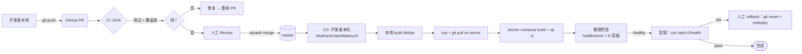
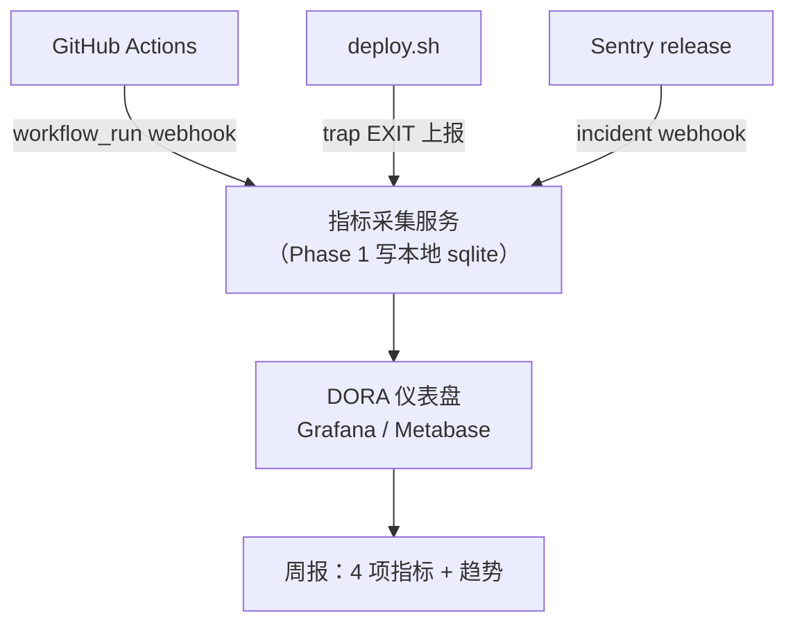
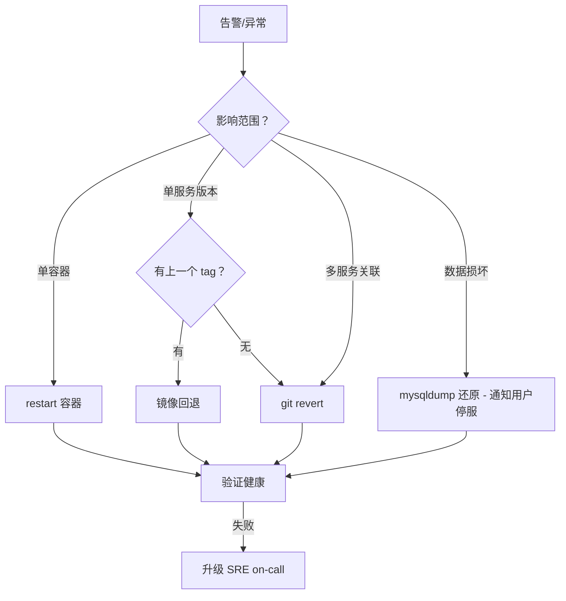

| 版本 | 日期 | 修订内容 | 作者 | 评审 |
|------|------|----------|------|------|
| v0.1.0 | 2026-03-24 | 初始草稿（仅占位） | — | — |
| v1.0.0 | 2026-04-25 | 按 SRE + DORA 全量改写：补齐 CI/CD 阶段图、DORA 4 项指标定义与采集、回滚剧本 | Ops Writer | Architecture Specialist |

---

## 1. 概述

### 1.1 目的
描述 Prorise AI Teach 平台从「commit → 生产」的完整自动化路径，并以 **DORA 4 项指标**（部署频率 / 变更前置时间 / 变更失败率 / MTTR）量化交付能力。

### 1.2 当前形态（诚实声明）
平台目前处于**部分自动化**阶段：
- **CI**（自动）：GitHub Actions 跑 FastAPI 测试与覆盖率（`.github/workflows/fastapi-backend-tests.yml`）。
- **CD**（半自动）：通过 `deploy/scripts/deploy.sh` 由开发者手动触发，本地 build + scp + 服务器 docker compose up。
- **目标形态**（§7）：master push → GHA 构建镜像 → 推 Registry → SSH 部署 → 自动健康检查 → DORA 上报。

> 本文同时描述「现状（M0）」与「目标（M2）」，并在每节标注差距，避免文档与现实脱钩。

### 1.3 阅读对象
| 角色 | 关注章节 |
|------|----------|
| 全体开发 | §3 流水线阶段、§5 PR 检查清单、§6 回滚 |
| Tech Lead / SRE | §4 DORA 指标、§7 演进路线 |
| 安全 | §3.5 密钥管理、§6.3 紧急回滚 |

## 2. 引用文件
- `./0001-部署架构.md`：CD 终点（部署拓扑）
- `./0003-监控与告警.md`：CD 后置探针所依赖的可观测性
- `../004-开发规范/0001-编码规范.md`：CI 静态检查门禁
- `../007-测试策略/0001-测试金字塔.md`：CI 测试阶段
- `deploy/README.md`：部署 SOP
- `.github/workflows/fastapi-backend-tests.yml`：CI 现状
- DORA: <https://dora.dev/research/>
- Google: 《Accelerate》Forsgren et al.

## 3. 流水线总览

### 3.1 阶段图



> 图 3-1：CI/CD 阶段。**红线**为人工节点；CI 完全自动，CD 仍需开发者手动触发 `deploy.sh`。

### 3.2 阶段详表

| 阶段 | 工具 | 输入 | 输出 | 失败处理 | 平均耗时 |
|------|------|------|------|----------|----------|
| Lint | ruff / eslint | 源码 | 错误清单 | 阻塞 PR | 30s |
| Unit Test | pytest / vitest | 源码 | 报告 + 覆盖率 | 阻塞 PR | 4-6 min |
| Integration Test | pytest（带 docker fixture） | 源码 | 报告 | 阻塞 PR | 6-10 min |
| Coverage Gate | pytest-cov | unit 输出 | 覆盖率% | 软门禁（< 60% 警告） | 1 min |
| Build (local) | docker build / pnpm build | master | 镜像 / dist | 中止 deploy | 3-8 min |
| Push (server) | scp + ssh | dist + sql | 服务器仓库 | 人工排查 | 1-2 min |
| Compose Up | docker compose | compose.yml + .env.prod | 容器运行 | healthcheck retry | 1-3 min |
| Health Probe | curl / docker healthcheck | endpoint | green/red | 自动重启 12 次后冷却 | < 30s |
| Smoke | curl `/api/v1/health` 等 | 部署后 | OK/fail | 人工触发 §6 回滚 | < 1 min |

### 3.3 触发条件

来源 `.github/workflows/fastapi-backend-tests.yml:3-15`：

```yaml
on:
  pull_request:
    paths: ["packages/fastapi-backend/**", ...]
  push:
    branches: [master]
    paths: ["packages/fastapi-backend/**", ...]
```

| 事件 | 行为 |
|------|------|
| PR 打开 / 推新 commit（命中 paths） | 跑全量 CI |
| master push | 跑 CI（不自动 deploy） |
| 仅文档变更 | **不触发**（path filter 跳过） |

### 3.4 CI 实际命令（FastAPI）

```bash
# .github/workflows/fastapi-backend-tests.yml:35-50
pnpm setup:fastapi-backend          # uv venv + pip install
pnpm test:fastapi-backend:ci        # 分层测试套件（L0/L1/L2）
pnpm test:fastapi-backend:coverage  # 覆盖率报告
```

> 缺口（M0 → M1）：当前**没有** RuoYi-Java、admin-fe、student-fe 的 CI workflow。M1 必须补齐，目标是 PR 改前端代码也能在 CI 跑 vitest。

### 3.5 密钥与凭据
| 类型 | 当前位置 | 风险 | 改进方向 |
|------|----------|------|----------|
| GHA 密钥 | GitHub Actions Secrets | 低 | 保持 |
| `.env.prod` | 服务器 `/home/prorise/xm-prod/deploy/.env.prod`（chmod 600） | 中（明文） | 迁移 SOPS / Vault |
| GitHub PAT | `.env.prod` 中 `GITHUB_PAT` | 中 | 改用 SSH Deploy Key |
| RuoYi JWT 密钥 | `.env.prod` `RUOYI_JWT_SECRET` | 高（一次泄露全员需重登） | 季度轮转 + 审计 |

## 4. DORA 4 项指标

### 4.1 指标定义与采集

| 指标 | 定义 | 当前采集 | 目标采集 | 当前值（自评） | 行业基线（Elite） |
|------|------|----------|----------|----------------|-------------------|
| **部署频率**（Deployment Frequency） | 单位时间内成功上线次数 | 人工记录 | GHA workflow_run + Slack hook | ~2 次/周 | 多次/天 |
| **变更前置时间**（Lead Time for Changes） | commit → 生产可用的中位时间 | 人工估 | `git log` + `deploy.sh` 时间戳上报 | ~6 h | < 1 day |
| **变更失败率**（Change Failure Rate, CFR） | 部署后触发回滚 / 紧急修复的比例 | Issue 标签 `incident` 比例 | Sentry release + 部署日志关联 | ~10% | < 15% |
| **MTTR**（Mean Time To Restore） | 从故障检测到恢复的中位时间 | Issue 创建 → close 时间 | PagerDuty / Sentry incident 时长 | ~2 h | < 1 h |

### 4.2 采集方法（M1）



> 图 4-1：DORA 指标采集。M0 当前是「Issue 标签 + Excel」，M1 目标是脚本化。

### 4.3 指标采集落地清单（M1）

| 指标 | 落地动作 | 责任人 | 状态 |
|------|----------|--------|------|
| 部署频率 | `deploy.sh` 末尾 `curl` 上报 metrics-collector | SRE | 未开始 |
| 前置时间 | `git log --reverse PR-base..HEAD` 取首 commit 时间 → 部署成功时间差 | SRE | 未开始 |
| CFR | Sentry release event ↔ 24h 内 incident 关联 | SRE | 未开始 |
| MTTR | Sentry incident 创建/解决时间差 | 全员 | 未开始 |

## 5. PR 检查清单（CI 门禁）

合并到 master 前必须满足：

- [ ] CI workflow 全绿（`fastapi-backend-tests` 必过）
- [ ] 至少 1 个 reviewer approve
- [ ] 覆盖率不下降超过 2 个百分点（软门禁，故意下降需 reviewer 批准）
- [ ] 关联 Issue（PR body `Closes #N`）
- [ ] 若改 `deploy/`：必须 SRE owner approve
- [ ] 若改 schema：附 `deploy/sql/06-data-fixup.sql` 增量
- [ ] 若改环境变量：同步 `deploy/.env.prod.example`（参见 [feedback-env-file-sync](../../../) 规则）

## 6. 回滚策略

### 6.1 回滚级别

| 级别 | 触发条件 | 操作 | 预计耗时 |
|------|----------|------|----------|
| **L1 进程重启** | 单容器 healthcheck 失败 | `docker compose restart <svc>` | < 30s |
| **L2 镜像回退** | 新版本逻辑错误，但其他服务 OK | `docker tag xm/fastapi:prev xm/fastapi:prod && compose up -d <svc>` | 1-2 min |
| **L3 Git 回滚** | 多服务联动错误 | `git revert <sha> && deploy.sh` | 5-10 min |
| **L4 数据回滚** | schema 或脏数据破坏 | `mysqldump` 还原（夜间快照） | 10-30 min（停服） |

### 6.2 镜像保留策略

每次 `deploy.sh` 在服务器侧保留**前 3 个**历史镜像 tag（`xm/fastapi:prod-2026-04-23-abc123`）。`prod` tag 是符号链接，回退靠 `docker tag <prev> xm/fastapi:prod`。

### 6.3 紧急回滚 Runbook

```bash
# === 在仓库根目录执行 ===
# 1. 定位最近一个稳定 commit
git log --oneline -20

# 2. 在 master 上 revert（保留历史）
git revert -m 1 <bad_sha>
git push origin master

# 3. 重新部署
./deploy/scripts/deploy.sh

# 4. 验证
curl -f https://xm.prorisehub.com/api/v1/health
curl -f https://xm.prorisehub.com/prod-api/actuator/health
```

> 关键：**永远不用 `git reset --hard` 推 master**——历史可回溯是事故复盘的前提。

### 6.4 回滚决策树



> 图 6-1：回滚级别决策树。优先选最小爆炸半径。

## 7. 演进路线

| 里程碑 | 目标 | 关键工件 | 预计 |
|--------|------|----------|------|
| **M0**（当前） | CI 自动 + CD 半自动 | `fastapi-backend-tests.yml` + `deploy.sh` | 已达成 |
| **M1** | CI 全栈覆盖 + 镜像 Registry | 新增 ruoyi/admin-fe/student-fe workflow + GHCR | 2026-Q3 |
| **M2** | CD 自动触发 | `deploy.yml` workflow + SSH Action | 2026-Q4 |
| **M3** | 蓝绿 / 金丝雀 | nginx upstream 双 backend + 比例路由 | 2027-Q1 |
| **M4** | DORA 仪表盘上线 | Metabase / Grafana | 2027-Q1 |

### 7.1 M2 自动 CD 设计草案

```yaml
# 目标文件 .github/workflows/deploy.yml（M2 落地）
on:
  push:
    branches: [master]
jobs:
  deploy:
    needs: [fastapi-tests, ruoyi-tests, fe-tests]
    steps:
      - uses: appleboy/ssh-action@v1
        with:
          host: ${{ secrets.SERVER_HOST }}
          script: cd /home/prorise/xm-prod && ./deploy/scripts/deploy.sh
      - run: curl -fsS https://xm.prorisehub.com/api/v1/health
      - if: failure()
        run: ./scripts/notify-slack-rollback.sh
```

## 8. 横切关注点

### 8.1 CI 缓存
- pnpm store: GHA `actions/setup-node` 缓存
- pip: GHA `actions/setup-python` 内置 hash on `pyproject.toml`
- Docker layer: 服务器侧 buildkit 缓存（不跨主机共享，待 M1 接 GHCR）

### 8.2 并发与互斥
当前 `deploy.sh` **没有锁**——两人同时执行会冲突。M1 必须加 flock 或 GitHub Actions concurrency group：
```yaml
concurrency:
  group: prod-deploy
  cancel-in-progress: false
```

### 8.3 部署窗口
- 非紧急部署：工作日 10:00-18:00（避开早高峰、晚高峰、夜间值班空窗）
- 数据库变更：仅周二/周四 10:00-12:00（错开低峰，便于回滚）
- 紧急修复：随时（必须 SRE on-call 确认）

## 9. 附录 A：术语对照

| 术语 | 英文 | 中文释义 |
|------|------|----------|
| 蓝绿部署 | Blue-Green | 两份生产环境交替上线，实现零宕机 |
| 金丝雀 | Canary | 新版本先放小比例流量验证 |
| 软门禁 | Soft Gate | 不阻断但产生警告的检查 |
| 部署频率 | Deployment Frequency | DORA 第一项指标 |
| 前置时间 | Lead Time | DORA 第二项指标 |
| CFR | Change Failure Rate | DORA 第三项指标 |
| MTTR | Mean Time To Restore | DORA 第四项指标 |

## 10. 附录 B：参考资料
- DORA: <https://dora.dev/research/>
- 《Accelerate》: Forsgren, Humble, Kim, 2018
- GitHub Actions Docs: <https://docs.github.com/actions>
- Google SRE Workbook §16 Canary Releases: <https://sre.google/workbook/canarying-releases/>
