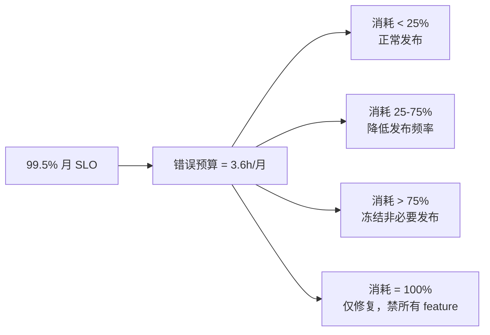
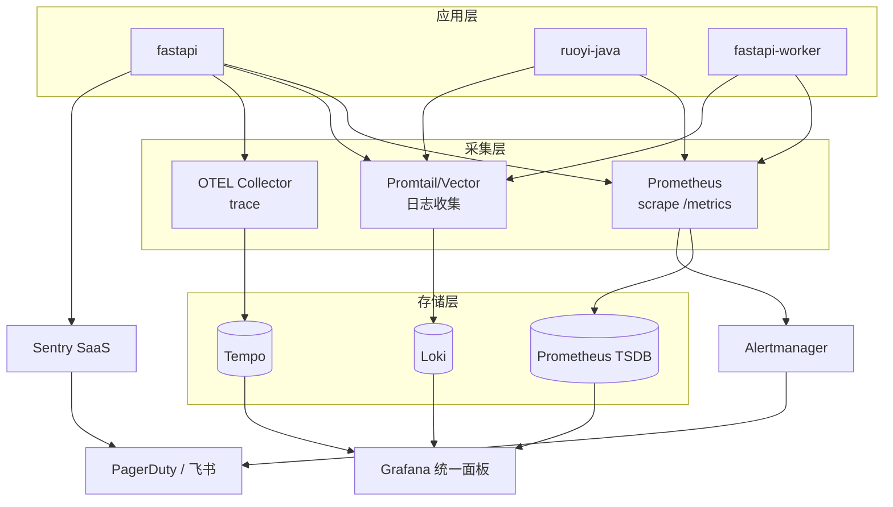

| 版本 | 日期 | 修订内容 | 作者 | 评审 |
|------|------|----------|------|------|
| v0.1.0 | 2026-03-24 | 初始草稿（仅占位） | — | — |
| v1.0.0 | 2026-04-25 | 按 SRE 全量改写：补齐 SLI/SLO/错误预算、告警分级、值班轮换、可观测三支柱蓝图 | Ops Writer | Architecture Specialist |

---

## 1. 概述

### 1.1 目的
为 Prorise AI Teach 平台建立 **SRE 三支柱（Metrics / Logs / Traces）+ SLO/Error Budget** 的可观测体系，并定义告警分级与值班轮换。

### 1.2 当前形态（诚实声明）
当前可观测能力是「**最小可用**」级别：
- **Metrics**：仅 RuoYi Spring Boot Admin（`ruoyi-monitor`）展示 JVM；Prometheus 未部署。
- **Logs**：FastAPI / RuoYi 各自落 stdout 与文件卷，**无聚合**（无 ELK/Loki）。
- **Traces**：未接入 OpenTelemetry。
- **告警**：仅靠用户反馈 + Sentry（FastAPI 已接，RuoYi 未接）。

本文同时描述「现状（M0）」与「目标（M2）」，并标注差距。

### 1.3 阅读对象
| 角色 | 关注章节 |
|------|----------|
| 全体开发 | §3 SLI/SLO、§5 告警分级 |
| SRE / 值班 | 全部，重点 §5、§6、§7 |
| 产品 | §3 SLO、§4 错误预算（影响功能上线节奏） |

## 2. 引用文件
- `./0001-部署架构.md`：监控对象（部署拓扑）
- `./0004-故障排查手册.md`：告警触发后的响应剧本
- `../003-架构设计/0001-系统架构总览.md`：SLO 业务上下文
- Google SRE Book §4 Service Level Objectives: <https://sre.google/sre-book/service-level-objectives/>
- Google SRE Workbook §5 Alerting on SLOs: <https://sre.google/workbook/alerting-on-slos/>

## 3. SLI / SLO / Error Budget

### 3.1 服务等级（按业务关键度分层）

| 服务 | 等级 | 业务影响 | 可用性 SLO | 错误预算（30 天） |
|------|------|----------|------------|-------------------|
| ruoyi-java（业务 API） | T1 | 登录/选课/支付不可用 | 99.5% | 3.6 h |
| fastapi（视频任务 API） | T1 | 视频生成不可用 | 99.5% | 3.6 h |
| student-fe / admin-fe | T1 | 前端白屏 | 99.5% | 3.6 h |
| fastapi-worker（视频管道） | T2 | 任务积压 / 等待 | 95%（首段 < 5 min） | 36 h |
| edge-tts（外部依赖） | T2 | 视频降级（无声） | 95% | 36 h |
| minio（对象存储） | T1 | 上传/下载失败 | 99.5% | 3.6 h |
| ruoyi-snailjob | T3 | 定时任务延迟 | 99% | 7.2 h |
| ruoyi-monitor | T3 | 监控本身 | 95% | 36 h |

### 3.2 SLI 详表

| 服务 | SLI 名称 | 计算方式 | 阈值（SLO） | 数据源 |
|------|----------|----------|-------------|--------|
| ruoyi-java | http_success_rate | `2xx+3xx / 总请求数`（5xx 计失败） | ≥ 99.5% | nginx access log（M1：Prometheus） |
| ruoyi-java | http_p95_latency | 5xx 排除后 p95 | ≤ 500ms | 同上 |
| fastapi | http_success_rate | 同上 | ≥ 99.5% | uvicorn access log |
| fastapi | http_p95_latency | 同上 | ≤ 800ms（含 LLM 路由） | 同上 |
| fastapi-worker | task_success_rate | `dramatiq.success / total` | ≥ 95% | 任务表 `video_task.status` |
| fastapi-worker | first_section_latency | 首段视频可见时间 | ≤ 5 min（p95） | 任务时间戳差 |
| mysql | conn_pool_usage | 当前连接 / max_connections | ≤ 80% | RuoYi monitor JDBC pool |
| redis | mem_usage_pct | `used_memory / maxmemory` | ≤ 85% | redis INFO memory |
| redis | hit_rate | `hits / (hits+misses)` | ≥ 90% | redis INFO stats |
| minio | api_success_rate | mc admin info | ≥ 99.5% | mc cli |
| 全栈 | error_log_rate | ERROR 日志条数 / min | ≤ 5/min | 日志聚合（M2） |

### 3.3 错误预算消耗



> 图 3-1：错误预算消耗与发布门禁联动。**这是 SRE 与产品的契约**——预算耗尽时产品必须接受冻结。

## 4. 监控工具栈

### 4.1 当前栈（M0）
| 层 | 工具 | 用途 |
|----|------|------|
| JVM 监控 | Spring Boot Admin（ruoyi-monitor） | RuoYi 进程、线程、GC、HTTP trace |
| 错误聚合 | Sentry（仅 FastAPI） | 异常上报 + 告警 |
| 容器健康 | Docker healthcheck | 自动重启 |
| 日志 | 容器 stdout + Logback 文件卷 | 人工 `docker logs` |

### 4.2 目标栈（M2）



> 图 4-1：M2 目标可观测架构（Prometheus + Loki + Tempo + Grafana + Alertmanager）。Sentry 作为应用错误兜底保留。

### 4.3 仪表盘清单（M2 落地）
| 面板 | 受众 | 关键卡片 |
|------|------|----------|
| 「平台概览」 | 全员 | DORA 4 指标、各服务 SLO 进度环、错误预算燃尽 |
| 「FastAPI 业务」 | 后端 | QPS、p50/p95/p99、错误率、Dramatiq 队列深度 |
| 「视频管道」 | 视频组 | 任务并发、首段耗时分布、阶段失败率（codegen / render / TTS） |
| 「RuoYi」 | 后端 | JVM heap、线程池、慢 SQL Top10 |
| 「基础设施」 | SRE | 容器 CPU/Mem、卷使用率、网络流量 |
| 「日志告警」 | 值班 | ERROR 速率、WARN Top patterns |

## 5. 告警分级与值班

### 5.1 告警分级（P0-P3）

| 级别 | 定义 | 响应 SLA | 通知 | 升级 | 示例 |
|------|------|----------|------|------|------|
| **P0** | 全站不可用 / 数据丢失风险 | 5 min 响应 | 电话 + 飞书 + Slack | 15 min 未 ACK 升级 Tech Lead | mysql 不可达、登录全挂 |
| **P1** | 核心功能不可用 | 15 min 响应 | 飞书 @oncall + Slack | 30 min 升级 | 视频任务 100% 失败、TTS Provider 全挂 |
| **P2** | 部分降级 / SLO 风险 | 1 h 响应 | 飞书 oncall 群 | 2 h 升级 | p95 超阈值、错误预算消耗 > 50%/天 |
| **P3** | 非紧急 / 容量预警 | 1 工作日 | Slack 群 | — | 卷使用率 > 70%、覆盖率回退 |

### 5.2 告警规则示例（M2 PromQL 草案）

```yaml
# fastapi 5xx 突增（P1）
- alert: FastAPI5xxSpike
  expr: |
    sum(rate(http_requests_total{service="fastapi",status=~"5.."}[5m]))
      / sum(rate(http_requests_total{service="fastapi"}[5m])) > 0.05
  for: 5m
  labels: { severity: P1 }

# 错误预算燃烧速度（P2）
- alert: ErrorBudgetBurn
  expr: |
    (1 - slo:availability:ratio_rate30d{service="fastapi"})
      > (1 - 0.995) * 14.4   # 14.4× 燃烧速率 → 2 天耗尽月预算
  for: 1h
  labels: { severity: P2 }

# Dramatiq 队列深度（P1）
- alert: DramatiqBacklog
  expr: dramatiq_queue_messages{queue="video"} > 50
  for: 10m
  labels: { severity: P1 }

# Redis 内存逼近上限（P2）
- alert: RedisMemoryHigh
  expr: redis_memory_used_bytes / redis_memory_max_bytes > 0.85
  for: 15m
  labels: { severity: P2 }
```

### 5.3 值班轮换

| 轮 | 周期 | 主值班 | 副值班 | 职责 |
|----|------|--------|--------|------|
| Primary | 7 天，周一 10:00 切换 | 全栈工程师 ×1 | Tech Lead | P0/P1 第一响应 |
| Secondary | 同上，错峰 | 后端 ×1 | — | Primary 不可达时接管 |

值班期间义务：
- **必须**：保持手机畅通、笔记本可远程、`deploy/.env.prod` 已下载、SSH key 可用
- **必须**：每个 P0/P1 在 24h 内提交事后复盘（模板见 `0004-故障排查手册.md`）
- **不得**：值班期间做破坏性变更（禁部署、禁 schema migration）

### 5.4 通知渠道

| 渠道 | 用途 | 静默时段 |
|------|------|----------|
| 电话（PagerDuty / 短信） | P0 | 无（24/7） |
| 飞书 @oncall | P0/P1/P2 | 无 |
| 飞书群 ops-alerts | P2/P3 | 22:00-08:00 静默（仅 P2 触发夜间） |
| Slack #incidents | 全部 | 无 |
| 邮件 | 周报 / 月报 | — |

## 6. 日志架构

### 6.1 当前日志栈
| 服务 | 输出 | 格式 | 级别控制 |
|------|------|------|----------|
| fastapi（含 worker） | stdout + `fastapi-secrets` 卷 | `LOG_FORMAT` 含 `request_id` / `task_id`（`packages/fastapi-backend/app/core/logging.py:47`） | `FASTAPI_LOG_LEVEL`（`config.py:111`，默认 INFO） |
| ruoyi-java | `/ruoyi/server/logs/*.log` 卷 | Logback `%d %p %c{0} - %m%n` | application-prod.yml |
| nginx (1panel) | 1panel 默认路径 | combined | nginx.conf |

### 6.2 关键约定
- **request_id**：FastAPI 入口注入到 contextvars，所有 logger 自动携带，跨服务调用通过 HTTP header 透传（参见 `0004-API设计规范.md` §request-id）。
- **task_id**：Dramatiq Actor 内 contextvar 注入，关联视频任务全链路。
- **error_code**：业务异常携带稳定错误码，便于聚合（`packages/fastapi-backend/app/core/logging.py:3`）。

### 6.3 已知缺口
| 缺口 | 影响 | 计划 |
|------|------|------|
| 日志未聚合 | 跨容器查链路靠 `docker logs` + grep | M1 接 Loki + Promtail |
| 日志保留策略不一致 | RuoYi 30 天滚动；FastAPI 容器重启即丢 | M1 统一 30 天 |
| FASTAPI_LOG_LEVEL 不能动态调整 | 改级别需重启容器 | M2 接入 Spring Boot Admin 动态级别 / FastAPI custom endpoint |
| 敏感字段（prompt、api_key）可能落 DEBUG 日志 | 高 | 强制 prod=INFO，DEBUG 24h 内必须回滚 |

## 7. 容量规划

### 7.1 当前容量基线（单机 4C8G）

| 资源 | 上限 | 当前峰值 | 余量 | 触发扩容线 |
|------|------|----------|------|------------|
| CPU | 4 core | ~60%（视频渲染时） | 40% | 持续 > 70% 一周 |
| 内存 | 8 GB | ~5 GB | 3 GB | 持续 > 6 GB |
| 磁盘 | 200 GB | ~80 GB | 120 GB | > 70% |
| MySQL 连接 | 151 默认 | ~20 | 130 | > 100 |
| Redis 内存 | 512 MB | ~100 MB | 400 MB | > 400 MB |
| Dramatiq 并发 | `FASTAPI_VIDEO_SECTION_CODEGEN_CONCURRENCY` 默认 2 | 2 | 0 | 队列积压 > 20 |

### 7.2 扩容路径
| 触发 | 动作 | 不停机？ |
|------|------|----------|
| CPU/Mem 持续高 | 升级单机规格 | 否（重启） |
| 视频任务积压 | 横向扩 fastapi-worker（compose `--scale fastapi-worker=2`） | 是 |
| MySQL 连接耗尽 | 调整 `max_connections` | 否（重启） |
| 磁盘满 | 扩容卷 / 清理 `video-assets/CASES` | 是 |

## 8. 可观测性最佳实践

| 实践 | 说明 |
|------|------|
| 黄金信号（Golden Signals） | 每个服务必须暴露：流量、错误、延迟、饱和度 |
| 三支柱独立 | Metrics 用于趋势告警；Logs 用于定位；Traces 用于跨服务因果 |
| 高基数限制 | label 不放 user_id / task_id（基数爆炸）；这些字段进 Logs/Traces |
| 告警基于 SLO 而非阈值 | 「错误率 > 5%」不如「错误预算 30 天燃烧 > 14.4×」精准 |
| 不告警 = 不重要 | 不能响应的告警必须删掉，避免疲劳 |

## 9. 演进路线

| 里程碑 | 目标 | 关键工件 | 预计 |
|--------|------|----------|------|
| **M0**（当前） | Sentry + 容器 healthcheck + 人工 | — | 已达成 |
| **M1** | Prometheus + Loki + Grafana 上线 | compose-monitor.yml | 2026-Q3 |
| **M2** | OTEL Trace + Alertmanager + DORA 仪表盘 | otel-collector.yaml | 2026-Q4 |
| **M3** | 错误预算自动门禁 CD | GHA + Prometheus query | 2027-Q1 |

## 10. 附录 A：术语对照
| 术语 | 英文 | 释义 |
|------|------|------|
| SLI | Service Level Indicator | 服务等级指标（量化值） |
| SLO | Service Level Objective | 服务等级目标（SLI 的目标阈值） |
| SLA | Service Level Agreement | 对客户的合约（SLO + 违约赔偿） |
| 错误预算 | Error Budget | 1 - SLO，可消耗的不可用时长 |
| 燃烧速率 | Burn Rate | 当前消耗 ÷ 平均允许消耗 |
| 黄金信号 | Golden Signals | 流量/错误/延迟/饱和度（Google SRE） |
| MTTD | Mean Time To Detect | 平均检测时长 |
| MTTR | Mean Time To Restore | 平均恢复时长（DORA 第 4 项） |

## 11. 附录 B：参考资料
- Google SRE Book: <https://sre.google/sre-book/>
- Google SRE Workbook: <https://sre.google/workbook/>
- Prometheus Best Practices: <https://prometheus.io/docs/practices/>
- Grafana Loki: <https://grafana.com/docs/loki/>
- OpenTelemetry: <https://opentelemetry.io/>
