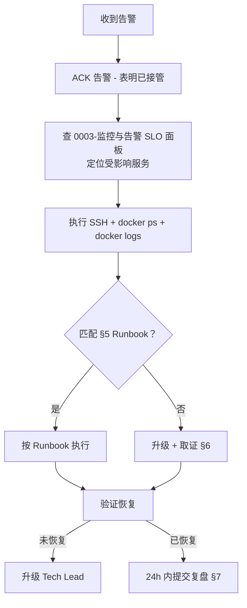
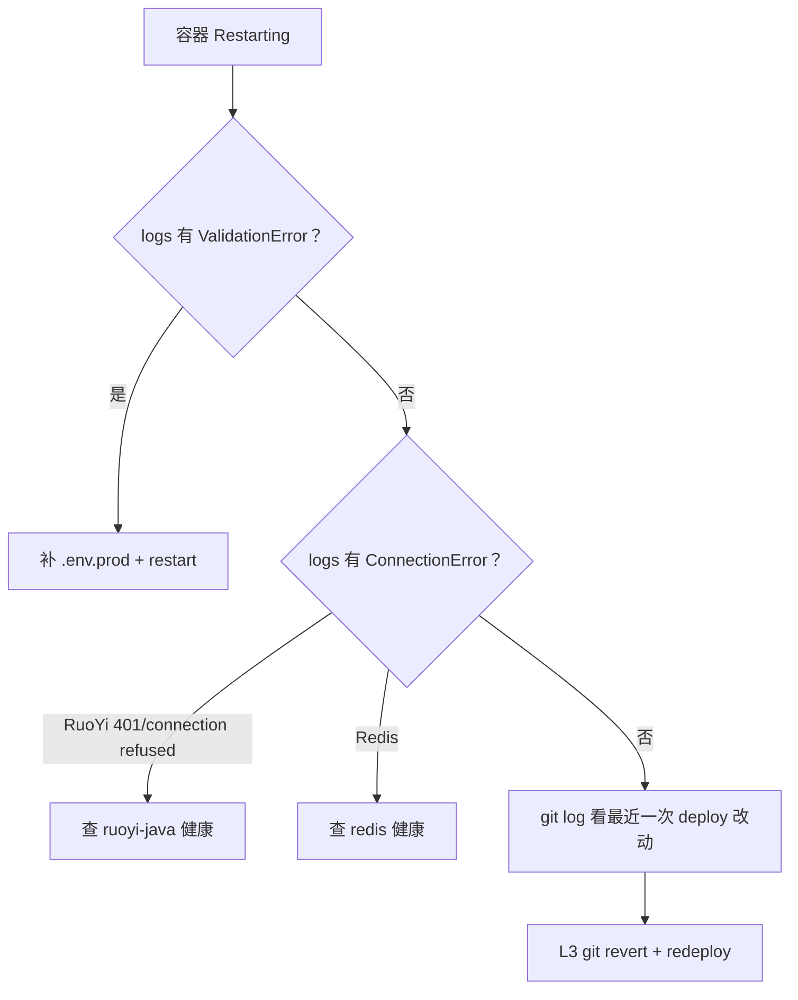
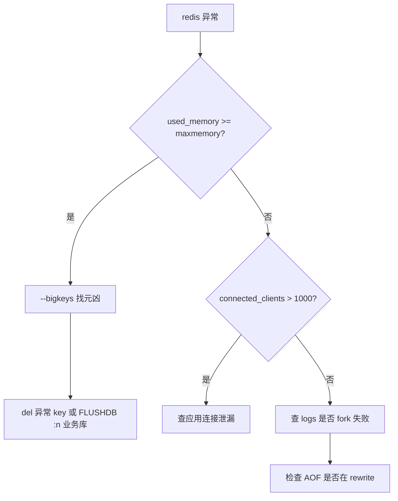
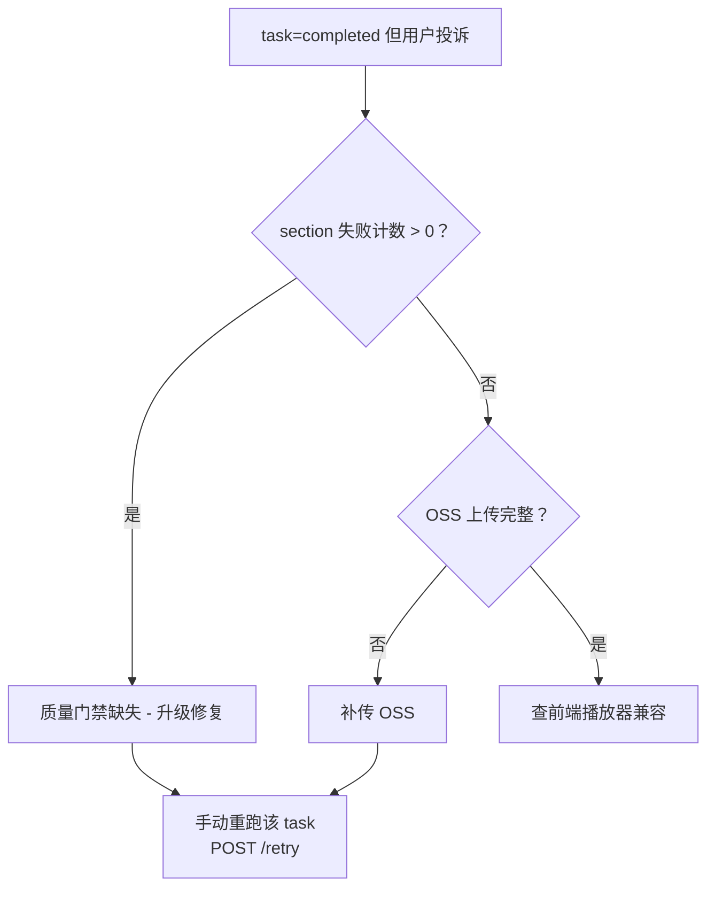
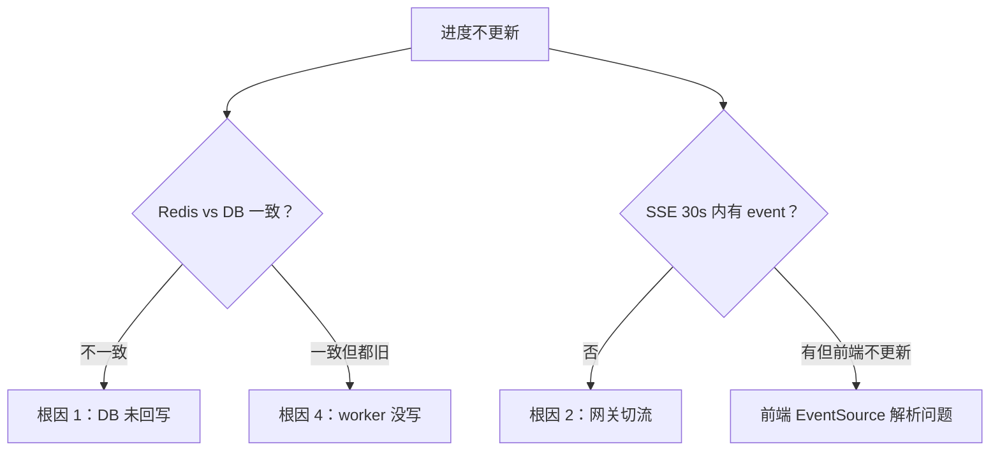
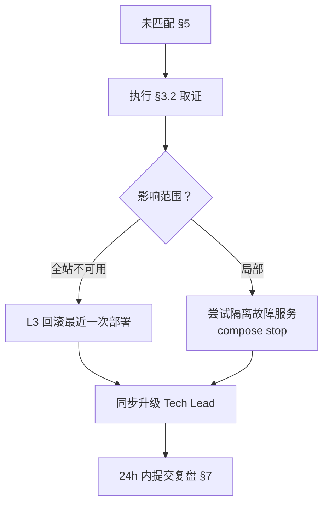

| 版本 | 日期 | 修订内容 | 作者 | 评审 |
|------|------|----------|------|------|
| v0.1.0 | 2026-03-24 | 初始草稿（仅占位） | — | — |
| v1.0.0 | 2026-04-25 | 按 SRE Runbook 规范全量改写：补齐通用排查流程、Runbook 模板、6 个真实故障场景 | Ops Writer | Architecture Specialist |

---

## 1. 概述

### 1.1 目的
为值班工程师提供**可直接照抄执行**的故障排查流程与场景化 Runbook。每个故障场景都是真实历史事件或已识别风险的固化复盘。

### 1.2 阅读对象
- 值班工程师（首要）
- 全体后端 / 前端开发（事故响应轮值）
- 新员工入职第一周必读

### 1.3 使用方式
1. 收到告警 → §3 通用排查流程定位嫌疑模块
2. 跳到 §5 对应 Runbook 章节执行
3. 找不到匹配 Runbook → §6 兜底（升级 + 取证）
4. 事后 24h 内填 §7 复盘模板，加入本文 §5

## 2. 引用文件
- `./0001-部署架构.md`：故障定位的物理拓扑
- `./0002-CI-CD流水线.md`：回滚流程
- `./0003-监控与告警.md`：告警分级 + SLI 阈值
- `deploy/README.md`：部署 SOP（事故时回滚依赖）
- Google SRE Book §14 Managing Incidents: <https://sre.google/sre-book/managing-incidents/>

## 3. 通用排查流程

### 3.1 黄金 5 步（First Responder Checklist）



> 图 3-1：值班响应黄金 5 步。**ACK 告警是第一步**——避免多人重复响应。

### 3.2 取证标准动作（任何场景必做）

```bash
# === 全部命令在生产服务器执行 ===
ssh prorise@38.76.207.214
cd /home/prorise/xm-prod

# (1) 容器状态
docker compose -f deploy/docker-compose.yml --env-file deploy/.env.prod ps

# (2) 关键容器日志（最近 500 行）
docker logs xm-fastapi --tail 500 > /tmp/incident-fastapi-$(date +%s).log
docker logs xm-fastapi-worker --tail 500 > /tmp/incident-worker-$(date +%s).log
docker logs xm-ruoyi-java --tail 500 > /tmp/incident-ruoyi-$(date +%s).log

# (3) 资源快照
docker stats --no-stream > /tmp/incident-stats-$(date +%s).txt
df -h > /tmp/incident-df-$(date +%s).txt
free -m >> /tmp/incident-df-$(date +%s).txt

# (4) 网络连通性
docker compose -f deploy/docker-compose.yml exec fastapi curl -fsS http://ruoyi-java:8080/ || echo "FAIL ruoyi"
docker compose -f deploy/docker-compose.yml exec fastapi redis-cli -h redis -a "$REDIS_PASSWORD" ping
```

> 工件保留至少 30 天，作为复盘材料。

## 4. Runbook 模板

每个 §5 故障场景都遵循以下结构：

```
### 场景 X：<标题>

| 字段 | 值 |
|------|-----|
| 故障代号 | INC-<YYYYMMDD>-<seq> |
| 严重度 | P0 / P1 / P2 / P3 |
| 受影响 SLO | 见 0003 §3 |
| 历史发生 | 次数 + 最近一次日期 |

**症状**：可观察的现象（用户视角 + 系统视角）
**根因假设**：列 1-N 个可能原因，置信度排序
**诊断命令**：可直接复制粘贴
**判定决策树**：Mermaid
**修复动作**：分级（L1 重启 / L2 配置 / L3 代码）
**验证标准**：明确的 ✅ 标志
**预防措施**：长期改进项 + 关联 Issue/PR
```

## 5. 真实故障场景

### 场景 1：FastAPI 启动失败（容器 restart 死循环）

| 字段 | 值 |
|------|-----|
| 故障代号 | INC-RUNBOOK-001 |
| 严重度 | P0（API 不可用） |
| 受影响 SLO | fastapi.http_success_rate |
| 历史发生 | 多次（依赖加新 Settings 字段未同步 .env、PR #未编号） |

**症状**：
- 用户：`/api/v1/*` 全部 502
- `docker ps`：`xm-fastapi` 状态 `Restarting`，重启次数持续上涨
- `docker logs`：`pydantic.ValidationError: ... missing field FASTAPI_XXX`

**根因假设**（按概率排序）：
1. 新增 Settings 字段未同步 `.env.prod`（参考 [feedback-env-file-sync](../) 规则）
2. Provider 数据库未配置 / RuoYi 未启动
3. Python 依赖缺失（`pip install` 未跑）
4. `.runtime/secrets` 卷权限错误

**诊断命令**：
```bash
docker logs xm-fastapi --tail 100 2>&1 | grep -E "Error|Validation|Traceback"
docker compose exec fastapi env | grep FASTAPI_
docker compose exec fastapi python -c "from app.core.config import get_settings; print(get_settings())"
```

**判定决策树**：



**修复动作**：
- L1：补全 `deploy/.env.prod` → `docker compose up -d fastapi`
- L2：恢复 RuoYi/Redis 依赖（见场景 4 / 5）
- L3：`git revert <bad_sha>` → `./deploy/scripts/deploy.sh`

**验证标准**：
- `curl -fsS http://localhost:18090/` 200
- `docker ps` 显示 `(healthy)`
- 业务侧：`curl -fsS https://xm.prorisehub.com/api/v1/health`

**预防**：
- CI 添加 `.env.prod.example` ↔ `Settings` 字段一致性检查（M1）
- 部署前必跑 `python -c "from app.core.config import get_settings; get_settings()"`

---

### 场景 2：视频管道 Manim Docker 渲染失败

| 字段 | 值 |
|------|-----|
| 故障代号 | INC-RUNBOOK-002 |
| 严重度 | P1（视频生成不可用） |
| 受影响 SLO | fastapi-worker.task_success_rate |
| 历史发生 | 多次（manimcat-latex-docker-root-cause、code2video-integration） |

**症状**：
- 用户：视频任务卡 `pending` 或 `failed`，无错误反馈
- `video_task` 表 `failure_message` 含 `Manim render failed` / `LaTeX Error` / `docker: command not found`
- `xm-fastapi-worker` 日志：`subprocess.CalledProcessError: returncode != 0`

**根因假设**：
1. `manim-sandbox` 镜像未构建 / 不在容器可见路径
2. LaTeX 包缺失（场景文档含数学公式）
3. Docker socket 未挂载 / fastapi-worker 无 docker.sock 权限
4. `FASTAPI_VIDEO_SANDBOX_ALLOW_LOCAL_FALLBACK=false` 但沙箱不可用

**诊断命令**：
```bash
# 沙箱镜像存在？
docker images | grep manim-sandbox

# fastapi-worker 容器内能否调 docker？
docker compose exec fastapi-worker docker ps

# 直接跑一次最小 manim 渲染
docker run --rm manim-sandbox manim --version

# 查任务失败明细
docker compose exec mysql mysql -uroot -p"$MYSQL_ROOT_PASSWORD" "$MYSQL_DATABASE" -e \
  "SELECT id, status, failure_message FROM video_task ORDER BY id DESC LIMIT 5\G"
```

**修复动作**：
- L1：重建沙箱镜像 `cd deploy/manim-sandbox && docker build -t manim-sandbox .`
- L2：补 LaTeX 包 → 改 `Dockerfile` `apt-get install texlive-fonts-extra` → 重 build
- L3：临时开启 `FASTAPI_VIDEO_SANDBOX_ALLOW_LOCAL_FALLBACK=true`（仅紧急，事后必关）

**验证标准**：
- 重跑一个最小 task：`curl -X POST .../api/v1/video/tasks -d '{"topic":"勾股定理","sections":1}'`
- 等 10 min，task 成 `completed`，存在 mp4 产物

**预防**：
- 沙箱镜像版本写入 compose `image:` 字段，不再裸 build
- CI 跑视频管道 smoke 测试（一个 30s 简单 case）

---

### 场景 3：Redis 连接断（OOM / 主动断连）

| 字段 | 值 |
|------|-----|
| 故障代号 | INC-RUNBOOK-003 |
| 严重度 | P0（多服务级联挂） |
| 受影响 SLO | ruoyi.http_success_rate, fastapi.http_success_rate, dramatiq |
| 历史发生 | 1 次（2026-Q1 OOM） |

**症状**：
- RuoYi 登录失败 / FastAPI 5xx 飙升 / Dramatiq 队列积压
- `docker logs xm-redis`：`OOM command not allowed when used memory > 'maxmemory'`（虽然有 lru，但 AOF 回写阻塞）

**诊断命令**：
```bash
docker compose exec redis redis-cli -a "$REDIS_PASSWORD" INFO memory
docker compose exec redis redis-cli -a "$REDIS_PASSWORD" INFO clients
docker compose exec redis redis-cli -a "$REDIS_PASSWORD" --bigkeys
```

**判定决策树**：



**修复动作**：
- L1：删超大 key（`bigkeys` 输出）
- L2：上调 `maxmemory`（`docker-compose.yml:79` 编辑 → up）
- L3：紧急 `FLUSHDB`（仅缓存型库，会话型库禁用）
- 长期：业务侧加 TTL 审计

**验证标准**：
- `INFO memory` `used_memory_human` 回到 < 80% maxmemory
- 应用 5xx 速率回到基线

---

### 场景 4：MySQL 死锁 / 慢 SQL 拖垮连接池

| 字段 | 值 |
|------|-----|
| 故障代号 | INC-RUNBOOK-004 |
| 严重度 | P1 |
| 受影响 SLO | ruoyi.http_p95_latency |
| 历史发生 | 0 次（已识别风险） |

**症状**：
- RuoYi 接口大面积超时
- `ruoyi-monitor`（Spring Boot Admin）连接池 100% 占用
- `SHOW ENGINE INNODB STATUS` 出现 `LATEST DETECTED DEADLOCK`

**诊断命令**：
```bash
docker compose exec mysql mysql -uroot -p"$MYSQL_ROOT_PASSWORD" -e "SHOW PROCESSLIST" | grep -v Sleep
docker compose exec mysql mysql -uroot -p"$MYSQL_ROOT_PASSWORD" -e "SHOW ENGINE INNODB STATUS\G" | grep -A50 "LATEST DETECTED DEADLOCK"
docker compose exec mysql mysql -uroot -p"$MYSQL_ROOT_PASSWORD" -e "SELECT * FROM information_schema.innodb_trx ORDER BY trx_started"
```

**修复动作**：
- L1：`KILL <thread_id>` 终止长事务
- L2：临时调大连接池（RuoYi `application-prod.yml`）
- L3：定位代码（PR 引入），`git revert`

**验证**：连接池利用率 < 50%，p95 < 500ms

**预防**：
- 慢 SQL 日志开启（`long_query_time=1`）
- PR 涉及事务必须有 reviewer 标 `db-impact`

---

### 场景 5：TTS Provider 全挂（视频静音）

| 字段 | 值 |
|------|-----|
| 故障代号 | INC-RUNBOOK-005 |
| 严重度 | P1 |
| 受影响 SLO | fastapi-worker.task_success_rate |
| 历史发生 | 1 次（tts-provider-registration-fix） |

**症状**：
- 视频任务跑完但**无音轨**
- worker 日志：`TTSProviderError: all providers failed` / `provider not found`
- 数据库 `provider_binding` 表 `runtime_provider_id` 指向不存在的 provider

**诊断命令**：
```bash
# 查 binding
docker compose exec mysql mysql -uroot -p"$MYSQL_ROOT_PASSWORD" "$MYSQL_DATABASE" -e \
  "SELECT pb.*, p.id as provider_exists FROM provider_binding pb LEFT JOIN provider p ON p.id=pb.runtime_provider_id WHERE pb.bind_kind='tts'"

# 直接调用 provider 探活
docker compose exec fastapi-worker python -c \
  "from app.adapters.tts import get_tts_client; print(get_tts_client('default').health())"

# edge-tts 跨 stack 容器
docker exec edge-tts curl -fsS http://localhost:5050/voices | head
```

**修复动作**：
- L1：管理后台改 binding 指向有效 provider
- L2：edge-tts 容器重启 `docker restart edge-tts`
- L3：代码层降级（OpenAI TTS fallback）

**验证**：重跑 task → 视频含音轨

**预防**：
- 启动时校验 binding 完整性（参考 provider-binding-ghost-ids 记忆）
- 至少 2 个 TTS provider 永远可用

---

### 场景 6：CF 524 LLM 超时（长 prompt 流式建立失败）

| 字段 | 值 |
|------|-----|
| 故障代号 | INC-RUNBOOK-006 |
| 严重度 | P2 |
| 受影响 SLO | fastapi.http_p95_latency, video first_section_latency |
| 历史发生 | 多次（llm-stream-524-root-cause、llm-proxy-null-content-fix） |

**症状**：
- 视频生成卡在 codegen 阶段，单段耗时 > 60s 后报 524
- worker 日志：`httpx.ReadTimeout` / `Cloudflare 524`
- 仅特定 LLM 端点（`synai996.space` / `cpa.prorise666.site`）

**根因**：
- Cloudflare 默认 100s 边界，但流式建链超过 60s 会被中断
- 反代缓冲层把 stream 当非流处理，content=null

**诊断**：
```bash
# 直接 curl 流式测试
docker compose exec fastapi-worker curl -N -X POST $LLM_URL/v1/chat/completions \
  -H "Authorization: Bearer $KEY" -d '{"model":"...","messages":[...],"stream":true}'

# 查最近 LLM 错误
docker logs xm-fastapi-worker --since 1h 2>&1 | grep -E "524|ReadTimeout|null content"
```

**修复动作**：
- L1：管理后台切到备用 LLM provider（如官方 OpenAI 直连）
- L2：缩短 prompt（参考 video-pipeline-codegen-none-fix）
- L3：开启三层 fallback（stream → fallback to non-stream → fallback to provider B）

**验证**：codegen p95 < 30s

**预防**：
- LLM 调用必须三层防御（参考 llm-proxy-null-content-fix 记忆）
- 监控加 LLM 错误率分 provider 维度告警

### 场景 7：视频管道 quality gate 静默通过（section 失败但 status=completed）

| 字段 | 值 |
|------|-----|
| 故障代号 | INC-RUNBOOK-007 |
| 严重度 | P1（用户拿到「成功」但内容残缺） |
| 受影响 SLO | fastapi-worker.task_success_rate（语义层面失真） |
| 历史发生 | 已识别风险（见 video-pipeline-quality-gate-gap 记忆） |

**症状**：
- 用户：视频生成「成功」但播放发现某些段落跳过 / 无音轨 / 黑屏
- API：`GET /api/v1/video/tasks/{id}` 返回 `status=completed`，但 `sections[i].status=failed` 或缺失 mp4
- worker 日志可见 `section X failed, skipping` 但任务总状态未降级

**根因**：
管道在 section 级别失败时**静默跳过**，未传播到 task.status。质量门禁缺位的 5 个环节：
1. section codegen 失败 → 跳过该 section（应当：失败计数 ≥ N 则整任务降级）
2. Manim 渲染失败 → 跳过（应当：硬失败）
3. TTS 失败 → 静音（应当：标 partial）
4. 章节合并阶段缺片 → 直接拼可用片（应当：拒绝产出）
5. 上传 OSS 失败 → 不重试（应当：retry-then-fail）

**诊断命令**：
```bash
# 查任务 section 级状态分布
docker compose exec mysql mysql -uroot -p"$MYSQL_ROOT_PASSWORD" "$MYSQL_DATABASE" -e \
  "SELECT vt.id, vt.status, COUNT(vs.id) total_sections,
          SUM(CASE WHEN vs.status='completed' THEN 1 ELSE 0 END) ok_sections,
          SUM(CASE WHEN vs.status='failed' THEN 1 ELSE 0 END) failed_sections
   FROM video_task vt LEFT JOIN video_section vs ON vs.task_id=vt.id
   WHERE vt.id=<TASK_ID> GROUP BY vt.id\G"

# 跑取 worker 该任务的全链路日志
docker logs xm-fastapi-worker 2>&1 | grep "task_id=<TASK_ID>" | grep -E "section|failed|skip"

# 检查产物完整性
docker compose exec fastapi-worker ls -la /app/.runtime/video-assets/CASES/<TASK_ID>/
```

**判定决策树**：



**修复动作**：
- L1（用户侧补救）：手动调用 `POST /api/v1/video/tasks/{id}/retry` 重跑失败 section
- L2（数据修正）：mysql `UPDATE video_task SET status='partial' WHERE id=...` + 通知用户
- L3（代码层修复）：在 section 聚合点加质量门禁——任一关键 section 失败 → task.status=failed（参考 video-pipeline-quality-gate-gap 5 个环节清单）

**验证标准**：
- task `status` 反映真实质量（无 silent success）
- section 失败必定向用户暴露（API 字段 + 前端红色徽章）

**预防**：
- 集成测试加「故意让 section X 失败」用例，断言 task.status != completed
- 监控加 `task_silent_failure_rate` 指标（task.status=completed 但 section.failed > 0）

---

### 场景 8：SSE 进度断裂（progress 永远 0 / 任务跑完了前端不刷新）

| 字段 | 值 |
|------|-----|
| 故障代号 | INC-RUNBOOK-008 |
| 严重度 | P1（用户体验严重退化，看似卡死） |
| 受影响 SLO | 用户体验（无单独 SLI，归入 fastapi.http） |
| 历史发生 | 多次（video-api-test-findings、video-pipeline-db-status-bug） |

**症状**：
- 用户：打开视频任务详情页，进度条卡 0% 不动；或后端已完成但前端仍显示 pending
- 浏览器 DevTools：`/api/v1/video/tasks/{id}/events`（SSE）连接建立但**无 progress event** 推送，或推送后端未持久化
- API 轮询：`GET /api/v1/video/tasks/{id}` 返回 status 不更新（DB 没回写）

**根因假设**（按概率排序）：
1. **Worker 只写 Redis 不写 DB**（dispatch 完成无 persist_task 回调，参考 video-pipeline-db-status-bug 记忆）→ API 读 DB 永远是旧值
2. SSE 网关层超时（Cloudflare/nginx 默认 60s 切流）→ 长任务连接被切
3. progress 计算器分母为 0（首次调用前 sections 表无数据）
4. Dramatiq actor 内 logger 抛 progress event 但 Pub/Sub 通道被 prefix 错误吞掉

**诊断命令**：
```bash
# (1) 对比 Redis 和 DB 的状态差
docker compose exec redis redis-cli -a "$REDIS_PASSWORD" GET "video:task:<TASK_ID>:status"
docker compose exec mysql mysql -uroot -p"$MYSQL_ROOT_PASSWORD" "$MYSQL_DATABASE" -e \
  "SELECT id, status, progress, updated_time FROM video_task WHERE id=<TASK_ID>"
# 不一致 → 根因 #1

# (2) SSE 端点直连测试
curl -N -H "Authorization: Bearer $TOKEN" \
  "https://xm.prorisehub.com/api/v1/video/tasks/<TASK_ID>/events"
# 30s 内无任何 event → 根因 #4 或 #2

# (3) 查 Pub/Sub 订阅
docker compose exec redis redis-cli -a "$REDIS_PASSWORD" PUBSUB CHANNELS "video:*"

# (4) 查 nginx/1panel 是否切流
sudo tail -f /var/log/1panel/access.log | grep events
```

**判定决策树**：



**修复动作**：
- L1：手动触发一次状态同步：`docker compose exec fastapi python -m app.cli.video sync-task <TASK_ID>`（如有此 CLI；否则直接 SQL 更新 + 推 Redis 通知）
- L2：网关层把 SSE 路径加长超时（1panel proxy_pass `proxy_read_timeout 600s; proxy_buffering off;`）
- L3（代码修复）：Worker 完成时**必须**调用 `task.finalize()` 同时写 DB 和 Redis（参考 video-pipeline-db-status-fix 已修方案）

**验证标准**：
- 跑 30 min 长任务，前端进度连续上升、status 实时反映
- DB `video_task.status` 在每个 phase 切换时同步更新（`updated_time` 增加）
- SSE 连接断开后前端自动重连并补齐错过 event

**预防**：
- 集成测试断言 `task.finalize` 后 DB.status == Redis.status
- SSE 心跳每 15s 一次（防代理切流）
- 前端降级策略：SSE 失败时 fallback 到 5s 轮询

---

## 6. 兜底：未匹配场景的处理



> 关键原则：**未知故障下，先恢复，后定位**。回滚是最快的恢复手段——保留取证物再回滚，不冲突。

## 7. 故障复盘模板（事后 24h 内填写）

```markdown
# 故障复盘报告 INC-YYYYMMDD-NNN

## 1. 时间线（精确到分）
- HH:MM 告警触发（来源、级别）
- HH:MM 值班 ACK
- HH:MM 定位根因
- HH:MM 执行修复
- HH:MM 服务恢复
- 总时长（MTTR）：N min

## 2. 严重度与影响
- 级别：P0/P1/P2/P3
- 受影响用户：N（估）
- 受影响功能：...
- 错误预算消耗：N min（占月预算 X%）

## 3. 根因分析（5-Why）
1. 直接原因：...
2. 上游：...
3. 流程：...
4. 工具：...
5. 文化 / 设计：...

## 4. 处理时间评估
- 检测：N min（理想 < 5）
- 升级：N min
- 修复：N min
- 验证：N min

## 5. 做对的事
- ...

## 6. 做错的事 / 可改进
- ...

## 7. 行动项（必须有 owner + 截止日）
| ID | 行动 | Owner | 截止 | Issue |
|----|------|-------|------|-------|
| 1 | ... | @x | YYYY-MM-DD | #N |

## 8. 是否归档为 §5 Runbook？
- 是 / 否（说明）
```

## 8. 排查工具清单

| 工具 | 用途 | 入口 |
|------|------|------|
| `docker compose logs` | 容器日志 | 服务器 |
| `docker stats` | 资源监控 | 服务器 |
| `mysql -e "SHOW PROCESSLIST"` | DB 活跃查询 | mysql 容器 |
| `redis-cli --bigkeys` | Redis 大 key | redis 容器 |
| `mc admin info` | MinIO 状态 | mc 容器 |
| Spring Boot Admin | RuoYi JVM | https://xm.prorisehub.com/admin（仅内网） |
| Sentry | FastAPI 异常 | https://sentry.io/... |
| `journalctl -u docker` | docker daemon | 服务器宿主 |

## 9. 应急联系（值班通讯录占位）

| 角色 | 联系方式 |
|------|----------|
| Primary On-Call | 飞书 @oncall |
| Tech Lead | 飞书 @tech-lead |
| 服务器机房 | （IDC 工单系统） |
| 域名 / Cloudflare | （账号管理员） |

> 真实通讯录维护在内部 Wiki，不进 git。

## 10. 附录 A：术语对照
| 术语 | 英文 | 释义 |
|------|------|------|
| Runbook | Runbook | 可执行的故障响应剧本 |
| ACK | Acknowledge | 值班确认接管告警 |
| Postmortem | Postmortem | 事后复盘报告 |
| MTTR | Mean Time To Restore | 平均恢复时长 |
| 5-Why | 5-Why Analysis | 5 层追问法 |

## 11. 附录 B：参考资料
- Google SRE Book §14 Managing Incidents: <https://sre.google/sre-book/managing-incidents/>
- Google SRE Book §15 Postmortem Culture: <https://sre.google/sre-book/postmortem-culture/>
- PagerDuty Incident Response: <https://response.pagerduty.com/>
