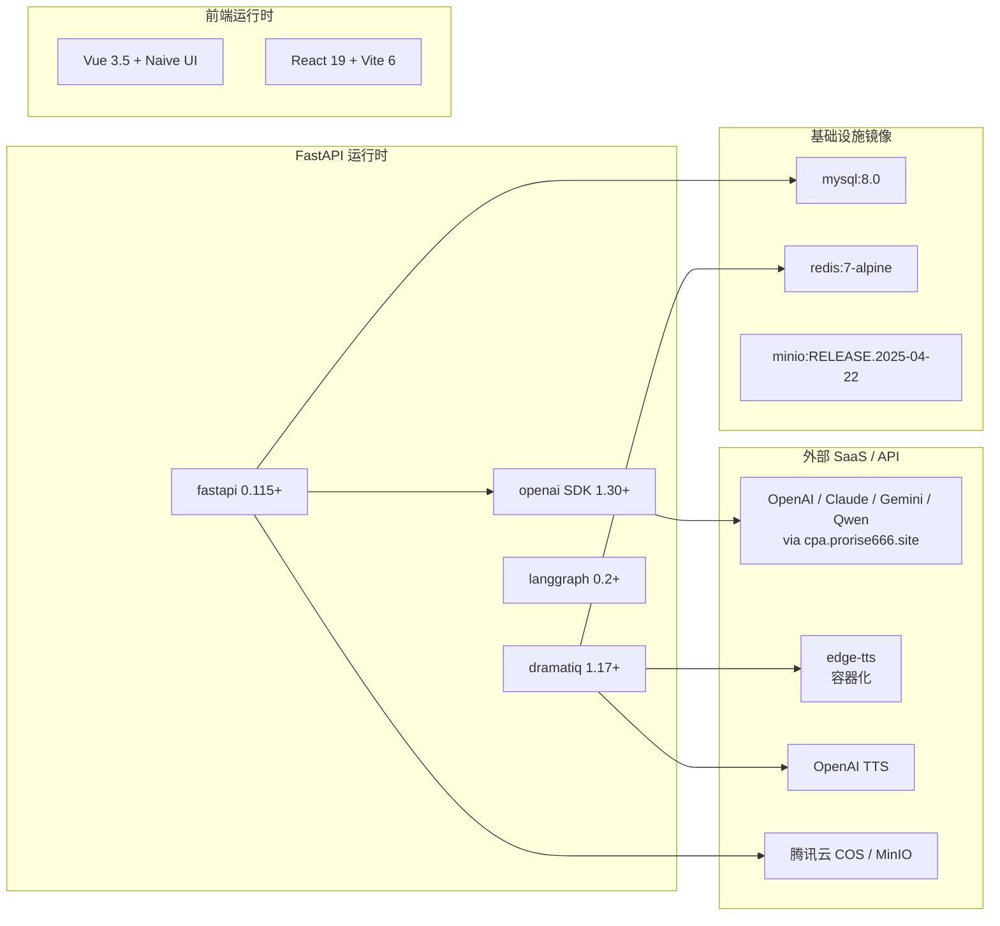

# 外部依赖与第三方服务

| 版本 | 日期 | 修订内容 | 作者 | 评审 |
|------|------|----------|------|------|
| v0.1.0 | 2026-03-24 | 草稿骨架 | TBD | — |
| v1.0.0 | 2026-04-25 | 全量补齐：第三方服务、SDK 清单、密钥治理、配额限制、替代方案 | 研发团队 | 架构组 |

---

## 1. 概述

### 1.1 目的

本文档作为 Prorise AI Teach 项目的「**第三方依赖事实清单**」，汇总所有进入生产链路的外部服务、运行时 SDK、构建链工具的版本、许可证、用途、安全等级与替代方案。任何引入新依赖或升级关键依赖前，必须先更新此文档。

### 1.2 适用范围

- 后端 Python 运行时依赖（`packages/fastapi-backend/pyproject.toml`、`uv.lock`，Python ≥3.11）
- 前端 Node 运行时与构建依赖：
  - `packages/student-web/package.json` — **React 19 + TypeScript + Vite 6**（学生端，包名 `@xiaomai/student-web`）
  - `packages/ruoyi-plus-soybean/package.json` — **Vue 3.5 + Naive UI + Vite 7**（管理后台，包名 `ruoyi-vue-plus`）
- Java/RuoYi-Plus 主依赖（`packages/RuoYi-Vue-Plus-5.X/pom.xml`，Java 21 + SpringBoot 3.5）
- Docker 镜像清单（`deploy/docker-compose.yml`）
- 外部 SaaS / API（OpenAI 兼容代理、对象存储、TTS、监控等）

### 1.3 阅读对象

- 研发：选型、升级、Bug 排查
- 安全合规：许可证审计、CVE 跟踪
- 运维：升级评估、容量规划

### 1.4 术语缩写

| 缩写 | 全称 | 含义 |
|------|------|------|
| SBOM | Software Bill of Materials | 软件物料清单 |
| OSI | Open Source Initiative | 开源促进会（许可证认证） |
| EOL | End of Life | 生命周期结束 |
| CVE | Common Vulnerabilities and Exposures | 公开漏洞编号 |

### 1.5 引用文件

- 内部：`../003-架构设计/0002-技术选型决策记录.md`、`../008-部署与运维/0001-部署架构.md`
- 外部：[SPDX License List](https://spdx.org/licenses/)、[OSV Database](https://osv.dev/)

---

## 2. 依赖全景图

图 2-1：核心依赖关系（节选关键链路，完整清单见 §3-§5）

---

## 3. 第三方 SaaS / API 服务清单

| 服务 | 用途 | 接入方式 | 计费/配额 | 安全等级 | 替代方案 | 官方文档 |
|------|------|----------|-----------|----------|----------|----------|
| OpenAI 兼容代理（cpa.prorise666.site / synai996.space） | LLM 调用、视觉（GPT-4o/Claude/Gemini） | OpenAI Python SDK + base_url 切换 | 按 token 计费，CDN 60s 超时 | 高（含密钥） | 直连 OpenAI/Azure；Qwen DashScope | https://platform.openai.com/docs |
| Google Gemini API | 视觉自修反馈（MLLM feedback） | Provider Router 适配 | RPM 限制按账号 | 高 | GPT-4o vision、Claude Vision | https://ai.google.dev/ |
| 阿里云 DashScope (Qwen) | 备用 LLM/TTS | OpenAI 兼容协议 | RPM/TPM 限制 | 中 | OpenAI、Gemini | https://help.aliyun.com/zh/dashscope/ |
| edge-tts | 默认免费 TTS（中文播报） | 容器 `prorise-internal` 网络内调 | 微软 EDGE 限速 | 低 | OpenAI TTS、火山 TTS | https://github.com/rany2/edge-tts |
| OpenAI TTS（tts-1） | 备用 TTS（音质优先场景） | OpenAI Provider | 按字符计费 | 中 | edge-tts、Azure TTS | https://platform.openai.com/docs/guides/text-to-speech |
| 腾讯云 COS | 视频/图片成品对象存储 | `FASTAPI_COS_BASE_URL` + STS | 按存储+流量计费 | 高（含密钥） | MinIO（自托管）、阿里 OSS | https://cloud.tencent.com/document/product/436 |
| MinIO（自托管） | 开发/灰度环境对象存储 | S3 协议 | 自管 | 中 | COS、OSS | https://min.io/docs/minio/linux/index.html |
| 1Panel（宿主反代） | 公网入口、证书托管 | 宿主 Nginx 反代到 Compose 暴露端口 | 自管 | 中 | Caddy、Traefik | https://1panel.cn/docs/ |

> 🛈 项目内 LLM 调用强制走 **Provider Router** 模式（详见 `../003-架构设计/0002-技术选型决策记录.md` ADR-006），所有外部 API 凭据由数据库 `provider_runtime` 表管理，**禁止硬编码**。

---

## 4. 后端 Python 依赖（`packages/fastapi-backend/pyproject.toml`，Python ≥3.11）

### 4.1 运行时依赖

| 包名 | 版本约束 | 用途 | 许可证 | 安全等级 | 升级风险 |
|------|----------|------|--------|----------|----------|
| fastapi | >=0.115,<1.0 | Web 框架 | MIT | 高 | 低（次版本兼容） |
| uvicorn[standard] | >=0.34,<1.0 | ASGI 服务器 | BSD-3 | 中 | 低 |
| pydantic-settings | >=2.7,<3.0 | 环境变量驱动配置 | MIT | 高 | 中（v2 → v3 不兼容） |
| dramatiq[redis] | >=1.17,<2.0 | 异步任务队列 | LGPL-3.0 | 高 | 中（LGPL 注意分发义务） |
| python-multipart | >=0.0.20,<1.0 | 表单/文件上传 | Apache-2.0 | 中 | 低 |
| httpx | >=0.28,<1.0 | 异步 HTTP 客户端（Provider/RuoYi 调用） | BSD-3 | 高 | 低 |
| openai | >=1.30,<2.0 | LLM/TTS SDK | Apache-2.0 | 高 | 中（v2 重大变更） |
| cryptography | >=44.0,<45.0 | RSA/AES（与 RuoYi `encrypt-key` 对接） | Apache-2.0 + BSD | 高 | 高（CVE 频发，需季度跟踪） |
| Jinja2 | >=3.1,<4.0 | 提示词模板渲染 | BSD-3 | 中 | 低 |
| langgraph | >=0.2,<1.0 | 智能体编排 | MIT | 中 | 中（pre-1.0 API 漂移） |
| langchain-core | >=0.3,<1.0 | LangGraph 依赖 | MIT | 中 | 中 |
| pypdf | >=5.0,<6.0 | PDF 解析（教材抽取） | BSD-3 | 中 | 低 |
| partial-json-parser | >=0.2,<1.0 | LLM 流式 JSON 容错 | MIT | 中 | 低 |

来源：`packages/fastapi-backend/pyproject.toml:11-25`

### 4.2 传递依赖（uv.lock 节选）

| 包 | 来源 | 备注 |
|----|------|------|
| pydantic / pydantic-core | fastapi、pydantic-settings | 数据校验核心 |
| anyio / sniffio / h11 / httpcore | httpx、fastapi | 异步底层 |
| jiter / orjson | openai、langchain | 高性能 JSON |
| prometheus-client | dramatiq Prometheus middleware | 指标导出 |
| requests / requests-toolbelt | langchain-core | 兼容旧同步 HTTP |
| langgraph-checkpoint / langgraph-sdk | langgraph | Checkpoint 持久化 |
| cryptography → cffi → pycparser | RSA 链路 | 编译型，需 build-essential |

完整 SBOM 由 `uv pip compile --universal` 生成，存档于 `packages/fastapi-backend/uv.lock`（CI 校验 hash）。

### 4.3 开发/测试依赖

| 包 | 版本 | 用途 |
|----|------|------|
| pytest | >=8.3,<9.0 | 测试框架 |
| pytest-asyncio | >=1.2,<2.0 | 异步用例 |
| pytest-cov | >=6.0,<7.0 | 覆盖率（gate ≥80%，详见 `../007-测试策略/0001-测试策略总览.md`） |
| coverage | uv 传递 | 覆盖率核心 |

---

## 5. 前端依赖

### 5.1 学生端 student-web（`packages/student-web/package.json`）

| 包 | 版本 | 用途 | 许可证 |
|----|------|------|--------|
| react / react-dom | ^19.2.4 | UI 框架 | MIT |
| react-router-dom | ^7.13.2 | 路由 | MIT |
| react-hook-form | ^7.72.0 | 表单 | MIT |
| react-i18next | ^17.0.1 | 国际化 | MIT |
| tailwindcss | ^4.2.2 | 样式 | MIT |
| tailwind-merge | 3.4.0 | 类名合并 | MIT |
| sass | 1.97.1 | 预处理 | MIT |
| typescript | 5.9.3 | 类型 | Apache-2.0 |
| vite | 6.4.1 | 构建 | MIT |
| vite-plugin-checker | ^0.12.0 | 构建期类型/Lint 检查 | MIT |
| vitest | ^4.1.3 | 单测/集成测 | MIT |
| playwright | ^1.59.1 | E2E | Apache-2.0 |

### 5.2 管理后台 ruoyi-plus-soybean（`packages/ruoyi-plus-soybean/package.json`）

| 包 | 版本 | 用途 | 许可证 |
|----|------|------|--------|
| vue | 3.5.26 | UI 框架 | MIT |
| vue-router | 4.6.4 | 路由 | MIT |
| pinia | 3.0.4 | 状态管理 | MIT |
| naive-ui | 2.43.2 | 组件库 | MIT |
| vue-i18n | 11.2.7 | 国际化 | MIT |
| tailwind-merge | 3.4.0 | 类名 | MIT |
| vue-advanced-cropper | ^2.8.9 | 图片裁剪 | MIT |
| vue-draggable-plus | 0.6.0 | 拖拽 | MIT |
| typescript | 5.9.3 | 类型 | Apache-2.0 |
| vite | 7.3.0 | 构建 | MIT |
| vue-tsc | 3.2.1 | 类型检查 | MIT |
| @soybeanjs/eslint-config | 1.7.4 | Lint 共享配置 | MIT |

### 5.3 工作区根（`package.json`）

| 包 | 版本 | 用途 |
|----|------|------|
| pnpm | 10.5.0 | 包管理（packageManager 锁定） |
| concurrently | ^9.2.1 | 并发启动 dev:all |

---

## 5.4 Java/RuoYi-Plus 主依赖（`packages/RuoYi-Vue-Plus-5.X/pom.xml`）

### 5.4.1 平台与构建

| 项 | 版本 | 来源 |
|----|------|------|
| Java | 21 | `<java.version>21</java.version>` |
| SpringBoot | 3.5.9 | `<spring-boot.version>3.5.9</spring-boot.version>` |
| Maven | 3.8+（构建） | `mvn -v` 校验 |

来源：`packages/RuoYi-Vue-Plus-5.X/pom.xml`

### 5.4.2 主运行时依赖

| 库 | 版本 | 用途 | 许可证 |
|----|------|------|--------|
| Sa-Token (sa-token-spring-boot3-starter / sa-token-jwt) | 跟随 BOM | 鉴权与 JWT | Apache-2.0 |
| MyBatis-Plus (mybatis-plus-spring-boot3-starter) | 3.5.16 | ORM | Apache-2.0 |
| Dynamic Datasource (dynamic-datasource-spring-boot3-starter) | 4.3.1 | 多数据源 | Apache-2.0 |
| Redisson (redisson-spring-boot-starter) | 3.52.0 | 分布式锁 / Redis 客户端 | Apache-2.0 |
| Hutool (hutool-bom / hutool-all) | 5.8.43 | 工具库 | MPL-2.0 |
| p6spy | 3.9.1 | SQL 监控（开发环境） | Apache-2.0 |
| FastJSON | 1.2.83 | 兼容旧 JSON 序列化 | Apache-2.0 |
| SpringDoc OpenAPI | 2.8.15 | OpenAPI 3 文档 | Apache-2.0 |
| FastExcel | 1.3.0 | Excel 导入导出（替代 EasyExcel） | Apache-2.0 |
| JustAuth | 1.16.7 | 第三方登录 | MIT |
| SMS4J | 3.3.5 | 短信网关聚合 | MIT |
| SnailJob (ruoyi-snailjob 嵌入) | 1.9.0 | 分布式任务调度 | Apache-2.0 |
| Lombok | 1.18.42 | 注解处理 | MIT |

> 注：上述版本均通过 `grep '<.*\.version>' packages/RuoYi-Vue-Plus-5.X/pom.xml` 直接提取，未经推断。Sa-Token 版本随其官方 BOM 跟随，未在主 pom 显式指定。

### 5.4.3 模块结构

| 模块 | 角色 |
|------|------|
| `ruoyi-admin` | 主启动入口（`ruoyi-admin/target/ruoyi-admin.jar`） |
| `ruoyi-common` | 公共工具与基础组件 |
| `ruoyi-modules` | 业务模块 |
| `ruoyi-extend/ruoyi-snailjob-server` | SnailJob 调度服务（独立容器 `xm-ruoyi-snailjob`） |
| `ruoyi-extend/ruoyi-monitor-admin` | Spring Boot Admin（独立容器 `xm-ruoyi-monitor`） |

来源：`deploy/docker-compose.yml:137-200`、`packages/RuoYi-Vue-Plus-5.X/pom.xml`

---

## 6. 容器镜像清单（`deploy/docker-compose.yml`）

| 镜像 | 版本 | 用途 | 许可证 |
|------|------|------|--------|
| mysql | 8.0 | 关系型数据库 | GPL-2.0（社区版） |
| redis | 7-alpine | 缓存 / Dramatiq broker | RSALv2/SSPL（>=7.4，需关注） |
| minio/minio | RELEASE.2025-04-22T22-12-26Z | 对象存储（自托管） | AGPL-3.0 |
| minio/mc | latest | MinIO 客户端（一次性 init） | AGPL-3.0 |
| xm/ruoyi-admin / monitor / snailjob | 自构建（Dockerfile.ruoyi） | RuoYi-Plus | Apache-2.0 |
| xm/fastapi | 自构建（Dockerfile.fastapi） | FastAPI + Worker | Apache-2.0 |
| xm/admin-fe / student-fe | 自构建（Nginx 静态） | 前端 | Apache-2.0 |

> ⚠️ **MinIO AGPL-3.0** 与 **Redis 7.4+ RSALv2/SSPL**：若计划做商业 SaaS 分发，需评估替代（Garage/SeaweedFS、Valkey、KeyDB）。

---

## 7. API Key 与凭据治理

### 7.1 治理原则

1. **绝不入库代码**：所有 `api_key`/`secret` 由数据库 `provider_runtime` 表 + RuoYi 字典管理，加密落盘。
2. **环境隔离**：dev/staging/prod 使用独立账号与配额。
3. **最小权限**：COS Token 走 STS 临时密钥；OpenAI key 仅项目级。
4. **轮转策略**：高敏密钥（COS、OpenAI）季度轮转；泄露 1 小时内吊销。
5. **审计**：所有 Provider 调用经 Router 落 `request_id`/`task_id`，可在日志回溯调用方。

### 7.2 配置入口对照

| 凭据类别 | 存储位置 | 加载方式 | 文件锚点 |
|----------|----------|----------|----------|
| LLM/TTS API Key | `provider_runtime` 表 | RuoYi 接口 → FastAPI Provider Router | `packages/fastapi-backend/app/providers/router.py` |
| RuoYi 加解密 RSA | 环境变量 `RUOYI_API_DECRYPT_*` | docker-compose env | `deploy/docker-compose.yml:223-225,258-259` |
| Redis 密码 | `${REDIS_PASSWORD}` | docker-compose env-file | `deploy/.env.prod`（不入仓） |
| MinIO Root | `${MINIO_ROOT_*}` | docker-compose env-file | 同上 |
| JWT Secret | `${RUOYI_JWT_SECRET}` | docker-compose env | 同上 |
| COS 域名 | `FASTAPI_COS_BASE_URL` | env | 同上 |

> 模板：`deploy/.env.prod.example`，每次新增 Settings 字段必须同步（见 `../004-开发规范/0006-配置管理规范.md`）。

---

## 8. 服务限制与配额（实测/经验值）

| 服务 | 限制 | 项目侧应对 |
|------|------|-----------|
| cpa.prorise666.site | CDN 边缘 60s 超时（流式建立期 524） | 三层 fallback：流式 → 非流式 → 备用 provider；详见记忆 `llm-stream-524-root-cause` |
| OpenAI 1.x SDK | 默认无连接池复用 | `app/llm/gpt_request.py` 自管 httpx，已知问题：每次新建 client（issue 跟踪中） |
| Dramatiq 默认 time_limit | 600s（10min） | 已配 `FASTAPI_DRAMATIQ_TASK_TIME_LIMIT_MS=900000`（15min），Manim 串行约 9min |
| Manim Docker 渲染 | 单容器约 30-60s/section | 并发度 `FASTAPI_VIDEO_SECTION_CODEGEN_CONCURRENCY=2` |
| edge-tts | 微软 RPM 限速 | 失败重试 3 次，指数退避（无 jitter Bug 待修） |
| 腾讯云 COS | 5GB 单对象上限、QPS 默认 3000 | 分片上传未启用（视频 < 200MB 暂无瓶颈） |
| MySQL 8.0 | innodb_buffer_pool_size=512M（compose 默认） | 生产建议 ≥4G |
| Redis 7 | maxmemory=512mb / allkeys-lru | 队列峰值监控未做（待补 Prometheus） |

---

## 9. 升级策略与 EOL 跟踪

| 依赖 | EOL/支持周期 | 当前差距 | 处置 |
|------|--------------|----------|------|
| Python 3.11+ | 3.11 EOL 2027-10 / 3.12 EOL 2028-10 | OK | 持续 |
| Java 21 LTS | 2031-09（Oracle 扩展支持） | OK | 持续 |
| SpringBoot 3.5.x | 3.5 至 2026-Q1 OSS 支持 | 关注 3.6/4.0 | minor 滚动 |
| Node 20 LTS | 2026-04（active）→ maintenance | 需评估升 22 LTS | Q3 启动 |
| MySQL 8.0 | 2026-04 进入扩展支持，2032-04 EOL | OK | 2027 评估 8.4 LTS |
| Redis 7 | 7.2 LTS 至 2026-08；7.4+ 改 RSALv2 | 需评估 Valkey 迁移 | Q4 决策 |
| FastAPI 0.x | 持续滚动 | <1.0，关注 break change | minor 滚动升级 |
| openai 1.x | v2 已规划 | API 兼容层就绪 | 跟踪 changelog |
| cryptography | 季度安全发布 | 需 CVE 跟踪 | Dependabot + 月度审 |

---

## 10. 替代方案速查

| 当前 | 切换触发 | 候选 | 工作量 |
|------|----------|------|--------|
| OpenAI SDK | 完全脱钩 OpenAI | LiteLLM、自研 Provider | 中（已具 Router 抽象） |
| Dramatiq | 多机分布式/复杂调度 | Celery + Redis Sentinel、Temporal | 大 |
| Naive UI | 主题与表格性能瓶颈 | Element Plus、Ant Design Vue | 中 |
| MinIO | AGPL 风险 | Garage、SeaweedFS、对象存储 SaaS | 中 |
| Redis 7.4+ | SSPL/RSALv2 风险 | Valkey、KeyDB | 小（兼容协议） |
| edge-tts | 微软封禁/限速 | OpenAI TTS、火山 TTS、Azure | 小（Provider 抽象已就绪） |

---

## 11. 引用与文件锚点

- `packages/fastapi-backend/pyproject.toml:11-25` — 后端运行时依赖
- `packages/fastapi-backend/uv.lock` — 锁定 SBOM
- `package.json:1-42` — 工作区脚本
- `packages/student-web/package.json` — 学生端依赖
- `packages/ruoyi-plus-soybean/package.json` — 管理后台依赖
- `packages/RuoYi-Vue-Plus-5.X/pom.xml` — Java 主 pom，版本号锁定于 `<properties>` 段
- `deploy/docker-compose.yml:1-350` — 镜像与端口
- `../003-架构设计/0002-技术选型决策记录.md` — ADR
- `../008-部署与运维/0001-部署架构.md` — 部署拓扑

---

## 修订记录

见首部表格。下次评审：依赖任一 minor 升级或新引入 SaaS 时同步更新。
