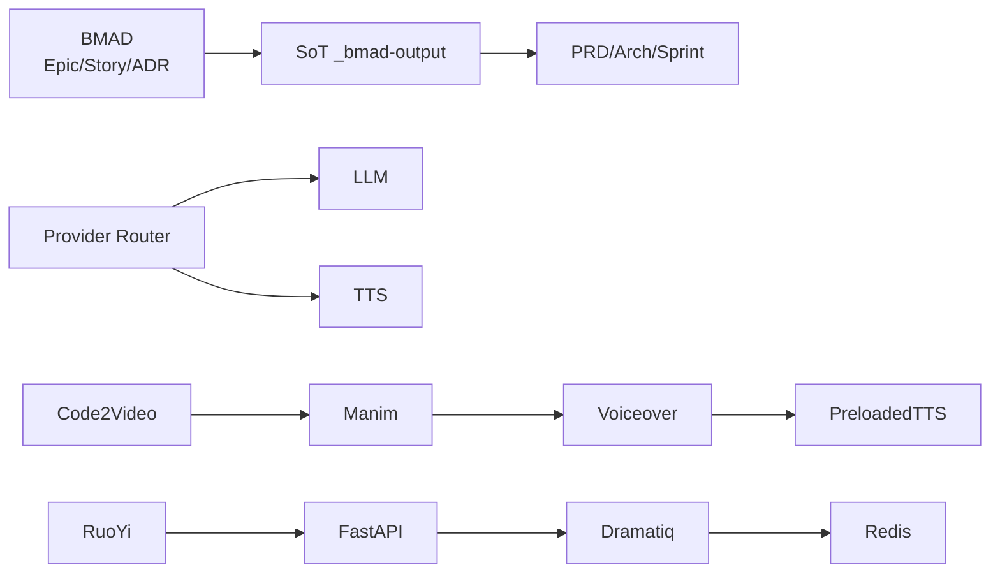

# 术语表（Glossary）

| 版本 | 日期 | 修订内容 | 作者 | 评审 |
|------|------|----------|------|------|
| v1.0.0 | 2026-04-25 | 首次发布，覆盖业务/架构/AI/视频/工程实践 65+ 项 | 研发团队 | 架构组 |

---

## 1. 概述

### 1.1 目的

为 Prorise AI Teach 项目提供**唯一、权威**的术语对照表，避免跨团队语义漂移。每条目包含中文、英文、释义与「关联文档」锚点，便于检索与回链。

### 1.2 编排规则

- 按英文首字母 A-Z 排序（中文术语挂在对应英文项下）
- 术语必须**真实存在于代码、文档或 SoT** 中，不创造概念
- 同义词/旧称使用 「→」 指向规范术语
- 关联文档使用相对路径

### 1.3 引用文件

- 内部 SoT：`_bmad-output/INDEX.md`
- 关联：`./0001-外部依赖与第三方服务.md`、`../003-架构设计/0001-系统架构总览.md`

---

## 2. 术语索引（Mermaid 概念图）

图 2-1：核心概念关系总览

---

## 3. 术语条目（A-Z）

### A

| 中文 | 英文 | 释义 | 关联 |
|------|------|------|------|
| 验收测试驱动开发 | ATDD（Acceptance Test-Driven Development） | 先写验收测试再写实现的协作模式 | `../007-测试策略/` |
| 架构决策记录 | ADR（Architecture Decision Record） | 单条架构决策的轻量文档（背景/决策/影响） | `../003-架构设计/0002-技术选型决策记录.md` |
| 异步 IO | AsyncIO | Python 协程框架，FastAPI/httpx/dramatiq 协程基础 | `packages/fastapi-backend/app/main.py` |
| AGPL | GNU Affero GPL | 强 Copyleft 许可，MinIO 使用 | `./0001-外部依赖与第三方服务.md` |

### B

| 中文 | 英文 | 释义 | 关联 |
|------|------|------|------|
| BMAD | Business / Module / Architecture / Delivery（项目自定义） | 项目文档与开发流程框架，以 `_bmad-output/` 为唯一事实源 | `_bmad-output/INDEX.md` |
| 蓝绿发布 | Blue-Green Deployment | 双环境切换发布策略 | `../008-部署与运维/0002-发布策略.md` |
| 业务对齐 | Business Alignment | 需求↔架构↔Story 三层对齐审查 | BMAD 流程 |

### C

| 中文 | 英文 | 释义 | 关联 |
|------|------|------|------|
| C4 模型 | C4 Model | Context/Container/Component/Code 四层架构图法 | `../003-架构设计/0001-系统架构总览.md` |
| 金丝雀发布 | Canary Release | 小流量灰度策略 | `../008-部署与运维/` |
| Code2Video | Code2Video | 当前视频生成管道（替代旧 manim4ai+claw 体系） | 记忆 `code2video-integration` |
| 上下文工程 | Context Engineering | 为 LLM 调用准备最小充分上下文的工程方法 | Augment / MemPalace |
| 容器编排 | Container Orchestration | Docker Compose（dev/prod）+ K8s（规划） | `deploy/docker-compose.yml` |
| 持续集成 / 持续交付 | CI/CD | Git push → 流水线 → 部署 | `.github/workflows/` |
| 跨源资源共享 | CORS | 浏览器跨域策略 | FastAPI middleware |
| CSRF | Cross-Site Request Forgery | 跨站请求伪造 | RuoYi 防护链 |

### D

| 中文 | 英文 | 释义 | 关联 |
|------|------|------|------|
| DAU/MAU | Daily/Monthly Active Users | 活跃用户指标 | 产品度量 |
| 死信队列 | Dead Letter Queue | 失败任务最终回收队列 | Dramatiq config |
| 设计文档 | Design Doc | 模块/特性级技术设计 | `../006-模块开发指南/` |
| DORA 指标 | DORA Metrics | Deploy Freq / Lead Time / MTTR / Change Fail | `../008-部署与运维/0004-DORA指标.md` |
| Dramatiq | Dramatiq | Python 异步任务队列（Redis broker） | `packages/fastapi-backend/app/tasks/` |
| Docker 沙箱 | Docker Sandbox | 视频代码执行隔离环境 | 记忆 `sandbox-architecture-decision` |

### E

| 中文 | 英文 | 释义 | 关联 |
|------|------|------|------|
| 边缘 TTS | edge-tts | 微软 Edge 浏览器 TTS 反向接口（容器化复用） | `./0001-外部依赖与第三方服务.md#3` |
| Epic | Epic | BMAD 体系下的大粒度需求集合（包含多 Story） | `_bmad-output/epics/` |
| 错误预算 | Error Budget | SLO 留白预算，超支即冻结发布 | `../008-部署与运维/` |
| 端到端测试 | E2E Test | Playwright 跨浏览器全链路验证 | `packages/student-web/tests/e2e` |

### F

| 中文 | 英文 | 释义 | 关联 |
|------|------|------|------|
| FastAPI | FastAPI | 项目后端 Web 框架（Python 3.12，端口 8090） | `packages/fastapi-backend/app/main.py` |
| 故障预演 | Failover Drill | 主备切换演练 | `../008-部署与运维/` |
| 特性开关 | Feature Flag | 运行时切换功能（避免分支长存） | RuoYi 字典 |

### G

| 中文 | 英文 | 释义 | 关联 |
|------|------|------|------|
| Gemini | Google Gemini | Google 多模态 LLM，承担视觉自修反馈 | 记忆 `mllm-feedback-activation-fix` |
| Git Flow / GitHub Flow | Git Flow | 项目采用 GitHub Flow（短分支 + Squash merge） | `../004-开发规范/` |

### H

| 中文 | 英文 | 释义 | 关联 |
|------|------|------|------|
| 健康检查 | Healthcheck | Docker/K8s 探活 | `deploy/docker-compose.yml:62-110` |
| 热修复 | Hotfix | 跳过常规流程的紧急修复 | git log 前缀 `hotfix:` |

### I

| 中文 | 英文 | 释义 | 关联 |
|------|------|------|------|
| 幂等 | Idempotent | 多次执行结果一致 | API/任务设计原则 |
| 集成测试 | Integration Test | L2 层（与外部依赖联调） | `tests/integration/` |
| 国际化 | i18n | vue-i18n / react-i18next | 前端 |

### J

| 中文 | 英文 | 释义 | 关联 |
|------|------|------|------|
| JWT | JSON Web Token | RuoYi 鉴权令牌 | `RUOYI_JWT_SECRET` |
| Jinja2 | Jinja2 | 模板引擎（提示词渲染） | `app/prompts/` |

### K

| 中文 | 英文 | 释义 | 关联 |
|------|------|------|------|
| K8s | Kubernetes | 容器编排平台（生产规划态） | `../008-部署与运维/` |
| 知识库 | Knowledge Base | MemPalace + `_bmad-output/` 双源 | 见 MemPalace |

### L

| 中文 | 英文 | 释义 | 关联 |
|------|------|------|------|
| LangGraph | LangGraph | 智能体状态图编排框架 | `pyproject.toml:21` |
| LLM Router | LLM Router → Provider Router | 多 Provider 路由层 | `app/providers/router.py` |
| 布局检查 | Layout Check | 视频镜头几何碰撞检测（Shapely） | 记忆 `visual-verify-shapely-layout` |

### M

| 中文 | 英文 | 释义 | 关联 |
|------|------|------|------|
| Manim | Manim Community Edition | 数学动画库，Code2Video 渲染引擎 | Code2Video pipeline |
| MemPalace | MemPalace MCP | 项目记忆/规范唯一检索入口 | `CLAUDE.md` |
| MLLM 反馈 | MLLM Feedback | 多模态 LLM 视觉自修循环（Gemini） | 记忆 `mllm-feedback-activation-fix` |
| 监控 | Monitoring | RuoYi-Monitor + Prometheus（规划） | `deploy/docker-compose.yml:164` |
| 微服务 | Microservices | 当前未采用，单体 FastAPI + RuoYi 边界清晰 | ADR-001 |

### N

| 中文 | 英文 | 释义 | 关联 |
|------|------|------|------|
| Naive UI | Naive UI | 管理后台组件库 | `packages/ruoyi-plus-soybean` |
| 非功能需求 | NFR | 性能/可用性/安全 | `../007-测试策略/` |

### O

| 中文 | 英文 | 释义 | 关联 |
|------|------|------|------|
| OpenAPI | OpenAPI 3.x | FastAPI 自动生成的 API 描述 | `/api/v1/openapi.json` |
| 对象存储 | Object Storage | COS / MinIO | `deploy/docker-compose.yml:92` |
| 可观测性 | Observability | 日志 + 指标 + 追踪三支柱 | `../008-部署与运维/` |

### P

| 中文 | 英文 | 释义 | 关联 |
|------|------|------|------|
| pnpm | pnpm | 工作区包管理器（v10.5.0 锁定） | `package.json:4` |
| PreloadedTTS | PreloadedTTS | 预生成音频再喂 VoiceoverScene 的播报模式 | 记忆 `voiceover-scene-migration` |
| Provider Router | Provider Router | 数据库驱动的 LLM/TTS 多供应商路由 | `app/providers/` |
| 提示词模板 | Prompt Template | Jinja2 渲染的 LLM 输入 | `app/prompts/` |
| PR Review | Pull Request Review | 强制双人审 + Squash merge | `../004-开发规范/` |

### Q

| 中文 | 英文 | 释义 | 关联 |
|------|------|------|------|
| Qwen | 通义千问 | 阿里 LLM，备用 Provider | DashScope |
| 质量门禁 | Quality Gate | 测试覆盖率/Lint/类型检查不达标即阻塞 | `../007-测试策略/` |

### R

| 中文 | 英文 | 释义 | 关联 |
|------|------|------|------|
| Redis | Redis | 缓存 + Dramatiq broker（7-alpine） | `deploy/docker-compose.yml:67` |
| 幂等键 | Request ID | 一次请求的全链路追踪 ID | RuoYi `traceId` + FastAPI middleware |
| RuoYi-Plus | RuoYi-Plus 5.x | 管理后台 Java 框架（SpringBoot 3） | `packages/RuoYi-Vue-Plus-5.X/` |
| 回归测试 | Regression Test | 防止旧 Bug 复发 | `../007-测试策略/` |
| Runbook | Runbook | 标准化故障/操作手册 | `../008-部署与运维/0005-Runbook.md` |

### S

| 中文 | 英文 | 释义 | 关联 |
|------|------|------|------|
| SBOM | Software Bill of Materials | 软件物料清单 | `./0001-外部依赖与第三方服务.md` |
| Server-Sent Events | SSE | 单向流式推送（视频任务进度） | `app/api/v1/video/sse.py` |
| Shapely | Shapely | Python 几何库（碰撞检测） | 视频布局 |
| 单点故障 | SPOF | 单一失效即全局宕机 | 架构评审 |
| Sprint | Sprint | 迭代周期，状态见 `_bmad-output/sprint-status.yaml` | BMAD |
| Story | Story | Epic 下的可交付最小开发单元 | `_bmad-output/stories/` |
| 沙箱 | Sandbox | 不可信代码隔离执行环境 | Docker sandbox |
| Soybean Admin | Soybean Admin | RuoYi-Plus-Soybean 前端模板基础 | `packages/ruoyi-plus-soybean` |
| SoT | Single Source of Truth | 唯一事实源（项目即 `_bmad-output/`） | `CLAUDE.md` |
| SLI/SLO/SLA | Service Level Indicator/Objective/Agreement | 可观测性度量层级 | `../008-部署与运维/` |
| 服务等级目标 | SLO（Service Level Objective） | 对外承诺的可用性/延迟/正确性目标值，超支即冻结发布（错误预算耗尽） | `../008-部署与运维/0003-SLI-SLO.md` |

### T

| 中文 | 英文 | 释义 | 关联 |
|------|------|------|------|
| Task ID | Task ID | 后台任务唯一编号（与 Request ID 关联） | Dramatiq + DB |
| TTS | Text-To-Speech | 文本转语音（edge-tts / OpenAI TTS） | Provider Router |
| 类型检查 | Typecheck | TypeScript / mypy（暂未启用 mypy） | `pnpm typecheck:all` |

### U

| 中文 | 英文 | 释义 | 关联 |
|------|------|------|------|
| uvicorn | uvicorn | ASGI 服务器 | `pyproject.toml:13` |
| 单元测试 | Unit Test | L1 层（隔离依赖） | `tests/unit/` |
| 用户验收测试 | UAT | 人工确认验收 | 业务侧 |

### V

| 中文 | 英文 | 释义 | 关联 |
|------|------|------|------|
| Vite | Vite | 前端构建工具（v6/v7） | 前端 dev/build |
| Vitest | Vitest | 前端测试框架 | `vitest.config.ts` |
| Voiceover | Voiceover | Manim 配音场景（结合 PreloadedTTS） | Code2Video |
| VoiceoverScene | VoiceoverScene | manim-voiceover 提供的播报场景类，项目通过 PreloadedTTS 适配器绕过其网络依赖 | 记忆 `voiceover-scene-migration` |
| Vue 3 | Vue 3 | 管理后台主框架 | `packages/ruoyi-plus-soybean` |

### W

| 中文 | 英文 | 释义 | 关联 |
|------|------|------|------|
| WebM | WebM | 透明背景视频容器（alpha 通道） | 记忆 `video-chinese-transparent-session` |
| Worker | Worker | Dramatiq 工作进程 | `scripts/start-worker.sh` |
| Worktree | Git Worktree | 多分支并行开发隔离 | 记忆 `feedback-multi-team-worktree` |

### X-Z

| 中文 | 英文 | 释义 | 关联 |
|------|------|------|------|
| XSS | Cross-Site Scripting | 跨站脚本注入 | 安全编码 |
| 学生端 | student-web | React 19 + Vite 6 学生侧前端 | `packages/student-web` |
| 字幕 | Subtitles | 前端渲染（避免 Manim 烧录） | 记忆 `video-result-page-investigation` |

---

## 4. 缩写速查（独立索引）

| 缩写 | 含义 |
|------|------|
| ADR | Architecture Decision Record |
| API | Application Programming Interface |
| AST | Abstract Syntax Tree |
| BFF | Backend For Frontend |
| CRUD | Create/Read/Update/Delete |
| DTO | Data Transfer Object |
| GC | Garbage Collection |
| HMR | Hot Module Replacement |
| IaC | Infrastructure as Code |
| LLM | Large Language Model |
| MCP | Model Context Protocol |
| ORM | Object-Relational Mapping |
| OSS | Open Source Software / Object Storage Service |
| PRD | Product Requirements Document |
| PoC | Proof of Concept |
| QPS | Queries Per Second |
| RBAC | Role-Based Access Control |
| RFC | Request for Comments |
| RPM/TPM | Requests/Tokens Per Minute |
| SDK | Software Development Kit |
| TPS | Transactions Per Second |
| TTL | Time To Live |
| UAT | User Acceptance Testing |
| WCAG | Web Content Accessibility Guidelines |

---

## 修订记录

见首部表格。新增/合并术语提交 PR 至本文件，PR 标题前缀 `docs(glossary):`。
