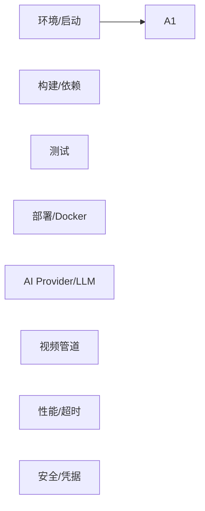

# FAQ 常见问题

| 版本 | 日期 | 修订内容 | 作者 | 评审 |
|------|------|----------|------|------|
| v1.0.0 | 2026-04-25 | 首次发布，覆盖 8 个主题、35 条常见问题（来自记忆、Issue 历史与代码现实） | 研发团队 | 架构组 |

---

## 1. 概述

### 1.1 目的

汇总 Prorise AI Teach 项目研发/运维过程中最高频的问题与已验证的解决步骤。**每条问题都来源于真实代码、真实记忆或真实 Issue**，不编造场景。

### 1.2 使用方式

- 出现问题 → 先按 §3-§10 主题定位 → 复制「解决步骤」逐步执行
- 步骤无效 → 翻「关联文档」寻找上下文 → 仍无解则升级到 issue 或 mempalace 检索
- 新增 FAQ：必须包含「问题/场景/根因/步骤/关联」五段，PR 前缀 `docs(faq):`

### 1.3 引用文件

- `./0002-术语表.md`、`./0001-外部依赖与第三方服务.md`
- `../005-环境搭建/`、`../008-部署与运维/`

---

## 2. 主题导航



图 2-1：FAQ 主题分布

---

## 3. 环境与启动

### Q1. 启动 FastAPI 报 `ModuleNotFoundError: No module named 'jinja2'`（或类似）

**场景**：本地 `pnpm dev:fastapi-backend` 报缺包，但 `pyproject.toml` 已声明。

**根因**：单测通过不代表 venv 已同步。新增依赖未执行 `pip install -e .[dev]`。

**步骤**：
```bash
pnpm setup:fastapi-backend       # 重建 venv 并按 pyproject 安装
# 或
packages/fastapi-backend/.venv/bin/pip install -e packages/fastapi-backend[dev]
```

**关联**：记忆 `feedback-jinja2-venv`、`pyproject.toml:11-25`

---

### Q2. 端口 8090 已被占用

**根因**：上次 dev 进程未退出，或 1Panel 反代占用。

**步骤**：
```bash
lsof -i :8090
kill -9 <PID>
```

---

### Q3. FastAPI 实际访问路径是什么？

**答**：`http://localhost:8090/api/v1/...`，**前缀必须是 `/api/v1/`，不是 `/api/`**。

**关联**：记忆 `fastapi-port-8090`

---

### Q4. RuoYi-Java 启动报 RSA 密钥错误

**根因**：`RUOYI_API_DECRYPT_PUBLIC_KEY/PRIVATE_KEY` 未配置或未与 FastAPI 端一致。

**步骤**：核对 `deploy/.env.prod` 与 FastAPI `FASTAPI_RUOYI_ENCRYPT_*`，二者必须同对密钥。

**关联**：`deploy/docker-compose.yml:223-225,258-259`

---

### Q5. 前端 dev 起不来，提示 pnpm 版本不符

**根因**：根 `package.json` 锁定 `packageManager: pnpm@10.5.0`。

**步骤**：`corepack enable && corepack prepare pnpm@10.5.0 --activate`

---

## 4. 构建与依赖

### Q6. `pnpm install` 后某些原生依赖失败

**根因**：cryptography/cffi 在 macOS arm64 需要本地 build-essential。

**步骤**：
```bash
xcode-select --install
brew install openssl rust
pnpm setup:fastapi-backend
```

---

### Q7. uv.lock 与 pyproject.toml 漂移如何处理？

**答**：CI 校验 lock hash。本地变更后执行 `uv pip compile --universal`（或 `uv lock`），将新 lock 提交。

---

### Q8. 新增 Settings 字段后启动报 `validation error`

**根因**：`.env`/`.env.example`/docker-compose env 未同步。

**步骤**：每次新增字段必须同步三处零差集（feedback `feedback-env-file-sync`）。

---

### Q9. 前端 typecheck 报错 `vue-tsc` 内存溢出

**步骤**：`NODE_OPTIONS=--max-old-space-size=8192 pnpm typecheck:admin-web`

---

## 5. 测试

### Q10. `pnpm test:fastapi-backend` 始终红 2 条用例

**答**：当前基线（commit 4109914）已知 2 条失败：`failover` 断言顺序 + `SettingsOverride` 缺属性。**不是你引入的**。

**关联**：记忆 `preexisting-test-failures`

---

### Q11. `pytest -m integration` 跑不过

**步骤**：检查 Redis/MinIO 是否启动 → `docker compose up redis minio -d` → 复跑。

---

### Q12. Vitest 报 `ReferenceError: window is not defined`

**根因**：用例跑在 node 环境却调浏览器 API。

**步骤**：将该 spec 的 `// @vitest-environment jsdom` 头部加上，或迁到 `test:browser`。

---

### Q13. Playwright E2E 在 CI 失败但本地通过

**根因**：CI 浏览器版本 / locale / 系统字体差异。

**步骤**：本地复现 `npx playwright test --headed --browser=chromium --locale=zh-CN`，截图 trace 上传。

---

## 6. 部署与 Docker

### Q14. `docker compose up` 卡在 `mysql healthy`

**根因**：首次启动 mysqldump 大文件导入。

**步骤**：等 5-10 分钟；超过则进入容器 `docker exec -it xm-mysql sh -c 'tail -f /var/log/mysql/*'`。

---

### Q15. fastapi-worker 起不来，日志 `Cannot connect to redis`

**根因**：`prorise-internal` 网络未创建（旧服务器有，新机器需手建）。

**步骤**：`docker network create prorise-internal`

**关联**：`deploy/docker-compose.yml:22-24`

---

### Q16. MinIO 控制台无法登录

**根因**：`MINIO_ROOT_PASSWORD` 长度 < 8 或含非法字符。

**步骤**：改为 ≥8 位字母数字组合，重启 minio 容器。

---

### Q17. 1Panel 反代后视频流播放断流

**根因**：反代 buffer 默认开启，与 SSE/分段视频冲突。

**步骤**：1Panel 站点配置加 `proxy_buffering off; proxy_read_timeout 600s;`

---

### Q18. ruoyi-snailjob 容器持续重启

**根因**：MySQL 慢启导致 snailjob 早连。

**步骤**：等 mysql healthy 后 `docker compose restart ruoyi-snailjob`，并确认 `SNAILJOB_TOKEN` 与 ruoyi-java 一致。

---

## 7. AI Provider / LLM

### Q19. LLM 调用 524 错误（CDN 超时）

**根因**：cpa.prorise666.site CDN 边缘 60s 流式建立期超时。

**步骤**：项目已三层 fallback（流式 → 非流式 → 备用 provider），无需手动处理；如重复出现，临时切换 `provider_runtime` 中 base_url 至 synai996.space。

**关联**：记忆 `llm-stream-524-root-cause`、`llm-proxy-null-content-fix`

---

### Q20. `httpx.InvalidURL` 报错且 api_key 含中文字符

**根因**：第三方平台粘贴 key 时混入中文字符（不可见）。

**步骤**：`provider_runtime.api_key.isascii()` 校验已加，重新粘贴 key（纯 ASCII）。

**关联**：记忆 `hotfix-api-key-unicode`

---

### Q21. Provider Router 返回「provider 不存在」

**根因**：`provider_binding` 表的 `resource_id` 指向已删除的 provider（幽灵 ID）。

**步骤**：管理后台「AI Provider 管理 → 资源绑定」批量校对；SQL：`SELECT * FROM provider_binding WHERE resource_id NOT IN (SELECT id FROM provider_runtime)`

**关联**：记忆 `provider-binding-ghost-ids`

---

### Q22. LLM stream 返回 `content=null`

**根因**：代理返回非标准 chunk。

**步骤**：已 fallback 至非流式重试，无需处理。如频发：检查 provider 健康。

---

### Q23. OpenAI TTS provider 报「provider id not found」

**根因**：`runtime_provider_id` 字段映射错为 `providerId`（mapper bug 已修）。

**关联**：记忆 `tts-provider-registration-fix`

---

## 8. 视频管道

### Q24. 视频任务一直 `pending`，DB status 不更新

**根因**：旧版 `dispatch()` 完成后只写 Redis 不写 DB（已修：`VideoTask.finalize()` 回写）。

**步骤**：拉最新 master；如线上仍有：手动 SQL 校正后重启 worker。

**关联**：记忆 `video-pipeline-db-status-fix`、`video-pipeline-db-status-bug`

---

### Q25. 公式渲染歪斜/重叠

**根因**：MLLM 视觉自修反馈未启用（`use_feedback=False`）。

**步骤**：管理后台为视频 provider 绑定 `mllm_feedback` 资源类型 → Gemini Vision 介入 2 轮自修。

**关联**：记忆 `mllm-feedback-activation-fix`、`video-formula-positioning-root-cause`

---

### Q26. Manim 渲染时间超 15 分钟被杀

**根因**：默认 Dramatiq time_limit 10 分钟，已扩到 15 分钟。

**步骤**：调 `FASTAPI_DRAMATIQ_TASK_TIME_LIMIT_MS=900000`；section 仍超时则缩故事板长度。

**关联**：记忆 `dramatiq-time-limit-fix`

---

### Q27. Section 渲染 4/10 失败但任务标 completed

**根因**：旧版无质量门禁，section 失败静默跳过。

**步骤**：升级到 ManimCat 优化分支后启用门禁；线上需重跑失败 section。

**关联**：记忆 `video-pipeline-quality-gate-gap`、`manimcat-latex-docker-root-cause`

---

### Q28. 本地 LaTeX 缺失致 6/10 假失败

**根因**：`agent.py:655` 走本地 LaTeX 探测。

**步骤**：所有 LaTeX 渲染都通过 Docker 沙箱（10/10 全过）；本地仅做语法预检。

---

### Q29. 视频 SSE 进度一直 0

**根因**：进度回调链路未持久化（旧版 bug）。

**步骤**：拉 master；前端校验 `eventSource.onmessage` 收到分段事件。

**关联**：记忆 `video-api-test-findings`

---

### Q30. 中文字幕乱码

**根因**：Manim 默认字体不含中文。

**步骤**：`Text(..., font="Source Han Sans CN")`，确保 Docker 镜像已装该字体。

---

## 9. 性能与超时

### Q31. CDN 60s 截断 / LLM 长 prompt 失败

**步骤**：长 prompt 拆分为 2 次调用 + memory 串联；或切换至非 CDN 直连 provider。

---

### Q32. Dramatiq 队列堆积

**步骤**：增加 worker 进程 `FASTAPI_DRAMATIQ_WORKER_PROCESSES` / 线程数；查 Redis `LLEN dramatiq:default`。

---

### Q33. 前端首屏白屏 > 3s

**步骤**：检查 vite build 包大小、开启路由懒加载、CDN 静态资源。

---

## 10. 安全与凭据

### Q34. 误把 api_key 提交到仓库怎么办？

**步骤**：
1. 立即吊销该 key（OpenAI 后台/腾讯云控制台）
2. `git filter-repo` 清理历史
3. force push 前征得 maintainer 授权
4. 通知所有协作者重 clone

---

### Q35. 本地 `.env.prod` 是否进 git？

**答**：**绝不**。仅 `.env.prod.example` 入仓。

---

## 修订记录

见首部表格。FAQ 应季度复盘一次，剔除已修复且 30 天未复发的条目，归档到「历史 FAQ」。
