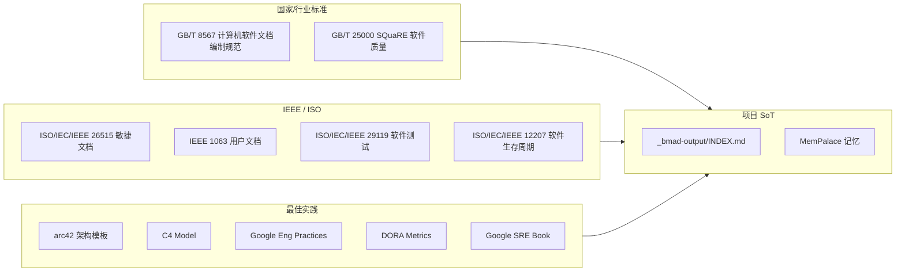

# 参考文献与标准

| 版本 | 日期 | 修订内容 | 作者 | 评审 |
|------|------|----------|------|------|
| v1.0.0 | 2026-04-25 | 首次发布，覆盖国标/IEEE/ISO/最佳实践与项目内部 SoT | 研发团队 | 架构组 |

---

## 1. 概述

### 1.1 目的

汇总 Prorise AI Teach 项目「**开发人员手册**」体系所遵循的外部标准、行业最佳实践、关键论著与项目内部 SoT 文档，便于：

- 文档评审时核验是否对齐工业标准
- 新成员快速理解每个章节背后的方法论出处
- 审计/合规场景给出可追溯的引用源

### 1.2 引用规则

- 标准号：写明编号 + 年份 + 标题
- 在线资源：标 URL，并标注访问日期（避免链接失效）
- 项目内部：使用相对路径

---

## 2. 引用关系图

图 2-1：标准与最佳实践如何映射到项目文档

---

## 3. 国家与行业标准

| 编号 | 标题 | 适用章节 | 备注 |
|------|------|----------|------|
| GB/T 8567—2006 | 计算机软件文档编制规范 | 全套手册（文档编号、修订记录、章节结构） | 提供「文档头表 + 修订记录」基础范式 |
| GB/T 25000.10—2016 | 系统与软件工程—系统与软件质量要求和评价（SQuaRE）—质量模型 | 007 测试策略、008 运维 NFR | 8 大质量特性框架 |
| GB/T 22239—2019 | 信息安全技术 网络安全等级保护基本要求 | 008 部署与运维（合规） | 等保 2.0 |
| GB/T 32400—2015 | 信息技术 云计算 概览与词汇 | 008 部署与运维 | 云计算术语对齐 |

---

## 4. ISO / IEEE 国际标准

| 编号 | 标题 | 适用章节 |
|------|------|----------|
| ISO/IEC/IEEE 12207:2017 | Systems and software engineering — Software life cycle processes | 全套手册的过程边界 |
| ISO/IEC/IEEE 15288:2015 | Systems and software engineering — System life cycle processes | 003 架构、008 运维 |
| ISO/IEC/IEEE 26515:2018 | Developing user documentation in an agile environment | 010 附录、文档编写流程 |
| ISO/IEC/IEEE 29119（系列） | Software Testing | 007 测试策略（L0-L3 金字塔、测试设计） |
| IEEE 1063—2001 | Standard for Software User Documentation | 010 附录、用户手册风格 |
| IEEE 1471 / ISO/IEC/IEEE 42010:2011 | Architecture description | 003 架构设计（视图/视点） |
| ISO/IEC 25010:2011 | Systems and software Quality Requirements and Evaluation (SQuaRE) — Product quality model | 007 测试策略 |
| ISO/IEC 27001:2022 | Information security management systems | 008 安全合规 |

---

## 5. 行业最佳实践

| 名称 | 出处 / 链接 | 项目对应 |
|------|-------------|----------|
| **arc42** 架构模板（v8） | https://arc42.org/ | 003 架构设计与 006 模块开发指南章节骨架 |
| **C4 Model** | Simon Brown，https://c4model.com/ | 003 架构总览的 Context/Container/Component 图 |
| **Google Engineering Practices Documentation**（含 Code Review、Style Guides） | https://google.github.io/eng-practices/ | 004 开发规范结构与 PR Checklist |
| **Google SRE Book / Workbook** | https://sre.google/books/ | 008 部署与运维（SLI/SLO/Error Budget） |
| **DORA Accelerate Metrics** | https://dora.dev/ | 008 部署与运维 §DORA 指标 |
| **The Twelve-Factor App** | https://12factor.net/ | 005 环境搭建、配置/日志/进程模型 |
| **OWASP Top 10 (2021)** | https://owasp.org/Top10/ | 安全审计、004 编码规范 |
| **OpenAPI Specification 3.1** | https://spec.openapis.org/oas/v3.1.0 | FastAPI 接口契约 |
| **Conventional Commits 1.0** | https://www.conventionalcommits.org/ | Git commit 风格 |
| **Semantic Versioning 2.0** | https://semver.org/ | 依赖版本约束 |
| **Keep a Changelog 1.1** | https://keepachangelog.com/ | CHANGELOG 风格 |
| **Refactoring (Martin Fowler, 2nd ed., 2018)** | 书 | 004 重构守则 |
| **Domain-Driven Design (Eric Evans, 2003)** | 书 | 003 架构边界 |
| **Designing Data-Intensive Applications (Martin Kleppmann, 2017)** | 书 | 003 架构、数据一致性 |
| **Site Reliability Engineering (Betsy Beyer 等)** | 书 | 008 运维 |
| **The Pragmatic Programmer 20th Anniv. (2019)** | 书 | 004 编码哲学 |

---

## 6. RFC / 协议规范

| RFC | 标题 | 项目用途 |
|-----|------|----------|
| RFC 7231 / RFC 9110 | HTTP Semantics | API 规范 |
| RFC 6749 | OAuth 2.0 Authorization Framework | 认证拓展（规划） |
| RFC 7519 | JSON Web Token (JWT) | RuoYi 鉴权令牌 |
| RFC 8259 | The JavaScript Object Notation (JSON) | 接口数据 |
| RFC 6455 | The WebSocket Protocol | 备选实时通道 |
| RFC 9111 | HTTP Caching | 静态资源缓存 |
| W3C SSE | https://html.spec.whatwg.org/multipage/server-sent-events.html | 视频任务进度推送 |

---

## 7. 关键工具/框架官方文档

| 工具 | 官方文档 | 关联 |
|------|----------|------|
| FastAPI | https://fastapi.tiangolo.com/ | 后端 |
| Pydantic v2 | https://docs.pydantic.dev/latest/ | 配置/校验 |
| Dramatiq | https://dramatiq.io/ | 任务队列 |
| LangGraph | https://langchain-ai.github.io/langgraph/ | 智能体编排 |
| OpenAI Python SDK | https://github.com/openai/openai-python | LLM/TTS |
| httpx | https://www.python-httpx.org/ | 异步 HTTP |
| Vue 3 | https://vuejs.org/ | 管理后台 |
| Naive UI | https://www.naiveui.com/ | 组件库 |
| React 19 | https://react.dev/ | 学生端 |
| Vite | https://vitejs.dev/ | 构建 |
| Vitest | https://vitest.dev/ | 前端测试 |
| Playwright | https://playwright.dev/ | E2E |
| Manim Community | https://docs.manim.community/ | 视频引擎 |
| MinIO | https://min.io/docs/ | 对象存储 |
| Redis 7 | https://redis.io/docs/ | 缓存/队列 |
| MySQL 8.0 | https://dev.mysql.com/doc/ | 关系库 |
| RuoYi-Plus 5.x | https://plus-doc.dromara.org/ | Java 后台 |

---

## 8. 项目内部 SoT 文档

| 路径 | 角色 |
|------|------|
| `_bmad-output/INDEX.md` | 项目唯一事实源索引 |
| `_bmad-output/sprint-status.yaml` | 当前 Sprint 状态 |
| `_bmad-output/project-context.md` | 项目语境快照 |
| `_bmad-output/mempalace.yaml` | MemPalace 索引入口 |
| `_bmad-output/planning-artifacts/` | PRD / 架构 / Epic 分片 |
| `_bmad-output/implementation-artifacts/` | Story / 实施记录 |
| `_bmad-output/research/` | 调研报告 |
| `_bmad-output/brainstorming/` | 头脑风暴归档 |
| `CLAUDE.md`（仓库根） | Agent 工作守则 |
| `docs/01开发人员手册/INDEX.md` | 手册总目录 |
| `docs/01开发人员手册/003-架构设计/` | arc42 架构 |
| `docs/01开发人员手册/004-开发规范/` | Google Eng Practices 风格 |
| `docs/01开发人员手册/005-环境搭建/` | Runbook |
| `docs/01开发人员手册/006-模块开发指南/` | arc42 building block |
| `docs/01开发人员手册/007-测试策略/` | ISO 29119 |
| `docs/01开发人员手册/008-部署与运维/` | SRE + DORA |
| `docs/01开发人员手册/010-附录/` | 本附录目录 |
| `MemPalace`（MCP） | 经验/规范/记忆检索入口 |

---

## 9. 学术论文 / 经典论著

| 标题 | 作者 / 年份 | 项目影响 |
|------|-------------|----------|
| _A Pattern Language for Architecture Description_ | Kruchten 4+1 视图（1995） | 003 架构总览 |
| _Out of the Tar Pit_ | Moseley & Marks（2006） | 004 简洁性原则 |
| _Programming as Theory Building_ | Naur（1985） | 文档与代码并重的写作哲学 |
| _Continuous Delivery_ | Humble & Farley（2010） | 008 发布流水线 |
| _Building Microservices_ 2nd ed. | Sam Newman（2021） | 服务边界与契约 |
| _Attention Is All You Need_ | Vaswani et al.（2017） | LLM 基础（背景） |

---

## 10. 编辑与体例规范

- **写作风格**：参考《Microsoft Writing Style Guide》（https://learn.microsoft.com/en-us/style-guide/welcome/）
- **图示规范**：Mermaid 语法，C4 标记参考 https://github.com/plantuml-stdlib/C4-PlantUML（仅借鉴 stereotype 命名）
- **文档元信息**：参考 GB/T 8567 「文档头 + 修订记录」 + ISO/IEC/IEEE 26515 敏捷文档头部
- **文件命名**：四位编号 `00XX-标题.md`，本节遵循 `010-附录/` 顺序

---

## 11. 维护策略

1. **季度评审**：每季度核查链接有效性（自动化脚本 `scripts/check-links.sh` 规划中）
2. **版本变更**：引用的标准/书出现新版（如 IEEE 29119-2:2025）时同步更新本文件
3. **新增引用**：任何新文档若引入了未列入本表的标准，必须在 PR 中追加本表条目，PR 前缀 `docs(refs):`

---

## 修订记录

见首部表格。链接失效或标准更新均需触发本文档的次版本号 +1。
